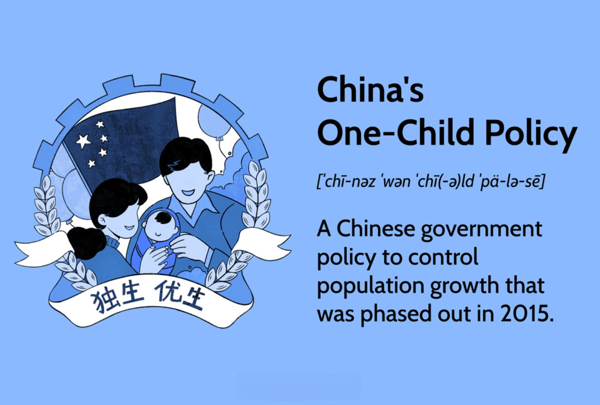

Population control has been a critical topic worldwide, with China's One-Child Policy being a prominent example of efforts to manage population growth. Initiated in 1979, the policy aimed to limit most Chinese families to a single child, largely as a strategy to mitigate the challenges posed by burgeoning population numbers. The One-Child Policy is noteworthy not only for its intention to control population size but also for its far-reaching social and economic implications. These ramifications include significant demographic shifts, such as a skewed gender ratio and an aging population, which have influenced China's economic and social landscapes.

In parallel to its population control measures, China has also emerged as a significant participant in algorithmic trading, which consists of using computer algorithms to automate the process of financial trading. This field of automated financial transactions has transformed global financial markets, allowing trades to be executed at an unprecedented speed and volume, driven by data and sophisticated algorithms. China's contribution to this shift is buoyed by its advances in technology and artificial intelligence, illustrating a broader economic strategy intertwined with its demographic policies.



This article examines the interplay between China's population control initiatives and its global economic positioning in the realm of algorithmic trading. Understanding these dynamics is crucial for assessing how demographic transitions can shape economic strategies, including advancements in financial technologies and changing patterns in trading practices. By scrutinizing these connections, we gain insights into the broader implications of demographic changes on economic policy and market engagements in China and across the world.

## Table of Contents

## Overview of China's One-Child Policy

The One-Child Policy, initiated in 1979, was a pivotal intervention by the Chinese government aimed at controlling rampant population growth. Responding to concerns about resource scarcity and economic strain, the policy sought to limit the burgeoning population and ensure sustainable development. Initially presented as a temporary solution, it spanned more than three decades, culminating in its relaxation in 2015 to a two-child limit policy, as the nation began to confront the consequences of a rapidly aging demographic and labor force concerns.

The policy's most significant impact was the prevention of approximately 400 million births. This figure, while highlighting the policy's effectiveness in curbing population growth, also underscores the profound demographic shifts it triggered. The strategy employed a combination of incentives and punitive measures to enforce compliance. Families adhering to the policy were offered incentives, including financial benefits, priority in housing allocation, and improved access to healthcare and education. Conversely, violations were met with strict penalties, ranging from substantial fines to, in some extreme cases, compulsory abortions and sterilizations. These enforcement measures varied across regions and were frequently subject to criticism for their severity and implications for human rights.

The demographic alterations induced by the One-Child Policy have left a lasting mark on Chinese society. With a significant reduction in birth rates, the policy contributed to a skewed population structure, characterized by an increased proportion of elderly citizens relative to the working-age population. This demographic imbalance poses potential challenges to economic growth, social welfare systems, and the overall dynamic of Chinese society.

## Implications of the One-Child Policy

The One-Child Policy, implemented in China in 1979, has led to significant demographic consequences that continue to influence the nation's socio-economic landscape. One of the most profound impacts is the pronounced gender imbalance, which arose from a strong cultural preference for male children. This preference often resulted in selective abortions and neglect of female infants, skewing the natural gender ratio. According to data from the National Bureau of Statistics, the male-to-female ratio at birth reached a peak of 120 boys for every 100 girls in the mid-2000s.

Additionally, the policy has contributed to an aging population. With fewer children born over several decades, the population structure has shifted toward older age groups, leading to a higher dependency ratio. The dependency ratio is a measure of the proportion of dependents (individuals aged 0-14 and over 65) to the working-age population (aged 15-64). As the proportion of elderly increases, this ratio worsens, posing challenges for economic productivity and social welfare systems. Forecasts suggest that by 2050, individuals over 60 will comprise about 35% of China's population.

This demographic shift presents a potential risk to economic growth, primarily because a shrinking workforce may hinder the country’s ability to sustain its economic [momentum](/wiki/momentum). A smaller pool of young workers can lead to a scarcity of labor, increased wages, and potential downward pressure on the economy's growth rate.

In response to these challenges, the Chinese government is now encouraging higher birth rates. Since the abolishment of the One-Child Policy in 2015, the government has introduced a two-child policy, later moving towards a three-child policy framework. These policies are accompanied by enhanced parental benefits, such as extended maternity and paternity leaves, tax deductions for childcare, and incentives for companies to support working parents. Such measures aim to balance the demographic equation by easing the financial burden of having additional children, hoping to stabilize population growth and mitigate the long-term economic risks posed by an aging population.

## Algorithmic Trading: A New Economic Frontier

Algorithmic trading is a form of trading that utilizes computer algorithms to automate decision-making in financial markets. This methodology has revolutionized the landscape of trading by enabling high-frequency and high-[volume](/wiki/volume-trading-strategy) transactions, which are executed based on pre-defined criteria such as timing, price, and volume. In essence, [algorithmic trading](/wiki/algorithmic-trading) leverages advanced data analytics and [artificial intelligence](/wiki/ai-artificial-intelligence) to optimize trading strategies and outcomes.

China's role in global algorithmic trading has grown significantly, driven by its rapid advancements in technology and infrastructure. The country's substantial investments in artificial intelligence, big data, and financial technology sectors have made it a formidable player. These advancements allow market participants to analyze vast datasets to identify trading opportunities and mitigate risks in real time.

Algorithmic trading in China represents a shift towards more nuanced and sophisticated economic strategies. The country's focus on integrating technology with traditional financial practices speaks to its broader economic and technological development ambitions. By employing [machine learning](/wiki/machine-learning) techniques and predictive analytics, financial institutions and traders can anticipate market trends and execute trades at unprecedented speeds and accuracy.

A typical algorithmic trading system might employ the following Python code snippet to illustrate how a simple moving average crossover strategy could be implemented:

```python
import pandas as pd

def moving_average_crossover_strategy(data, short_window, long_window):
    data['Short_MA'] = data['Close'].rolling(window=short_window, min_periods=1).mean()
    data['Long_MA'] = data['Close'].rolling(window=long_window, min_periods=1).mean()
    data['Signal'] = 0
    data['Signal'][short_window:] = np.where(data['Short_MA'][short_window:] > data['Long_MA'][short_window:], 1, -1)
    data['Position'] = data['Signal'].diff()
    return data

# Example usage
data = pd.DataFrame({
    'Close': [110, 112, 113, 115, 116, 118, 119, 121, 120, 118]  # Sample closing prices
})

result = moving_average_crossover_strategy(data, short_window=3, long_window=5)
print(result)
```

This example demonstrates the essence of how algorithms can be used for financial decision-making, thereby facilitating a shift towards more advanced economic strategies in the trading world.

The emphasis on big data and AI in algorithmic trading also mirrors China's broader strategic goals. By harnessing the power of these technologies, China not only seeks to enhance its competitive edge in financial markets but also to ensure long-term economic sustainability and growth. As China continues to integrate algorithmic trading into its economic fabric, it reflects a commitment to ongoing innovation and adaptation in the face of global financial challenges.

## Interconnections Between Demographics and Algorithmic Trading

China's demographic shifts, driven by policies like the One-Child Policy, have played a significant role in shaping its economic strategies, particularly in technology-driven financial systems such as algorithmic trading. These demographic changes have influenced investment decisions, the structure of the workforce, and the trajectory of economic sectors.

As China's population ages and growth slows, there is an increased focus on maximizing economic productivity with a smaller workforce. This scenario necessitates a shift towards sectors that leverage technology and innovation, with algorithmic trading being one such area. By using sophisticated computer algorithms to automate financial trading decisions, China's financial institutions can maintain high levels of efficiency and competitiveness in the global market. This requires a technologically adept workforce that can develop, manage, and refine these complex trading systems.

The smaller, more technically skilled labor force in China is thus more likely to engage in advanced economic activities like algorithmic trading. This transition supports the country's need for economic optimization as labor resources become constrained. Algorithmic trading systems utilize big data analytics and artificial intelligence to analyze market trends, execute trades at high speeds, and manage assets across diverse portfolios. These capabilities allow China to adapt to demographic pressures by maximizing economic output through technology rather than sheer workforce numbers.

Furthermore, China's experience highlights how population policies can have indirect consequences on economic sectors. As the labor market adapts to demographic trends, investment in technological advancements becomes not just an option but a necessity. This move towards a technology-centric economy can lead to enhanced innovation in trading and financial practices, ensuring that China remains competitive in the global financial system despite internal demographic challenges.

In conclusion, the intersection of demographic change and economic strategy as seen in the evolution of algorithmic trading frameworks in China underscores the intricate relationship between population policies and economic adaptation. This dynamic illustrates how forward-looking economic strategies can mitigate demographic constraints and foster sustained economic growth.

## Conclusion

China's One-Child Policy and its evolution highlight the complex relationship between population control measures and economic strategies. Originally implemented to mitigate rapid population growth, the policy led to significant demographic shifts that necessitated adjustments in economic planning and policy. These adjustments not only addressed the immediate demographic challenges but also encouraged broader economic transitions. For example, the gender imbalance and aging population prompted by the policy have led to a re-evaluation of labor resources and productivity strategies.

In parallel, China's advancements in algorithmic trading exemplify how demographic policies can influence economic and technological developments. As China embraces algorithmic trading, it reflects the country's commitment to adopting innovative financial technologies to maintain economic momentum despite demographic constraints. By leveraging big data and artificial intelligence, algorithmic trading offers China a competitive edge in global financial markets, enabling high-frequency and large-volume transactions that complement its economic evolution.

Understanding these dynamics provides valuable insights into the interplay between demographic changes and economic policy. As populations around the world experience similar shifts, examining how China navigates these challenges through technology-driven economic strategies offers potential lessons for other nations. This understanding is crucial for anticipating future market engagements and formulating economic policies that align with changing demographic landscapes globally.

## References & Further Reading

[1]: Fong, M., & Meier, M. (2019). ["The Economic Implications of China's One-Child Policy on Gender Balance."](https://www.annualreviews.org/content/journals/10.1146/annurev-soc-090220-032839) National Institute Economic Review.

[2]: Robertson, P. E., & Zheng, Y. (2017). ["The Effects of Population Policies on Economic Growth in China."](https://www.sciencedirect.com/science/article/pii/S0094119017300402) Journal of Asian Economics.

[3]: Reardon, S. (2015). ["China Ends One-Child Policy։ What Next?"](https://onlinelibrary.wiley.com/doi/full/10.1111/aswp.12101) Nature News.

[4]: Fernandez, R., & Fogli, A. (2009). ["Demographic Transitions across Time and Space"](https://www.nber.org/papers/w29480) American Economic Journal: Macroeconomics.

[5]: D. Mobius (2019). ["China's Journey Into Algorithmic Trading"](https://www.researchgate.net/publication/378548435_Algorithmic_Trading_and_AI_A_Review_of_Strategies_and_Market_Impact) Bloomberg Opinion.

[6]: Li, L. T., & Tang, M. (2019). ["How Algorithmic Trading is Reshaping China's Market Dynamics"](https://scholar.google.com/citations?user=FIT6asAAAAAJ) Journal of Financial Markets and Portfolio Management.

[7]: Aizhu, C. Y., & Lin, Q. (2020). ["The Growth of Algorithmic Trading and its Impact on the Chinese Financial Sector."](https://www.researchgate.net/publication/378548435_Algorithmic_Trading_and_AI_A_Review_of_Strategies_and_Market_Impact) Reuters Analysis.