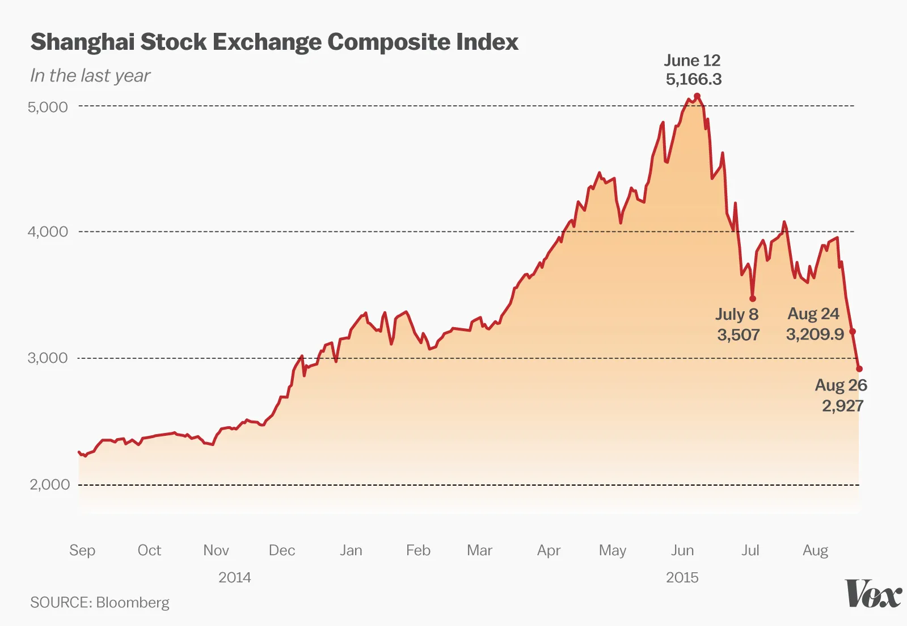

## Table of Contents

## What was the 2015 Chinese stock market crash?

The 2015 Chinese stock market crash was a big drop in the value of stocks in China. It started in June 2015 and got worse in July and August. Many people in China had bought stocks hoping to make money, but when the prices started to fall, they panicked and sold their stocks. This made the prices fall even more. The crash affected not just China but also other countries because China is a big part of the world economy.

The Chinese government tried to stop the crash by doing things like stopping people from selling stocks and using money from the government to buy stocks. But these actions did not work well at first. By the end of 2015, the stock market had calmed down a bit, but many people had lost a lot of money. The crash showed that even big economies like China can have big problems, and it made people think more about how safe it is to invest in stocks.

## When did the 2015 Chinese stock market crash occur?

The 2015 Chinese stock market crash started in June 2015. It was a time when the prices of stocks in China began to fall a lot. Many people had bought stocks thinking they would make money, but when the prices dropped, they got scared and started selling their stocks. This made the prices fall even more.

The crash got worse in July and August of 2015. It didn't just affect China but also other countries because China is a big part of the world's economy. The Chinese government tried to stop the crash by doing things like stopping people from selling stocks and using government money to buy stocks. But these actions didn't work well at first. By the end of 2015, things had calmed down a bit, but many people had lost a lot of money.

## What were the immediate causes of the 2015 Chinese stock market crash?

The immediate cause of the 2015 Chinese stock market crash was a sudden drop in stock prices that started in June 2015. Many people in China had been buying stocks because they thought the prices would keep going up. But when the prices started to fall, people got scared and began selling their stocks quickly. This selling made the prices fall even more, creating a cycle of panic and more selling.

Another reason was that many people were borrowing money to buy stocks, hoping to make a profit. When the stock prices started to drop, these people had to sell their stocks to pay back their loans. This added more pressure on the stock market and made the prices fall faster. The Chinese government tried to stop the crash by doing things like stopping people from selling stocks and using government money to buy stocks, but these actions did not work well at first.

## How did the Chinese government initially respond to the stock market crash?

When the stock market started to crash in 2015, the Chinese government quickly tried to stop it. They did things like telling some people they couldn't sell their stocks for a while. They also used money from the government to buy stocks, hoping this would make the prices go up again. But these actions didn't work well at first. People were still scared and kept selling their stocks.

The government also tried to calm people down by saying everything would be okay. They wanted to stop the panic that was making more people sell their stocks. Even though they did a lot, the stock market kept falling for a while. It took some time before things started to get better, but many people had already lost a lot of money.

## What were the key economic policies implemented by China to stabilize the market?

When the stock market crashed in 2015, the Chinese government did a few things to try to make it better. They told some people they couldn't sell their stocks for a while. This was to stop the prices from falling even more. They also used money from the government to buy stocks. They thought if they bought stocks, the prices might go up again. But these ideas didn't work very well at first because people were still scared and kept selling their stocks.

The government also tried to calm people down by saying everything would be okay. They wanted to stop the panic that was making more people sell their stocks. They also made it easier for companies to borrow money so they could keep going even though the stock market was bad. It took some time, but eventually, these actions helped to make the stock market more stable. Even though many people had lost money, the government's efforts started to work and things got better.

## How did the People's Bank of China intervene during the crisis?

During the 2015 Chinese stock market crash, the People's Bank of China (PBOC) took several steps to help stabilize the market. One of the main things they did was to make more money available to banks. This was to help companies and people who were struggling because of the falling stock prices. By making it easier for banks to lend money, the PBOC hoped to keep the economy going and prevent more panic.

The PBOC also tried to calm people down by saying that they were watching the situation closely and were ready to do more if needed. They wanted to make people feel that the government was in control and that things would get better. Although the PBOC's actions did not fix the problem right away, they were part of the bigger effort to help the economy recover over time.

## What role did state-owned enterprises play in the government's response?

During the 2015 Chinese stock market crash, state-owned enterprises (SOEs) were important in the government's plan to help the market. The government used these companies to buy stocks and stop the prices from falling too much. By having SOEs buy stocks, the government hoped to make people feel better and stop them from selling their own stocks out of fear.

The government also told some SOEs that they couldn't sell their stocks for a while. This was to make sure that the stock market didn't get even worse. Even though the SOEs couldn't fix everything right away, their actions helped to calm things down over time and played a big part in the government's efforts to make the market more stable.

## What were the long-term effects of the government's interventions on the Chinese economy?

The long-term effects of the Chinese government's interventions after the 2015 stock market crash were mixed. On one hand, the government's actions helped to calm the market and stop the panic. By using state-owned enterprises to buy stocks and by making it easier for banks to lend money, the government was able to keep the economy from getting even worse. Over time, these efforts helped to make people feel more confident about investing again, and the stock market slowly started to recover.

On the other hand, the interventions also had some negative effects. People started to worry about how much control the government had over the market. Some thought that the government's actions might make it harder for the market to work in a fair way. Also, the money the government used to help the market could have been used for other things, like building schools or hospitals. So, while the interventions helped in the short term, they also made people think more about the role of the government in the economy and how to balance that with the needs of the people.

## How did international investors react to China's response to the crash?

When the Chinese government stepped in to help with the 2015 stock market crash, international investors had mixed feelings. Some investors felt better because the government was trying to fix the problem. They thought that if the government was doing something, it meant things might get better soon. These investors saw the government's actions as a sign that China was trying to keep its economy strong, and they kept investing in Chinese stocks.

However, other investors were worried. They thought the government was trying to control the market too much. They were concerned that the government's actions might not be fair and could make the market less trustworthy. Some investors started to pull their money out of China because they were afraid that the government's interventions might cause more problems in the future. Overall, while some saw the government's efforts as helpful, others were more cautious and less willing to invest in China.

## What lessons did the Chinese government learn from the 2015 stock market crash?

The Chinese government learned a lot from the 2015 stock market crash. One big lesson was that trying to control the stock market too much can make things worse. When the government stopped people from selling their stocks and used government money to buy stocks, it made some people think the market wasn't fair. This made some investors, both in China and other countries, less willing to trust the Chinese market. The government realized it needed to be more careful about how it steps in during a crisis.

Another lesson was the importance of clear communication. During the crash, the government tried to calm people down by saying everything would be okay, but this didn't work well at first because people were still scared. The government learned that it needs to explain its actions better and be more open about what it's doing to help the market. This way, people might feel more confident and less likely to panic during future problems. Overall, the 2015 crash taught the Chinese government to balance its interventions and communicate better to keep the economy stable.

## How did the 2015 crash influence China's future financial regulations and policies?

The 2015 stock market crash taught China a lot about how to handle future financial problems. One big change was that the government started to be more careful about how much it tried to control the stock market. After the crash, they realized that too much control can make people think the market isn't fair. So, they decided to let the market work more on its own and only step in when really needed. This was to make investors, both in China and other countries, feel more confident about putting their money in Chinese stocks.

Another important change was in how the government talked to people about the economy. During the crash, the government tried to calm people down by saying everything would be okay, but this didn't work well because people were still scared. So, they learned to be more open and clear about what they were doing to help the market. By explaining their actions better, the government hoped to make people feel more secure and less likely to panic during future problems. Overall, the crash led to more balanced financial regulations and better communication from the government.

## What are the ongoing debates among economists about the effectiveness of China's response to the 2015 stock market crash?

Economists still argue about how well China's government handled the 2015 stock market crash. Some say the government's quick actions, like stopping people from selling stocks and using government money to buy stocks, helped to calm the market and stop the panic. They think these steps were needed to keep the economy from getting even worse. These economists believe that without the government's help, the crash could have been much bigger and hurt more people.

On the other hand, other economists think the government did too much. They say that by trying to control the market so much, the government made people less confident in it. These economists argue that the government's actions might have stopped the market from working in a fair way. They also worry that the money used to help the market could have been better spent on other things, like helping people or building schools. In the end, these ongoing debates show that there's no easy answer to how best to handle a big financial crisis like the one in 2015.

## References & Further Reading

[1]: Cheng, E., & Wong, C. (2015). ["China Boosts Financial Firepower with More Buying of Stocks."](https://pubmed.ncbi.nlm.nih.gov/26443652/) Reuters.

[2]: Sweeney, C. (2015). ["China Freezes IPOs to Steady Markets."](https://www.bloomberg.com/news/articles/2015-07-04/china-stock-brokers-set-up-19-billion-fund-to-stem-market-rout) BBC News.

[3]: Liang, H., & Wei, M. (2015). ["Effects of Government Interventions: The Chinese Stock Market."](https://www.researchgate.net/publication/323129729_DO_GOVERNMENT_INTERVENTIONS_AFFECT_CHINA'S_STOCK_MARKET_CASE_STUDY-ANALYSIS_OF_THE_ASSET_BUBBLE_IN_2015-2016) Journal of Financial Economics, 115(3), 580-595.

[4]: Walter, C. (2016). ["Analyzing the 2015 China Stock Crash using a Behavioral Finance Lens."](https://onlinelibrary.wiley.com/doi/abs/10.1002/sta4.460) Semantic Scholar.

[5]: Kynge, J. (2015). ["How China’s stock market bubble could burst."](https://books.google.com/books/about/China_Shakes_The_World.html?id=xXYd9b5YMj0C) Financial Times.