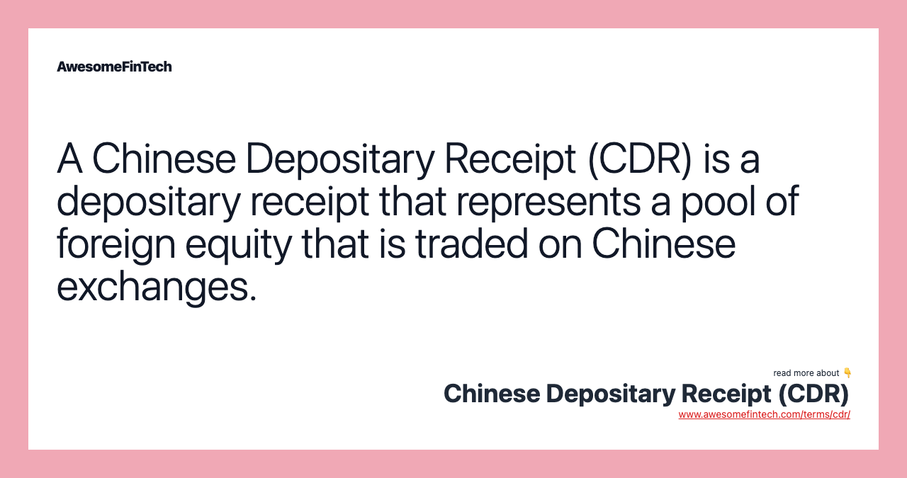

## Table of Contents

## What are Chinese Depositary Receipts (CDRs)?

Chinese Depositary Receipts (CDRs) are financial instruments that allow Chinese investors to buy shares in foreign companies without having to directly purchase those shares on foreign stock exchanges. They work by a Chinese bank buying shares of a foreign company and then issuing CDRs, which represent those shares, to investors in China. This makes it easier for Chinese investors to invest in well-known international companies without dealing with the complexities of foreign stock markets.

CDRs are similar to American Depositary Receipts (ADRs), which are used in the United States for the same purpose. The main benefit of CDRs is that they help bridge the gap between Chinese and global markets, making it simpler for Chinese investors to diversify their portfolios. However, CDRs are subject to regulations by Chinese authorities, which can impact their availability and the companies that can issue them.

## How do CDRs function in the Chinese market?

Chinese Depositary Receipts (CDRs) work by allowing Chinese investors to own shares in foreign companies without buying them directly. A Chinese bank buys the shares of a foreign company on a foreign stock exchange. Then, the bank issues CDRs to investors in China. Each CDR represents a certain number of the foreign company's shares. This way, Chinese investors can invest in big international companies without dealing with foreign stock markets.

When someone buys a CDR, they are actually buying a piece of paper that represents the foreign shares held by the Chinese bank. The value of the CDR goes up and down with the value of the foreign company's stock. If the foreign company does well, the CDR's value increases, and if it does poorly, the CDR's value decreases. This makes it easier for Chinese investors to diversify their investments and own parts of well-known companies around the world.

## What is the purpose of issuing CDRs?

The main purpose of issuing Chinese Depositary Receipts (CDRs) is to help Chinese investors buy shares in foreign companies easily. Instead of dealing with foreign stock markets, which can be complicated and have different rules, Chinese investors can simply buy CDRs from a Chinese bank. The bank buys the actual shares on the foreign market and then issues CDRs that represent those shares. This makes it much simpler for Chinese people to invest in big international companies.

Another goal of CDRs is to help bring more foreign money into China's financial markets. By making it easier for Chinese investors to buy shares in foreign companies, CDRs can attract more investment from around the world. This can help grow China's economy and make its financial markets stronger. Overall, CDRs are a way to connect Chinese investors with global companies and help China's economy grow.

## Who can invest in CDRs?

Anyone in China who wants to invest in foreign companies can buy CDRs. You don't need to be rich or a big investor. As long as you have some money to invest and you are in China, you can buy CDRs from a Chinese bank.

CDRs are a way for regular people in China to own parts of big companies from other countries without having to deal with foreign stock markets. This makes it easier and simpler for them to invest in global companies and grow their money.

## How are CDRs different from American Depositary Receipts (ADRs)?

CDRs and ADRs are similar because they both let people invest in foreign companies without buying shares directly on foreign stock markets. A bank buys the foreign shares and then issues either CDRs or ADRs, which represent those shares. This makes it easier for people to invest in big companies from other countries. The main difference is where they are used: CDRs are for Chinese investors, while ADRs are for American investors.

Another difference is that CDRs and ADRs are regulated by different countries. CDRs follow China's rules, which can affect which companies can issue them and how they work. ADRs follow the rules of the United States. Both help investors buy into global companies, but they do it in different parts of the world and under different laws.

## What are the benefits of investing in CDRs for Chinese investors?

Investing in CDRs helps Chinese investors buy shares in big companies from other countries easily. Instead of dealing with foreign stock markets, which can be hard to understand and have different rules, Chinese investors can just buy CDRs from a Chinese bank. This makes it simple for them to own parts of well-known international companies. If the foreign company does well, the value of the CDR goes up, and the investor can make money.

Another benefit is that CDRs help Chinese investors spread their money across different kinds of investments. This is called diversification, and it can lower the risk of losing money. By buying CDRs, Chinese investors can have a mix of local and global companies in their investment portfolio. This can make their investments safer and help them grow their money over time.

## What are the risks associated with investing in CDRs?

Investing in CDRs can be risky because the value of the CDRs goes up and down with the value of the foreign company's stock. If the foreign company does not do well, the value of the CDR can go down, and investors can lose money. Also, since CDRs are tied to foreign companies, they can be affected by things happening in other countries, like economic problems or political changes. These things can make the value of the CDR go up and down a lot, which can be risky for investors.

Another risk is that CDRs are controlled by Chinese laws and rules. The Chinese government can change these rules at any time, which might affect how CDRs work or which companies can issue them. This can make it hard for investors to predict what will happen to their investments. Also, because CDRs are new and not as common as other investments, there might not be as much information available about them. This can make it harder for investors to make good decisions about buying and selling CDRs.

## How does the process of issuing CDRs work?

When a company wants to issue CDRs, a Chinese bank first buys shares of that company on a foreign stock exchange. The bank then creates CDRs that represent those shares. Each CDR stands for a certain number of the foreign company's shares. The bank sells these CDRs to investors in China. This way, Chinese investors can own parts of foreign companies without dealing with foreign stock markets.

The whole process is managed by the Chinese bank, which keeps the foreign shares safe and handles all the paperwork. The bank also makes sure that the CDRs follow Chinese laws and rules. If the foreign company's stock price goes up, the value of the CDRs goes up too, and investors can make money. But if the stock price goes down, the value of the CDRs goes down, and investors can lose money. This makes investing in CDRs both exciting and risky for Chinese investors.

## What regulatory frameworks govern CDRs in China?

CDRs in China are governed by rules set by the China Securities Regulatory Commission (CSRC). The CSRC makes sure that CDRs follow Chinese laws and protect investors. When a company wants to issue CDRs, it has to get approval from the CSRC. The CSRC checks the company's financial health and makes sure it meets all the rules before allowing the CDRs to be sold in China. This helps keep the market safe and fair for everyone.

Another important part of the regulatory framework is the rules about how CDRs can be traded. The Shanghai and Shenzhen stock exchanges have their own rules for CDRs, which include things like how they can be bought and sold, and how their prices are set. These rules help make sure that trading is clear and fair. Also, the banks that issue CDRs have to follow strict rules about how they handle the foreign shares and report to the CSRC. This makes sure that everything is done the right way and investors are protected.

## How do CDRs impact the global investment landscape?

CDRs make it easier for Chinese people to invest in big companies from other countries. Instead of dealing with foreign stock markets, which can be hard to understand, Chinese investors can just buy CDRs from a Chinese bank. This helps more money flow into global markets because more people can invest in companies from around the world. It also helps companies from other countries raise money in China, which can help them grow and do more business there.

But CDRs also change how global investments work. Because they are controlled by Chinese laws, they can be affected by what the Chinese government decides. This can make things less predictable for investors and companies. Also, since CDRs are a new way to invest, they might not be as well understood as other investments. This can make some investors nervous about using them. Overall, CDRs help connect Chinese and global markets, but they also bring new challenges and risks.

## What are some examples of companies that have issued CDRs?

A few big companies have issued CDRs to let Chinese people invest in them easily. One example is Alibaba, a huge Chinese company that wanted to let more people in China buy its shares. Alibaba issued CDRs so that Chinese investors could own parts of the company without having to deal with foreign stock markets. Another example is Baidu, a Chinese internet company. Baidu also used CDRs to help Chinese investors buy its shares more easily.

These examples show how CDRs help big companies raise money in China. By issuing CDRs, companies like Alibaba and Baidu can get more money from Chinese investors, which helps them grow their businesses. This makes it easier for Chinese people to invest in well-known companies and helps the companies reach more investors in China.

## What future developments might affect the use and popularity of CDRs?

Future developments in China's financial rules could change how CDRs work and how popular they are. If the Chinese government makes the rules easier, more companies might want to issue CDRs. This could make it simpler for Chinese people to invest in foreign companies and bring more money into China's markets. But if the rules get stricter, it might be harder for companies to issue CDRs, and fewer people might want to buy them. Also, if China and other countries work together more on financial rules, it could make CDRs easier to use and more popular.

Another thing that could affect CDRs is how well they do in the market. If more people start buying CDRs and the companies that issue them do well, more companies might want to use CDRs to raise money. This could make CDRs more common and easier to understand. But if the value of CDRs goes down a lot or if there are big problems with them, people might not want to invest in them anymore. This could make CDRs less popular and harder to use. So, both changes in rules and how well CDRs do in the market will be important for their future.

## References & Further Reading

[1]: Mookerjee, R., & Yu, Q. (2021). ["ADR investing and the emergence of Chinese Depositary Receipts."](https://scholar.google.com/citations?user=jiYyQPwAAAAJ&hl=en) The European Journal of Finance.

[2]: Kolaric, S., & Schiereck, D. (2022). ["IPO survival on Chinese exchanges: A comparison between ADR and CDR."](https://www.semanticscholar.org/paper/Market-Discipline-through-Credit-Ratings-and-in-Kolaric-Kiesel/07f0292ff31fa48914b678772d8dde86568477d5) Pacific-Basin Finance Journal.

[3]: Huang, Y., & Wu, J. (2020). ["The internationalization of the Renminbi and financing difficulties of ‘returning’ Chinese companies."](https://www.sciencedirect.com/science/article/pii/S0360319924052996) Journal of Chinese Economic and Business Studies.

[4]: Gu, X., & Reed, W. R. (2018). ["The impact of the 2007–2008 global financial crisis on the synchronous trading of ADRs: A factor analysis."](https://www.researchgate.net/publication/387327553_Trends_in_Oceanic_Precipitation_Characteristics_Inferred_From_Shipboard_Present-Weather_Reports_1950-2019) Applied Financial Economics.

[5]: Liu, H., & Zhou, J. (2017). ["Chinese securities market development: policy implications."](https://www.sciencedirect.com/science/article/pii/S0360319924052996) Journal of Multinational Financial Management.