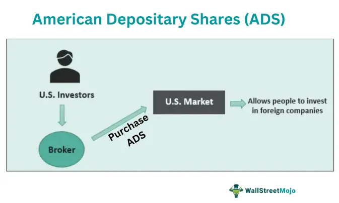

 to Chinese Depositary Receipts (CDRs)

Chinese Depositary Receipts (CDRs) are financial instruments designed to facilitate the trading of foreign equities on Chinese stock exchanges. These instruments closely resemble American Depositary Receipts (ADRs), which serve a similar purpose by allowing U.S. investors to invest in foreign companies. CDRs are issued by a custodian bank that holds the underlying foreign equities on behalf of Chinese investors. These receipts represent the ownership of shares in a foreign company, allowing them to be traded locally in China's stock exchanges like the Shanghai and Shenzhen exchanges. 



The primary purpose of CDRs is to create a bridge between China's financial market and the global economy, facilitating cross-border investment flows. One of the significant motivations behind the introduction of CDRs is China's intention to attract overseas capital and boost its domestic market. By offering investors the opportunity to invest in global companies without having to navigate the complexities of foreign stock markets, China seeks to strengthen its economic position and increase market liquidity.

The trading mechanism of CDRs involves several key players. These include the foreign company whose shares are being represented, a custodian bank that holds the underlying shares, and potentially a broker or dealer who facilitates the trading of these receipts on Chinese exchanges. The regulatory framework for CDRs is influenced by both domestic Chinese laws and international finance regulations, necessitating a comprehensive approach to ensure compliance and protect investor interests.

The strategic introduction of CDRs aligns with China’s broader financial reforms aimed at liberalizing its markets and integrating them with global economic systems. Furthermore, regulatory measures have been put in place to manage foreign exchange risks and ensure the stability of the financial system. The government monitors CDR issuances and transactions closely, ensuring that they align with China's monetary policy and economic growth objectives.

In summary, CDRs represent a crucial innovation in China's financial markets, providing a gateway for both foreign companies seeking access to Chinese investors and local investors aiming to diversify their portfolios with international assets. The development of CDRs is expected to contribute significantly to China's economic expansion by fostering a more interconnected global financial environment.

## Table of Contents

## Understanding the Mechanism of CDRs

Chinese Depositary Receipts (CDRs) represent a financial mechanism that allows foreign companies to list their shares on Chinese stock exchanges. CDRs are issued by a custodian bank, which holds the underlying foreign equity. This process involves creating a receipt for these equities that can be traded on local exchanges, making them accessible to domestic investors without requiring them to buy shares on foreign stock markets directly.

The concept of depositary receipts originated with the introduction of American Depositary Receipts (ADRs) in the 1920s. ADRs were developed to help American investors invest in foreign companies without dealing with the complexities of foreign markets. Similarly, CDRs are adapted to suit the Chinese market by allowing Chinese investors to invest in foreign firms within the framework of Chinese regulatory environments. This adaptation is critical to align with China's legal and financial infrastructure, which is distinct from Western markets.

The issuance of CDRs involves several steps. A foreign company that wishes to issue CDRs must first engage a Chinese financial institution that acts as a custodian. This institution holds the foreign company's shares and issues corresponding CDRs that can be traded on Chinese exchanges. The flexibility of this system allows the prices of CDRs to reflect local market conditions, while still being tethered to the value of the underlying foreign securities.

When comparing CDRs with ADRs, both serve the similar function of providing investment opportunities in foreign equities to local investors. Both systems involve custodial institutions holding foreign shares and issuing tradable receipts. However, key differences lie in the regulatory frameworks and market environments they cater to. ADRs, governed by U.S. regulations, have facilitated cross-border investments into U.S. markets for decades, promoting [liquidity](/wiki/liquidity-risk-premium) and transnational investment flows. On the other hand, CDRs are part of China's strategy to integrate with global financial markets while maintaining capital controls, thus ensuring that domestic capital has the means to invest in international opportunities.

In summary, CDRs function by leveraging custodial services to convert foreign equity into a locally tradable format, employing a mechanism analogous to ADRs but tailored to China's regulatory and financial context. This system not only mitigates the complexities of direct foreign equity investment for Chinese individuals but also serves as an economic tool to encourage domestic investment in global markets.

## Advantages of Investing in CDRs

Chinese Depositary Receipts (CDRs) present several advantages for investors, primarily by offering access to international equities through local exchanges. This mechanism allows Chinese investors to diversify their portfolios without the complexities of direct foreign investments. By trading foreign equities domestically, investors can bypass language and procedural barriers often associated with overseas markets, creating a more accessible entry point into global assets.

A significant benefit of CDRs is risk mitigation concerning ownership and capital control issues. Directly owning foreign assets can expose investors to uncertainties like fluctuating foreign exchange rates, geopolitical tensions, and differing regulatory environments. CDRs alleviate some of these concerns by consolidating foreign investments into a framework governed by domestic regulations. This structure protects local investors from potential legal conflicts and simplifies the taxation process.

Furthermore, the presence of a robust CDR market contributes to economic growth. Facilitating international investment within China increases market activity and liquidity, potentially leading to higher valuations and greater capital flow. An active CDR market can attract more companies worldwide to consider listing via depositary receipts, thereby increasing competition and innovation within China's financial sector. As domestic investors engage more with these international equities, the resulting economic dynamism can lead to enhanced competitiveness and influence in global finance.

Overall, CDRs create a strategic synergy between Chinese investors and international markets, fostering a more inclusive financial environment that supports both individual and broader economic advancement.

## Challenges in the CDR Market

Chinese Depositary Receipts (CDRs) face several challenges in their market development, primarily related to regulatory hurdles, legal complexities, and listing barriers for Chinese firms. 

Regulatory hurdles and restrictions on CDR issuance are significant challenges. The regulatory framework governing CDRs is complex and often involves multi-layered compliance standards that companies must meet to issue these securities. Regulatory bodies such as the China Securities Regulatory Commission (CSRC) play a pivotal role in setting the guidelines for CDR issuance. These include compliance with capital requirements, financial disclosures, and transparency mandates that align with Chinese financial regulations. Furthermore, restrictions regarding the proportion of shares that can be converted into CDRs are stringent, affecting the appeal and accessibility of CDRs to foreign companies looking to tap into the Chinese market.

Legal complexities in cross-border investments are another challenge for CDRs, arising due to variations in national stock exchange laws and international investment treaties. These complexities are compounded by differences in legal frameworks concerning shareholder rights, taxation, and corporate governance standards between China and the home countries of foreign firms. For instance, discrepancies in accounting standards and disclosure practices can pose significant barriers for companies aiming to list CDRs. These legal differences necessitate comprehensive legal counsel and cross-jurisdictional strategies to ensure compliance and mitigate litigation risks.

To navigate these challenges, Chinese firms adopt various strategies to overcome listing barriers on domestic exchanges. One common approach is to establish Variable Interest Entities (VIEs), allowing foreign firms to enter the Chinese market indirectly while adhering to domestic ownership restrictions. This structure, however, introduces additional legal and financial risks, necessitating careful contractual arrangements to ensure control and profit repatriation. Additionally, companies often engage in dual-listing, issuing both CDRs and traditional shares to enhance their visibility and liquidity across multiple markets.

In summary, despite the attractive opportunity that CDRs offer for expanding the investment landscape in China, regulatory, legal, and strategic challenges persist. Addressing these challenges requires continuous dialogue between regulatory authorities, legal experts, and market participants to foster a conducive environment for CDR market growth.

## Algorithmic Trading in CDR Investments

Algorithmic trading has increasingly become a crucial component in the trading of Chinese Depositary Receipts (CDRs), transforming the landscape with its speed, accuracy, and efficiency. The application of technology and algorithms provides traders with the ability to execute complex strategies at speeds and volumes beyond human capability.

### Role of Technology in CDR Trading
Algorithmic trading, often referred to as algo-trading, employs automated and pre-programmed trading instructions accounting for variables such as timing, price, and [volume](/wiki/volume-trading-strategy). In the context of CDRs, algo-trading facilitates capturing [arbitrage](/wiki/arbitrage) opportunities, optimizing execution prices, and managing large order flows without significantly impacting market prices.

### Advantages of Algorithms
1. **Speed**: Algorithms can execute trades within milliseconds, far exceeding the capabilities of a human trader. This speed is essential for exploiting small price inefficiencies in the fast-moving markets of CDRs.

2. **Accuracy**: Algorithms minimize human error during trading by adhering strictly to pre-defined instructions without emotional interference.

3. **Efficiency**: Through continuous monitoring of market conditions and real-time data analysis, algorithms efficiently manage trades, enhancing potential returns by minimizing transaction costs.

For instance, a basic algorithm could be designed to monitor price movements of a specific CDR and execute a buy order if the price falls by a certain percentage:

```python
def buy_cdr(cdr_price, threshold=1.0):
    if cdr_price <= threshold:
        execute_trade('buy', cdr_price)
```

### Potential Pitfalls and Challenges
Despite the advantages, there are several challenges associated with algo-trading in CDRs:

- **Market Volatility**: Rapid market changes can render an algorithm ineffective quickly, potentially leading to significant losses if the algorithm misjudges market conditions.

- **Complexity and Infrastructure**: Developing and maintaining sophisticated algorithms require substantial technical expertise and infrastructure investment, which may not be feasible for smaller firms.

- **Regulatory Scrutiny**: Algorithms must comply with the regulatory framework governing CDRs. Violations, whether intentional or due to an oversight in the algorithm's design, can lead to heavy penalties and sanctions.

- **Overfitting**: There is a risk that algorithms might be overfitted to historical data, reducing their effectiveness in live trading environments. Algorithms need constant updates and optimizations to adapt to changing market conditions.

Algorithmic trading is a powerful tool in the CDR market, but it requires careful implementation and regular assessments to align with market dynamics and regulatory requirements. This continuous evolution will likely result in the development of more sophisticated and adaptive trading algorithms that can better navigate the complexities of the CDR market.

## Future Outlook for CDRs and Algorithmic Trading

The future outlook for Chinese Depositary Receipts (CDRs) and [algorithmic trading](/wiki/algorithmic-trading) is shaped by evolving market trends and technological advancements. As China continues to integrate with global financial markets, the demand for CDRs is expected to rise, providing investors with diversified access to international companies. This growth will likely be fueled by China's initiatives to attract foreign investments and the continuous liberalization of its financial markets.

**Trends in the Development of CDRs**

One significant trend is the increasing willingness of leading global technology companies, especially those with a substantial Chinese user base, to issue CDRs. This strategy not only aids these companies in accessing capital from Chinese investors but also aligns with China's goals to enhance its domestic financial market stability. Additionally, the push towards digitalization and fintech innovations is expected to streamline the issuance process of CDRs, making them more accessible to a wider array of companies and investors.

**Enhancements in Trading Techniques**

The rise of algorithmic trading is revolutionizing the CDR market by providing enhanced speed, accuracy, and efficiency in executing trades. This development works in tandem with the growth of big data analytics and [machine learning](/wiki/machine-learning), enabling more sophisticated trading strategies that can quickly adapt to market changes. Moreover, advancements in blockchain technology could offer increased transparency and security in CDR transactions.

**Projection of Market Growth Potential and Investor Interest**

The potential for market growth in CDRs is significant. As more Chinese individuals and institutional investors seek diversification and exposure to global markets, CDRs present a feasible solution for bridging domestic funds and foreign equities. Investor interest is likely to be bolstered by China's regulatory reforms aimed at fostering a more open and accommodating financial environment. According to market analyses, if the current trajectory holds, the CDR market could see exponential growth, similar to the expansion seen in American Depositary Receipts (ADRs) over recent decades.

**Predictions on Regulatory Changes**

Regulatory changes will play a crucial role in shaping the future landscape of CDRs and algorithmic trading. China's regulatory bodies, such as the China Securities Regulatory Commission (CSRC), are expected to introduce reforms to further simplify the process for listing and trading CDRs. This might include easing capital flow restrictions, aligning with international standards, and ensuring robust investor protection frameworks.

Moreover, as algorithmic trading becomes more prevalent, regulators may implement measures to address associated risks such as market manipulation and systemic instability. This could involve establishing guidelines for the use of trading algorithms, mandating periodic audits, and enhancing transparency requirements for trading activities.

In summary, the future outlook for CDRs and algorithmic trading is promising. Market growth and technological advancements will likely coincide with an increasingly supportive regulatory environment, offering a fertile ground for innovation and investment opportunities. However, continuous monitoring and adaptation to regulatory changes will be necessary for market participants to fully leverage the benefits presented by these developments.

## Conclusion

Chinese Depositary Receipts (CDRs) represent a pivotal link between the Chinese and global financial markets, offering a platform for international equities to be traded within China. This not only enables Chinese investors to access foreign markets more easily but also encourages foreign companies to tap into the vast capital pool that China presents. The introduction of CDRs marks a significant step toward integrating China's financial market with the global economy, potentially boosting economic growth by facilitating greater cross-border investment flows.

For investors, particularly those inclined towards algorithmic trading, CDRs present a myriad of opportunities. The use of advanced algorithms can optimize trading strategies by enhancing speed, accuracy, and execution efficiency. Algorithmic trading in the context of CDRs allows investors to swiftly react to market changes and exploit arbitrage opportunities that may exist due to differences in trading hours and market conditions between Chinese exchanges and the corresponding foreign markets. However, traders must remain cognizant of the inherent challenges posed by algorithmic strategies, such as market [volatility](/wiki/volatility-trading-strategies) and the risks of automated trades executing under unexpected market conditions.

As CDRs continue to evolve, they prompt important considerations for future research and financial tool innovation. Key areas of interest might include developing more robust algorithms to handle varied market scenarios, improving predictive models for better forecasting market movements, and exploring how blockchain technology could streamline CDR transactions. Moreover, understanding the regulatory landscape's evolution will be crucial, as any changes could significantly impact how CDRs and algorithmic trading are conducted. 

Overall, CDRs carve a promising path for deepening China’s integration into global finance, with algorithmic trading poised to maximize the benefits harnessed from this new financial instrument. The continuous development in these areas beckons further exploration and holds the potential for unprecedented advancements in international investment strategies.

## References & Further Reading

[1]: Mookerjee, R., & Yu, Q. (2021). ["ADR investing and the emergence of Chinese Depositary Receipts."](https://scholar.google.com/citations?user=jiYyQPwAAAAJ&hl=en) The European Journal of Finance.

[2]: Kolaric, S., & Schiereck, D. (2022). ["IPO survival on Chinese exchanges: A comparison between ADR and CDR."](https://www.semanticscholar.org/paper/Market-Discipline-through-Credit-Ratings-and-in-Kolaric-Kiesel/07f0292ff31fa48914b678772d8dde86568477d5) Pacific-Basin Finance Journal.

[3]: Huang, Y., & Wu, J. (2020). ["The internationalization of the Renminbi and financing difficulties of ‘returning’ Chinese companies."](https://www.sciencedirect.com/science/article/pii/S0360319924052996) Journal of Chinese Economic and Business Studies.

[4]: Gu, X., & Reed, W. R. (2018). ["The impact of the 2007–2008 global financial crisis on the synchronous trading of ADRs: A factor analysis."](https://www.researchgate.net/publication/387327553_Trends_in_Oceanic_Precipitation_Characteristics_Inferred_From_Shipboard_Present-Weather_Reports_1950-2019) Applied Financial Economics.

[5]: Liu, H., & Zhou, J. (2017). ["Chinese securities market development: policy implications."](https://www.sciencedirect.com/science/article/pii/S0360319924052996) Journal of Multinational Financial Management.