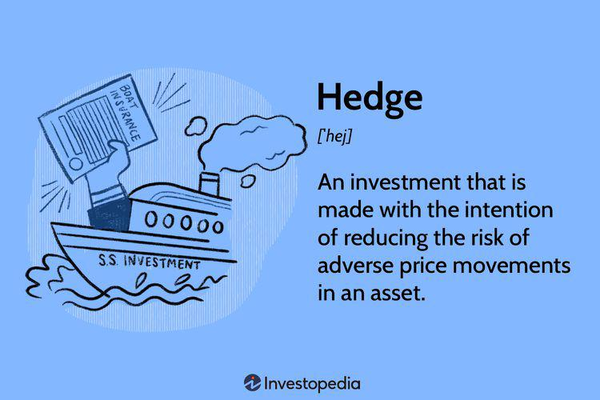

In recent years, the financial world has undergone a significant transformation, driven by technological advancements that have reshaped traditional investment strategies. Leading this evolution are Chinese hedge funds, which have emerged as pivotal players utilizing sophisticated algorithmic trading strategies. These strategies are transforming how investments are managed and outcomes optimized, providing a unique competitive edge in the global financial market.

Algorithmic trading, which involves the use of computer programs to execute trades based on predefined criteria, has become integral to the operation of Chinese hedge funds. By leveraging complex algorithms, these funds are able to analyze vast amounts of market data with unprecedented precision and speed. This capability allows them to identify profitable trading opportunities and execute trades that maximize returns while minimizing risks.



Chinese hedge funds have gained a distinct advantage through this approach, driven by China's rapid economic growth and technological innovation. The integration of advanced mathematical models and computational algorithms allows these funds to make informed trading decisions. These developments are not only pivotal in optimizing investment outcomes but also in enhancing the overall efficiency of the financial markets.

This article will examine the specific investment strategies employed by Chinese hedge funds, focusing particularly on their use of algorithmic trading. The aim is to uncover how these strategies impact the broader finance industry and what they signify for the future of investment management. Through this exploration, it becomes evident that Chinese hedge funds are at the forefront of a new era in quantitative finance, leveraging technology to redefine the possibilities within the investment landscape.

## Table of Contents

## The Rise of Chinese Hedge Funds

Chinese hedge funds have become increasingly influential in the global financial landscape, driven by their innovative approaches to investment management. Over the past decade, China's rapid economic growth and technological advancements have positioned the country as a fertile ground for quantitative hedge funds. These funds differentiate themselves by employing cutting-edge mathematical models and computational algorithms to make informed trading decisions.

The evolution of Chinese hedge funds can be attributed to several factors. Primarily, China's burgeoning economy offers a vast and dynamic market environment, which is conducive to the implementation and testing of sophisticated trading strategies. This has attracted a generation of well-educated quantitative analysts and traders, who leverage China's strengths in science and technology to develop robust financial models. Additionally, China's government has supported the evolution of the financial sector by fostering an environment that encourages innovation and adaptation to global market trends. 

Quantitative hedge funds in China embrace a data-driven approach, relying heavily on [algorithmic trading](/wiki/algorithmic-trading) techniques. They utilize statistical methods, such as regression analysis and [machine learning](/wiki/machine-learning), to dissect large datasets and identify patterns that can signal profitable trading opportunities. For instance, linear regression models can be utilized to predict stock prices based on historical data and other relevant metrics:

$$
y = \beta_0 + \beta_1 x_1 + \beta_2 x_2 + \ldots + \beta_n x_n + \varepsilon
$$

Here, $y$ represents the predicted stock price, $x_1, x_2, \ldots, x_n$ are the predictor variables (such as past prices, trading [volume](/wiki/volume-trading-strategy), economic indicators), $\beta_0, \beta_1, \ldots, \beta_n$ are coefficients, and $\varepsilon$ is the error term.

Python, a preferred language for data analysis due to its extensive libraries such as NumPy and pandas, is often employed to implement these algorithms efficiently. This can be exemplified by the use of Python to perform data analysis and modeling, enabling quick adjustments to strategies based on changing market conditions.

The focus on quantitative methods allows Chinese hedge funds to mitigate risks and enhance returns, capitalizing on the [volatility](/wiki/volatility-trading-strategies) and inefficiencies present in both domestic and international markets. As a result, these funds are not only enhancing their competitiveness but also contributing to the sophistication and stability of financial markets overall. 

Through their commitment to innovation and strategic investment, Chinese hedge funds continue to gain prestige and influence, setting benchmarks for other emerging markets. This positions China as an increasingly critical player in global finance, with its hedge funds leading the charge in adopting advanced technological solutions to optimize investment outcomes.

## Understanding the Chinese Hedge Strategy

A Chinese hedge involves a strategic combination of positions in both convertible securities and their underlying assets. This approach is designed to take advantage of disparities in the conversion factors of convertible securities, which are hybrid instruments blending features of debt and equity. By maintaining a short position in the convertible security and a long position in the corresponding underlying asset, investors can exploit price inefficiencies while achieving risk mitigation.

Convertible securities grant the holder the right to convert them into a predetermined number of shares of the issuing company, thus offering the potential for equity-like returns with bond-like safety. However, the conversion ratio of these securities can sometimes be mispriced, creating an opportunity for tactical [arbitrage](/wiki/arbitrage). For example, if a convertible bond's conversion price is lower than the market price of the equity it can be converted into, the implied conversion option might be undervalued.

In a Chinese hedge, the short position in the convertible security generates profit if the security's price falls or if the conversion feature is overpriced. Simultaneously, the long position in the underlying asset provides a hedge against upward movements in the asset’s price, ensuring that the portfolio benefits from the asset's appreciation. This configuration is expressed mathematically as follows:

$$
\text{Net Exposure} = (\Delta_{\text{long}} \cdot Q_{\text{long}}) - (\Delta_{\text{short}} \cdot Q_{\text{short}})
$$

where:
- $\Delta_{\text{long}}$ and $\Delta_{\text{short}}$ represent the delta, or the rate of change of the security's price relative to the underlying asset's price, of the long and short positions, respectively,
- $Q_{\text{long}}$ and $Q_{\text{short}}$ are the quantities held in each position.

This strategic setup reduces the portfolio's overall exposure to market volatility, as gains or losses in one position counterbalance those in the other.

By mitigating downside risk and optimizing conversion efficiencies, this hedge strategy serves as a lower-risk method for engaging with convertible securities. The implicit aim is to maintain a balance that leverages pricing inefficiencies while shielding against broader market swings, ultimately leading to more stable portfolio returns.

## Algorithmic Trading: The Game Changer

Algorithmic trading has revolutionized the financial markets by using complex algorithms to parse and analyze substantial datasets. This technological breakthrough has significantly improved the precision and speed of identifying lucrative trading opportunities. The core of algorithmic trading lies in its ability to automate complex trading strategies, minimizing human intervention and leveraging computational efficiency.

Chinese hedge funds such as Ubiquant and High-Flyer have extensively adopted [artificial intelligence](/wiki/ai-artificial-intelligence) (AI) and machine learning technologies within their trading strategies. AI and machine learning enhance the capacity to process and interpret large volumes of financial data, allowing hedge funds to develop nuanced and robust trading models. These models can dynamically adjust to evolving market conditions, thereby optimizing their investment decisions.

The algorithms implemented in algorithmic trading range from simple linear regression models to more sophisticated [deep learning](/wiki/deep-learning) networks and [reinforcement learning](/wiki/reinforcement-learning) frameworks. For instance, a trading algorithm might use a machine learning model to predict asset prices based on historical data, news sentiment analysis, and other financial indicators. 

The Python language offers libraries such as `pandas` for data manipulation, `scikit-learn` for machine learning, and `TensorFlow` or `PyTorch` for deploying neural networks, making it a popular choice for implementing these trading strategies. A simple example of a linear regression model in Python could involve:

```python
from sklearn.linear_model import LinearRegression
import numpy as np

# Sample data
X = np.array([[1, 1], [1, 2], [2, 2], [2, 3]])
y = np.dot(X, np.array([1, 2])) + 3

# Create model
model = LinearRegression().fit(X, y)

# Predictions
predictions = model.predict(X)
```

In contrast, deep learning models can capture more complex non-linear relationships in financial data, providing powerful tools for pattern recognition and predictive analytics. High-Flyer, for example, employs AI models for trade timing and stock selection, significantly enhancing their market edge.

Furthermore, these technologies facilitate superior risk management. By simulating various market scenarios and stress testing their models, hedge funds can better anticipate potential risks and adjust their strategies accordingly. This proactive approach to risk management is critical in maintaining competitiveness and safeguarding investments in the volatile and rapidly changing financial landscape.

In conclusion, the adoption of algorithmic trading by Chinese hedge funds epitomizes a game-changing shift in strategy. Through the integration of AI and machine learning, these funds achieve significant improvements in trading efficiency and effectiveness, paving the way for continuous innovation in quantitative finance.

## The Role of AI in Modern Trading

AI-driven trading strategies are revolutionizing the financial industry by utilizing pattern recognition, predictive analytics, and automated decision-making capabilities. These technologies empower hedge funds to analyze extensive datasets, derive actionable insights, and optimize their trading decisions, thus enhancing their competitive advantage and adaptability in dynamic financial markets.

Pattern recognition, a core component of AI trading strategies, enables algorithms to identify trends and anomalies within historical and real-time data. By recognizing recurring patterns, AI systems can forecast price movements and inform trading actions with greater accuracy. For instance, neural networks, a type of machine learning model, can be trained to predict stock price fluctuations by analyzing past trading data, news, and other relevant indicators.

Predictive analytics, another critical aspect, involves using statistical algorithms and machine learning techniques to predict future market movements. These predictions can be derived from inputs such as historical price data, trading volumes, economic indicators, and even social media sentiment analysis. For example, regression models can be employed to estimate the future price of an asset based on its historical relationship with various predictors.

Automated decision-making is facilitated by AI's ability to execute trades with high speed and precision. By integrating AI with algorithmic trading systems, hedge funds can develop and deploy trading strategies that react instantaneously to market changes. Trading algorithms are designed to buy or sell assets based on predefined rules and real-time data inputs, minimizing the latency between identifying an opportunity and executing a trade.

The integration of AI in trading not only improves decision-making but also strengthens a fund's competitive edge. Hedge funds leveraging AI can swiftly adapt to market shifts, maintain superior performance metrics, and manage risks more effectively. By processing vast amounts of structured and unstructured data—beyond human capabilities—AI systems capture opportunities previously unattainable through traditional analysis methods.

AI technologies also enable hedge funds to continuously refine their trading models. Machine learning algorithms optimize themselves over time by learning from new data, making them adaptable to evolving market conditions. This adaptability is crucial in maintaining an edge in highly competitive and volatile markets.

Ultimately, AI-driven trading represents a significant evolution in quantitative finance, offering hedge funds a potent tool for maximizing returns and mitigating risks amidst the complexity of modern financial ecosystems.

## Key Players and Their Strategies

Prominent Chinese hedge funds such as Ubiquant and High-Flyer have been instrumental in revolutionizing algorithmic trading. Their innovative use of artificial intelligence (AI) and machine learning has set new benchmarks in quantitative finance strategies.

**Ubiquant** has effectively integrated AI in its operational framework. The focus here is on enhanced indexing and long/short equity strategies. Enhanced indexing involves constructing a portfolio that aims to outperform a specific benchmark index with the help of algorithm-driven trading decisions. The long/short equity strategy employed by Ubiquant centers around taking long positions in undervalued securities while simultaneously shorting overvalued ones, thus capitalizing on price fluctuations. By leveraging AI, Ubiquant can process vast datasets to identify potential market inefficiencies, allowing them to make more informed investment choices.

**High-Flyer**, another key player, has taken a technological leap by developing supercomputers dedicated to AI deep learning. These supercomputers are central to enhancing their algorithmic capabilities, focusing on trade timing and stock selection. The AI models employed by High-Flyer enable them to rapidly analyze market trends and price movements, executing trades with precision. For instance, advanced predictive analytics facilitate determining optimal entry and exit points in trading, thereby maximizing returns.

The utilization of AI models in algorithmic trading by these hedge funds encompasses several key processes, such as:

- **Pattern Recognition**: AI algorithms can identify recurrent patterns and trends in historical market data, enabling the prediction of future price movements.

- **Predictive Analytics**: By examining variables that influence market dynamics, the AI systems can generate forecasts that assist in decision-making.

- **Automated Decision-Making**: These systems autonomously execute trades based on predefined criteria, enhancing efficiency and reducing the emotional biases inherent in human trading.

Python, a popular language for implementing such models, is extensively used. Here is a simple example of how Python can be used for stock analysis using machine learning:

```python
import pandas as pd
from sklearn.model_selection import train_test_split
from sklearn.ensemble import RandomForestClassifier
from sklearn.metrics import accuracy_score

# Load stock data
data = pd.read_csv('stock_data.csv')

# Feature selection
features = data[['open', 'high', 'low', 'volume']].values
target = data['price_trend'].values  # price_trend: target label

# Split the data into training and testing sets
X_train, X_test, y_train, y_test = train_test_split(features, target, test_size=0.2, random_state=42)

# Train the model
model = RandomForestClassifier()
model.fit(X_train, y_train)

# Predict and evaluate
predictions = model.predict(X_test)
accuracy = accuracy_score(y_test, predictions)

print("Model Accuracy: ", accuracy)
```

In conclusion, Ubiquant and High-Flyer exemplify the pioneering efforts of Chinese hedge funds in leveraging AI to redefine investment strategies. Their continued innovation and strategic application of technology have positioned them as leaders in the rapidly evolving landscape of global finance.

## Risks and Challenges

Chinese hedge funds, despite their impressive growth and adoption of cutting-edge technologies, face significant risks and challenges in their operations. One of the primary concerns is market volatility. Financial markets are inherently unpredictable, and rapid fluctuations can impact the performance of algorithmic trading strategies. Hedge funds must continuously monitor market conditions and adjust their strategies to mitigate potential adverse effects caused by sudden market movements.

Algorithmic model limitations also pose considerable risks. These models, although sophisticated, rely on historical data to make predictions and may fail to anticipate unprecedented market events or shifts in market sentiment. Misinterpretations and inaccuracies in data can lead to suboptimal trading decisions and financial losses. To address these limitations, hedge funds need to engage in regular evaluation and improvement of their algorithms, ensuring they remain effective under varying market conditions.

Risk management protocols are crucial in navigating these challenges. A robust risk management system involves a comprehensive assessment of potential threats and the implementation of strategies to minimize their impact. This includes setting predefined risk limits, diversifying investment portfolios, and employing stress testing to evaluate how trading models perform under extreme conditions.

Regulatory changes are another area of concern. Financial regulations can vary significantly across different jurisdictions, and global hedge funds must stay updated on relevant legal requirements to ensure compliance. Regulatory bodies have increased scrutiny on algorithmic trading practices, emphasizing the need for transparency and ethical standards in their operations. Failure to comply with these regulations can result in penalties, reputational damage, and operational constraints.

Global economic conditions further complicate the operation of Chinese hedge funds. Factors such as trade tensions, geopolitical instability, and changes in monetary policy can affect economic environments and, consequently, investment strategies. Hedge funds must maintain a flexible approach, allowing them to adapt quickly to shifting economic landscapes. This adaptability is vital in safeguarding their investments and capitalizing on new opportunities that emerge from evolving market conditions.

In summary, while Chinese hedge funds leverage advanced technologies to enhance their trading capabilities, they must remain vigilant to manage inherent risks effectively. Continuous improvement of trading algorithms, robust risk management practices, and adherence to regulatory standards are essential for navigating the complex and dynamic financial landscape.

## Conclusion

Chinese hedge funds have emerged as pivotal entities in the global financial domain, wielding significant influence through their innovative investment strategies. A crucial [factor](/wiki/factor-investing) contributing to their prominence is the adept integration of algorithmic trading and artificial intelligence (AI) technologies. This fusion has facilitated the transformation of traditional trading practices, leading to optimized investment strategies and enhanced market efficiency.

Algorithmic trading, driven by complex mathematical models and cutting-edge computational algorithms, has enabled these funds to analyze and respond to market variables with unprecedented precision and speed. By processing large volumes of financial data, these algorithms can identify patterns and opportunities that might be imperceptible through conventional analysis. This capability allows Chinese hedge funds to execute trades in a manner that maximizes returns while minimizing risks.

Moreover, the incorporation of AI and machine learning technologies has further amplified the effectiveness of these strategies. AI-driven systems can recognize intricate patterns and employ predictive analytics to make informed decisions swiftly. This strategic advantage is augmented by the ability to automate decision-making processes, thereby reducing human error and responding immediately to market fluctuations.

As the financial industry continues its trajectory of technological enhancement, Chinese hedge funds remain well-positioned to spearhead advancements in quantitative finance. Their commitment to harnessing AI and algorithmic trading not only reshapes their investment strategies but also contributes to broader market efficiencies. The ongoing evolution in these domains is likely to fortify their leadership in the global financial landscape, setting a benchmark for innovation and strategic agility in the fast-evolving field of finance.

In summary, the strategic adoption of advanced technologies by Chinese hedge funds underscores their significant role in reshaping the financial industry. As these funds continue to innovate and adapt, they are poised to remain at the forefront of global financial advancement, driving further innovation in quantitative finance.

## References & Further Reading

1. **Exploring Reinforcement Learning in Financial Markets: Algorithms and Applications. IEEE, 2019.** This resource examines the application of reinforcement learning algorithms in financial markets, highlighting how these methods can be used to optimize trading strategies and portfolio management. The study focuses on the adaptability and learning capabilities of reinforcement algorithms that are particularly relevant to dynamic financial environments.

2. **Advances in Financial Machine Learning by Marcos Lopez de Prado.** This book is a foundational resource for understanding how machine learning techniques can be applied to financial markets. It covers various aspects, including data analysis, model evaluation, and the specific challenges of finance. De Prado's work is crucial for those interested in developing machine learning-driven strategies in trading and investment.

3. **Machine Learning for Asset Managers by Marcos Lopez de Prado.** Building on the ideas from his previous work, De Prado discusses the use of machine learning techniques specifically tailored for asset management. This book provides practical insights into implementing machine learning systems for asset management, offering tools for risk management and strategy development within financial operations.

4. **Quantitative Trading: How to Build Your Own Algorithmic Trading Business by Ernest P. Chan.** Chan's book is a guide for setting up an algorithmic trading business. It discusses the implementation of quantitative trading strategies, the necessary technological infrastructure, and the operational considerations required to successfully run a trading operation. This resource is invaluable for those looking to enter the quantitative trading space with a focus on practical application and business viability.