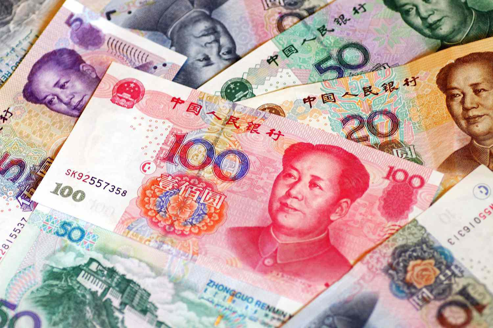

The Chinese Yuan Renminbi (CNY) stands as a fundamental component of the global financial landscape. Recognized for its vital role in international trade and finance, the understanding of its history and its function in algorithmic trading is essential for investors worldwide. This article examines the CNY's evolution from its inception to its present-day role and explores its structural intricacies and trading dynamics.

Since its introduction by the People's Republic of China in 1949, the Renminbi has undergone significant transformations, evolving in tandem with China’s economic rise and global integration. Its journey from a fixed exchange rate to a more flexible, managed float system exemplifies China's strategic economic policies aimed at boosting trade and international influence.



The Yuan, as the basic unit of the Renminbi, is structured into a series of denominations, both in banknotes and coins, and operates under a unique managed float exchange rate regime. This section will highlight the currency’s pivotal role within China’s monetary system, providing insights into its stability and behavior in the financial markets.

Moreover, the inclusion of CNY in the International Monetary Fund's Special Drawing Rights (SDR) basket marks a milestone in its global acceptance, amplifying its influence on international trade dynamics. Its valuation consistently impacts inflation, competitiveness, and global market trends, signifying China's burgeoning economic clout.

The rise of algorithmic trading represents a modern evolution in engaging with CNY's market volatility. As digital trading platforms enhance access and facilitate the automation of trading processes, the CNY presents unique opportunities for algorithmic traders. The currency’s often policy-driven fluctuations make it appealing for sophisticated trading strategies aimed at optimizing returns.

Ultimately, understanding the historical context and trading dynamics of the Chinese Yuan Renminbi is indispensable for investors and traders navigating the complex global financial ecosystem. As China's influence continues to expand, awareness and strategic engagement with CNY will remain critical for financial success.

## Table of Contents

## Historical Background of Yuan Renminbi

The Renminbi, known as the official currency of the People's Republic of China, was introduced in 1949 by the Communist government following their establishment of the nation. Its initial introduction was crucial for standardizing the monetary system amidst the turbulent economic conditions that prevailed after the Chinese Civil War. Initially, the Renminbi (人民币) was pegged to the U.S. dollar to instill stability and trust in the new economy, with the exchange rate being administered by the People's Bank of China (PBOC).

Throughout its history, the Chinese Yuan Renminbi (CNY) has experienced several policy shifts that reflect China's evolving economic strategies and ambition for global integration. In the earlier decades, the currency was part of a fixed exchange rate system designed to support industrial growth and shield the domestic market from external [volatility](/wiki/volatility-trading-strategies). However, post-1978, when China undertook economic reforms under Deng Xiaoping, the currency system evolved progressively in response to global economic integration and liberalization goals. This included moving away from a strict dollar peg in 2005 to adopting a managed floating exchange rate system, allowing for more flexibility and competitiveness.

The issuance of various series of the Renminbi marks its historical advancements. From its inception, the currency has undergone five major revisions. The first Renminbi series was introduced during the establishment period of 1949. Subsequently, each series introduced new denominations and updated security features to cater to economic demands and prevent counterfeiting. The fifth series, currently, stands as the legal tender, reflecting modern security measures and aesthetic designs aimed at reinforcing the currency's robustness.

Understanding the historical context and evolution of the Renminbi is vital for grasping the nuances of China's current monetary policies and their global aspirations. The progressive de-pegging of the Renminbi from the U.S. dollar mirrors China's goal to boost its currency's international status and influence. These transformations have been instrumental in China's climb to becoming the world's second-largest economy. They also underscore ongoing policy initiatives to position the Renminbi as a viable contender in global trade and finance.

## Chinese Yuan: Structure and Characteristics

The Chinese Yuan, often symbolized as CNY, stands as one of the most significant currencies on the global stage. It is essential to distinguish between the terms "Yuan" and "Renminbi." While "Renminbi" (RMB) serves as the official name of China's currency, "Yuan" is the primary unit. For instance, prices in China might be quoted in Yuan, analogous to how the term "dollar" is used concerning the "United States Dollar."

The issuance and regulation of the Chinese Yuan are overseen by the People's Bank of China (PBOC), the country's central banking authority. The structural framework of the currency encompasses various denominations, manifesting as both banknotes and coins. Specifically, these denominations are segmented into Yuan, Jiao, and Fen. One Yuan is equivalent to 10 Jiao, and one Jiao equals 10 Fen. This hierarchy facilitates transactions of differing scales, making the currency adaptable for both large-scale trade and everyday purchases.

Unlike free-floating currencies, which find their value through market forces, the Chinese Yuan operates under a managed float system. Under this framework, the currency's value is primarily influenced by China's central bank interventions alongside market-driven forces. The PBOC adjusts the currency's reference rate periodically, reflecting economic strategic goals, usually maintaining a tight control compared to a typical floating regime.

Analyzing the Yuan's structure, particularly its managed float characteristics, is vital for comprehending its stability and market behavior. The tight control exerted by the PBOC provides a stabilization mechanism, crucial for preventing excessive volatility that could arise from speculative activities. It ensures predictable exchange rates, benefiting international trade negotiations and providing a reliable currency environment for businesses interacting with Chinese markets. 

Understanding these fundamentals enables investors and analysts to make informed predictions concerning the Yuan's role in global trade, assess risk factors, and develop strategic approaches for engaging with the currency in both domestic and international markets.

## The Role of CNY in Global Finance

The Chinese Yuan Renminbi (CNY) has become integral to global finance, significantly impacting international trade, currency markets, and economic policies. As China's economic footprint has expanded, so too has the prominence of the CNY in global financial transactions. The yuan is frequently used for trade settlements and foreign exchange transactions with China, supporting the nation’s robust trade network and solidifying its position as one of the world's largest economies.

A pivotal moment in the yuan’s ascent was its inclusion in the International Monetary Fund's (IMF) Special Drawing Rights (SDR) basket in 2016. This inclusion marked a significant milestone, as the CNY joined the ranks of other major currencies such as the U.S. dollar, the euro, the British pound, and the Japanese yen. The SDR inclusion acknowledged the yuan's increasing importance in the global monetary system and China's commitment to financial reforms and greater currency convertibility. This inclusion reflects recognition of China's economic stature and has had implications for investor confidence and central bank reserves.

CNY's valuation carries substantial weight in global import and export dynamics. A stronger yuan makes Chinese goods more expensive on the international market, potentially reducing export volumes. Conversely, a weaker yuan can enhance China's export competitiveness by making its products more affordable globally. This dynamic affects inflationary pressures and trade balances worldwide. For example, countries heavily reliant on Chinese imports might experience fluctuating inflation rates based on CNY valuation changes. Moreover, shifts in the yuan's value can compel multinational corporations to adjust their pricing strategies, sourcing decisions, and supply chain logistics.

In the foreign exchange ([forex](/wiki/forex-system)) markets, the CNY serves as a bellwether for China's economic health and policy directions. Forex traders closely monitor the currency's movements, using both technical and [fundamental analysis](/wiki/fundamental-analysis) to evaluate potential fluctuations and misalignments. The People's Bank of China's influence on the exchange rate through interventions and policy announcements provides both opportunities and challenges for forex strategists. China's emergence as a global economic powerhouse has led to increased foreign interest in the yuan, with many traders seeking to capitalize on market inefficiencies and discrepancies between onshore (CNY) and offshore (CNH) yuan valuations.

In conclusion, the Chinese Yuan Renminbi has cemented its place as a key player in global finance. Its use in international trade, inclusion in the IMF's SDR basket, and pivotal role in forex markets underscore China’s growing influence on the world stage. As China's economic trajectory continues to evolve, the significance of the yuan in shaping global economic trends and policies is likely to intensify.

## Algorithmic Trading with CNY

Algorithmic trading has revolutionized financial markets, enabling traders to automate transactions using sophisticated algorithms, and the Chinese Yuan Renminbi (CNY) is no exception. The CNY's market dynamics, characterized by volatility and policy shifts driven by the Chinese government, offer unique opportunities for algorithmic traders.

Volatility in the CNY often arises from the Chinese government's monetary policy interventions and economic announcements. These factors can lead to abrupt changes in the currency's value, creating opportunities for algorithmic traders to develop strategies that capitalize on short-term market movements. For instance, algorithms can be designed to respond rapidly to policy updates or economic data releases, executing trades at speeds unattainable by human traders.

Algorithmic traders often employ [arbitrage](/wiki/arbitrage) strategies to exploit price discrepancies in the CNY across different markets. Arbitrage involves buying and selling the currency simultaneously in different markets to profit from varying prices. The CNY's movement restrictions and varying degrees of accessibility in global markets make it an attractive target for such strategies. For example, traders might use an algorithm to automatically detect and capitalize on discrepancies between the onshore (CNY) and offshore (CNH) markets.

The rise of digital trading platforms has also played a significant role in the increased adoption of [algorithmic trading](/wiki/algorithmic-trading) in CNY. These platforms provide traders with the technological infrastructure needed to implement and execute complex algorithms efficiently. Enhanced computational power and access to high-frequency trading networks facilitate real-time data analysis and transaction execution, making algorithmic trading accessible to a broader range of investors.

Python, a popular programming language in the financial sector, is often used for developing and [backtesting](/wiki/backtesting) algorithmic trading strategies. Below is a simple example of how a basic algorithmic trading strategy could be implemented in Python, using moving averages to make trading decisions:

```python
import numpy as np
import pandas as pd

# Sample data for CNY prices
data = {
    'Date': pd.date_range(start='2023-01-01', periods=100),
    'Price': np.random.randn(100).cumsum() + 7.0
}
df = pd.DataFrame(data)

# Calculate moving averages
df['Short_MA'] = df['Price'].rolling(window=5).mean()
df['Long_MA'] = df['Price'].rolling(window=20).mean()

# Implement a basic trading strategy
df['Signal'] = 0
df['Signal'][df['Short_MA'] > df['Long_MA']] = 1
df['Signal'][df['Short_MA'] < df['Long_MA']] = -1

# Determine buy and sell points
df['Position'] = df['Signal'].diff()

# Display the strategy signals
print(df[['Date', 'Price', 'Short_MA', 'Long_MA', 'Signal', 'Position']])
```

This code calculates short and long moving averages to generate buy and sell signals for CNY trading, demonstrating how an algorithmic trading strategy might be structured.

In summary, the combination of CNY's inherent market volatility, arbitrage opportunities, and the growing sophistication of algorithmic trading platforms have made algorithmic trading a key avenue for investors looking to engage with the Chinese currency. As technology continues to evolve, algorithmic trading is anticipated to play an increasingly prominent role in the CNY market.

## Market Dynamics and Speculations

The Chinese Yuan Renminbi (CNY) exhibits a complex market dynamics influenced by a myriad of factors, chief among them being China's monetary policy and economic indicators. The People's Bank of China (PBOC) plays a critical role in managing the CNY's value through various monetary tools, such as interest rates adjustments and foreign exchange interventions. These interventions are often aimed at stabilizing the currency while ensuring competitive trade conditions for China’s export-driven economy.

Speculations about the CNY's strengthening or weakening are closely tied to global economic conditions. For instance, a strong global demand for Chinese goods can push the yuan stronger, while a downturn can have the opposite effect. Additionally, investment trends influenced by geopolitical tensions, trade policies, and comparative interest rates between China and other major economies can prompt traders to take positions on the future path of the CNY. 

Technical and fundamental analyses form the cornerstone of predicting CNY market trends. Technical analysis focuses on historical price movements and trading volumes to identify patterns and forecast future currency directions. This involves tools such as moving averages, Relative Strength Index (RSI), and Bollinger Bands. Fundamental analysis, on the other hand, scrutinizes economic indicators like GDP growth rates, inflation, and industrial output, alongside policy announcements and international trade figures, to assess the intrinsic value of the CNY.

Consider the following Python example, which uses a simple moving average (SMA) to analyze price trends:

```python
import pandas as pd
import numpy as np

# Sample data representing CNY's daily exchange rate
data = {'Date': pd.date_range(start='2023-01-01', periods=100, freq='D'),
        'CNY_to_USD': np.random.uniform(low=6.0, high=7.0, size=100)}

df = pd.DataFrame(data)

# Calculate 10-day simple moving average
df['SMA_10'] = df['CNY_to_USD'].rolling(window=10).mean()

# Identify buy/sell signals
df['Signal'] = np.where(df['CNY_to_USD'] > df['SMA_10'], 'Buy', 'Sell')

print(df.head(20))
```

This simple moving average method can guide buy or sell decisions, offering insights into market [momentum](/wiki/momentum) and possible reversals.

CNY's performance has significant ripple effects on global markets. As China's economy is integral to the global supply chain, any volatility in its currency can influence investor sentiment worldwide. A weaker yuan makes Chinese exports cheaper, affecting international trade balances and the competitiveness of global companies that rely on Chinese manufacturing. Conversely, a stronger yuan can increase costs for international businesses importing from China, prompting shifts in supply chain and investment strategies.

In summary, while the dynamics of the CNY market are complex due to its interdependence with global financial ecosystems and domestic policy directives, traders and investors who thoroughly analyze economic signals and leverage technical tools effectively stand to gain a better understanding and potential advantage in the currency's market behaviors.

## Conclusion

The Chinese Yuan Renminbi (CNY) is a cornerstone of both domestic and international finance, reflecting China's significant economic evolution and integration into the global market. A thorough understanding of CNY's history and trading dynamics is essential for investors and traders aiming to navigate the complex financial landscapes influenced by China’s economy. The Yuan's trajectory from a domestically focused currency to a global financial instrument underscores the nation's strategic economic tempo.

Algorithmic trading has emerged as a sophisticated method to engage with the CNY, addressing its inherent volatility and the policy-driven nature of its valuation. This modern approach utilizes complex algorithms to automate trading processes, enabling investors to exploit market movements and arbitrage opportunities efficiently. The precision and speed offered by algorithmic trading are particularly beneficial given the CNY's fluctuating exchange rates shaped by China’s monetary policies and global economic interactions.

As China continues to expand its influence on the world stage, the significance of the CNY and its associated trading strategies remains pronounced. The currency's role in global finance will likely increase, necessitating a focused analysis of its behavior and implications. Investors and traders must remain vigilant and adaptable, considering both the historical context and the evolving economic conditions that influence the Yuan. Consequently, CNY's role in global finance and its management strategy will remain a critical focus, aligning with China's ongoing quest to solidify its position as a dominant economic power.

## References & Further Reading

[1]: Cheung, Y.W., & Chinn, M.D. (2011). ["Forex market structure, players and evolution."](https://onlinelibrary.wiley.com/doi/full/10.1111/j.1468-0106.2010.00531.x) National Bureau of Economic Research.

[2]: Frankel, J. (2005). ["On the Renminbi: The Choice Between Adjustment Under a Fixed Exchange Rate and Adjustment Under a Flexible Rate."](https://www.nber.org/papers/w11274) National Bureau of Economic Research.

[3]: Eichengreen, B. (2011). ["Why the Renminbi is not a global currency... yet."](https://onlinelibrary.wiley.com/doi/full/10.1111/j.1467-8446.2011.00334.x) International Economic Journal.

[4]: Zhang, C., & Tao, Q. (2020). ["The role of Renminbi in the global monetary system."](https://www.tandfonline.com/doi/full/10.1080/23311975.2020.1808399) China Economic Journal.

[5]: ["The Exchange Stabilization Fund of China: The Future of the International Monetary System"](https://home.treasury.gov/policy-issues/international/exchange-stabilization-fund) by the International Monetary Fund.

[6]: Mueller, C. (2020). ["Renminbi rises: A decade of RMB internationalization."](https://www.tandfonline.com/doi/full/10.1080/20954816.2021.1996938) Journal of International Financial Markets, Institutions & Money.