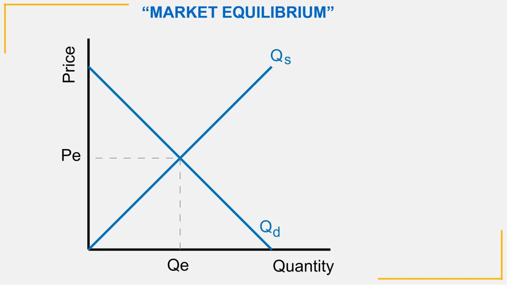

## Table of Contents

## What is a Choice Market?

A Choice Market is a type of store where you can find a variety of products, like groceries, snacks, and household items. It's designed to be convenient for people who want to quickly grab what they need without going to a big supermarket. You might find Choice Markets in busy areas like city centers or near office buildings.

These stores often have a friendly atmosphere and may offer some unique or locally-made products. They aim to provide good quality items at reasonable prices. Whether you're looking for a quick lunch, some fresh produce, or just a few snacks, a Choice Market can be a great place to shop.

## How does a Choice Market differ from traditional markets?

A Choice Market is different from traditional markets because it is usually smaller and more focused on convenience. Traditional markets, like big supermarkets or farmer's markets, often have a lot more space and a wider variety of products. They might have whole aisles dedicated to different types of food or goods. On the other hand, a Choice Market is designed for people who need to shop quickly. It has a more limited selection but tries to include the most popular and necessary items.

Another difference is the location and atmosphere. Traditional markets can be found in many places, from city centers to suburban areas, and they often have a more impersonal feel. Choice Markets, however, are usually placed in busy, urban areas where people are always on the go. They aim to create a friendly and welcoming environment, making shopping a more pleasant experience. This focus on convenience and customer experience sets Choice Markets apart from the more traditional, larger markets.

## What are the key components of a Choice Market?

A Choice Market has a few important parts that make it special. First, it is all about being easy and quick to use. The store is small, so you can find what you need fast. It has a mix of things like food, snacks, and stuff for your home. They pick items that people want the most, so you don't have to look through a lot of choices. This makes shopping simple and fast.

Another key part of a Choice Market is where it is and how it feels. These stores are usually in busy places like city centers or near offices. This makes it easy for people to stop by on their way to work or during a break. The store tries to be friendly and welcoming. They might have nice decorations or play good music. This makes shopping there feel nice and different from big, busy supermarkets.

## What mechanisms drive the operations of a Choice Market?

A Choice Market runs smoothly because of a few key things. First, it uses a good way to keep track of what's in the store. They use computers to know what items are popular and need to be restocked. This helps them always have the things people want. They also have a simple way to check out. You can pay quickly with a card or cash, and there aren't long lines. This makes shopping fast and easy for everyone.

Another important thing is how they pick what to sell. Choice Markets choose items that are popular and needed every day. They don't have a lot of different choices, but what they do have is what people want. They also try to find special or local products to make shopping more fun. By doing this, they make sure people can find what they need and maybe discover something new too.

## How do participants interact within a Choice Market?

In a Choice Market, people come in to buy things they need quickly. They walk around the small store, looking for snacks, food, or household items. The store is set up to be easy to navigate, so customers can find what they want fast. They might ask the friendly staff for help if they need it. The staff knows where everything is and can guide customers to the right spot. When customers find what they need, they go to the checkout. The checkout is quick and easy, so people don't have to wait long.

Customers also enjoy the atmosphere of a Choice Market. The store is in a busy area, so people might stop by on their way to work or during a break. The store tries to make shopping fun and welcoming. They might play nice music or have nice decorations. Sometimes, customers find special or local products that they can't get in bigger stores. This makes shopping at a Choice Market a different and enjoyable experience.

## What are the benefits of participating in a Choice Market?

Shopping at a Choice Market has many good things about it. One big benefit is how easy and quick it is. The store is small and set up so you can find what you need fast. This is great if you're in a hurry or just want to grab a few things without spending a lot of time. The checkout is also fast, so you don't have to wait in long lines. This makes shopping a lot less stressful and more convenient.

Another benefit is the friendly and welcoming atmosphere. Choice Markets are often in busy places like city centers, so you can stop by easily. The store tries to make shopping fun with nice music and decorations. You might also find special or local products that you can't get in bigger stores. This makes shopping at a Choice Market a different and enjoyable experience. It's not just about getting what you need; it's also about enjoying the time you spend there.

## What are the potential risks or challenges in a Choice Market?

One challenge in a Choice Market is that they have less variety than bigger stores. If you need something specific, you might not find it there. They focus on popular items, so if you want something less common, you might have to go to a bigger supermarket. This can be annoying if you're used to having a lot of choices.

Another risk is that because Choice Markets are small and in busy places, they can get crowded. During busy times, like lunch breaks or after work, it can be hard to move around the store. This can make shopping take longer than you want, even though the store is meant to be quick and easy. It can also be hard for the staff to help everyone when it's crowded.

## How is pricing determined in a Choice Market?

Pricing in a Choice Market is based on a few things. They look at what other stores charge for the same items. This helps them make sure their prices are fair and competitive. They also think about how much it costs them to get the products and run the store. This includes things like buying the items, paying the staff, and keeping the store open. By understanding these costs, they can set prices that cover their expenses but are still good for customers.

Another part of pricing is how popular the items are. If something is really popular and people want it a lot, the Choice Market might charge a bit more for it. But they try to keep prices reasonable so people will keep coming back. They also sometimes have special deals or discounts to attract more customers. This way, they can offer good prices and still make enough money to keep the store running smoothly.

## What role does technology play in facilitating Choice Markets?

Technology helps Choice Markets a lot. They use computers to keep track of what items they have and what they need to order more of. This way, they always have the popular things people want. They also use technology to make checking out fast and easy. You can pay with a card or even your phone, so you don't have to wait in long lines. This makes shopping quicker and more convenient for everyone.

Another way technology helps is by letting Choice Markets know what customers like. They can see which items sell the most and what times are busiest. This helps them plan better and make sure they have enough staff and stock when they need it. Technology also lets them do things like send special deals or discounts to customers' phones. This can bring more people into the store and make shopping more fun and rewarding.

## Can you explain the regulatory environment surrounding Choice Markets?

Choice Markets have to follow rules just like any other store. These rules come from the government and are meant to make sure the stores are safe and fair for everyone. For example, they need to make sure the food they sell is safe to eat. They also have to be honest about their prices and not trick customers. If they sell things like alcohol or tobacco, there are even more rules they need to follow, like checking IDs to make sure people are old enough to buy them.

The rules can be different depending on where the Choice Market is located. In some places, there might be special rules about where a store can be or what kind of signs it can have. Choice Markets also have to pay taxes on the things they sell and follow rules about how they treat their workers, like paying them fairly and giving them breaks. By following these rules, Choice Markets can keep running smoothly and keep their customers and workers happy and safe.

## How do Choice Markets impact economic theory and practice?

Choice Markets play a big role in economic theory and practice by showing how important convenience and customer experience are. In economics, people talk about how stores need to meet what customers want. Choice Markets do this by being small and easy to use, so people can shop fast. They focus on popular items and make shopping fun with a friendly atmosphere. This fits with the idea that businesses should adapt to what customers need and want. By doing this, Choice Markets show how businesses can succeed by being convenient and enjoyable for customers.

In practice, Choice Markets also affect the economy by creating jobs and helping local businesses. They need people to work in the store, so they create jobs in the community. They also often sell special or local products, which helps small producers and makers. This can make the local economy stronger. Choice Markets also compete with bigger stores, which can lead to better prices and more choices for everyone. By being part of the economy in these ways, Choice Markets show how small, focused stores can have a big impact.

## What are some real-world examples of Choice Markets and their outcomes?

One example of a Choice Market is the 7-Eleven stores. These stores are all about convenience. They are small, easy to get to, and open all the time. People can go there to buy snacks, drinks, and even quick meals. 7-Eleven has done well because it meets the needs of busy people who want to shop fast. They have also started selling more fresh food and even some local products. This has helped them attract more customers and keep them coming back.

Another example is the bodegas in New York City. Bodegas are small stores that you can find on almost every corner. They are like Choice Markets because they focus on having what people need every day, like milk, bread, and snacks. Bodegas are important in their communities because they are easy to get to and often open late. They also sell some unique items, like local foods or special treats. This makes them a favorite spot for many people who live nearby.

## What are Market Mechanisms and how do they relate to the Choice Market?

Market mechanisms are fundamental components of economic theory and practice, governing how decisions are made in financial markets through the forces of supply and demand. These mechanisms facilitate the allocation of resources and set the stage for trading activities by determining prices, production levels, and the distribution of goods and services.

A theoretical construct within market mechanisms is the concept of a choice market. A choice market is characterized by the absence of a bid-ask spread, meaning the prices at which buyers are willing to purchase (bid) and sellers are willing to sell (ask) are identical. This theoretical condition is expressed as:

$$
\text{Bid Price} = \text{Ask Price} = \text{Market Equilibrium Price}
$$

In practical terms, a choice market reflects an idealized state of perfect market equilibrium where transactions are costless, and there is no disparity between buying and selling prices. However, such a condition is rarely observed in actual markets due to factors like transaction costs, information asymmetry, and market friction.

Regulators often treat choice markets with caution. The absence of a bid-ask spread can indicate market manipulation or extreme competition, where traders potentially exploit the mechanism to their advantage. For example, [liquidity](/wiki/liquidity-risk-premium) providers might engage in strategies that create artificial liquidity, undermining market integrity. As a result, regulatory bodies may introduce rules to prevent such occurrences, focusing on maintaining stability and protecting investors.

Despite the challenges associated with implementing choice markets, they provide valuable insights into market liquidity and efficiency. Market liquidity refers to the ease with which assets can be traded without causing significant price changes, while market efficiency reflects how well market prices integrate all available information. A zero bid-ask spread theoretically implies maximum liquidity and efficiency, as participants can trade seamlessly.

Consider the following Python code snippet, which simulates the concept of a choice market using a simplified model of bids and asks:

```python
import numpy as np

# Simulate bids and asks
np.random.seed(0)
bids = np.random.uniform(100, 105, 100)
asks = np.random.uniform(100, 105, 100)

# Calculate bid-ask spread
spread = asks - bids

# Identify a choice market condition
choice_market = np.isclose(spread, 0, atol=0.01)

# Output number of choice market instances
print("Number of choice market instances:", np.sum(choice_market))
```

This script creates a simulation with random bid and ask prices within a specified range and calculates the spread. It then identifies instances where the spread approaches zero, indicating potential choice market conditions.

In summary, market mechanisms and the concept of a choice market offer profound insights into the structure and functioning of economic systems. While theoretical in nature, these concepts have practical implications for understanding market dynamics and driving more efficient and liquid markets. Balancing these ideals with regulatory oversight remains crucial to fostering a stable and equitable trading environment.

## References & Further Reading

Bergstra, J., Bardenet, R., Bengio, Y., & Kégl, B. (2011). "Algorithms for Hyper-Parameter Optimization." This paper, presented at the Advances in Neural Information Processing Systems (NIPS), explores strategies for optimizing hyper-parameters in [machine learning](/wiki/machine-learning) algorithms. The methods discussed can significantly enhance the performance of [algorithmic trading](/wiki/algorithmic-trading) systems by fine-tuning models for better predictive accuracy.

"Advances in Financial Machine Learning" by Marcos Lopez de Prado offers a comprehensive guide on applying machine learning techniques to financial markets. The book emphasizes the importance of scientific rigor in developing trading models, including techniques like fractional differentiation and financial feature extraction, which aid in constructing more robust algorithmic trading strategies.

"Evidence-Based Technical Analysis: Applying the Scientific Method and Statistical Inference to Trading Signals" by David Aronson sets a framework for evaluating the efficacy of trading signals through scientific and statistical validation. This resource is critical for traders looking to validate their strategies against quantitative metrics, ensuring reliability and performance in diverse market conditions.

"Machine Learning for Algorithmic Trading" by Stefan Jansen provides a practical approach to developing trading algorithms using Python. Jansen covers essential concepts such as data processing, feature engineering, and machine learning workflows, providing code examples and case studies to create effective trading strategies that leverage modern computational tools.

"Quantitative Trading: How to Build Your Own Algorithmic Trading Business" by Ernest P. Chan guides readers on launching a quantitative trading venture. It addresses vital components such as data sources, trading platforms, and risk management, combined with real-world experiences and strategies, enabling aspiring traders to navigate and succeed in the competitive landscape of algorithmic trading.

