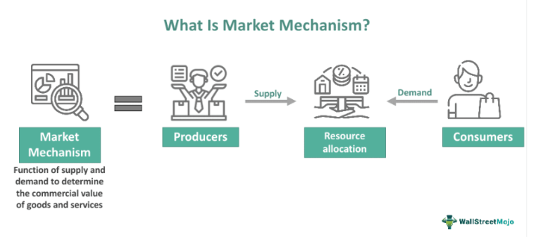

In today's global economy, understanding the intricacies of economic systems and market mechanisms is crucial. These systems dictate how resources are allocated and influence the behaviors of both consumers and investors. The underlying framework of economic systems, comprising market and command economies, plays a pivotal role in setting up the rules by which economic activity is governed. Market economies, guided by supply and demand, encourage competition and innovation, paving the way for dynamic interactions in financial markets. On the other hand, command economies, with their significant government intervention, often focus on equitable distribution and social welfare.

Algorithmic trading has emerged as a transformative force in financial markets, leveraging technology to execute trades at unprecedented speeds. This technological advancement allows for the automation of trading strategies using complex mathematical models and algorithms, significantly altering traditional trading methods. By analyzing vast amounts of financial data quickly, algorithmic trading aims to identify profitable opportunities and react to market changes more swiftly than human traders.



This article explores the relationship between economic systems, market mechanisms, choice markets, and algorithmic trading. It seeks to delineate how these elements interact to shape the financial landscape, examining both the opportunities and challenges they present. Specifically, the discussion will consider how algorithmic trading fits within different economic systems, the implications for market efficiency and liquidity, and the potential policy considerations that arise from these interactions. Understanding these dynamics provides crucial insights for investors, policymakers, and economists as they navigate the complexities of the modern financial ecosystem.

## Table of Contents

## Understanding Economic Systems

Economic systems provide the structural backbone through which nations conduct their economic activities, shaping various aspects of society, such as wealth distribution, consumer behavior, and trade policy implementation. At a fundamental level, economic systems can be classified into two predominant categories: market economies and command economies.

In a market economy, the forces of supply and demand are the primary drivers of economic activities. Resources are allocated through decentralized decision-making processes by individuals and firms operating competitively. This economic system is characterized by minimal governmental intervention, where prices are determined by the interaction of buyers and sellers in the marketplace. The flexibility of market economies often leads to a higher degree of innovation and efficiency, as firms and individuals are incentivized to optimize their productivity and satisfy consumer demands. Consequently, market economies typically support vibrant financial markets, which are crucial for raising capital and distributing economic resources efficiently across various sectors.

Conversely, command economies are characterized by substantial government control over economic activities. In these systems, central authorities make decisions about the allocation of resources, production targets, and pricing. The government dictates what goods and services are produced, the quantity in which they are produced, and their allocation to the population. While this system can facilitate coordinated large-scale infrastructure projects and ensure equitable resource distribution, it often stifles innovation and results in inefficiencies due to the lack of competition and market signals that indicate consumer preferences.

The impact of these economic systems on innovation, efficiency, and equity is substantial and multifaceted, influencing the performance and dynamism of financial markets. In market economies, the competitive environment fosters technological advancements and incentivizes efficient resource use, which can lead to rapid economic growth and enhanced equity through trickle-down effects. However, market economies may also experience significant disparities in wealth distribution as market forces favor those with competitive advantages. This can lead to market failures, such as monopolies or public goods under-provision, which may require regulatory intervention.

In contrast, command economies may achieve a more equitable distribution of resources and basic goods, thereby reducing income inequality. Nevertheless, the lack of market-driven incentives often leads to bureaucratic inefficiencies, reduced productivity, and limited consumer choice. These factors can inhibit the growth and functionality of financial markets, as the government's dominant role may restrict the flow of capital and impede the responsiveness of the economy to change.

Understanding these differences is essential for analyzing how economic systems influence the broader financial landscape, especially as nations continue to balance government intervention with free-market efficiencies. This dynamic interplay helps to shape the opportunities and challenges faced by both consumers and investors in the global economy.

## Market Mechanisms and the Choice Market

Market mechanisms are fundamental components of economic theory and practice, governing how decisions are made in financial markets through the forces of supply and demand. These mechanisms facilitate the allocation of resources and set the stage for trading activities by determining prices, production levels, and the distribution of goods and services.

A theoretical construct within market mechanisms is the concept of a choice market. A choice market is characterized by the absence of a bid-ask spread, meaning the prices at which buyers are willing to purchase (bid) and sellers are willing to sell (ask) are identical. This theoretical condition is expressed as:

$$
\text{Bid Price} = \text{Ask Price} = \text{Market Equilibrium Price}
$$

In practical terms, a choice market reflects an idealized state of perfect market equilibrium where transactions are costless, and there is no disparity between buying and selling prices. However, such a condition is rarely observed in actual markets due to factors like transaction costs, information asymmetry, and market friction.

Regulators often treat choice markets with caution. The absence of a bid-ask spread can indicate market manipulation or extreme competition, where traders potentially exploit the mechanism to their advantage. For example, [liquidity](/wiki/liquidity-risk-premium) providers might engage in strategies that create artificial liquidity, undermining market integrity. As a result, regulatory bodies may introduce rules to prevent such occurrences, focusing on maintaining stability and protecting investors.

Despite the challenges associated with implementing choice markets, they provide valuable insights into market liquidity and efficiency. Market liquidity refers to the ease with which assets can be traded without causing significant price changes, while market efficiency reflects how well market prices integrate all available information. A zero bid-ask spread theoretically implies maximum liquidity and efficiency, as participants can trade seamlessly.

Consider the following Python code snippet, which simulates the concept of a choice market using a simplified model of bids and asks:

```python
import numpy as np

# Simulate bids and asks
np.random.seed(0)
bids = np.random.uniform(100, 105, 100)
asks = np.random.uniform(100, 105, 100)

# Calculate bid-ask spread
spread = asks - bids

# Identify a choice market condition
choice_market = np.isclose(spread, 0, atol=0.01)

# Output number of choice market instances
print("Number of choice market instances:", np.sum(choice_market))
```

This script creates a simulation with random bid and ask prices within a specified range and calculates the spread. It then identifies instances where the spread approaches zero, indicating potential choice market conditions.

In summary, market mechanisms and the concept of a choice market offer profound insights into the structure and functioning of economic systems. While theoretical in nature, these concepts have practical implications for understanding market dynamics and driving more efficient and liquid markets. Balancing these ideals with regulatory oversight remains crucial to fostering a stable and equitable trading environment.

## Algorithmic Trading: A Modern Market Phenomenon

Algorithmic trading, often referred to as algo trading, represents a pivotal development in modern financial markets. By leveraging computer algorithms, it automates the process of executing trades based on predetermined criteria, thereby transforming traditional trading methods. These algorithms operate at astonishing speeds and with high precision, enabling market participants to capitalize on fleeting market opportunities that might be missed through manual trading.

The emergence of [algorithmic trading](/wiki/algorithmic-trading) is closely tied to wider trends of digitization and automation, which are hallmarks of market economies. This shift has resulted in significant improvements in the speed and accuracy of trade execution. Algorithms can process large volumes of data in milliseconds, identifying optimal trading opportunities and executing trades faster than any human trader could. The efficiency brought about by algorithmic trading has led to narrower bid-ask spreads and increased market liquidity, benefiting both institutional and retail investors.

A primary advantage of algorithmic trading is its ability to eliminate human error and emotional biases from trading decisions. Algorithms are programmed to follow strict rules, making them immune to the psychological factors that can influence human traders, such as fear or overconfidence. This objectivity is crucial in maintaining consistent performance and risk management across various market conditions.

In market economies, algorithmic trading has flourished due to the competitive, innovation-driven environment that encourages technological advancement. Financial institutions continually invest in cutting-edge technologies and employ sophisticated algorithms to gain an edge over their competitors. Advanced statistical models, [machine learning](/wiki/machine-learning) techniques, and high-frequency trading strategies are commonly employed to enhance trading performance.

However, the situation differs markedly in command economies, where regulatory constraints often limit the scope of algorithmic trading. These economies are characterized by significant government control over market activities, which can hamper the integration of advanced trading technologies. Regulations might restrict the types of financial instruments available for algo trading or impose limits on trading frequencies and practices. Consequently, while market economies experience widespread adoption of algorithmic trading, command economies tend to see limited activity in this field.

In conclusion, algorithmic trading exemplifies the transformative impact of technology on financial markets, embodying both the opportunities and challenges of modern economic systems. As technology continues to advance, the role of algorithmic trading in shaping market dynamics is likely to expand, reflecting ongoing shifts in how economic systems and market mechanisms operate.

## Comparative Analysis: Impact on Economic Systems

Algorithmic trading (algo trading) and market mechanisms exhibit different impacts on economic systems, particularly when comparing market economies with command economies. Understanding these impacts necessitates an examination of how these systems operate and interact with algorithmic trading.

In market economies, where the forces of supply and demand primarily drive economic activities, algorithmic trading significantly enhances efficiency and market liquidity. The inherent competition and innovation in these economies provide a fertile ground for the deployment of complex trading algorithms. These algorithms swiftly respond to market changes, exploiting [arbitrage](/wiki/arbitrage) opportunities by executing trades at high speeds with minimal human intervention. This rapid execution not only facilitates large volumes of trading but also reduces transaction costs, contributing to tighter bid-ask spreads and improved price discovery. Additionally, algo trading aids in reducing market impact and slippage, further optimizing trading efficiency.

On the other hand, command economies, characterized by substantial government control over economic activities and planning, encounter challenges in fully integrating algorithmic trading. The regulatory environment in command economies often imposes constraints on financial markets, limiting the flexibility and speed that algo trading relies upon. However, selective adoption of algorithmic trading strategies is possible, particularly in areas where markets are allowed limited autonomy. For instance, in sectors deemed strategically important, algorithmic trading can be applied to enhance operational efficiency and improve resource allocation without compromising government oversight.

Despite these challenges, command economies can potentially benefit from algorithmic trading by leveraging it in state-controlled enterprises or sectors. By adopting algorithmic strategies, these economies could introduce some degree of competitive edge, optimizing state-controlled market operations. Nevertheless, the extent of these benefits is contingent upon the regulatory framework and the willingness of policymakers to embrace financial innovation while maintaining control over economic activities.

In summary, while algorithmic trading thrives in market economies by capitalizing on competition and innovation, command economies face limitations due to their regulatory structures. However, with strategic implementation, these systems can selectively harness the advantages of algorithmic trading, enhancing efficiency within permissible domains.

## Conclusion

Algorithmic trading serves as an intersection between varied economic systems and market mechanisms by offering an adaptable framework that can thrive across diverse environments. In market economies, characterized by minimal government intervention and a high degree of freedom, algorithmic trading enhances market efficiency. It does so by capitalizing on competition, driving down transaction costs, and improving liquidity. The algorithms can quickly process large volumes of data and execute trades in milliseconds, optimizing the timing and pricing of trade executions.

In contrast, command economies, which are typified by significant government control and regulation, present a unique set of challenges for the adoption of algorithmic trading. The limited flexibility and regulatory constraints can hinder the full potential of algorithmic systems. Nevertheless, selective adoption of algorithmic trading frameworks in these economies can still be beneficial. Algorithms can be tailored to operate within the constraints of the regulatory environment, allowing for improved market operations through enhanced efficiency and reduced operational errors.

For investors and policymakers, navigating the evolving landscape of algorithmic trading involves a careful balancing act. On one hand, there is the allure of technological advancements that promise increased market efficiency and profitability. On the other hand, it is crucial to align these innovations with broader economic strategies and regulatory requirements to mitigate systemic risks and ensure sustainable growth.

As algorithmic trading continues to evolve, its role in shaping economic systems and market mechanisms becomes more profound. Its capacity to integrate within different economic structures highlights both the opportunities and complexities it introduces. In a rapidly digitizing world, understanding and harnessing the full potential of algorithmic trading is imperative for stakeholders aiming to achieve strategic economic objectives while safeguarding market integrity.

## References & Further Reading

Bergstra, J., Bardenet, R., Bengio, Y., & Kégl, B. (2011). "Algorithms for Hyper-Parameter Optimization." This paper, presented at the Advances in Neural Information Processing Systems (NIPS), explores strategies for optimizing hyper-parameters in machine learning algorithms. The methods discussed can significantly enhance the performance of algorithmic trading systems by fine-tuning models for better predictive accuracy.

"Advances in Financial Machine Learning" by Marcos Lopez de Prado offers a comprehensive guide on applying machine learning techniques to financial markets. The book emphasizes the importance of scientific rigor in developing trading models, including techniques like fractional differentiation and financial feature extraction, which aid in constructing more robust algorithmic trading strategies.

"Evidence-Based Technical Analysis: Applying the Scientific Method and Statistical Inference to Trading Signals" by David Aronson sets a framework for evaluating the efficacy of trading signals through scientific and statistical validation. This resource is critical for traders looking to validate their strategies against quantitative metrics, ensuring reliability and performance in diverse market conditions.

"Machine Learning for Algorithmic Trading" by Stefan Jansen provides a practical approach to developing trading algorithms using Python. Jansen covers essential concepts such as data processing, feature engineering, and machine learning workflows, providing code examples and case studies to create effective trading strategies that leverage modern computational tools.

"Quantitative Trading: How to Build Your Own Algorithmic Trading Business" by Ernest P. Chan guides readers on launching a quantitative trading venture. It addresses vital components such as data sources, trading platforms, and risk management, combined with real-world experiences and strategies, enabling aspiring traders to navigate and succeed in the competitive landscape of algorithmic trading.

