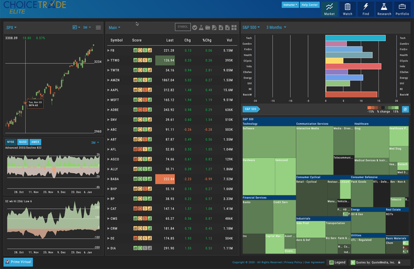

ChoiceTrade is a U.S.-based brokerage firm that has carved a niche for itself by offering low-cost options trading, appealing to both novice and seasoned traders. Established with a focus on reducing trading costs, ChoiceTrade provides an accessible way for active and self-directed investors to engage in options and stock trading. The brokerage's competitive pricing structure, noted for its commission-free trades for stocks and ETFs and low-cost options trading at $0.40 per contract, plays a significant role in attracting cost-conscious traders who seek to maximize their trading efficiencies.

In the broader context of stock trading, ChoiceTrade stands out for its efforts to democratize access to the financial markets by offering budget-friendly trading solutions. This has particular relevance in the field of algorithmic trading, where cost efficiencies can significantly impact overall trading strategy performance. Algorithmic trading, which relies on pre-defined criteria and computational techniques to execute trades, benefits greatly from reduced transaction fees, enabling algorithms to make more frequent trades without eroding profit margins.

The objective of this article is to evaluate ChoiceTrade's offerings with a specific look at its suitability for algorithmic trading. By exploring the features, costs, and tools that ChoiceTrade provides, we aim to provide an informed perspective for traders considering the platform for algorithmic strategies. This analysis will encompass the brokerage's advantages and potential limitations, thereby aiding traders in making an informed choice about whether ChoiceTrade aligns with their trading needs and aspirations.

## Table of Contents

## Background of ChoiceTrade

ChoiceTrade is a U.S.-based brokerage firm that commenced operations in 2000. Since its establishment, it has been catering primarily to an audience of active, self-directed traders. This demographic is characterized by individuals who prefer to manage their investment decisions independently rather than relying on third-party financial advisors. These traders are often engaged in frequent trading activities, necessitating a platform that offers low-cost transactions and efficient execution.

Over the years, ChoiceTrade has been recognized for its commitment to providing cost-effective trading solutions, especially in options trading where pricing can significantly influence trading strategies. The firm's initial focus on low-cost trading has evolved, and recent strides have been made to broaden its service offerings. By expanding beyond just economical trades, ChoiceTrade aims to enhance its value proposition to its users, potentially attracting a wider array of traders who seek comprehensive trading services. These efforts might include the enhancement of technological tools, the development of more sophisticated trading platforms, or perhaps the introduction of new financial products, all of which would enhance user experience and provide greater flexibility in trading methodologies. 

While retaining its foundational appeal to cost-conscious traders, ChoiceTrade is possibly positioning itself to be competitive within a broader financial services landscape. This expansion strategy serves to accommodate not only the firm's traditional target market but also to appeal to traders seeking advanced functionalities and broader market access without compromising on cost-efficiency.

## Key Features of ChoiceTrade

ChoiceTrade is a brokerage firm that stands out primarily due to its cost-effective trading options for individual investors, particularly in the area of options trading. A notable feature that attracts cost-sensitive traders is the provision of commission-free trades for stocks and ETFs. This offering aligns ChoiceTrade with other modern brokerages that have embraced commission-free models, making equity trading accessible without additional costs.

For those interested in options trading, ChoiceTrade maintains a competitive edge by offering low-cost option trades at $0.40 per contract. This pricing structure is advantageous for traders who deal with high volumes of options contracts, as it can significantly reduce overall transaction costs compared to firms with higher per-contract fees.

ChoiceTrade provides various types of accounts to cater to different trading needs. The minimum deposit requirements are set at $100 for cash accounts, allowing new or small-scale investors a low barrier to entry. A margin account requires a more substantial minimum deposit of $2,000, granting traders the ability to leverage their investments, a feature suited for those with a higher risk tolerance. Moreover, day traders are required to maintain a minimum balance of $25,000 in their accounts, complying with the pattern day trader regulations in the United States, which mandate such a balance for individuals executing four or more day trades within five business days.

The trading platforms offered by ChoiceTrade are designed to accommodate modern traders through both web-based and mobile options. The web-based platform allows traders to access their accounts and manage their portfolios through a standard internet browser, providing flexibility and convenience. Additionally, the mobile platform, compatible with smartphones and tablets, supports trading on the go, enabling users to respond swiftly to market movements without being tethered to a desktop environment.

Overall, ChoiceTrade's key features highlight its commitment to providing low-cost and accessible trading services, catering both to new investors and seasoned traders seeking to optimize their trading costs.

## Pros & Cons

ChoiceTrade presents several advantages and disadvantages that are crucial for traders to consider. Among its primary advantages is the low-cost structure for options trading, which appeals particularly to cost-sensitive traders. With option trades priced at a competitive rate of $0.40 per contract, ChoiceTrade provides an economical option for traders who deal heavily in options. This feature aligns with trends in the trading industry, where cost efficiency is a significant determinant for traders choosing a brokerage platform.

Another notable advantage is the user-friendly ChoiceTrade Elite platform. This platform is designed to cater to both novice and experienced traders, offering a streamlined, intuitive interface that facilitates efficient trading activities. The platform's design minimizes the learning curve for new users while providing the requisite tools for seasoned traders to perform complex trades seamlessly.

However, ChoiceTrade also has several drawbacks that potential users should weigh. One significant disadvantage is the limited range of trading products available on the platform. Currently, ChoiceTrade primarily supports U.S. stocks, ETFs, and options, which may not suffice for traders seeking exposure to a broader array of financial instruments such as futures, [forex](/wiki/forex-system), or commodities.

Furthermore, ChoiceTrade has a high platform fee structure which can be off-putting, especially for traders with low-frequency trading patterns. This cost can impact the overall profitability of trading activities, particularly for those who do not trade at volumes that could mitigate these expenses.

Additionally, the platform offers restricted research amenities. Research tools and analytics are critical components for informed decision-making in trading, and ChoiceTrade's limited resources in this area may deter traders who rely on comprehensive data analysis to guide their investment strategies. This limitation could impede the ability of traders to perform extensive market analysis and strategy testing, which are crucial for successful trading outcomes.

Overall, while ChoiceTrade offers compelling low-cost options trading and a user-friendly platform, its limitations in trading products, high platform fees, and restricted research tools present significant considerations for traders evaluating its suitability for their needs.

## Algo Trading with ChoiceTrade

ChoiceTrade offers a platform that caters to [algorithmic trading](/wiki/algorithmic-trading), a method where pre-programmed trading instructions are executed automatically. The feasibility of employing algorithmic strategies on ChoiceTrade is primarily supported by its technological features and the availability of automated trading tools. Many traders appreciate the ability to construct, backtest, and deploy algorithms to automate trading decisions based on market data analysis.

**Availability and Usability of Automated Trading Tools**

ChoiceTrade provides APIs (Application Programming Interfaces) that allow traders to build and implement custom trading algorithms. These APIs facilitate the integration of external trading tools and allow for the execution of trades based on set algorithms. The availability of such APIs is crucial for algo traders who require a robust system to automate complex strategies. The ChoiceTrade Connect API, for instance, is particularly useful for traders looking to link their own trading software with brokerage accounts, offering a degree of customization and control over trading strategies.

However, the platform's accessibility to automated trading tools is not as comprehensive as some competitors that integrate with popular third-party trading platforms. ChoiceTrade's tools allow essential algorithm development and execution, but advanced traders might find these resources lacking in sophistication unless augmented with external software solutions.

**Potential Limitations for Algo Traders**

One of the critical potential limitations for algorithmic traders using ChoiceTrade is the platform's technological infrastructure and order type flexibility. Although the basic tools for algorithmic trading are present, the platform may not offer the high-frequency trading capabilities and order types that can be found elsewhere. This can be a limitation for traders who employ strategies requiring the execution of numerous trades at rapid speeds.

Additionally, ChoiceTrade may not support advanced order routing and complex order types beyond standard market, limit, and stop orders. For algorithmic traders who rely on a broad spectrum of order types to minimize slippage and optimize trade execution, this could pose a challenge.

In summary, while ChoiceTrade provides basic facilities for algorithmic trading through its APIs and integration options, algo traders may encounter limitations concerning more advanced trading functionalities and technical execution capabilities. Traders should evaluate their specific algorithmic needs against the tools offered by ChoiceTrade to ensure alignment with their trading strategies.

## Usability and Trading Experience

To open an account with ChoiceTrade, prospective clients begin with an online application process designed to be straightforward. This requires the submission of personal details, understanding of financial objectives, and agreement to the brokerage's terms. A critical aspect of the process is meeting the minimum funding requirements, which vary depending on the type of trading account—$100 for a cash account, $2,000 for a margin account, and $25,000 for those engaging in [day trading](/wiki/day-trading-spy).

ChoiceTrade provides multiple platforms catering to diverse trading needs. The web-based platform offers intuitive navigation, suitable for executing trades and monitoring market trends. Its intuitive interface is praised, though its analytical tools are less comprehensive compared to some leading brokers.

The ChoiceTrade Elite platform, designed for active traders, delivers a more sophisticated trading environment. Users benefit from advanced charting capabilities and a range of technical analysis tools. Despite its advanced features, navigating the platform incurs a fee, a potential drawback for budget-conscious clients.

For traders requiring mobility, the ChoiceTrade mobile application provides essential functionalities. Available for both iOS and Android, the app offers real-time quotes, the ability to place and monitor trades, and access to account information. While the mobile app presents basic features suitable for on-the-go trading, its functionality does not fully mirror the capabilities available in the ChoiceTrade Elite desktop platform. This lack of uniformity might impact traders accustomed to more feature-rich mobile experiences. 

Overall, ChoiceTrade's platforms are functional, with a balance between simplicity and advanced features tailored to different trader needs. However, they may fall short for traders seeking extensive research tools and expansive mobile trading capabilities.

## Range of Offerings and Order Types

ChoiceTrade offers a focused range of trading products, specializing in U.S. stocks, exchange-traded funds (ETFs), and options. This selection is particularly appealing for traders interested in these markets, especially given the platform's low-cost structure and its emphasis on options trading.

The order types available at ChoiceTrade include the basic and commonly used market orders, which execute immediately at the current market price, and limit orders, where traders specify the maximum or minimum price at which they are willing to buy or sell a security. In addition to these, ChoiceTrade supports stop orders, which trigger a trade once a security reaches a specified price. This range provides essential tools for traders to execute their strategies effectively. The platform also offers stop-limit orders, combining the features of stop orders with the price control of limit orders. However, more complex order types, such as conditional orders and algorithmic orders, are not prominently featured on ChoiceTrade's platform, which could be a limitation for traders who employ advanced trading strategies.

When comparing ChoiceTrade’s offerings to those of its competitors, there are notable limitations. For instance, while some brokers provide access to international markets, mutual funds, futures, and bonds, ChoiceTrade’s focus remains on U.S.-based equities and options. This narrower focus may limit the diversification opportunities for traders who seek access to a broader array of asset classes. Moreover, the exclusion of features like fractional shares, which allow investors to purchase a fraction of a stock rather than a whole share, can be a disadvantage for investors looking to make the most of their funds or work with smaller dollar amounts.

In conclusion, while ChoiceTrade provides an adequate selection of order types for its core products—stocks, ETFs, and options—it may not suffice for traders seeking extended market access and a wider variety of order types. The platform's limitations could push more advanced traders to consider alternatives that offer a more comprehensive suite of trading options and order functionalities.

## Costs and Fees

ChoiceTrade's fee structure is designed to offer cost-effective solutions for active traders, particularly those engaged in options trading. The primary focus of ChoiceTrade's pricing model is to provide competitive rates without compromising service quality.

### Commissions and Fees Structure

1. **Stock and ETF Trades**: ChoiceTrade offers commission-free trading for U.S.-listed stocks and ETFs, aligning with industry standards where commission-free trades have become commonplace.

2. **Options Trades**: Options trading with ChoiceTrade incurs a fee of $0.40 per contract, a reasonable rate compared to some of its competitors. For options traders executing a high number of trades, this low fee per contract can translate into significant savings over time. 

3. **Account Minimums**: ChoiceTrade sets varied account minimums depending on the account type. A $100 minimum is required for cash accounts, while margin accounts require a minimum of $2,000. For day trading, adhering to the Pattern Day Trader rule, a minimum equity of $25,000 must be maintained.

4. **Inactivity and Platform Fees**: ChoiceTrade charges a monthly service fee of $15 for its Elite platform, which can be waived if specific trading activity or account requirements are met. This fee structure might impact low-frequency traders or inactive accounts adversely. It is important for traders using ChoiceTrade to remain active or choose lower-cost platforms to avoid incurring unnecessary monthly fees.

### Comparison with Competitors

While many brokers compete tightly on offering commission-free trading for stocks and ETFs, ChoiceTrade stands out with its low options contract fee. Competitors like E*TRADE and TD Ameritrade charge relatively higher fees per options contract, often in the range of $0.65. This price difference makes ChoiceTrade particularly appealing for traders specializing in options.

However, the $15 monthly fee for the Elite platform could be a deterrent, especially considering that many alternative platforms might offer advanced tools without additional charges, or without the necessity to meet specific conditions to have such fees waived.

### Impact of Fees on Traders

Traders must consider how ChoiceTrade's cost structure aligns with their trading strategies and frequency. For high-[volume](/wiki/volume-trading-strategy) options traders, the low per-contract fee offers a distinct advantage. Conversely, those who trade infrequently might find the inactivity or platform fees chip away at their profits, making ChoiceTrade less economical compared to competitors with no such charges.

In conclusion, while ChoiceTrade provides competitive rates for options trading, traders should evaluate their trading frequency and account usage to fully benefit from its cost advantages.

## Customer Service and Support

ChoiceTrade's customer service support is accessible primarily through phone and email, offering users the capability to resolve issues or obtain information through direct and personal communication channels. The phone support ensures immediate assistance during trading hours, which is crucial for resolving time-sensitive issues that can arise in fast-paced trading environments. Email support provides an alternative for queries and issues that may not require immediate attention, allowing users to articulate their concerns in detail and receive comprehensive responses.

The efficiency and responsiveness of ChoiceTrade's customer service can be considered adequate for addressing the needs of its target market. Phone support helps handle urgent inquiries promptly, while email support ensures that more complex issues can be addressed with detailed feedback. However, the overall customer experience might benefit from enhancement due to the absence of live chat support, which is a common expectation among modern traders accustomed to instantaneous communication.

The lack of live chat support can have several implications for user experience. Traders often need quick responses to their queries to make timely decisions, and the absence of this feature might lead to delays in resolving queries, potentially impacting trading outcomes. Live chat support could facilitate real-time interaction, offering a blend of immediate communication similar to phone support and the detailed exchange of information possible with email. This gap may prompt users to seek support options outside of ChoiceTrade, possibly leading to customer dissatisfaction or loss.

Overall, while ChoiceTrade's existing customer service framework is functional, incorporating live chat support could significantly enhance user engagement and satisfaction, aligning with the expectations of a digitally-savvy trading audience.

## Security and Safety Measures

ChoiceTrade, as a U.S.-based brokerage firm, implements several security measures to ensure the safety and protection of its clients' assets and data. A significant component of its security framework is its membership in the Securities Investor Protection Corporation (SIPC). This membership provides insurance for client accounts up to $500,000, including a limit of $250,000 for cash claims, against broker-dealer insolvency, thus offering a level of assurance that client funds are secure in the event of the brokerage's financial failure. 

However, ChoiceTrade does not currently offer two-[factor](/wiki/factor-investing) authentication (2FA), a security feature that has become standard among many online platforms due to its effectiveness in reducing the risk of unauthorized account access. 2FA adds an extra layer of protection by requiring users to provide two forms of identification before accessing their accounts, typically one they know (a password) and one they possess (a mobile phone or security token). The absence of 2FA may lead to concerns among users regarding potential vulnerabilities to hacking or unauthorized access. For traders, particularly those engaging in frequent transactions, the lack of this security measure can impact their confidence in the platform's ability to safeguard their financial information.

Despite the absence of two-factor authentication, ChoiceTrade employs other security measures to protect user data. These include advanced encryption protocols that secure the transmission of sensitive information across its platforms. Encryption ensures that data is unreadable to unauthorized parties, thereby maintaining confidentiality and integrity. Additionally, ChoiceTrade adheres to industry-standard security practices, such as regular security audits and compliance checks, to ensure that its systems are up-to-date and resistant to potential security threats. By maintaining robust security procedures, ChoiceTrade aims to provide a secure trading environment for its clients, even as it faces ongoing challenges in a constantly evolving digital landscape.

## Conclusion

ChoiceTrade presents a compelling option for traders seeking a low-cost platform, particularly those focused on options trading. Among its notable strengths are the commission-free trades for stocks and ETFs, and a competitively low-cost structure for options trading at $0.40 per contract. The ChoiceTrade Elite platform, while lauded for its user-friendly interface, attracts some criticism due to its high platform fees and limited scope of trading products when compared to competitors.

For algorithmic traders, ChoiceTrade offers a moderate array of tools and a platform that can support basic algorithmic strategies. However, the platform's limitations in technology, such as lack of advanced order types or more sophisticated automation tools, might impede traders seeking comprehensive algo trading solutions. The absence of two-factor authentication raises concerns regarding security, though the firm's SIPC membership provides reassurance regarding account protection.

Ultimately, ChoiceTrade's cost-effectiveness is particularly appealing to options traders and those who prioritize low trading fees over expansive product offerings. For novice traders, the platform's simplicity may provide an accessible entry point, though they may need to contend with limited research amenities and customer support drawbacks, like the lack of live chat.

Traders considering ChoiceTrade should weigh the trade-offs between cost and the range of features available. For those whose trading strategies align with ChoiceTrade's strengths, such as low-cost options trading, it can be an effective platform. Conversely, traders seeking a more diverse array of assets or advanced trading capabilities may find alternative brokers more suitable to their needs.

## References & Further Reading

[1]: Bergstra, J., Bardenet, R., Bengio, Y., & Kégl, B. (2011). ["Algorithms for Hyper-Parameter Optimization."](https://papers.nips.cc/paper/4443-algorithms-for-hyper-parameter-optimization) Advances in Neural Information Processing Systems 24.

[2]: ["Advances in Financial Machine Learning"](https://www.amazon.com/Advances-Financial-Machine-Learning-Marcos/dp/1119482089) by Marcos Lopez de Prado

[3]: ["Evidence-Based Technical Analysis: Applying the Scientific Method and Statistical Inference to Trading Signals"](https://www.amazon.com/Evidence-Based-Technical-Analysis-Scientific-Statistical/dp/0470008741) by David Aronson

[4]: ["Machine Learning for Algorithmic Trading"](https://github.com/PacktPublishing/Machine-Learning-for-Algorithmic-Trading-Second-Edition) by Stefan Jansen

[5]: ["Quantitative Trading: How to Build Your Own Algorithmic Trading Business"](https://www.amazon.com/Quantitative-Trading-Build-Algorithmic-Business/dp/0470284889) by Ernest P. Chan