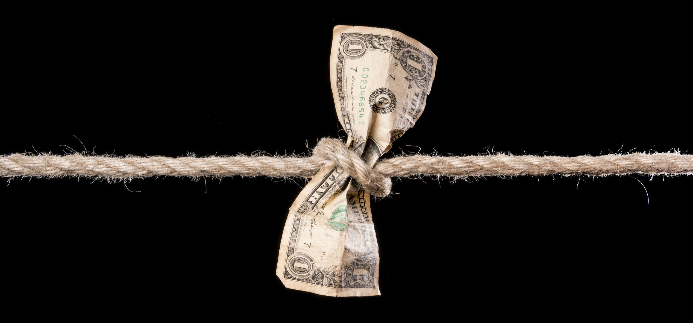

## Table of Contents

## What is the basic definition of a choke price?

A choke price is the highest price at which people are still willing to buy a product or service. If the price goes above this point, demand drops to zero because it becomes too expensive for anyone to afford or want to pay.

In simple terms, it's like a limit. If you keep raising the price of something, eventually you'll reach a point where no one will buy it anymore. This choke price is important for businesses to know because it helps them set prices that will keep customers interested without losing sales.

## How does a choke price affect market dynamics?

When a product hits its choke price, it changes how the market works. If a seller tries to sell something above the choke price, no one will buy it. This means the seller might have to lower the price back down to start selling again. It's like a game where the seller needs to find the right price that people are happy to pay but also makes them money.

The choke price also affects how much of a product is made. If a company knows the highest price people will pay, they can decide how much to produce. If they set the price too high and no one buys, they might make less of the product next time. But if they find the right price, they can make more and sell more, keeping everyone happy. It's all about finding that sweet spot where the price is just right.

## Can you explain the mechanism behind a choke price?

The mechanism behind a choke price is pretty straightforward. Imagine you're selling lemonade. If you start charging more and more for it, at some point, people will stop buying it because it's too expensive. That highest price where people still buy your lemonade is the choke price. When you go above that, no one wants to pay, so your sales drop to zero. It's like a switch that turns off demand when the price gets too high.

This choke price helps businesses figure out how to price their products. If they know the choke price, they can set their prices just below it to keep selling. It's a bit like a game of tug-of-war. If they price too high, they lose customers. If they price too low, they might not make enough money. So, finding the choke price helps them find the best price that keeps people buying and keeps their business going strong.

## What are some real-world examples of choke prices in different industries?

In the tech industry, think about smartphones. If a new phone comes out and the company sets the price way too high, like $2,000, many people might decide it's not worth it and won't buy it. That $2,000 could be the choke price because at that point, demand drops to zero. The company would then have to lower the price to something like $1,000 to start selling again, showing how the choke price affects what they can charge.

In the food industry, let's say a restaurant tries to sell a burger for $50. Most people would think that's too expensive and won't buy it, making $50 the choke price for that burger. The restaurant would need to find a lower price, maybe around $15, to keep customers coming in. This shows how the choke price helps restaurants decide how much to charge for their food to keep people happy and coming back.

## How do choke prices influence consumer behavior?

Choke prices change how people buy things. If a product gets too expensive and reaches its choke price, people stop buying it because it's just too much money. For example, if a new video game costs $100, many people might decide it's not worth it and wait for a sale or choose a different game. This shows how the choke price makes people think twice before spending their money.

When companies know the choke price, they can set prices that keep people buying. If a store sees that no one is buying a shirt priced at $50, they might lower it to $30 to get people interested again. This way, people feel like they're getting a good deal, and the store keeps selling. So, understanding the choke price helps businesses and consumers find a happy middle ground where both are satisfied.

## What role do choke prices play in supply and demand?

Choke prices are important in the game of supply and demand. They show the highest price people will pay before they stop buying something. If a seller tries to charge more than the choke price, no one will buy the product, and the demand will drop to zero. This helps businesses understand how high they can set their prices without losing all their customers.

When a product reaches its choke price, it tells the seller to make less of it because no one is buying. If they lower the price below the choke price, more people will start buying again, and the demand will go up. This way, choke prices help keep the balance between how much of a product is made and how much people want to buy it, making sure there's not too much or too little of the product in the market.

## How can businesses strategically use choke prices?

Businesses can use choke prices to figure out the best price for their products. If they know the highest price people will pay, they can set their prices just below that to keep selling. For example, if a toy company finds out that no one will buy their new toy if it costs more than $50, they can set the price at $45 to make sure people keep buying it. This helps them sell more toys and make more money.

Understanding choke prices also helps businesses decide how much to make of a product. If they see that no one is buying at the choke price, they might make less of that product next time. But if they lower the price and people start buying again, they can make more to meet the demand. This way, businesses can keep their customers happy and avoid having too much stuff they can't sell.

## What are the economic theories that support the concept of choke prices?

The concept of choke prices fits well with the economic theory of demand. This theory says that as the price of something goes up, people will usually want to buy less of it. The choke price is the point where the price gets so high that no one wants to buy it anymore. Economists use something called a demand curve to show this. The demand curve is a line on a graph that goes down as the price goes up, and the choke price is where the line hits zero demand.

Another theory that supports choke prices is the idea of price elasticity of demand. This means how much the amount people buy changes when the price changes. If a product has a high choke price, it means that people are willing to pay a lot for it before they stop buying. But if the choke price is low, even small price increases can make people stop buying. Understanding this helps businesses set prices that will keep people buying their products without losing sales.

## How do government regulations impact choke prices?

Government rules can change how high a choke price can go. If the government says a product can't be sold above a certain price, that can become the new choke price. For example, if the government sets a maximum price for medicine, that price becomes the highest anyone can charge. If it's lower than what people were willing to pay before, the choke price goes down. This means businesses have to sell at that lower price or not sell at all.

On the other hand, if the government gives money to people to help them buy things, like subsidies, it can make the choke price go up. People might be willing to pay more for a product if they get help from the government. For example, if farmers get money to buy better seeds, they might be willing to pay more for those seeds, pushing the choke price higher. So, government rules can either lower or raise the choke price, depending on what they do.

## What are the ethical considerations surrounding the use of choke prices?

When businesses use choke prices, they need to think about what's fair. If they set prices too high, it can hurt people who can't afford to pay that much. For example, if medicine has a high choke price, some people might not be able to buy it and get sick. Businesses have a responsibility to make sure their prices don't stop people from getting things they really need. It's important for them to think about how their pricing affects everyone, not just how much money they can make.

On the other hand, setting prices too low can also be a problem. If businesses can't make enough money, they might stop making the product altogether. This means no one can buy it, even if they need it. Finding the right balance is key. Businesses should try to set prices that let them keep selling and making money, while also making sure people who need the product can still afford it. It's all about being fair to everyone involved.

## How do choke prices interact with other pricing strategies like price skimming or penetration pricing?

Choke prices work together with other pricing strategies like price skimming and penetration pricing. Price skimming means starting with a high price and then slowly lowering it. A business might use the choke price to figure out how high they can start their price without losing all their customers. If they know the choke price, they can set their starting price just below it to make sure people still buy the product. As time goes on, they can lower the price to attract more customers and keep selling.

Penetration pricing is when a business starts with a low price to get a lot of people to buy their product quickly. They might use the choke price to know how low they can go without losing money. If they set the price too low, they might not make enough money to keep going. But if they set it just right, below the choke price but still profitable, they can get a lot of customers and grow their business. So, understanding the choke price helps businesses use these strategies effectively to sell more and make more money.

## What advanced analytical tools can be used to determine optimal choke prices in complex markets?

To find the best choke prices in markets that are hard to understand, businesses can use special tools like regression analysis. This tool helps them see how prices affect how much people buy. They can put in data about past sales and prices, and the tool will show them patterns. This way, they can figure out the highest price people will pay before they stop buying. It's like using a smart math helper to find the sweet spot for pricing.

Another useful tool is machine learning. This is like a computer that can learn from lots of information. Businesses can feed it data about what people buy, how much they spend, and even things like the time of year or special events. The machine learning tool can then predict what the choke price might be in different situations. It's like having a crystal ball that helps businesses set the right prices to keep selling without losing customers.

## What is the understanding of Economic Theory and Market Dynamics?

Economic theory serves as a crucial framework for analyzing how markets function and evolve. At its core, it seeks to understand the behavior of individuals and firms and the allocation of resources under conditions of scarcity. One of the fundamental principles of economic theory is the law of supply and demand, which posits that the price of a good or service is determined by the relationship between its supply and demand.

### Supply and Demand

Supply refers to the quantity of a good or service that producers are willing and able to sell at various prices over a specified period. Demand, on the other hand, is the quantity that consumers are willing and able to purchase at different price levels. The interaction between supply and demand is a primary driver of market conditions. When demand exceeds supply, prices tend to increase, leading to a potential increase in supply as producers seek to capitalize on higher prices. Conversely, when supply outstrips demand, prices typically fall, causing producers to reduce production.

The relationship between supply and demand can be represented graphically with the supply and demand curves, where the supply curve typically slopes upwards, reflecting higher quantities offered at higher prices, and the demand curve slopes downwards, indicating greater quantities demanded at lower prices.

### Market Equilibrium

Market equilibrium occurs where the supply and demand curves intersect. At this juncture, the quantity of goods supplied equals the quantity demanded, and the market is cleared. The equilibrium price is the price at which this balance occurs, and it is an essential concept for determining how resources are allocated efficiently in a market.

Mathematically, equilibrium can be expressed as follows:

$$
Q_d(P) = Q_s(P)
$$

Where $Q_d$ represents the quantity demanded, $Q_s$ represents the quantity supplied, and $P$ stands for the price level. Solving this equation allows economists to find the equilibrium price and quantity.

### Economic Theories and Market Applications

Economic theories are not only theoretical constructs; they have real-world applications that influence a wide range of market phenomena. For example, policymakers use these theories to predict how changes in fiscal or monetary policies might impact inflation, unemployment, and economic growth. Companies leverage economic theories to make strategic decisions about pricing, production, and market entry based on supply and demand forecasts.

In practical terms, these theories help explain and anticipate consumer behavior, guide corporate strategy, and shape government policy. The ability to apply economic theory effectively is a critical component in predicting market trends and crafting responses to dynamic market challenges. Understanding how market equilibrium can be disrupted or maintained aids stakeholders in navigating fluctuating economic landscapes.

Economic theory remains a vital tool in the arsenal of market analysts, guiding both theoretical exploration and pragmatic decision-making in diverse economic contexts.

## References & Further Reading

[1]: Bergstra, J., Bardenet, R., Bengio, Y., & Kégl, B. (2011). ["Algorithms for Hyper-Parameter Optimization."](https://dl.acm.org/doi/10.5555/2986459.2986743) Advances in Neural Information Processing Systems 24.

[2]: ["Advances in Financial Machine Learning"](https://www.amazon.com/Advances-Financial-Machine-Learning-Marcos/dp/1119482089) by Marcos Lopez de Prado

[3]: ["Evidence-Based Technical Analysis: Applying the Scientific Method and Statistical Inference to Trading Signals"](https://www.amazon.com/Evidence-Based-Technical-Analysis-Scientific-Statistical/dp/0470008741) by David Aronson

[4]: ["Machine Learning for Algorithmic Trading"](https://github.com/stefan-jansen/machine-learning-for-trading) by Stefan Jansen

[5]: ["Quantitative Trading: How to Build Your Own Algorithmic Trading Business"](https://www.amazon.com/Quantitative-Trading-Build-Algorithmic-Business/dp/1119800064) by Ernest P. Chan

[6]: Grossman, S. J., & Stiglitz, J. E. (1980). ["On the Impossibility of Informationally Efficient Markets."](https://www.jstor.org/stable/1805228) The American Economic Review, 70(3), 393-408.

[7]: Smith, A. (1776). ["The Wealth of Nations."](https://en.wikipedia.org/wiki/The_Wealth_of_Nations) Book I, Chapter VII. 

[8]: Kyle, A. S. (1985). ["Continuous Auctions and Insider Trading."](https://personal.utdallas.edu/~nina.baranchuk/Fin7310/papers/Kyle1985.pdf) Econometrica, 53(6), 1315-1335.