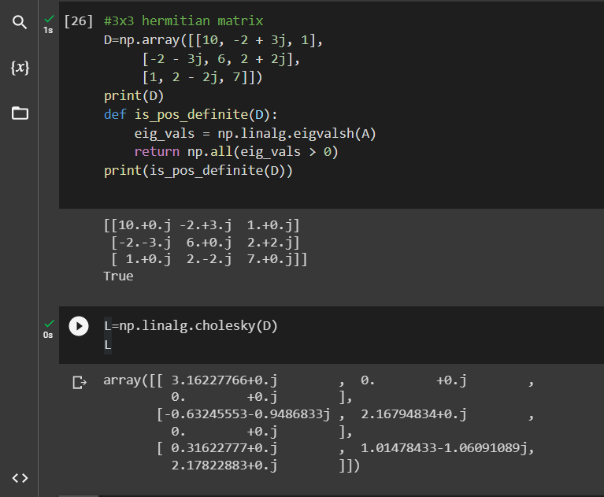

## Table of Contents

## What is Cholesky Decomposition?

Cholesky Decomposition is a way to break down a special kind of matrix into simpler parts. A matrix is like a grid of numbers, and the special kind we're talking about is called a symmetric, positive-definite matrix. This means if you flip the matrix over its main diagonal, it looks the same, and all the values it helps create are positive. When you do a Cholesky Decomposition, you turn this matrix into the product of a lower triangular matrix and its transpose. A lower triangular matrix has all zeros above the main diagonal, and its transpose is just the same matrix flipped over the main diagonal.

This decomposition is really useful in many areas, like solving systems of linear equations, doing simulations, and even in machine learning. It's faster and more stable than some other methods because it takes advantage of the special properties of the matrix. For example, if you need to solve a system of equations where the matrix of coefficients is symmetric and positive-definite, using Cholesky Decomposition can make the process much easier and quicker. It's like breaking a big, complicated problem into smaller, easier pieces that you can handle one at a time.

## Why is Cholesky Decomposition important in linear algebra?

Cholesky Decomposition is important in linear algebra because it helps solve problems faster and more easily. It works on a special type of matrix called a symmetric, positive-definite matrix. When you use Cholesky Decomposition, you break this matrix into two simpler matrices. One is a lower triangular matrix, and the other is its transpose. This makes it easier to solve equations and do calculations because you're working with simpler pieces.

This method is also more stable than other ways of solving equations. That means you're less likely to get big errors in your answers. Because of this, Cholesky Decomposition is used a lot in areas like computer graphics, [machine learning](/wiki/machine-learning), and [statistics](/wiki/bayesian-statistics). It helps with things like optimizing models, running simulations, and analyzing data. By breaking down a complex matrix into simpler parts, Cholesky Decomposition makes many tasks in linear algebra much more manageable.

## What are the prerequisites for applying Cholesky Decomposition?

To use Cholesky Decomposition, you need a special kind of matrix. This matrix must be symmetric, which means if you flip it over its main diagonal, it looks the same. It also has to be positive-definite. This means that for any non-zero vector, when you multiply the matrix by the vector and then by the vector again, you always get a positive number. If your matrix doesn't meet these two conditions, you can't use Cholesky Decomposition.

These conditions are important because they make sure that the decomposition will work properly. If the matrix is not symmetric or positive-definite, the Cholesky Decomposition might not be possible, or it might give you the wrong results. So, before you start, always check that your matrix fits these requirements. If it does, you can break it down into a lower triangular matrix and its transpose, which makes solving problems much easier.

## How can you implement Cholesky Decomposition in Python using NumPy?

You can use the `numpy` library in Python to do Cholesky Decomposition. First, you need to import `numpy` and use the function `numpy.linalg.cholesky`. This function will take your matrix and turn it into a lower triangular matrix. Let's say you have a matrix called `A`. You would write `L = numpy.linalg.cholesky(A)`. Here, `L` is the lower triangular matrix that you get from the decomposition.

After you run this code, `L` will have all zeros above the main diagonal. The main diagonal and below it will have numbers. If you want to check if the decomposition worked correctly, you can multiply `L` by its transpose and see if you get back your original matrix `A`. You can do this by writing `numpy.allclose(A, L @ L.T)`. If this returns `True`, then the decomposition was successful. Remember, your matrix `A` needs to be symmetric and positive-definite for this to work.

## What are the steps involved in the Cholesky Decomposition algorithm?

Cholesky Decomposition breaks down a special matrix into simpler parts. This special matrix is called symmetric and positive-definite. To start, you need to check if your matrix meets these conditions. Once you confirm that, you can begin the decomposition. The goal is to turn your matrix into a lower triangular matrix, which means all the numbers above the main diagonal are zero.

The process starts at the top left corner of the matrix. You find the square root of the number in that spot and put it in the same position in your new lower triangular matrix. Then, you use this number to figure out the rest of the numbers in the first row and column of your new matrix. You keep moving down the main diagonal, doing the same thing for each spot. For each new spot, you use the numbers you already found to calculate the new number. This way, you fill in the entire lower triangular matrix, which is your Cholesky Decomposition.

Once you have your lower triangular matrix, you can check if the decomposition worked by multiplying this matrix by its transpose. If you get back your original matrix, then the decomposition was successful. This method is useful because it makes solving problems easier by breaking them into simpler pieces.

## Can you explain the mathematical formula behind Cholesky Decomposition?

Cholesky Decomposition is a way to break down a special kind of matrix into simpler parts. The special matrix needs to be symmetric, meaning if you flip it over its main diagonal it looks the same, and positive-definite, meaning all the values it helps create are positive. When you do Cholesky Decomposition, you turn this matrix into a lower triangular matrix, which has all zeros above the main diagonal, and its transpose. The transpose of a matrix is like flipping it over its main diagonal. The formula for Cholesky Decomposition is L * L^T = A, where A is your original matrix, L is the lower triangular matrix, and L^T is its transpose.

To do the decomposition, you start with the top left corner of the matrix A. You find the square root of the number in that spot and put it in the same position in your new matrix L. Then, you use this number to figure out the rest of the numbers in the first row and column of L. You keep moving down the main diagonal of A, doing the same thing for each spot. For each new spot, you use the numbers you already found to calculate the new number. This way, you fill in the entire lower triangular matrix L. Once you have L, you can check if the decomposition worked by multiplying L by its transpose, L^T. If you get back your original matrix A, then the decomposition was successful.

## How do you verify the correctness of a Cholesky Decomposition?

To verify if a Cholesky Decomposition is correct, you need to check if the lower triangular matrix you got, called L, can be multiplied by its transpose to get back the original matrix, A. This means you do L times L^T, where L^T is just L flipped over its main diagonal. If the result of this multiplication matches the original matrix A, then your Cholesky Decomposition was done right.

You can use a computer to help with this check. In Python, for example, you can use the numpy library. After you do the Cholesky Decomposition and get L, you can write a simple line of code to see if L times L^T equals A. If you use numpy.allclose(A, L @ L.T) and it returns True, then you know your decomposition was successful. This method is useful because it makes sure your work is correct before you use it to solve bigger problems.

## What are common errors or issues when performing Cholesky Decomposition, and how can they be resolved?

When doing Cholesky Decomposition, you might run into problems if your matrix doesn't meet the right conditions. The matrix needs to be symmetric and positive-definite. If it's not symmetric, it won't work at all. If it's not positive-definite, you might get numbers that are not real, like imaginary numbers, or you might see a warning or error message from your computer. To fix this, you need to check your matrix carefully before starting. Make sure it's symmetric by comparing it to its transpose. To check if it's positive-definite, you can use a computer to see if all the values it helps create are positive.

Another common issue is getting small errors in your numbers due to how computers handle math. These are called numerical errors. They can make your Cholesky Decomposition a bit off, but usually not by much. To handle this, you can use special methods in computer programs that are made to reduce these errors. Also, if your matrix is very big, the computer might take a long time to do the decomposition. To speed things up, you can use a computer with more power or break your matrix into smaller pieces and do the decomposition on those pieces separately.

## How does Cholesky Decomposition compare to other matrix decomposition methods like LU or QR?

Cholesky Decomposition, LU Decomposition, and QR Decomposition are all ways to break down matrices into simpler parts, but they work differently and are useful for different things. Cholesky Decomposition is special because it only works on matrices that are symmetric and positive-definite. This makes it faster and more stable than other methods when you can use it. It breaks the matrix into a lower triangular matrix and its transpose. This is great for solving systems of equations where the matrix is symmetric and positive-definite, like in some optimization problems or simulations.

LU Decomposition, on the other hand, can work on any square matrix. It breaks the matrix into a lower triangular matrix and an upper triangular matrix. This is useful for solving general systems of linear equations, but it might not be as stable as Cholesky Decomposition for the special matrices that Cholesky can handle. QR Decomposition breaks the matrix into an orthogonal matrix and an upper triangular matrix. This is really helpful for solving least squares problems and can be used on any matrix, not just square ones. Each method has its own strengths, so you choose the one that fits your problem best.

## What are some real-world applications of Cholesky Decomposition?

Cholesky Decomposition is used a lot in solving problems in many fields, like engineering, finance, and computer science. In engineering, it helps solve equations that describe how things like buildings or bridges behave under different forces. This is important for making sure structures are safe and strong. In finance, Cholesky Decomposition is used to figure out how risky investments are. It helps break down big, complicated sets of numbers into smaller pieces that are easier to understand and work with. This way, people can make better decisions about where to put their money.

In computer science, Cholesky Decomposition is key in machine learning and data analysis. It's used to make models that can predict things based on data. For example, it helps in figuring out how different pieces of data relate to each other, which is important for making algorithms that learn from examples. This method is also used in simulations, where computers pretend to be real-world systems to see how they might behave. By using Cholesky Decomposition, these simulations can run faster and give more accurate results, helping scientists and engineers test ideas without building expensive prototypes.

## How can you optimize the performance of Cholesky Decomposition in large-scale problems?

When you need to use Cholesky Decomposition for very big matrices, you can do a few things to make it faster. One way is to use special computer programs that are made to handle big calculations quickly. These programs can use the power of your computer better and do the math in a smarter way. Another way is to break your big matrix into smaller pieces. You can do the decomposition on these smaller pieces one at a time, which is easier for the computer to handle. This is called "block" or "tile" Cholesky Decomposition, and it can make the whole process much faster.

Another thing you can do is to use more than one computer at the same time. This is called "parallel computing." By spreading the work across many computers, you can finish the decomposition much quicker. Sometimes, you might also find that your big matrix has a special pattern that you can use to your advantage. If parts of the matrix are zero, you can skip those parts and save time. This is called "sparse matrix" techniques, and it can make a big difference when working with large matrices. By using these methods, you can make Cholesky Decomposition work well even on very big problems.

## What advanced techniques or modifications can be applied to the standard Cholesky Decomposition?

When you're working with very big matrices, you can use some advanced tricks to make Cholesky Decomposition faster and better. One trick is called "block" or "tile" Cholesky Decomposition. Instead of doing the whole matrix at once, you break it into smaller pieces, or blocks. You then do the decomposition on these smaller blocks one by one. This makes it easier for your computer to handle and can speed things up a lot. Another trick is using more than one computer at the same time, which is called "parallel computing." By spreading the work across many computers, you can finish the decomposition much quicker.

Another useful technique is taking advantage of special patterns in your matrix. If your matrix has a lot of zeros in it, you can use "sparse matrix" techniques. This means you can skip over the zero parts and only do the math on the parts that matter. This can save a lot of time and make your calculations more efficient. You can also use special computer programs that are designed to handle big calculations quickly. These programs can use the power of your computer better and do the math in a smarter way, making the whole process faster and more accurate.

## What is Cholesky Decomposition and how can it be understood?

Cholesky Decomposition is a fundamental technique in numerical linear algebra, particularly useful for efficiently solving systems of linear equations and for applications such as linear least squares and Monte Carlo simulations. This decomposition applies to Hermitian (or symmetric in real cases), positive-definite matrices $A$, decomposing them into the product of a lower triangular matrix $L$ and its conjugate transpose $L^*$, such that:

$$
A = LL^*
$$

The advantage of using Cholesky Decomposition over other matrix factorization methods, like the LU decomposition, is its computational efficiency; it requires approximately half the number of operations. This makes it particularly effective for high-performance computing environments where speed and conservation of computational resources are paramount.

In the context of [algorithmic trading](/wiki/algorithmic-trading), the stability and performance provided by the Cholesky Decomposition are critical. Performance, in terms of both speed and accuracy, is essential when integrating mathematical models into trading systems, where large-scale numerical computations are frequent. This decomposition is particularly appreciated for its numerical stability, which minimizes round-off errors, a common issue during the execution of floating-point arithmetic operations.

To fully harness the benefits of Cholesky Decomposition, a solid comprehension of its mathematical basis is essential. Understanding these fundamentals allows algorithmic traders to implement more reliable and efficient calculative procedures in their trading algorithms, ultimately improving decision-making processes based on real-time data analysis.

Through its ability to efficiently [factor](/wiki/factor-investing) matrices inherent in quantitative finance, Cholesky Decomposition enables various practical applications, including but not limited to portfolio optimization, financial risk management, and asset pricing models. By leveraging this knowledge, traders and financial analysts can develop powerful tools and strategies that enhance their operational efficiency and investment performance.

## How can you implement Cholesky Decomposition using NumPy?

Implementing the Cholesky Decomposition in Python using NumPy is remarkably straightforward, owing to the library's user-friendly API. NumPy's `numpy.linalg.cholesky` function provides an efficient method to compute the decomposition, specifically designed to handle Hermitian, positive-definite matrices. When applied to a symmetric matrix $A$, this function returns a lower triangular matrix $L$ such that:

$$
A = LL^T
$$

where $L^T$ denotes the transpose of matrix $L$.

For traders and developers, utilizing this function can significantly optimize computation time. Preprocessing matrices with Cholesky Decomposition ensures that trading algorithms run more efficiently, particularly in operations involving covariance matrices where numerical stability is crucial. Below is a simple Python implementation using NumPy to compute the Cholesky Decomposition:

```python
import numpy as np

# Define a symmetric, positive-definite matrix
A = np.array([[4, 12, -16],
              [12, 37, -43],
              [-16, -43, 98]])

# Compute the Cholesky decomposition
L = np.linalg.cholesky(A)

# Output the lower triangular matrix L
print("Lower triangular matrix L:\n", L)

# Verify the decomposition
print("Verification (L @ L.T):\n", np.dot(L, L.T))
```

In this example, matrix $A$ is decomposed into matrix $L$, which can then be used for various trading algorithms. Checking the product $L \times L^T$ confirms the accuracy of the decomposition, as it reconstructs the original matrix $A$.

Understanding how to efficiently employ NumPy's Cholesky function can enhance the performance and accuracy of trading strategies by reducing computational load and increasing robustness. This efficiency is particularly beneficial when dealing with high-frequency trading scenarios where rapid and accurate calculations are imperative. Traders can maximize their algorithmic performance by integrating these mathematical decompositions into their preprocessing steps, ensuring that their strategies are both swift and reliable.

## References & Further Reading

[1]: Golub, G. H., & Van Loan, C. F. (1996). ["Matrix Computations."](https://books.google.com/books/about/Matrix_Computations.html?id=X5YfsuCWpxMC) Johns Hopkins University Press.

[2]: Trefethen, L. N., & Bau, D. (1997). ["Numerical Linear Algebra."](https://epubs.siam.org/doi/book/10.1137/1.9780898719574) SIAM: Society for Industrial and Applied Mathematics.

[3]: ["Introduction to Algorithms, 3rd Edition"](https://drive.google.com/file/d/0B3RHrbxFb7PfYjk4ZG01Z3lrbnc/view) by Thomas H. Cormen, Charles E. Leiserson, Ronald L. Rivest, and Clifford Stein.

[4]: ["The Python Data Science Handbook"](https://jakevdp.github.io/PythonDataScienceHandbook/) by Jake VanderPlas.

[5]: ["Scientific Computing with Python"](https://www.freecodecamp.org/learn/scientific-computing-with-python/) by Hans Petter Langtangen.