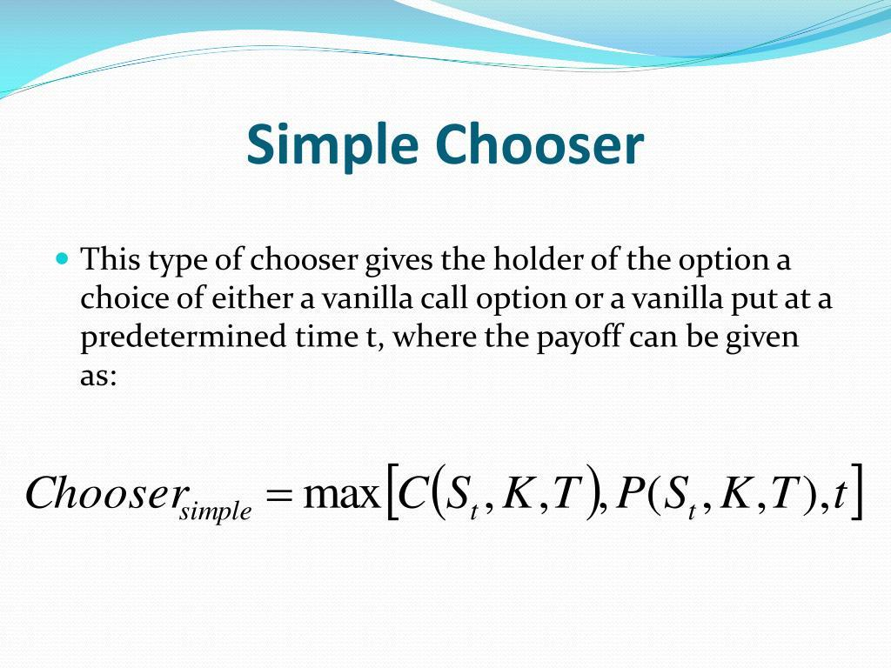

## Table of Contents

## What is a chooser option?

A chooser option is a type of financial option that gives the buyer the right, but not the obligation, to choose whether the option will be a call or a put at a certain point in the future. This choice is typically made before the expiration date of the option. The main advantage of a chooser option is the flexibility it offers to the buyer, allowing them to adapt their strategy based on how the market is moving.

For example, if the buyer thinks the price of the underlying asset will go up, they can choose to make it a call option and buy the asset at a lower price. If they think the price will go down, they can choose to make it a put option and sell the asset at a higher price. This type of option is useful for investors who are unsure about market direction but want to have a position that can benefit from either upward or downward movements.

## How does a chooser option work?

A chooser option is a special kind of option that lets the buyer decide later if they want it to be a call option or a put option. A call option lets you buy something at a set price, while a put option lets you sell something at a set price. With a chooser option, you don't have to pick right away. Instead, you can wait until a certain date before the option expires to decide if you want to buy or sell the asset.

This type of option is helpful if you're not sure which way the market will go. If you think the price of the asset will go up, you can choose to turn the chooser option into a call option and buy the asset at a lower price. If you think the price will go down, you can turn it into a put option and sell the asset at a higher price. This flexibility can be a big advantage for investors who want to be ready for different market conditions.

## What are the key features of a chooser option?

A chooser option is a special kind of option that gives the buyer the flexibility to decide later whether they want it to be a call option or a put option. A call option lets you buy something at a set price, and a put option lets you sell something at a set price. With a chooser option, you don't have to decide right away. Instead, you can wait until a specific date before the option expires to make your choice.

This type of option is useful if you're not sure which way the market will go. If you think the price of the asset will go up, you can choose to make the option a call and buy the asset at a lower price. If you think the price will go down, you can choose to make it a put and sell the asset at a higher price. This flexibility helps investors be ready for different market conditions without committing too early.

## What is the difference between a chooser option and a regular option?

A chooser option is different from a regular option because it lets you decide later if you want it to be a call or a put. A regular option makes you choose right away if you want to buy (call) or sell (put) something at a set price. With a chooser option, you wait until a certain date before the option expires to make your choice. This gives you more time to see how the market is moving before you decide.

This flexibility is a big advantage of chooser options. If you're not sure if the price of the asset will go up or down, a chooser option lets you wait and see. If you think the price will go up, you can choose to make it a call option and buy at a lower price. If you think it will go down, you can choose to make it a put option and sell at a higher price. Regular options don't give you this choice; you have to pick one type and stick with it.

## Can you provide a simple example of a chooser option?

Imagine you buy a chooser option on a stock that costs $100 per share. The option lets you decide in one month if you want it to be a call or a put option. If you think the stock price will go up, you can choose to make it a call option and buy the stock at $100, even if the market price is higher.

Let's say after one month, the stock price goes up to $120. You choose to make your chooser option a call option, so you buy the stock at $100 and sell it at $120, making a $20 profit per share. If the stock price had gone down to $80 instead, you could have chosen to make it a put option and sold the stock at $100, making a $20 profit per share that way. This flexibility is what makes chooser options useful for investors who are unsure about market direction.

## What are the common uses of chooser options in financial markets?

Chooser options are often used by investors who are unsure about which way the market will go. If someone thinks a stock might go up or down but isn't sure, a chooser option lets them wait and see. They can decide later if they want to buy the stock at a set price (call option) or sell it at a set price (put option). This flexibility can be really helpful when the market is unpredictable, and it lets investors make a more informed decision based on how things are going.

In addition to individual investors, chooser options are also used by companies and financial institutions to manage risk. For example, a company might use a chooser option to hedge against price changes in a commodity they need for their business. If the price of the commodity goes up, they can choose to buy it at a lower price. If it goes down, they can choose to sell it at a higher price. This helps them protect their profits and plan better for the future, even when they're not sure which way the market will move.

## How is the value of a chooser option determined?

The value of a chooser option is determined by several factors, including the price of the underlying asset, the time left until the option expires, and the [volatility](/wiki/volatility-trading-strategies) of the asset's price. Since a chooser option lets you decide if it will be a call or a put, its value is based on the values of both types of options. The more time you have to decide, the more valuable the chooser option can be because you have more time to see how the market moves.

To calculate the value, you often use a mathematical model like the Black-Scholes model, which is commonly used for pricing options. This model takes into account the current price of the asset, the strike price of the option, the time until expiration, the risk-free [interest rate](/wiki/interest-rate-trading-strategies), and the expected volatility of the asset's price. By comparing the values of the potential call and put options, you can figure out the overall value of the chooser option. This helps investors understand how much they should pay for the option and what kind of profit they might make.

## What are the pricing models used for chooser options?

The main pricing model used for chooser options is the Black-Scholes model. This model is a popular way to figure out the price of options. It takes into account things like the current price of the asset, the price at which you can buy or sell the asset (strike price), the time left until the option expires, the risk-free interest rate, and how much the asset's price might change (volatility). For a chooser option, you use the Black-Scholes model to find the value of both a call option and a put option, then compare them to find the overall value of the chooser option.

Another model that can be used is the binomial model. This model breaks down the time until the option expires into smaller steps and looks at all the different ways the price of the asset could go up or down. It's a bit more complicated than the Black-Scholes model, but it can be more accurate, especially for options that can be exercised early. Both models help investors figure out how much a chooser option is worth and decide if it's a good buy.

## What are the risks associated with trading chooser options?

Trading chooser options comes with several risks. One big risk is that the market might move in a way you didn't expect. Even though chooser options let you wait and see before deciding if you want a call or a put, the market can still go against you. If the price doesn't move much or moves in the wrong direction, you could lose money. Also, chooser options can be more expensive than regular options because they give you more flexibility, so you might pay more for them.

Another risk is the complexity of chooser options. They can be hard to understand and price correctly. If you don't use the right models or make a mistake in your calculations, you might end up overpaying for the option or not getting the value you expected. This can lead to financial losses. It's important to know what you're doing and maybe even get advice from a financial expert before trading chooser options.

## How do chooser options fit into a broader investment strategy?

Chooser options can be a useful part of a broader investment strategy because they give you flexibility. If you're not sure which way the market will go, a chooser option lets you wait and see before deciding if you want to buy or sell something at a set price. This can be really helpful when the market is unpredictable. Instead of choosing right away and risking a bad decision, you can use a chooser option to make a more informed choice later. This can help you manage risk and maybe even make a profit, no matter which way the market moves.

In a bigger investment plan, chooser options can be used along with other types of investments to spread out your risk. For example, you might have some regular options, some stocks, and some chooser options in your portfolio. This mix can help protect your money and give you different ways to make a profit. Chooser options are especially good for investors who want to be ready for different market conditions without committing too early. By using chooser options wisely, you can build a strategy that works well in lots of different situations.

## What are some advanced strategies involving chooser options?

One advanced strategy involving chooser options is using them as part of a hedging strategy. Imagine you own a bunch of stocks and you're worried that their prices might go down. You can buy a chooser option to protect yourself. If the stock prices do go down, you can choose to turn the chooser option into a put option and sell your stocks at a higher price than the market. If the stock prices go up instead, you can choose to make it a call option and buy more stocks at a lower price. This way, you're protected no matter which way the market goes.

Another strategy is to use chooser options for speculation. If you think a stock might move a lot but you're not sure which way, a chooser option can be a good bet. You buy the option and wait to see what happens. If the stock price jumps up, you choose to make it a call option and buy the stock at a lower price. If the stock price drops, you choose to make it a put option and sell the stock at a higher price. This gives you a chance to make money from big moves in the market, even if you're not sure which way they'll go.

## How have chooser options been used historically in major financial events?

Chooser options have been used in major financial events, especially during times when the market was really uncertain. For example, during the 2008 financial crisis, many investors were worried about which way the market would go. Some of them used chooser options to protect their money. They bought chooser options on stocks or other assets, so they could wait and see what would happen. If the market went down, they could choose to turn their chooser options into put options and sell at a higher price. If the market went up, they could turn them into call options and buy at a lower price. This helped them manage risk during a very scary time.

Another time chooser options were important was during the dot-com bubble in the late 1990s and early 2000s. Many investors were unsure if the tech stocks would keep going up or if they would crash. Chooser options gave them a way to stay flexible. If they thought a tech company's stock might go up, they could choose to make their option a call and buy the stock at a lower price. If they thought the stock would go down, they could choose to make it a put and sell at a higher price. This flexibility helped some investors make smart moves during a very unpredictable time in the market.

## What are the benefits and risks of chooser options in algo trading?

Chooser options offer considerable advantages in [algorithmic trading](/wiki/algorithmic-trading) by providing flexibility that can be harnessed to address volatility and shifting market dynamics. Their ability to alternate between a call or put before a specified decision date makes them a valuable instrument for traders aiming to leverage market uncertainty. This adaptability can enhance the precision of algorithmic strategies that rely on real-time data to navigate complex market environments.

### Benefits

One of the primary benefits of incorporating chooser options into algorithmic trading is the heightened adaptability to market shifts. Algorithms can dynamically adjust the choice of call or put based on developing trends, thereby optimizing returns. For instance, if an algorithm detects increased volatility due to an upcoming macroeconomic event, a chooser option allows the strategy to pivot effectively to benefit from this volatility. This opportunistic approach can be expressed mathematically as:

$$
\text{Optimal Choice} = \begin{cases} 
\text{Call}, & \text{if market trend is bullish} \\
\text{Put}, & \text{if market trend is bearish}
\end{cases}
$$

Assuming a correct prediction model, this flexibility can position traders favorably compared to more rigid option structures.

### Risks

Despite their appeal, chooser options come with inherent complexities that demand careful risk management. The pricing of these options is typically higher due to the added flexibility, which means that incorrect predictions can lead to significant losses. Consequently, the integration of chooser options into trading algorithms must be strategically implemented. Algorithms should include meticulous risk assessments and [backtesting](/wiki/backtesting) to ensure that the potential cost is justifiable relative to expected returns. This can be modeled using robust scenario analysis and Monte Carlo simulations to test various outcome possibilities and their impacts on portfolio performance.

Furthermore, the complexity of chooser options requires algorithms to efficiently process vast amounts of data and adjust strategies in real-time. This necessitates the use of advanced technology infrastructure and sophisticated programming techniques. Below is a basic example of how Python code could be structured to evaluate the efficacy of chooser options in trading:

```python
import numpy as np

# Sample parameters
market_trend = np.random.choice(['bullish', 'bearish'], size=100)
returns = np.random.normal(0, 1, size=100)

# Simple strategy for chooser option decision
def evaluate_chooser_option(trend, returns):
    decision = []
    for t, r in zip(trend, returns):
        if t == 'bullish' and r > 0:
            decision.append('Call')
        elif t == 'bearish' and r < 0:
            decision.append('Put')
        else:
            decision.append('Hold')
    return decision

# Execute strategy
strategy_decisions = evaluate_chooser_option(market_trend, returns)
```

In summary, the integration of chooser options into algorithmic trading offers significant potential benefits through enhanced flexibility and precise execution. However, these are balanced against the challenges of complexity and cost, which necessitate robust risk management strategies and advanced technological solutions.

## References & Further Reading

[1]: Bengtsson, C. (2009). ["Financial Derivatives: Pricing and Risk Management."](https://books.google.com/books/about/Financial_Derivatives.html?id=NJ5mBgAAQBAJ) Cengage Learning EMEA.

[2]: Hull, J. C. (2018). ["Options, Futures, and Other Derivatives."](https://www.semanticscholar.org/paper/Options%2C-Futures%2C-and-Other-Derivatives-Hull/89bdee500c8623864fc9eb7a471546aa713acc44) Pearson.

[3]: Lopez de Prado, M. (2018). ["Advances in Financial Machine Learning."](https://www.amazon.com/Advances-Financial-Machine-Learning-Marcos/dp/1119482089) Wiley.

[4]: Jansen, S. (2020). ["Machine Learning for Algorithmic Trading."](https://github.com/stefan-jansen/machine-learning-for-trading) Packt Publishing.

[5]: Whaley, R. E. (1993). ["Derivatives on Market Volatility: Hedging Tools Long Overdue."](https://www.pm-research.com/content/iijderiv/1/1/71) The Journal of Derivatives.

[6]: Chan, E. P. (2008). ["Quantitative Trading: How to Build Your Own Algorithmic Trading Business."](https://github.com/ftvision/quant_trading_echan_book) Wiley.