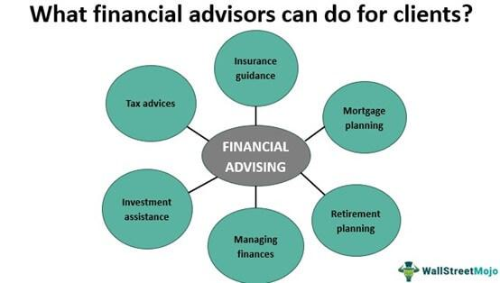

In today's fast-paced financial world, managing personal finance effectively can indeed be challenging. With the complexities of fluctuating markets, diverse investment options, and economic volatility, individuals require strategic approaches to ensure financial stability and growth. This is where the expertise of a financial advisor becomes invaluable. Financial advisors offer personalized guidance tailored to individual investment goals, helping clients navigate the intricacies of investment planning, risk management, and financial goal setting. 

In parallel, the landscape of investment management is being revolutionized by algorithmic trading. Known commonly as algo trading, this technology-driven approach utilizes computer algorithms to execute trades at unprecedented speeds and with high accuracy. It automates the decision-making process, enabling investors to capitalize on market opportunities that may otherwise be missed through traditional means. By analyzing vast amounts of data and executing transactions in milliseconds, algorithmic trading enhances investment efficiency and precision.



This article aims to explore the crucial roles that financial advisors play in guiding investments and how algorithmic trading is transforming the mechanics of financial markets. By examining the synergies between human expertise and technological advancements, we can understand how these elements collectively enhance personal financial planning. The integration of professional financial advice with the cutting-edge capabilities of algorithmic trading provides a comprehensive solution for individuals seeking to optimize their financial health and achieve their long-term financial aspirations.

## Table of Contents

## Understanding Personal Finance

Personal finance is the comprehensive management of an individual's financial activities, including budgeting, saving, investing, and planning for future financial objectives. A strategic approach to personal finance is crucial for ensuring both financial stability and security. This involves effectively managing one's income and expenses to achieve personal goals and fulfill financial obligations.

Budgeting serves as the foundation of personal finance by providing a structured plan to manage income and expenses. Creating a budget involves assessing all sources of income and allocating funds to various spending categories such as housing, food, transportation, and entertainment. A well-crafted budget enables individuals to live within their means and set aside money for future needs, contributing to long-term financial health.

Saving is another integral component of personal finance, facilitating the accumulation of funds for future needs and unexpected expenses. Consistent saving can be achieved through methods such as setting up automatic transfers to savings accounts or participating in employer-sponsored retirement plans like 401(k)s. The goal of saving is to build an emergency fund and accumulate wealth over time.

Investing involves allocating money to financial instruments such as stocks, bonds, mutual funds, or real estate with the expectation of generating a return. Investment strategies are typically aligned with an individual's risk tolerance, time horizon, and financial goals. Diversification, or spreading investments across different assets, is a key principle in reducing risk and achieving a balanced portfolio.

Planning for the future encompasses setting financial goals and outlining the steps necessary to achieve them. This can include saving for retirement, funding a child's education, or planning for major life events like buying a home. Effective financial planning requires an understanding of both current financial status and future financial needs, allowing individuals to make informed decisions that support their long-term objectives.

Financial literacy is paramount in personal finance, as it equips individuals with the knowledge and skills to make informed financial decisions. Understanding concepts like interest rates, credit scores, and investment returns allows individuals to navigate the complexities of the financial system and optimize their financial outcomes.

In summary, a well-rounded personal finance strategy that includes budgeting, saving, investing, and planning can significantly enhance financial stability and security. By fostering financial literacy and providing tools for informed decision-making, individuals are better positioned to achieve their financial goals and secure their financial future.

## Role of Financial Advisors in Investment Guidance

Financial advisors provide specialized knowledge and guidance to help individuals achieve their financial objectives, tailoring their services to each client's unique circumstances. These professionals analyze a client's financial status, including income, expenses, debts, and investments, to develop a customized financial strategy. Such strategies often involve a mix of budgeting, saving, retirement planning, tax optimization, and asset management, aligning with both short-term and long-term goals.

### Creating Comprehensive Financial Plans

One of the primary roles of financial advisors is to construct comprehensive financial plans. These plans go beyond mere investment advice and consider a wide array of financial elements. Advisors assess current financial resources, projected future income, risk tolerance, and life goals to propose an optimal investment strategy. This can include asset allocation recommendations across different classes such as equities, fixed income, and alternative investments. They also conduct periodic reviews and rebalancing of portfolios to adjust for shifts in the market or changes in the client's financial situation.

### Differences between Financial Advisors and Financial Planners

While the terms "financial advisor" and "financial planner" are often used interchangeably, they can denote different roles. Financial advisors generally provide a broad scope of financial advice, including investment management, whereas financial planners focus primarily on creating detailed plans for specific financial goals such as retirement or estate planning. Financial planners might have credentials such as Certified Financial Planner (CFP) designations, which require adherence to stringent ethical standards and educational requirements.

### Factors to Consider When Choosing a Financial Advisor

Selecting the right financial advisor is crucial for effective financial management. Clients should consider various factors, including:

1. **Credentials and Experience**: Professional designations like CFP, Chartered Financial Analyst (CFA), or Chartered Financial Consultant (ChFC) can indicate a high level of expertise.

2. **Fee Structure**: Advisors may charge fees based on assets under management, a flat rate, or an hourly rate. Understanding the fee structure helps avoid any potential conflicts of interest.

3. **Reputation and Track Record**: Researching online reviews, asking for referrals, and checking for regulatory issues through FINRA's BrokerCheck or the SEC's Investment Adviser Public Disclosure can provide insights into the advisor’s reputation.

4. **Investment Philosophy**: An advisor's approach to investing should align with the client's values and risk tolerance.

5. **Personal Compatibility**: Effective communication and a good rapport are essential as financial planning is a collaborative effort that requires trust.

In conclusion, financial advisors play a critical role in helping individuals navigate the complexities of personal finance through expert guidance and strategic planning tailored to personal financial situations and goals.

 to Algorithmic Trading

Algorithmic trading, commonly referred to as algo trading, involves the use of computer algorithms to automate and enhance the process of trading financial securities. These algorithms are pre-programmed sets of instructions designed to execute orders based on various factors such as timing, price, and [volume](/wiki/volume-trading-strategy). The primary aim of [algorithmic trading](/wiki/algorithmic-trading) is to execute orders at an optimum speed and price, minimizing human intervention and emotion.

Algo trading has its roots in the development of electronic markets. The origins trace back to the early adoption of electronic communication networks in the 1970s, which laid the groundwork for more sophisticated digital trading systems. By the 1980s and 1990s, advancements in computing power and data availability enabled the creation of algorithms capable of executing complex trading decisions faster than human traders.

Several common strategies define today’s algorithmic trading landscape. High-frequency trading ([HFT](/wiki/high-frequency-trading-strategies)) is one such strategy, characterized by extremely rapid trades that take advantage of small price discrepancies in the market. HFT requires substantial computational power and access to high-speed data feeds to capitalize on fleeting opportunities.

Market making is another prevalent strategy where firms provide [liquidity](/wiki/liquidity-risk-premium) to a market by continuously buying and selling certain securities. By placing buy and sell orders around the current market price, market makers earn a profit from the bid-ask spread. Algorithms in this strategy help sustain efficient markets by consistently offering competitive prices.

The use of algorithms in trading brings significant benefits, primarily revolving around speed and efficiency. Algorithms can process vast amounts of market data in real-time and execute trades at speeds and volumes unachievable by human traders. This automation enables consistent execution devoid of emotional bias, which can be particularly advantageous during volatile market conditions. By optimizing the timing of trades, algorithms can also reduce transaction costs and market impact.

Technological advancements have profoundly impacted trading and investment management. The proliferation of big data, [machine learning](/wiki/machine-learning), and sophisticated algorithms has transformed asset management, allowing for the creation of more precise predictive models and customized investment strategies. These technologies enable traders and fund managers to analyze historical data, forecast market trends, and adjust strategies with unprecedented precision.

Python code, often utilized in developing and testing trading algorithms, is emblematic of these technological shifts. Here is an exemplary snippet demonstrating a basic algorithm for moving average crossover strategy:

```python
import pandas as pd
import numpy as np

# Load market data
data = pd.read_csv('market_data.csv')
data['SMA_50'] = data['Close'].rolling(window=50).mean()
data['SMA_200'] = data['Close'].rolling(window=200).mean()

# Generate signals
data['Signal'] = 0
data.loc[data['SMA_50'] > data['SMA_200'], 'Signal'] = 1
data.loc[data['SMA_50'] < data['SMA_200'], 'Signal'] = -1

# Calculate returns
data['Returns'] = data['Close'].pct_change()
data['Strategy_Returns'] = data['Returns'] * data['Signal'].shift(1)

# Print summary
print(data[['Close', 'SMA_50', 'SMA_200', 'Signal', 'Strategy_Returns']].tail())
```

This code exemplifies how algorithms can guide decision-making based on historical price patterns. In this case, a moving average crossover is used to generate buy or sell signals when the short-term moving average crosses the long-term moving average.

Overall, the convergence of financial expertise and technological sophistication continues to enhance trading strategies, making algo trading an integral part of modern financial markets.

## Benefits and Drawbacks of Algorithmic Trading

Algorithmic trading has revolutionized the financial markets by leveraging computer algorithms to execute trades at optimal speeds and prices. This approach offers several advantages, making it increasingly popular among institutional and retail investors alike.

### Advantages

1. **Reduced Transaction Costs**: Algorithmic trading minimizes transaction costs through efficient order execution and reduced market impact. Algorithms can divide large orders into smaller, time-distributed trades to avoid buying or selling at unfavorably large volumes in one go, thereby reducing slippage and market impact costs.

2. **Elimination of Human Emotion**: The automatic and pre-defined nature of algorithmic trading eliminates human emotional interferences, such as fear and greed, often detrimental to trading decisions. This objectivity ensures that trading strategies are executed strictly according to the predefined parameters, improving consistency and reliability in decision-making.

3. **Improved Market Liquidity**: By enabling high-speed trade executions, algorithmic trading significantly boosts market liquidity. This increase in liquidity often results in tighter bid-ask spreads, benefiting traders by making prices more competitive and reflective of real-time market conditions.

### Potential Drawbacks

1. **Technology Risks**: Algorithmic trading hinges on sophisticated software and infrastructure, creating a dependency on technology. System failures, software bugs, and connectivity issues can lead to significant financial losses, highlighting the need for robust risk management systems and contingency plans.

2. **Regulatory Scrutiny**: The opaque nature of algorithmic trading and its potential to disrupt market stability has attracted scrutiny from regulatory authorities. Regulations aim to ensure transparency and prevent practices that could lead to market manipulation or unfair advantages, imposing stringent compliance requirements on traders using these techniques.

### Challenges and Considerations

1. **Market Manipulation and Flash Crashes**: Alarming instances, such as the 2010 flash crash, have underscored the potential for algorithmic trading to contribute to sudden and severe market dislocations. Traders might exploit algorithms to execute manipulative strategies, prompting regulators to enforce ethical trading standards and monitoring mechanisms.

2. **Ethical Considerations**: Algorithmic traders face ethical challenges, particularly concerning the fairness and transparency of their operations. Ensuring algorithms do not engage in predatory trading practices, such as spoofing, is paramount to maintaining market integrity. Traders must design algorithms with ethical considerations, promoting fair competition and equitable market access.

In conclusion, while algorithmic trading offers unparalleled advantages such as reduced transaction costs and enhanced liquidity, it is not without its challenges. Technology risks, regulatory scrutiny, and ethical considerations remain critical areas that need addressing. As the financial landscape evolves, balancing these factors is essential for leveraging the full potential of algorithmic trading while safeguarding market integrity.

## Combining Human Insight with Algorithmic Efficiency

Financial advisors today are in a unique position to enhance their services by integrating algorithmic trading into their investment strategies. Algorithmic trading, driven by advanced mathematical models and high-speed data processing, allows advisors to optimize investment strategies, reduce costs, and improve execution speed. This combination of human insight with algorithmic efficiency forms a symbiotic relationship aimed at maximizing client benefits.

### Leveraging Algorithmic Trading for Client Benefits

Financial advisors can leverage algorithmic trading by utilizing its analytical power to make more informed, data-driven decisions. Algorithms can process vast amounts of data quickly, providing insights into market trends and patterns that may not be evident through manual analysis. This capability can enhance portfolio management by allowing for more precise timing in buying or selling assets, thus optimizing returns.

### Collaboration with Algorithmic Trading Platforms

Effective collaboration between financial advisors and algorithmic trading platforms involves selecting platforms with advanced trading algorithms that match the advisor's investment philosophy and objectives. Advisors can work closely with these platforms to customize algorithms that align with specific client needs, thereby enhancing the service provided. This partnership can result in a toolset that combines human expertise and machine efficiency, bolstering portfolio performance.

### Examples of Successful Integration

Several investment firms have successfully integrated human and algorithmic strategies to deliver superior results. For instance, quant-driven hedge funds frequently use algorithms to identify [arbitrage](/wiki/arbitrage) opportunities swiftly, while human managers provide oversight and strategic direction. Similarly, robo-advisors employ algorithms to manage investments efficiently, backed by human advisors who offer personalized advice to clients, ensuring a personal touch.

### Balancing Personal Touch and Automation

The key to success in combining human and algorithmic approaches lies in maintaining the balance between personal attention to clients and the automation of investment processes. While algorithms handle data analysis and execute predetermined trading strategies efficiently, human advisors are crucial for understanding a client’s unique financial goals, risk tolerance, and life circumstances. Personalized advice and relationship building are aspects where human insight is irreplaceable, providing reassurance and guidance that algorithms alone cannot offer.

By carefully balancing these elements, financial advisors can enhance their effectiveness, offering clients a comprehensive approach that combines the best of both worlds. This integrated approach not only maximizes returns but also strengthens the advisor-client relationship by ensuring individualized service, improved outcomes, and increased trust.

## Conclusion

The future of personal finance is predicted to be increasingly characterized by the integration of human expertise with technological advancements. This symbiotic relationship between financial advisors and algorithmic trading platforms presents an opportunity for crafting comprehensive and effective investment solutions tailored to individual needs. By blending the nuanced understanding of market conditions and human behavioral insights provided by financial advisors with the speed and efficiency of algorithmic trading, individuals can benefit from a more holistic approach to managing their personal finances.

Continual learning and adaptation play pivotal roles in effectively leveraging these tools. The financial landscape is constantly evolving, with new technologies, regulatory changes, and market dynamics impacting investment decisions. Financial professionals and individuals alike must commit to ongoing education to understand and utilize these emerging tools and strategies. This includes staying informed about the latest developments in algorithmic trading, financial regulations, and market trends.

Empowering individuals to take charge of their financial future requires a judicious mix of expert guidance and cutting-edge technology. With access to advanced algorithmic tools and the strategic oversight of knowledgeable advisors, individuals are better equipped to achieve their financial goals. Financial literacy remains a fundamental component, enabling individuals to make informed decisions when collaborating with professionals and utilizing automated systems.

In conclusion, the evolving partnership between human expertise and algorithmic efficiency opens up new possibilities in personal finance management. By embracing this blend, individuals can navigate the complexities of modern finance with greater confidence and success. Whether through personalized investment strategies or enhanced financial education, the future promises a more empowered and informed financial journey for all.

## References & Further Reading

[1]: Bergstra, J., Bardenet, R., Bengio, Y., & Kégl, B. (2011). ["Algorithms for Hyper-Parameter Optimization."](https://dl.acm.org/doi/10.5555/2986459.2986743) Advances in Neural Information Processing Systems 24.

[2]: ["Advances in Financial Machine Learning"](https://www.amazon.com/Advances-Financial-Machine-Learning-Marcos/dp/1119482089) by Marcos Lopez de Prado

[3]: ["Evidence-Based Technical Analysis: Applying the Scientific Method and Statistical Inference to Trading Signals"](https://www.amazon.com/Evidence-Based-Technical-Analysis-Scientific-Statistical/dp/0470008741) by David Aronson

[4]: ["Machine Learning for Algorithmic Trading"](https://github.com/stefan-jansen/machine-learning-for-trading) by Stefan Jansen

[5]: ["Quantitative Trading: How to Build Your Own Algorithmic Trading Business"](https://www.amazon.com/Quantitative-Trading-Build-Algorithmic-Business/dp/1119800064) by Ernest P. Chan