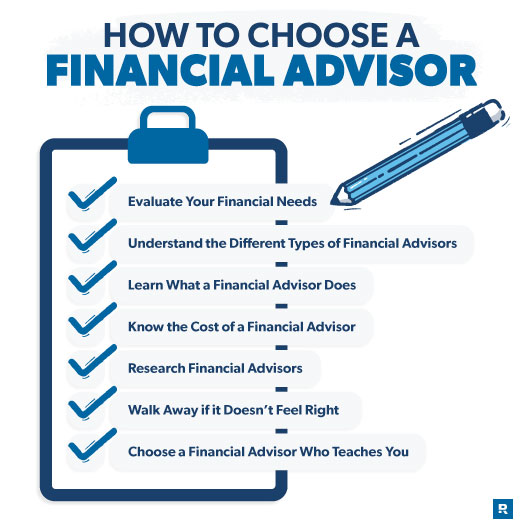

## Table of Contents

## What is a financial advisor and why might you need one?

A financial advisor is a person who helps you with your money. They give you advice on how to save, invest, and plan for the future. They can help you make smart choices about things like buying a house, saving for your kids' college, or planning for when you retire.

You might need a financial advisor if you feel confused about what to do with your money. They can help you set goals and make a plan to reach them. For example, if you want to retire early, a financial advisor can show you how to save and invest to make that happen. They can also help you avoid making big money mistakes that could cost you a lot in the long run.

## What are the different types of financial advisors?

There are several types of financial advisors, each with their own focus and expertise. One type is a certified financial planner (CFP). CFPs are trained to help you with all parts of your money life, like saving, investing, and planning for the future. They look at your whole financial picture and help you make a plan that fits your goals. Another type is an investment advisor, who focuses mostly on helping you invest your money. They can help you pick stocks, bonds, or mutual funds that match what you want to achieve with your investments.

Another type of financial advisor is a tax advisor. Tax advisors help you with your taxes and can give you advice on how to pay less in taxes. They can help you find tax deductions and credits that you might not know about. There are also estate planning advisors, who help you plan what will happen to your money and things after you pass away. They can help you set up wills and trusts to make sure your wishes are followed. Each type of advisor has special knowledge that can help you with different parts of your financial life.

## How do you start the process of finding a financial advisor?

To start finding a financial advisor, you can begin by asking people you trust for recommendations. Friends, family, or coworkers who have had good experiences with financial advisors can give you names to consider. You can also search online for financial advisors in your area. Websites like the National Association of Personal Financial Advisors (NAPFA) or the Financial Planning Association (FPA) have directories where you can find certified advisors. When you find some potential advisors, make sure to check their credentials and see if they have any complaints against them by looking them up on the Financial Industry Regulatory Authority (FINRA) website.

Once you have a list of potential advisors, it's a good idea to meet with a few of them. Most advisors offer a free initial consultation where you can ask questions and see if you feel comfortable with them. During these meetings, ask about their experience, how they get paid, and what services they offer. It's important to find someone who understands your financial goals and who you feel you can trust. After meeting with a few advisors, you can compare your experiences and choose the one that feels like the best fit for you.

## What qualifications should you look for in a financial advisor?

When looking for a financial advisor, it's important to check their qualifications. One key qualification to look for is if they are a Certified Financial Planner (CFP). CFPs have to pass a tough exam and follow strict rules about how they work with clients. They have to keep learning to stay up to date on financial planning. Another good qualification is a Chartered Financial Analyst (CFA). CFAs know a lot about investing and have to pass three hard exams. Both of these qualifications show that the advisor has the knowledge and skills to help you with your money.

It's also good to check if the advisor is a fiduciary. This means they have to put your interests first and give you advice that is best for you, not for them. You can find out if an advisor is a fiduciary by asking them directly or checking with organizations like the Certified Financial Planner Board of Standards. Besides these qualifications, it's important to see if the advisor has experience working with people like you. For example, if you are saving for retirement, you might want an advisor who has helped others with the same goal. Make sure to ask about their experience and see if they have worked with clients in similar situations.

## What are the fee structures for financial advisors and how do they impact you?

Financial advisors can charge you in different ways. One common way is a fee based on a percentage of the money they manage for you. This is called an assets under management (AUM) fee. For example, if they charge 1% and you have $100,000 with them, you would pay $1,000 a year. Another way is a flat fee or hourly rate. With a flat fee, you might pay a set amount for a financial plan. An hourly rate means you pay for the time the advisor spends helping you. Some advisors also get paid by commission, which means they earn money when they sell you certain products like insurance or investments.

The way an advisor gets paid can impact you. If they charge a percentage of your money, their fee will grow as your money grows. This can be good because it motivates them to help your money grow, but it also means you pay more as you save more. A flat fee or hourly rate can be simpler and more predictable, but it might not be the best if you need a lot of ongoing help. Commission-based advisors might be cheaper upfront, but they could push you to buy things that earn them more money, not what's best for you. It's important to understand how your advisor gets paid so you can see if it fits with what you need and want.

## How can you check the background and reputation of a potential financial advisor?

To check the background and reputation of a potential financial advisor, you can start by looking them up on the Financial Industry Regulatory Authority (FINRA) website. FINRA has a tool called BrokerCheck where you can see if the advisor has any complaints or issues against them. This can help you see if they have been in trouble before or if clients have had problems with them. You can also check if they have the right licenses and if they are registered to work in your state.

Another way to check their reputation is to ask for references from the advisor. A good advisor should be happy to give you names of past or current clients who can tell you about their experience. Talking to these people can give you a better idea of what it's like to work with the advisor. You can also look for reviews online, but be careful because not all reviews are honest. By doing your research, you can feel more confident that you are choosing an advisor who is trustworthy and has a good reputation.

## What should you discuss during your initial meeting with a financial advisor?

During your first meeting with a financial advisor, it's important to talk about your money goals and what you want to achieve. Tell them about things like saving for a house, planning for retirement, or paying for your kids' college. This helps the advisor understand what you need and how they can help you. You should also ask about their experience and if they have helped other people with similar goals. This way, you can see if they are the right person to help you with your money.

It's also a good idea to discuss how the advisor gets paid. Ask if they charge a fee based on the money they manage, a flat fee, an hourly rate, or if they earn money from commissions. Understanding their fees helps you know what you will have to pay and if it fits your budget. Lastly, talk about how often you will meet and how they will communicate with you. Knowing this can help you feel more comfortable and confident working with them.

## How important is it for a financial advisor to understand your personal financial goals?

It's really important for a financial advisor to understand your personal financial goals. When they know what you want to achieve, like buying a house or saving for retirement, they can make a plan that fits your needs. If they don't understand your goals, they might give you advice that doesn't help you reach what you want. For example, if you want to save for your kids' college but the advisor focuses on investing in risky stocks, that might not be the best for you.

Understanding your goals also helps build trust between you and your advisor. When they take the time to listen and learn about what's important to you, you feel more comfortable working with them. This trust is key because you are sharing a lot of personal information about your money. A good advisor will keep checking in with you to make sure your plan is still working towards your goals, and they'll adjust it if your goals change over time.

## What are the signs of a good financial advisor-client relationship?

A good financial advisor-client relationship is built on trust and clear communication. When you feel like your advisor really listens to you and understands what you want to achieve with your money, that's a great sign. They should explain things in a way that makes sense to you and not use a lot of confusing financial words. You should feel comfortable asking them any questions and know that they will give you honest answers.

Another sign of a good relationship is that your advisor keeps in touch with you regularly. They should check in to see how you're doing and if your goals have changed. If they make changes to your financial plan, they should explain why and make sure you agree with the new plan. When you feel like your advisor is always looking out for your best interests and helping you reach your goals, you know you have a strong and positive relationship.

## How often should you review your financial plan with your advisor?

It's a good idea to review your financial plan with your advisor at least once a year. This helps make sure your plan is still working towards your goals. Life changes, like getting a new job or having a baby, can change what you want to do with your money. By checking in every year, you and your advisor can adjust your plan to fit these changes.

Sometimes, you might need to review your plan more often. If something big happens, like a big drop in the stock market or if you get a lot of money from an inheritance, you should talk to your advisor sooner. They can help you decide what to do next to keep your money safe and on track to meet your goals.

## What are some red flags to watch out for when choosing a financial advisor?

When choosing a financial advisor, one big red flag is if they promise you will make a lot of money fast. No one can predict the future, so if an advisor says they can, they might not be telling the truth. Another red flag is if they don't explain things clearly. A good advisor will take the time to make sure you understand what they are doing with your money. If they use a lot of confusing words or seem annoyed when you ask questions, that's a bad sign.

Also, watch out if an advisor won't tell you how they get paid. They should be open about their fees and if they earn money from selling you certain products. If they are not clear about this, they might be trying to hide something. Lastly, if an advisor has a lot of complaints against them or has been in trouble with the law, that's a big warning. You can check this by looking them up on the FINRA website.

## How can you switch financial advisors if you are not satisfied with the current one?

If you're not happy with your current financial advisor, it's okay to switch to someone new. Start by looking for a new advisor the same way you found the first one. Ask friends or family for recommendations, or search online for advisors with good reviews and the right qualifications. When you find some potential new advisors, check their backgrounds on the FINRA website to make sure they don't have any complaints against them. Then, set up meetings with a few of them to see who you feel most comfortable with and who understands your financial goals.

Once you've chosen a new advisor, you need to move your money and accounts to them. Your new advisor can help you with this process, so ask them how to do it. They will guide you on how to transfer your investments and other financial accounts. Before you switch, talk to your old advisor and let them know you are leaving. They might need to do some paperwork or give you documents you need for the transfer. Switching advisors can feel like a big step, but if it helps you feel more confident about your money, it's worth doing.

## References & Further Reading

[1]: Bergstra, J., Bardenet, R., Bengio, Y., & Kégl, B. (2011). ["Algorithms for Hyper-Parameter Optimization."](https://dl.acm.org/doi/10.5555/2986459.2986743) Advances in Neural Information Processing Systems 24.

[2]: ["Advances in Financial Machine Learning"](https://www.amazon.com/Advances-Financial-Machine-Learning-Marcos/dp/1119482089) by Marcos Lopez de Prado

[3]: ["Evidence-Based Technical Analysis: Applying the Scientific Method and Statistical Inference to Trading Signals"](https://www.amazon.com/Evidence-Based-Technical-Analysis-Scientific-Statistical/dp/0470008741) by David Aronson

[4]: ["Machine Learning for Algorithmic Trading"](https://github.com/stefan-jansen/machine-learning-for-trading) by Stefan Jansen

[5]: ["Quantitative Trading: How to Build Your Own Algorithmic Trading Business"](https://www.amazon.com/Quantitative-Trading-Build-Algorithmic-Business/dp/1119800064) by Ernest P. Chan