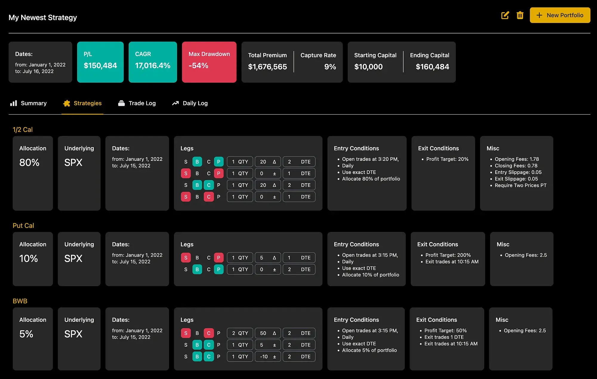

## Table of Contents

## What is backtesting and why is it important for trading?

Backtesting is a way to test a trading strategy using past data. It's like trying out a new recipe with old ingredients to see if it would have worked before you use it with fresh ones. Traders use backtesting to see how well their ideas might work in the real market by pretending to trade with historical prices and seeing what would have happened.

Backtesting is important because it helps traders make better decisions. By seeing how a strategy would have performed in the past, traders can feel more confident about using it in the future. It also helps them find and fix any problems with their plan before they risk real money. This way, they can improve their strategies and hopefully make more money while losing less.

## What are the key features to look for in a backtesting platform?

When choosing a backtesting platform, it's important to look for features that make testing your trading strategies easy and accurate. One key feature is the ability to use historical data. This means the platform should have access to lots of old price information from different markets so you can test your ideas thoroughly. Another important feature is flexibility. The platform should let you create and change your trading rules easily, so you can try out different strategies and see what works best. It's also helpful if the platform can run tests quickly, so you don't have to wait a long time to see your results.

Another thing to consider is how well the platform shows you the results of your backtests. Good platforms will give you clear reports and graphs that help you understand how your strategy did. This makes it easier to see if your strategy is making money or losing it, and why. Additionally, it's useful if the platform lets you test your strategy in different market conditions, like when the market is going up or down, to see how it might perform in the future. Finally, the platform should be reliable and easy to use, so you can focus on improving your trading without getting stuck on technical problems.

## How do different platforms handle data feeds and historical data?

Different [backtesting](/wiki/backtesting) platforms handle data feeds and historical data in various ways. Some platforms have their own built-in data sources, which means they come with a lot of historical price information already included. This can be really convenient because you don't need to find and add the data yourself. Other platforms let you connect to outside data providers, which can be useful if you want to use specific data that the platform doesn't have. You might need to pay extra for this data, but it gives you more options to test your strategies with the exact information you need.

The way platforms store and manage historical data can also be different. Some platforms keep all the data on their servers, so you can access it quickly whenever you need it. This can make your backtests run faster. Other platforms might let you download the data to your own computer, which can be good if you want to keep your data private or if you don't always have a good internet connection. The quality of the data is important too. Good platforms make sure their data is accurate and complete, so you can trust the results of your backtests.

## What programming languages are supported by various backtesting platforms?

Different backtesting platforms support various programming languages, which can affect how you create and test your trading strategies. Some popular platforms, like MetaTrader 4 and 5, use their own built-in languages called MQL4 and MQL5. These are easy to learn if you're new to programming and are specifically designed for trading. Other platforms, like NinjaTrader, support languages like C# and NinjaScript, which can be more powerful but might take longer to learn if you're not familiar with them.

There are also platforms that support more widely-used languages like Python, which is great if you already know how to code in Python or want to use it for other tasks as well. For example, platforms like Backtrader and Quantopian use Python, making it easy to integrate with other tools and libraries. Some platforms, like TradingView, use a simpler language called Pine Script, which is designed to be user-friendly for people who don't have a lot of programming experience.

Choosing a platform that supports a language you're comfortable with can make a big difference in how easy it is to develop and test your trading strategies. If you're just starting out, you might want to pick a platform with a simpler language. But if you're more experienced or need more advanced features, a platform that supports a more powerful language might be better for you.

## How does the ease of use and user interface impact the choice of a backtesting platform?

The ease of use and user interface of a backtesting platform can make a big difference in which one you choose. If a platform is easy to use, you can start testing your trading ideas quickly without getting stuck on figuring out how to use the software. A good user interface means everything is laid out in a way that makes sense, so you can find what you need without getting lost. This is especially important if you're new to backtesting or don't like dealing with complicated software. A platform that's easy to navigate can help you focus on improving your trading strategies instead of struggling with the technology.

On the other hand, if a platform has a confusing or hard-to-use interface, it might take a lot of time to learn how to use it properly. This can be frustrating and might even make you give up on backtesting altogether. Even if a platform has lots of great features, if it's hard to use, it might not be worth it. That's why it's important to try out different platforms and see which one feels the most comfortable for you. The best platform is the one that lets you test your strategies easily and effectively, so you can make better trading decisions.

## What are the costs associated with using different backtesting platforms?

The costs of using backtesting platforms can vary a lot. Some platforms are free to use, which is great if you're just starting out or don't want to spend money. These free platforms might have fewer features or less historical data, but they can still be useful for basic backtesting. Other platforms charge a monthly or yearly fee, which can range from a few dollars to hundreds of dollars. The more you pay, the more features and data you usually get. It's important to think about what you need and how much you're willing to spend.

Some platforms also have extra costs for things like data feeds or advanced features. For example, if you want to use real-time data or data from specific markets, you might need to pay extra for that. These costs can add up, so it's a good idea to check all the fees before you choose a platform. Remember, the most expensive platform isn't always the best one for you. It's all about finding a balance between what you need and what you can afford.

## How do platforms differ in their support for automated execution of trading strategies?

Different backtesting platforms have different ways to help you turn your trading strategies into real trades automatically. Some platforms, like MetaTrader 4 and 5, are really good at this. They let you write your strategy in their special languages, MQL4 or MQL5, and then run it live in the market. This means your computer can make trades for you without you having to do anything. Other platforms, like TradingView, let you create strategies but you might need to use another tool or service to actually make the trades happen automatically.

The level of support for automated trading can also depend on what kind of account you have with the platform. Some platforms offer this feature for free, while others might charge extra for it. For example, NinjaTrader has a free version where you can backtest, but you need to pay for a license if you want to use their automated trading features. It's important to check if the platform you're interested in can connect to your broker and if it supports the kind of automated trading you want to do. This way, you can make sure your strategy can go from backtesting to real trading smoothly.

## What are the risks and limitations of using backtesting platforms for strategy development?

Using backtesting platforms to develop trading strategies can have some risks and limitations. One big risk is that past performance doesn't always predict future results. Just because a strategy worked well in the past doesn't mean it will work the same way in the future. Markets can change, and what used to be a good strategy might not work anymore. Also, backtesting platforms might not account for things like trading costs, slippage, and [liquidity](/wiki/liquidity-risk-premium), which can make a big difference in real trading. If you don't include these factors, your backtest results might look better than they would in real life.

Another limitation is that backtesting platforms can sometimes give you results that are too good to be true because of something called overfitting. This happens when you adjust your strategy too much to fit the past data perfectly, but it doesn't work well with new data. It's like trying to make a key fit one lock perfectly, but then it doesn't work on any other locks. Plus, some platforms might not have enough historical data or the right kind of data, which can limit how well you can test your strategies. It's important to be aware of these risks and limitations so you can use backtesting as a helpful tool, but not rely on it too much.

## How can one evaluate the performance and reliability of a backtesting platform?

To evaluate the performance and reliability of a backtesting platform, you can start by looking at how fast and accurate the platform runs your backtests. If the platform can handle a lot of historical data quickly and give you results that match what you see in real trading, that's a good sign. You should also check if the platform includes important details like trading fees, slippage, and market liquidity in its backtests. These things can make a big difference in how your strategy would perform in real life, so a good platform should account for them.

Another way to judge a backtesting platform is by trying it out yourself. Many platforms offer free trials or demo versions, so you can test them without spending money. During the trial, see if the platform is easy to use and if it has all the features you need. It's also helpful to read reviews from other users to see what they think about the platform's reliability and performance. If a lot of people say good things about it, that's a good sign. But if there are many complaints about slow performance or inaccurate results, you might want to look for a different platform.

## What advanced features should expert users look for in a backtesting platform?

Expert users should look for advanced features like the ability to use complex programming languages like Python or C#. These languages let you create detailed trading strategies that can handle lots of different situations. A good platform will also let you connect to many data sources, so you can use all kinds of historical data to test your ideas. Another important feature is the ability to do walk-forward analysis, which means you can test your strategy on different time periods to make sure it works well over time, not just in the past.

It's also useful if the platform can handle things like [machine learning](/wiki/machine-learning) and [artificial intelligence](/wiki/ai-artificial-intelligence). These tools can help you find patterns in the data that you might not see otherwise, which can make your strategies even better. Expert users should also look for features that let them test their strategies in different market conditions, like high [volatility](/wiki/volatility-trading-strategies) or big price changes. This way, they can see how their strategy might perform in the future, no matter what the market does.

## How do community support and resources influence the choice of a backtesting platform?

Community support and resources can really help you choose a backtesting platform. When you're learning how to use a new platform, it's great to have a community of other users who can help you. They can answer your questions, give you tips, and share their own experiences. Some platforms have big communities with lots of active users, which means you're more likely to find the help you need. You can usually find these communities on forums, social media, or even within the platform itself. If a platform has a strong community, it can make learning and using the platform a lot easier and more fun.

Resources like tutorials, guides, and example strategies are also important. A good platform will have lots of these resources to help you get started and keep improving. For example, if you're new to backtesting, you might want to find a platform with step-by-step tutorials that show you how to create and test your first strategy. More advanced users might look for detailed guides on using complex features or example strategies they can learn from. The more resources a platform offers, the easier it will be for you to use it effectively and keep getting better at backtesting.

## What are some case studies or examples of successful backtesting and automated execution using different platforms?

One example of successful backtesting and automated execution is a trader using MetaTrader 4. They created a simple moving average crossover strategy and backtested it using historical data from the platform. The backtest results showed that the strategy made good profits over several years. Feeling confident, the trader used MetaTrader's automated trading feature to run the strategy live in the market. The strategy worked well in real trading, making consistent profits and helping the trader grow their account.

Another case study involves a user on TradingView who developed a [momentum](/wiki/momentum)-based strategy using Pine Script. They backtested the strategy on several different stocks and found that it performed well during both bullish and bearish market conditions. The user then used a third-party service to automate the strategy, which allowed them to execute trades automatically based on the signals generated by their backtested strategy. Over time, the strategy continued to perform as expected, leading to a steady increase in the user's trading account.

## Top Features to Look for in Backtesting Software

Accurate historical data access is a cornerstone of effective backtesting software. To accurately simulate trading strategies, it is essential to have access to data that reflects real-world market conditions. This includes open, high, low, and close prices, as well as [volume](/wiki/volume-trading-strategy) and timestamp information. Accurate data allows traders to simulate past market scenarios, thereby providing an objective measure of how a strategy might perform. Discrepancies or gaps in data can lead to misleading results, underscoring the critical need for accurate and comprehensive historical data.

A user-friendly interface is crucial to ensure that both novice and experienced traders can navigate the software with ease. An intuitive interface enhances the user experience by reducing the time spent learning the tool, thus allowing traders to focus on strategy development and analysis. A robust testing framework further complements this by allowing users to implement and test multiple strategies seamlessly. This includes support for scripting languages like Python, which enables the creation of complex trading algorithms through customizable code modules.

Advanced modeling capabilities are another important feature to consider. Backtesting software should support multiple asset types, such as equities, commodities, and [forex](/wiki/forex-system), allowing traders to diversify their testing scenarios. Additionally, data visualization tools are pivotal for extracting meaningful insights from backtested data. Visualization tools such as graphs and heatmaps can facilitate a deeper understanding of patterns and performance metrics, making it easier to identify successful trading strategies.

Performance metrics and reporting features play a vital role in evaluating the effectiveness of a trading strategy. Metrics such as return on investment (ROI), Sharpe ratio, and drawdown are essential for gauging risk and profitability. Comprehensive reporting tools can generate detailed reports that include these metrics, enabling traders to make informed decisions.

Integration with trading platforms and other analytical tools is a key feature that enhances a software's utility. Seamless integration allows traders to move from backtesting to live trading without requiring extensive reconfiguration. This integration also enables the synchronization of data and strategies across different platforms, providing a cohesive trading approach. Software that supports integration with widely used platforms like MetaTrader or [Interactive Brokers](/wiki/interactive-brokers-api) can significantly streamline the transition from strategy testing to execution. 

In summary, selecting backtesting software with accurate data access, a user-friendly interface, advanced modeling capabilities, comprehensive performance metrics, and platform integration can greatly enhance the development and evaluation of trading strategies.

## Best Backtesting Software for Algo Trading

### Review Software 1: QuantConnect

QuantConnect is a cloud-based [algorithmic trading](/wiki/algorithmic-trading) platform renowned for its versatility and extensive support for backtesting. It provides traders access to a vast library of historical data, alongside a powerful IDE for developing and testing trading algorithms.

**Features:**
- Supports multiple asset classes, including equities, forex, futures, and cryptocurrencies.
- Provides access to over a decade of minute-level historical data.
- Users can utilize C# and Python for algorithm development, facilitating flexibility.
- Integrated with the Lean Algorithm Framework, an open-source algorithmic trading engine.
- Offers data visualization tools, such as equity curves and performance metrics graphs.

**Pros:**
- Extensive documentation and an active community for support.
- Cloud-based, allowing backtesting without robust local computing resources.
- Regular updates and integration with various brokerages for live trading.

**Cons:**
- The learning curve can be steep for beginners unfamiliar with programming.
- Dependence on internet connectivity due to its cloud-based nature.
- Pricing structure may become expensive for high-frequency or complex backtesting needs.

### Review Software 2: MetaTrader 5 (MT5) Strategy Tester

MetaTrader 5 is widely recognized in the trading community, particularly for forex and CFD trading. Its Strategy Tester module is an integral tool for backtesting, providing traders the ability to test and optimize their strategies across a range of financial instruments.

**Features:**
- High-speed backtesting with support for multi-threaded optimization.
- Comprehensive historical data covering various financial instruments.
- Advanced charting tools for detailed analysis of backtesting results.
- The ability to test Expert Advisors written in MQL5, a proprietary scripting language.

**Pros:**
- User-friendly interface with a shallow learning curve, especially for those transitioning from MetaTrader 4.
- Extensive community support and free access to a wide range of assets and tools.
- Embedded in the MT5 trading platform, facilitating seamless transition from backtesting to live trading.

**Cons:**
- Limited support for certain asset classes, such as U.S. equities.
- MQL5’s proprietary nature can be restrictive for traders preferring open-source environments.
- Requires installation and does not support web-based testing.

### Review Software 3: Amibroker

Amibroker is a powerful backtesting software favored by traders for its speed and advanced analytics capabilities. It caters to both novice and seasoned traders through its comprehensive set of features.

**Features:**
- Extremely fast backtesting thanks to its efficient data processing engine.
- AFL (Amibroker Formula Language) for detailed scripting of trading strategies.
- Supports advanced technical analysis with a range of built-in indicators.
- Ability to handle large datasets and conduct walk-forward analysis.

**Pros:**
- Offers a considerable degree of customization and flexibility in strategy development.
- Detailed performance metrics and customizable reporting.
- One-time purchase cost, which may be more economical in the long run for certain users.

**Cons:**
- Steeper learning curve due to the complexity of AFL.
- Does not natively support all asset classes, requiring additional plugins or data feeds.
- Lacks direct integration with some popular trading platforms, necessitating additional configuration for live trading.

### Comparison

Comparing these three platforms based on key criteria:

- **Features and Flexibility**: QuantConnect stands out with its extensive asset class support and open-source integration. Amibroker offers advanced analytics, while MT5 provides seamless integration with live trading on its platform.

- **Ease of Use**: MT5 is often lauded for its intuitive interface, advantageous for users with less programming experience. Amibroker and QuantConnect require a higher investment in learning due to their respective scripting languages.

- **Cost**: Amibroker’s one-time cost can be appealing, while QuantConnect's pricing can escalate with usage. MT5 typically requires broker sign-up but can be cost-effective given the platform’s comprehensive offerings.

- **Community and Support**: QuantConnect and MT5 both receive high marks for community support, whereas Amibroker’s help may largely depend on various online resources and forums.

### User Reviews

- **QuantConnect**: Users appreciate its robust capabilities and cloud-based architecture but note the steep learning curve and potential costs.

- **MetaTrader 5**: Many endorse its smooth transition from backtesting to live trading but mention its limited asset class support outside forex and CFDs.

- **Amibroker**: Highly praised for its speed and customization, although beginners may find AFL challenging initially.

These insights can guide traders in selecting the backtesting software that aligns best with their objectives and technical capabilities.

## How to Choose the Right Backtesting Software for You

Choosing the right backtesting software for algorithmic trading is a crucial step that can significantly impact the effectiveness of your trading strategies. When evaluating potential software, it is important to consider your unique trading goals and personal needs. Start by assessing the types of strategies you plan to implement and the complexity of the models you're comfortable creating. If you're a beginner, you might prioritize user-friendly interfaces and learning resources, while experts may seek out advanced features and customization options.

Budget considerations are another key [factor](/wiki/factor-investing). Backtesting software varies widely in cost, with options ranging from free open-source platforms to high-end professional tools with subscription fees. Understanding the pricing models—be they one-time purchases, monthly subscriptions, or tiered services—will help you align your choice with your financial resources. Remember that higher cost does not always equate to higher quality; evaluate what you get for the price in terms of features and support.

Taking advantage of free versions or trial periods before committing to a purchase is highly encouraged. Many software providers offer limited feature demos or time-bound trials. These options allow you to test the software’s capabilities and assess whether it meets your expectations and requirements. This trial period is an excellent opportunity to navigate the user interface, examine the available features, such as data access and modeling capabilities, and perhaps even test some of your trading strategies using historical data.

Community support and available resources are equally important. Engaging with user communities, forums, and online resources can provide invaluable insights and assistance. Communities often offer shared experiences, custom scripts, and solutions to common problems, which can enhance your understanding and usage of the software. Strong community support can be a deciding factor, especially for platforms that are not well-documented or have a steep learning curve. Additionally, consider the availability of customer support from the software provider, as well as online tutorials, webinars, and guides. These resources can be crucial in troubleshooting and optimizing your backtesting setup.

Ultimately, the selection of backtesting software should be guided by a comprehensive evaluation of how well it aligns with your trading objectives, budget, and available support resources. By carefully considering these factors, you can ensure that your choice bolsters your algorithmic trading endeavors, facilitating the development of robust and profitable strategies.

## References & Further Reading

[1]: ["Algorithmic Trading: Winning Strategies and Their Rationale"](https://www.wiley.com/en-us/Algorithmic+Trading%3A+Winning+Strategies+and+Their+Rationale-p-9781118746912) by Ernest P. Chan

[2]: ["Quantitative Trading: How to Build Your Own Algorithmic Trading Business"](https://books.google.com/books/about/Quantitative_Trading.html?id=j70yEAAAQBAJ) by Ernest P. Chan

[3]: ["Advances in Financial Machine Learning"](https://www.amazon.com/Advances-Financial-Machine-Learning-Marcos/dp/1119482089) by Marcos López de Prado

[4]: ["Backtesting in Trading: A Practical Guide with Python"](https://algotrading101.com/learn/backtesting-py-guide/) by Jacques Joubert

[5]: QuantConnect Community Guide. [QuantConnect](https://www.quantconnect.com/forum/)

[6]: ["Backtesting Strategies and How to Manage Your Portfolio"](https://backtestgo.com/) by Investopedia

[7]: ["Build Your Own Algorithmic Trading System"](https://www.youtube.com/watch?v=WBmJbVzBg64) by Kirill Eremenko, Hadelin de Ponteves, et al.