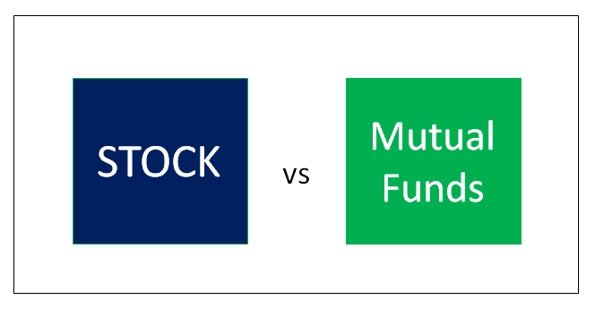

## Table of Contents

## What are mutual funds and how do they differ from individual stocks?

Mutual funds are investment vehicles that pool money from many investors to buy a diversified portfolio of stocks, bonds, or other securities. They are managed by professional fund managers who make decisions about which securities to buy and sell. This allows individual investors to own a small piece of a large and diverse set of investments, which can help spread out risk. When you invest in a mutual fund, you are buying shares of the fund itself, and the value of your investment will go up or down based on the overall performance of the fund's holdings.

Individual stocks, on the other hand, represent ownership in a single company. When you buy a stock, you are purchasing a share of that company, and the value of your investment will rise or fall based on the performance of that specific company. Unlike mutual funds, stocks do not provide automatic diversification, so your investment can be riskier if the company you invest in does not perform well. However, stocks can also offer the potential for higher returns if the company does well. In summary, mutual funds offer a way to invest in a broad range of assets with professional management, while individual stocks allow you to invest directly in specific companies with potentially higher risk and reward.

## What are the benefits of investing in mutual funds for beginners?

Investing in mutual funds can be a great choice for beginners because they are easy to understand and manage. When you invest in a mutual fund, you're putting your money into a big pool that is managed by experts. These experts choose a mix of stocks, bonds, or other investments, so you don't have to pick them yourself. This means you can start investing without needing to know a lot about the stock market or how to pick individual stocks.

Another big benefit is that mutual funds help spread out your risk. Instead of putting all your money into one company, your money is spread across many different investments. This is called diversification, and it can protect you if one investment doesn't do well. Plus, mutual funds let you start with a small amount of money, making it easier for beginners to get started without needing a lot of cash upfront.

## How do mutual funds help in diversifying an investment portfolio?

Mutual funds help diversify your investment portfolio by spreading your money across many different types of investments. When you buy a mutual fund, you're not just investing in one company or one kind of investment. Instead, your money is used to buy a mix of stocks, bonds, or other securities. This mix can include companies from different industries, countries, and sizes. By doing this, mutual funds reduce the risk that comes from having all your money in one place. If one company or investment doesn't do well, it won't hurt your whole investment because the others might still be doing okay.

Another way mutual funds help with diversification is by having professional managers who choose the investments for you. These managers keep an eye on the market and adjust the mix of investments to try and get the best returns while managing risk. This means you don't have to worry about [picking](/wiki/asset-class-picking) the right stocks or bonds yourself. For someone new to investing, this can be a big relief because it's hard to know which individual investments will do well. By using mutual funds, you can let the experts handle the details and still enjoy the benefits of a diversified portfolio.

## What are the different types of mutual funds available to investors?

There are several types of mutual funds, each designed for different investment goals and risk levels. One common type is equity funds, which mainly invest in stocks. These can be further divided into categories like large-cap funds, which focus on big, well-established companies, mid-cap funds that invest in medium-sized companies, and small-cap funds that target smaller, growing companies. Another type is bond funds, which invest in bonds and other debt instruments. These are often seen as less risky than stock funds because they aim to provide steady income rather than big growth. 

Another category is balanced funds, which mix stocks and bonds to offer a bit of both growth and income. These funds are good for people who want a balanced approach to investing. Then there are index funds, which aim to match the performance of a specific market index, like the S&P 500. They are popular because they usually have lower fees and are easy to understand. Sector funds focus on a specific industry, like technology or healthcare, and can be riskier because they are less diversified. Finally, there are target-date funds, which automatically adjust their mix of investments as you get closer to a certain date, like retirement. These are great for people who want a set-it-and-forget-it approach to investing.

In summary, mutual funds come in many flavors to suit different needs. Whether you're looking for growth, income, or a mix of both, there's likely a mutual fund that fits your goals. Understanding these types can help you pick the right ones for your investment strategy.

## How do fees and expenses associated with mutual funds compare to those of individual stocks?

When you invest in mutual funds, you have to pay fees and expenses that can affect your overall returns. These usually include a management fee, which pays the fund managers for picking and managing the investments, and an expense ratio, which covers the fund's operating costs. The expense ratio is a percentage of your investment that's taken out each year. For example, if a mutual fund has an expense ratio of 1%, you'll pay $10 for every $1,000 you have invested in the fund. Some funds also have sales charges, called loads, which you pay when you buy or sell the fund. These fees can add up and eat into your returns over time.

Individual stocks, on the other hand, generally have lower fees and expenses. When you buy or sell a stock, you usually just pay a brokerage commission, which can be very small, especially with online brokers that offer low or even no commissions. There are no ongoing management fees like with mutual funds because you're managing your own investments. However, you might need to pay for research or financial advice if you're not doing it yourself. Overall, while individual stocks might have lower direct costs, they require more work and knowledge on your part to manage effectively.

## What is the role of a fund manager in managing a mutual fund?

A fund manager is like the captain of a mutual fund. Their main job is to choose which stocks, bonds, or other investments the fund should buy or sell. They do this by looking at a lot of information about different companies and the economy. They try to pick the best investments that will help the fund grow and meet its goals. For example, if the fund is supposed to focus on technology companies, the fund manager will pick the tech stocks they think will do well.

The fund manager also keeps an eye on the fund's performance all the time. If some investments are not doing well, the manager might decide to sell them and buy new ones. They also need to make sure the fund stays balanced according to its plan. This means they might change the mix of stocks and bonds to keep the fund's risk at the right level. All of this work helps the mutual fund try to make money for the people who invest in it.

## How can mutual funds be used to achieve specific financial goals?

Mutual funds can be a great way to reach specific financial goals, like saving for a house, retirement, or a child's education. By choosing the right type of mutual fund, you can match your investments with your goals. For example, if you're saving for a goal that's many years away, like retirement, you might choose a growth-oriented equity fund. These funds invest in stocks and aim for higher returns over the long term. On the other hand, if you're saving for something in the near future, like a down payment on a house, you might pick a more conservative bond fund that focuses on providing steady income with less risk.

Another way to use mutual funds for your goals is through target-date funds. These funds automatically adjust their mix of investments as you get closer to your goal date. For example, if you're planning to retire in 2040, you can invest in a 2040 target-date fund. When you're far from 2040, the fund might have more stocks for growth. As you get closer to 2040, it will shift to more bonds for safety. This way, you don't have to worry about changing your investments yourself; the fund does it for you. By picking the right mutual funds, you can set up your investments to help you reach your financial goals without having to be an expert in the stock market.

## What are the tax implications of investing in mutual funds versus individual stocks?

When you invest in mutual funds, you need to think about taxes. Mutual funds can create what are called capital gains distributions. This happens when the fund manager sells investments that have gone up in value. You have to pay taxes on these gains, even if you didn't sell any of your own shares in the fund. Also, if you get dividends from the mutual fund, you'll have to pay taxes on those too. The tax rate depends on whether the dividends are qualified or not. If you hold onto your mutual fund shares for less than a year before selling, any profit you make is taxed as regular income. If you hold them for more than a year, the profit is taxed at the lower long-term capital gains rate.

Investing in individual stocks has different tax rules. Like with mutual funds, you'll pay taxes on any dividends you get from the stocks. But, you only pay taxes on capital gains when you decide to sell the stock. If you sell a stock for more than you paid for it, you'll have a capital gain. If you hold the stock for less than a year, the gain is taxed as regular income. If you hold it for more than a year, it's taxed at the lower long-term capital gains rate. One big difference is that with stocks, you can control when you sell and trigger a taxable event, while mutual funds might distribute gains without your control.

## How does the performance of mutual funds typically compare to that of individual stocks?

When you compare the performance of mutual funds to individual stocks, it's important to remember that they are different kinds of investments. Mutual funds usually give you a smoother ride because they spread your money across many different investments. This means they often don't go up or down as much as individual stocks. If you pick a stock that does really well, you could make a lot more money than with a mutual fund. But if that stock does badly, you could lose a lot more too. So, mutual funds tend to be less risky than individual stocks but might not give you the big wins that a single stock can.

Over time, mutual funds can be a good choice if you want steady growth. They are managed by experts who try to pick the best mix of investments to meet the fund's goals. This can help you avoid the ups and downs that come with picking individual stocks yourself. However, the fees you pay for the fund's management can eat into your returns. With individual stocks, you might beat the market if you pick the right ones, but it takes a lot of work and knowledge. In the end, your choice might depend on how much risk you're willing to take and how much time you want to spend on managing your investments.

## What are the risks involved in investing in mutual funds and how do they differ from the risks of investing in individual stocks?

When you invest in mutual funds, you take on some risks. One big risk is that the value of the fund can go up and down because it holds many different investments. If the market goes down, your mutual fund can lose value too. Also, there's the risk that the fund manager might not pick the best investments, which can hurt the fund's performance. Another thing to think about is the fees you pay for the fund's management. These fees can lower your overall returns over time. But, because mutual funds spread your money across many investments, they can be less risky than putting all your money into one stock.

Investing in individual stocks can be riskier than mutual funds. When you buy a stock, your money is tied to how well that one company does. If the company does great, you can make a lot of money. But if it does poorly, you can lose a lot too. This is called company-specific risk. Also, if you don't know a lot about the stock market, picking the right stocks can be hard and you might make bad choices. With stocks, you don't have to pay ongoing fees like with mutual funds, but you might need to pay for advice or research to help you pick the right ones. In the end, stocks can offer bigger rewards but come with higher risks than mutual funds.

## How can an investor evaluate the performance and suitability of a mutual fund?

To evaluate the performance of a mutual fund, an investor should look at how well the fund has done over time. This means checking the fund's returns over different periods, like one year, three years, or even ten years. You can compare these returns to a benchmark, like the S&P 500 for a stock fund, to see if the fund is doing better or worse than the market. It's also important to consider the fund's risk level. You can do this by looking at the fund's [volatility](/wiki/volatility-trading-strategies), which shows how much the fund's value goes up and down. A fund with high returns might be tempting, but if it's very volatile, it might not be right for someone who doesn't like big swings in their investment.

When thinking about the suitability of a mutual fund, an investor should consider their own financial goals and how long they plan to invest. If you're saving for something far in the future, like retirement, a fund that focuses on growth might be a good choice. But if you need the money sooner, a more conservative fund that aims to protect your money might be better. Also, think about the fees you'll pay. A fund with high fees can eat into your returns, so it's good to look for funds with lower costs. Finally, make sure the fund fits with your comfort level for risk. If you don't like taking big risks, a fund that invests in a lot of different things and has a history of steady performance might be the best fit for you.

## What advanced strategies can expert investors use when investing in mutual funds?

Expert investors can use advanced strategies like tactical asset allocation to manage their mutual fund investments. This means they change the mix of their investments based on what's happening in the market. For example, if they think stocks will do well, they might put more money into stock funds. If they think the market will go down, they might move money into bond funds or cash. They also might use a strategy called sector rotation, where they move money into funds that focus on industries that are expected to do well at certain times. These strategies need a lot of research and understanding of the market, but they can help expert investors try to get better returns.

Another strategy experts might use is tax-loss harvesting. This means selling a mutual fund that has lost value to use that loss to lower their taxes. They can then buy a similar fund to keep their investment strategy the same. Experts also might look at the fund's turnover rate, which shows how often the fund manager is buying and selling investments. A high turnover rate can lead to more capital gains taxes, so experts might choose funds with lower turnover to save on taxes. These advanced strategies can help expert investors fine-tune their mutual fund investments to try and get the best results.

## References & Further Reading

[1]: ["Mutual Funds and Exchange-Traded Funds: Building Blocks to Wealth"](https://www.amazon.com/Mutual-Funds-Exchange-Traded-Financial-Investments/dp/0190207434) by H. Kent Baker and John A. Haslem

[2]: Sharpe, W. F. (1966). ["Mutual Fund Performance"](https://www.jstor.org/stable/2351741). The Journal of Business, 39(1), 119-138.

[3]: ["The Intelligent Investor: The Definitive Book on Value Investing"](https://www.amazon.com/Intelligent-Investor-Definitive-Investing-Essentials/dp/0060555661) by Benjamin Graham

[4]: Lo, A. W. and MacKinlay, A. C. (1997). ["Stock Market Prices Do Not Follow Random Walks: Evidence from a Simple Specification Test"](https://papers.ssrn.com/sol3/papers.cfm?abstract_id=346975). The Review of Financial Studies, 1(1), 41-66.

[5]: ["Algo Bots and the Law: Technology, Automation, and the Regulation of Futures and Other Financial Instruments"](https://www.cambridge.org/core/books/algo-bots-and-the-law/17E016E13A7F8E15B1A07BA1F579AD5B) by Gregory Scopino