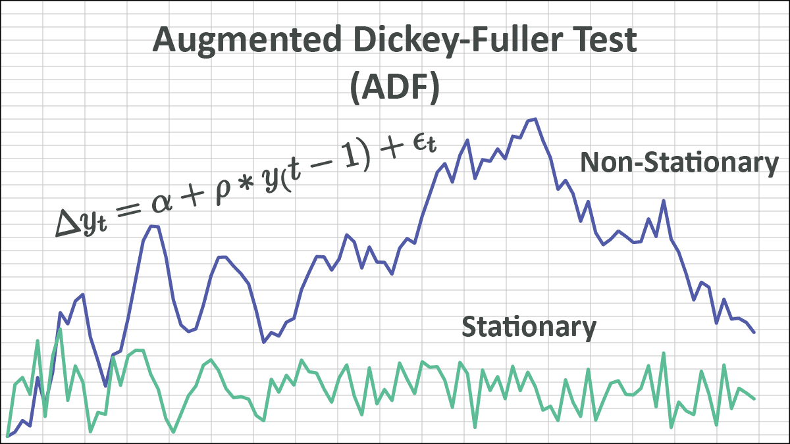

## Table of Contents

## What is the Chow-type Dickey-Fuller test?

The Chow-type Dickey-Fuller test is a statistical test used to check if a time series data set has a structural break. A structural break means there's a big change in the data pattern at some point in time. This test helps us see if the way data behaves before a certain time is different from how it behaves after that time.

This test is based on the Dickey-Fuller test, which checks if a time series is stationary, meaning its statistical properties don't change over time. The Chow-type version adds the idea of checking for a break in the series. It does this by comparing the data before and after the possible break point to see if they follow the same pattern or if there's a significant difference. If there is a big difference, it suggests there's a structural break in the data.

## How does the Chow-type Dickey-Fuller test differ from the standard Dickey-Fuller test?

The Chow-type Dickey-Fuller test and the standard Dickey-Fuller test both aim to understand time series data, but they focus on different aspects. The standard Dickey-Fuller test checks if a time series is stationary, meaning its statistical properties like mean and variance stay the same over time. It does this by testing if there's a unit root in the data, which would mean the data isn't stationary. If the test shows there's no unit root, the data is likely stationary.

On the other hand, the Chow-type Dickey-Fuller test looks for structural breaks in the time series. A structural break is when the data's pattern changes significantly at a certain point in time. This test combines the idea of checking for stationarity with the ability to detect if there's a big change in how the data behaves before and after a specific time. It does this by comparing the data before and after the possible break point to see if there's a significant difference, suggesting a structural break.

In simple terms, while the standard Dickey-Fuller test focuses solely on whether the entire time series is stationary, the Chow-type Dickey-Fuller test goes a step further by also checking for any sudden shifts or breaks in the data's pattern. This makes the Chow-type test useful for analyzing time series where changes in behavior over time are suspected.

## What are the key assumptions underlying the Chow-type Dickey-Fuller test?

The Chow-type Dickey-Fuller test assumes that the time series data you're looking at follows a certain pattern before and after a possible break point. It thinks the data can be split into two parts: one part before the break and one part after the break. The test assumes that if there's no break, the whole series should behave the same way throughout. But if there is a break, the part before the break should behave differently from the part after the break.

Another important assumption is that the errors, or the differences between the actual data points and the model's predictions, are random and not related to each other. This means the errors should not follow any pattern and should be independent. If the errors are not random or if they're related, it could mess up the test results. So, the test works best when the data's errors are well-behaved and don't have any hidden patterns.

## Can you explain the mathematical formula used in the Chow-type Dickey-Fuller test?

The Chow-type Dickey-Fuller test uses a formula that checks if there's a big change in a time series at a certain point. Imagine you have a series of numbers over time. The test splits this series into two parts: one part before a possible break and one part after it. It then uses a formula to see if these two parts behave differently. The basic idea is to compare how well a single model fits the whole series versus how well two separate models fit each part of the series before and after the break. If the two separate models fit better, it suggests there's a structural break.

The formula for the test involves calculating something called the F-statistic. This is done by first fitting a model to the whole series and another model that allows for a break at a specific point. The F-statistic measures how much better the model with the break fits the data compared to the model without a break. If the F-statistic is big enough, it means the data behaves differently before and after the break, indicating a structural break. The exact formula for the F-statistic in this test is a bit complicated, but it essentially compares the sum of squared errors from the two models to see if the difference is significant.

## What types of data are suitable for the Chow-type Dickey-Fuller test?

The Chow-type Dickey-Fuller test works best with time series data, which means data that is collected over time. This could be things like daily stock prices, monthly sales figures, or yearly temperature readings. The test is good for looking at data where you think there might be a big change at some point. For example, if you want to see if a company's sales changed a lot after a new CEO took over, the Chow-type Dickey-Fuller test could help you find out.

This test is especially useful for data where the pattern might change suddenly. It can help you figure out if something big happened at a certain time that made the data behave differently before and after that point. So, it's good for data where you suspect there might be a break, like economic data after a policy change, or environmental data after a natural disaster. The test needs enough data points both before and after the possible break to work well, so it's important to have a good amount of data on both sides of the break you're looking at.

## How do you interpret the results of a Chow-type Dickey-Fuller test?

When you do a Chow-type Dickey-Fuller test, you're trying to see if there's a big change in your data at a certain point in time. The test gives you a number called the F-statistic. If this number is big, it means the data before the break is very different from the data after the break. You compare this F-statistic to a special table or use a computer to find out if it's big enough to say there's really a break. If the F-statistic is bigger than a certain cutoff, you can say there's strong evidence of a structural break in your data.

If you find a structural break, it means something important happened at that time that changed how your data behaves. For example, if you're looking at sales data and you find a break when a new CEO started, it suggests the new CEO might have made big changes that affected sales. If the F-statistic isn't big enough, it means the data probably didn't change much at that point, and you might not have a structural break. Understanding these results helps you figure out if and when something big happened that changed your data's pattern.

## What are the common pitfalls when applying the Chow-type Dickey-Fuller test?

One common pitfall when using the Chow-type Dickey-Fuller test is choosing the wrong break point. If you pick the wrong spot to check for a break, you might miss the real change in your data or think there's a break when there isn't one. It's important to have a good reason for [picking](/wiki/asset-class-picking) the break point you do, like knowing when a big event happened that might have changed things.

Another issue is not having enough data. The test needs a good amount of data both before and after the break point to work well. If you don't have enough data on one side or the other, the test might not give you a clear answer. Also, if the errors in your data aren't random or if they're related to each other, it can mess up the test results. So, it's important to check that your data's errors are well-behaved before using the test.

## How does the Chow-type Dickey-Fuller test handle structural breaks in time series data?

The Chow-type Dickey-Fuller test looks for big changes in time series data, which we call structural breaks. Imagine you have a bunch of numbers over time, like daily temperatures or monthly sales. The test splits this data into two parts: one part before a certain point in time and one part after. It then checks if the data behaves the same way in both parts or if there's a big difference. If there's a big difference, it means something important happened at that point that changed how the data acts.

To do this, the test uses something called the F-statistic. It compares how well a single model fits all the data to how well two separate models fit the data before and after the break. If the F-statistic is big enough, it means the data before the break is very different from the data after the break, suggesting there's a structural break. This helps you understand if and when something big happened that changed your data's pattern.

## What are the critical values for the Chow-type Dickey-Fuller test and how are they determined?

The critical values for the Chow-type Dickey-Fuller test are numbers that help you decide if there's a big change in your data at a certain point. These numbers are called critical values because they're the cutoff points that tell you if the change is big enough to matter. They're usually found in special tables or calculated using computer programs. The critical values depend on things like how much data you have and how confident you want to be in your results. If your test's F-statistic is bigger than the critical value, it means there's a good chance there's a real change in your data.

These critical values are determined through simulations and statistical theory. Researchers use computers to create lots of fake data sets that have no real breaks in them. They then run the Chow-type Dickey-Fuller test on these fake data sets to see what kinds of F-statistics come up when there's no break. By doing this many times, they can figure out what F-statistic values are so big that they're unlikely to happen by chance if there's no break. These unlikely values become the critical values. So, if your real data's F-statistic is bigger than these critical values, it's a sign that there might be a real break in your data.

## Can the Chow-type Dickey-Fuller test be used in conjunction with other statistical tests? If so, which ones?

Yes, the Chow-type Dickey-Fuller test can be used with other statistical tests to get a better understanding of time series data. One common test to use with it is the standard Dickey-Fuller test, which checks if the whole time series is stationary. By using both tests together, you can find out if there's a big change in the data at a certain point and also if the data's overall pattern stays the same over time. Another test you might use with the Chow-type Dickey-Fuller test is the Augmented Dickey-Fuller test, which is good for checking stationarity when there might be more complicated patterns in the data.

Other tests that can be used alongside the Chow-type Dickey-Fuller test include the Phillips-Perron test, which also checks for stationarity but can handle certain types of data issues better than the Dickey-Fuller tests. You might also use the KPSS test, which looks at stationarity from a different angle by testing if the data is trend-stationary. Using these tests together helps you see different aspects of your time series data, like if it's stationary, if there are breaks, and how these breaks might affect the data's overall pattern.

## What software tools are available to perform the Chow-type Dickey-Fuller test?

There are several software tools that can help you do the Chow-type Dickey-Fuller test. One popular tool is R, which is a free program used a lot by people who work with data. In R, you can use packages like "strucchange" to run this test. Another tool is Python, which is also free and very popular. In Python, you can use libraries like "statsmodels" to do the test. Both R and Python are easy to use once you learn how to set them up.

Another option is EViews, which is a paid software often used by economists and researchers. EViews has built-in tools that make it easy to run the Chow-type Dickey-Fuller test. If you like working in a spreadsheet, you can use Microsoft Excel with add-ins like "XLSTAT" to do the test. These tools make it simple to check for big changes in your data over time, even if you're not an expert in statistics.

## How have recent advancements in econometrics affected the application of the Chow-type Dickey-Fuller test?

Recent advancements in econometrics have made the Chow-type Dickey-Fuller test easier to use and more accurate. New computer programs and software, like R and Python, have special tools that help you run the test quickly and correctly. These programs can handle big sets of data and do the math for you, so you don't have to worry about making mistakes. Also, new methods in econometrics have helped us understand how to pick the right break point better, which makes the test more reliable.

These advancements have also led to new ways to check the results of the Chow-type Dickey-Fuller test. For example, we now have better ways to see if the test's results are strong enough to trust. This means we can be more sure about whether there's a real change in the data or not. Overall, these improvements have made the Chow-type Dickey-Fuller test a more powerful tool for finding big changes in time series data, helping researchers and analysts make better decisions.

## What is the Chow-Type Dickey-Fuller Test and how does it work?

The Chow-Type Dickey-Fuller Test is a statistical tool designed to analyze time series data for signs of explosiveness, an important warning of potential instability in financial markets. Rooted in an AR(1) process, this test examines the transition of a time series from a random walk—a model where values change in no predictable direction—to an explosive process, characterized by rapid, unsustainable increases.

The central hypothesis of the Chow-Type Dickey-Fuller Test focuses on the autoregressive parameter, denoted as $\delta$. In the context of an AR(1) model, the basic equation is:

$$
X_t = \delta X_{t-1} + \epsilon_t
$$

where $X_t$ represents the time series data at time $t$, and $\epsilon_t$ is a white noise error term. The test scrutinizes whether $\delta = 0$ or $\delta > 1$. When $\delta = 0$, the time series behaves like a stationary series. A value of $\delta > 1$ suggests explosive behavior, where prices grow at an increasing rate, indicating potential asset price bubbles or speculative excess.

Detecting speculative bubbles is crucial in trading as it allows traders to anticipate and prepare for market corrections. The Chow-Type Dickey-Fuller Test is specifically valuable here due to its ability to identify shifts from normal market conditions to unsustainable explosive growth, enabling traders to undertake corrective measures timely. 

Understanding the test's mathematical foundation aids its application in practical trading scenarios. In executing the test, the time series is divided into a pre-defined number of regimes. For each potential transition point, or 'break', the model tests for changes in $\delta$, enabling precise detection of when the market may switch to an explosive state. This approach provides robust insights into market dynamics, enhancing trading strategy formulations.

The mathematical robustness of the Chow-Type Dickey-Fuller Test provides a significant advantage in [algorithmic trading](/wiki/algorithmic-trading). By using these statistical measurements and anticipatory signals, traders can align their strategies to avoid or capitalize on expected market changes.

## What is the implementation of the Chow-Type Dickey-Fuller Test?

The implementation of the Chow-Type Dickey-Fuller Test is pivotal for accurately identifying explosiveness within a time series. Central to this implementation is understanding the autoregressive process, AR(1), which forms the basis of this test. The AR(1) model is typically expressed as:

$$

y_t = \delta y_{t-1} + \epsilon_t 
$$

where $y_t$ is the time series value at time $t$, $\delta$ is the parameter of interest, and $\epsilon_t$ is the error term assumed to be white noise. The critical hypothesis involves testing whether $\delta = 1$, which indicates a random walk, versus $\delta > 1$, suggesting explosiveness.

Implementing the Chow-Type Dickey-Fuller Test involves employing a change-point methodology. This methodology focuses on evaluating multiple potential breakpoints across the time series. By doing so, it addresses potential shifts or structural changes that may indicate an explosive regime. The objective is to determine if and when the time series transitions from a non-explosive to an explosive behavior.

The Supremum Chow-Type Dickey-Fuller statistic is computed to assess these potential breakpoints. This statistic aims to pinpoint the most significant regime shift by comparing the test [statistics](/wiki/bayesian-statistics) over different potential breakpoints. The supremum, or highest value, represents the most likely point of structural change.

For practical implementation, Python libraries such as `statsmodels` provide robust tools to perform this type of analysis on financial data. The library offers functions for time series analysis that can accommodate the testing requirements.

Here is an example code snippet demonstrating how to implement the Chow-Type Dickey-Fuller Test using Python and `statsmodels`:

```python
import numpy as np
import statsmodels.api as sm
from statsmodels.tsa.stattools import adfuller

# Sample dataset: generating a synthetic time series
np.random.seed(42)
n = 100
y = np.random.randn(n).cumsum() + 100

# Applying the Dickey-Fuller test
result = adfuller(y, autolag='AIC')
print('ADF Statistic:', result[0])
print('p-value:', result[1])

# Interpretation: Check if p-value is below a threshold (e.g., 0.05) for significance
```

This step-by-step guide emphasizes the use of the Augmented Dickey-Fuller (ADF) test within `statsmodels` as a starting point, and it can be extended to consider multiple breakpoints and structural changes. The test result will contain the ADF statistic and a p-value to determine the presence of an explosive regime.

In summary, implementing the Chow-Type Dickey-Fuller Test involves understanding AR processes, applying a change-point methodology to evaluate breakpoints, and utilizing Python libraries to facilitate this analysis on financial datasets. This approach aids in detecting regime shifts indicative of market explosiveness.

## References & Further Reading

[1]: Phillips, P. C. B., Wu, Y., & Yu, J. (2011). ["Explosive Behavior in the 1990s NASDAQ: When did exuberance escalate asset values?"](http://korora.econ.yale.edu/phillips/pubs/art/p1349.pdf) Cowles Foundation Discussion Paper No. 1705.

[2]: Homm, U., & Breitung, J. (2012). ["Testing for Speculative Bubbles in Stock Markets: A Comparison of Alternative Methods"](https://academic.oup.com/jfec/article-abstract/10/1/198/757787) Journal of Financial Econometrics, 10(1), 198-231.

[3]: ["Statsmodels: Statistical Models, Hypothesis Tests, and Data Exploration"](https://www.statsmodels.org/stable/index.html) Python library documentation for statistical tests and models.

[4]: Greenaway-McGrevy, R., & Phillips, P. C. B. (2016). ["Hot property in New Zealand: Empirical evidence of housing bubbles in the metro areas."](https://en.wikipedia.org/wiki/YIMBY) Oxford Economic Papers, 68(1), 169-192.

[5]: Diba, B. T., & Grossman, H. I. (1988). ["The Theory of Rational Bubbles in Stock Prices."](https://academic.oup.com/ej/article-abstract/98/392/746/5190580) The Economic Journal, 98(392), 746-754.