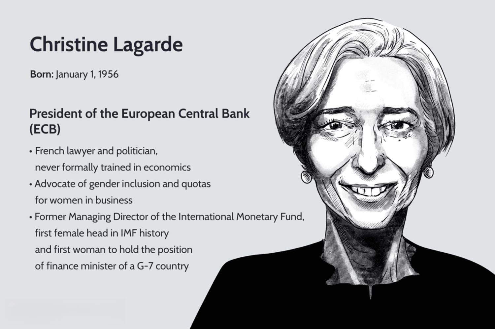

## Table of Contents

## Who is Christine Lagarde?

Christine Lagarde is a French woman who is in charge of the European Central Bank. She was born on January 1, 1956, in Paris, France. She became the head of the European Central Bank in 2019. Before that, she was the leader of another big group called the International Monetary Fund from 2011 to 2019.

Before working at these big banks, Christine Lagarde was a lawyer and also worked in the French government. She was the Minister of Economy, Finance and Industry in France from 2007 to 2011. She is known for being smart and good at talking to people, which helps her do her job well.

## What is the European Central Bank (ECB)?

The European Central Bank (ECB) is a bank that works for countries in Europe that use the euro as their money. It started in 1998 and its main job is to make sure the euro stays strong and prices don't go up too fast, which is called inflation. The ECB is in Frankfurt, Germany, and it helps these countries by setting rules about money and interest rates.

The ECB is run by a group of people called the Governing Council, which includes the bank's President, Vice-President, and other important members. They meet regularly to decide what the ECB should do to keep the economy stable. Christine Lagarde is the current President of the ECB, and she leads this group in making big decisions about Europe's money.

## When did Christine Lagarde become the President of the ECB?

Christine Lagarde became the President of the European Central Bank (ECB) in 2019. She started her job on November 1, 2019. Before she took over, she was the head of the International Monetary Fund (IMF) for eight years.

As the President of the ECB, Christine Lagarde is in charge of making sure the euro stays strong and prices don't go up too fast. She leads a group called the Governing Council, which makes important decisions about money and interest rates for countries that use the euro.

## What are the main responsibilities of the ECB President?

The main job of the ECB President is to lead the bank and make sure the euro stays strong. They do this by working with a group called the Governing Council. This group decides on things like interest rates and other money rules that help keep prices from going up too fast, which is called inflation. The President also talks to the public and explains what the ECB is doing and why.

Another important part of the ECB President's job is to watch over the economy of the countries that use the euro. They need to make sure these countries' economies are working well together. The President also works with other big banks and governments around the world to make sure everything runs smoothly. It's a big job that needs someone who understands money and can talk to a lot of different people.

## How has Christine Lagarde influenced ECB policies?

Since becoming the President of the European Central Bank in 2019, Christine Lagarde has worked to make the bank's decisions easier to understand for everyone. She talks a lot about how the ECB is trying to keep prices stable and help the economy grow. She has made the ECB more open by explaining things in a clear way and using social media to reach more people. Lagarde also started something called the "ECB Listens" events, where she talks to people from different parts of society to hear what they think about the economy.

Lagarde has also pushed for the ECB to think about more than just keeping prices stable. She wants the bank to also care about things like climate change and making sure everyone has a fair chance in the economy. She has made the ECB pay more attention to how their decisions affect the environment. For example, she has led the bank to start buying bonds from companies that are good for the planet. This shows that Lagarde wants the ECB to help with big problems that affect everyone, not just money and prices.

## What challenges has Christine Lagarde faced as ECB President?

Christine Lagarde has faced many challenges since becoming the President of the European Central Bank. One big challenge was the COVID-19 pandemic. It made the economy very weak, and Lagarde had to help make sure the euro stayed strong. She and the ECB decided to do things like give banks more money and buy more bonds to help the economy. This was tough because everyone was worried about their jobs and money.

Another challenge has been dealing with different opinions inside the ECB. The bank has people from many countries, and they don't always agree on what to do. Lagarde has had to work hard to get everyone to work together. She also faced criticism for some of her early decisions, like when she said the ECB was not there to help with bond prices. This caused some confusion and worry among investors, but she learned from it and tried to be clearer in the future.

Lagarde also wants the ECB to help with big problems like climate change. This is a new area for the bank, and not everyone agrees on how much the ECB should do. She has tried to lead the bank to buy bonds from companies that are good for the environment. It's a challenge because it's a new way of thinking for the ECB, and it's not easy to change how the bank works. But Lagarde keeps pushing for these changes because she thinks it's important for the future.

## How does Christine Lagarde's leadership style differ from her predecessors?

Christine Lagarde's leadership style is different from her predecessors because she focuses a lot on talking to people and explaining things clearly. Before her, ECB Presidents like Mario Draghi and Jean-Claude Trichet were very focused on numbers and keeping prices stable. They were good at making big decisions about money, but they didn't always talk a lot to the public. Lagarde, on the other hand, uses social media and events like "ECB Listens" to reach out to people and explain what the ECB is doing and why. She wants everyone to understand the bank's decisions, not just the experts.

Another way Lagarde's style is different is that she cares about more than just money and prices. She wants the ECB to help with big problems like climate change and making sure everyone has a fair chance in the economy. Her predecessors mostly focused on keeping inflation low and making sure the euro was strong. Lagarde thinks the ECB should also think about the environment and social issues. This is a new way of thinking for the bank, and it shows that she wants the ECB to be a leader in solving big problems that affect everyone, not just in managing money.

## What are some key economic policies implemented under Christine Lagarde's tenure?

Since Christine Lagarde became the President of the European Central Bank, she has helped guide the bank through some tough times, especially during the COVID-19 pandemic. One of the big things she did was to start a program to give banks more money so they could lend it to businesses and people who were struggling because of the virus. She also made the ECB buy more bonds to help keep the economy going. These steps were important to make sure the euro stayed strong and to help people keep their jobs and businesses.

Lagarde also wants the ECB to do more than just keep prices stable. She has pushed for the bank to think about climate change and how their decisions affect the environment. For example, the ECB started buying bonds from companies that are good for the planet. This is a new way of doing things for the bank, and it shows that Lagarde cares about big problems that affect everyone, not just money and prices. She has also tried to make the ECB's decisions easier to understand by talking to the public more and using social media to explain what the bank is doing.

## How has Christine Lagarde addressed issues like inflation and economic recovery in the Eurozone?

Christine Lagarde has worked hard to keep inflation under control and help the Eurozone economy recover. When she became the President of the European Central Bank, one of her first big challenges was the COVID-19 pandemic. It made the economy very weak, so she helped the ECB give banks more money to lend to businesses and people. The bank also bought more bonds to keep the economy going. These steps were important to make sure the euro stayed strong and to help people keep their jobs and businesses.

Lagarde has also tried to make sure that everyone understands what the ECB is doing about inflation and the economy. She talks a lot to the public and uses social media to explain the bank's decisions. She started events called "ECB Listens" to hear what people think about the economy. By talking to people and explaining things clearly, she helps everyone know why the ECB is doing what it's doing to fight inflation and help the economy recover.

## What is Christine Lagarde's approach to monetary policy and financial stability?

Christine Lagarde's approach to monetary policy focuses on keeping prices stable and helping the economy grow. She believes the European Central Bank should do more than just control inflation. During the COVID-19 pandemic, she helped the ECB give banks more money to lend to businesses and people who were struggling. The bank also bought more bonds to keep the economy going. These steps were important to make sure the euro stayed strong and to help people keep their jobs and businesses. Lagarde wants the ECB to think about big problems like climate change and making sure everyone has a fair chance in the economy, not just focusing on money and prices.

Lagarde also works hard to make the ECB's decisions clear to everyone. She uses social media and events like "ECB Listens" to talk to people and explain what the bank is doing and why. By being open and talking a lot to the public, she helps everyone understand how the ECB is working to keep inflation under control and help the economy recover. Her approach to financial stability involves making sure the euro stays strong and that the economy works well for all countries in the Eurozone. She leads the ECB's Governing Council to make decisions that help keep the economy stable and growing.

## How has Christine Lagarde's background influenced her role at the ECB?

Christine Lagarde's background has really helped her do her job well at the European Central Bank. Before she was the President of the ECB, she worked as a lawyer and in the French government. She was the Minister of Economy, Finance and Industry in France, so she knows a lot about money and how to run big organizations. She also led the International Monetary Fund, which is another big group that helps countries with their money problems. All of this experience has made her good at understanding how to keep the euro strong and how to help the economy.

Lagarde is also known for being good at talking to people and explaining things clearly. Because she used to be a lawyer, she knows how to talk about complicated things in a way that everyone can understand. This helps her explain what the ECB is doing and why, which is important for keeping people calm and confident in the economy. Her background has made her a leader who cares about more than just money and prices; she also wants the ECB to help with big problems like climate change and making sure everyone has a fair chance in the economy.

## What future challenges might Christine Lagarde face as ECB President?

In the future, Christine Lagarde might face some big challenges as the President of the European Central Bank. One of the main challenges will be dealing with inflation. Right now, prices are going up a lot in many places, and it's hard to keep them under control. Lagarde will need to find ways to keep inflation from getting too high while also making sure the economy keeps growing. This can be tricky because if she does too much to stop inflation, it might hurt the economy, but if she doesn't do enough, prices could keep going up and up.

Another challenge Lagarde might face is making sure all the countries in the Eurozone work well together. Each country has its own problems and needs, so it can be hard to make decisions that are good for everyone. Lagarde will need to keep talking to leaders from different countries and find ways to help everyone. She'll also need to keep the ECB focused on big issues like climate change and making sure everyone has a fair chance in the economy, even when it's hard to agree on what to do.

Lagarde will also need to keep explaining the ECB's decisions clearly to the public. People can get worried about the economy, and if they don't understand what the ECB is doing, it can make things worse. Lagarde will need to keep using social media and events like "ECB Listens" to talk to people and make sure they know why the ECB is making certain choices. This will be important for keeping everyone calm and confident in the economy, even when things are tough.

## References & Further Reading

[1]: ["Advances in Financial Machine Learning"](https://www.amazon.com/Advances-Financial-Machine-Learning-Marcos/dp/1119482089) by Marcos Lopez de Prado

[2]: ["Machine Learning for Algorithmic Trading"](https://github.com/stefan-jansen/machine-learning-for-trading) by Stefan Jansen

[3]: ["Quantitative Trading: How to Build Your Own Algorithmic Trading Business"](https://www.amazon.com/Quantitative-Trading-Build-Algorithmic-Business/dp/1119800064) by Ernest P. Chan

[4]: ECB. (2020). ["A Symmetric Inflation Aim: The ECB's Monetary Policy Strategy Review"](https://www.ecb.europa.eu/home/search/review/html/ecb.strategyreview_monpol_strategy_overview.en.html) European Central Bank.

[5]: Hull, J. (2018). ["Options, Futures, and Other Derivatives"](https://www.semanticscholar.org/paper/Options%2C-Futures%2C-and-Other-Derivatives-Hull/89bdee500c8623864fc9eb7a471546aa713acc44) by John C. Hull.

[6]: ECB. (2020). ["ECB Monetary Policy and the Covid-19 Pandemic: An Assessment of the ECB's Pandemic Emergency Purchase Programme (PEPP)"](https://www.tctimes.com/news/local-gas-prices-lower-compared-to-one-year-prior/article_44ecb942-b1c6-11ef-a662-ffb3c723a31b.html) European Central Bank.