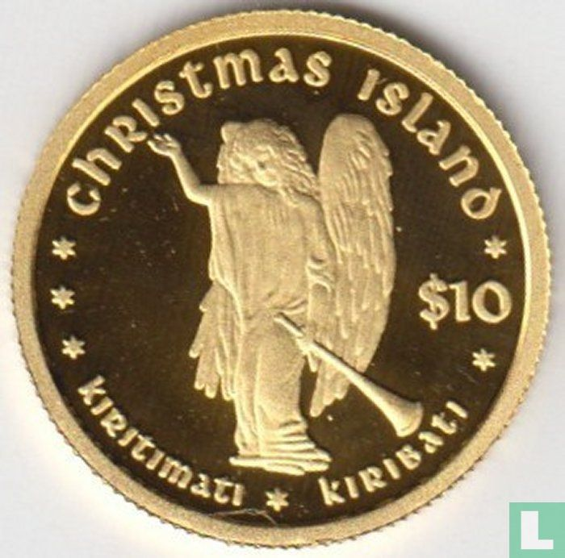

## Table of Contents

## What is the Christmas Island Dollar?

The Christmas Island Dollar is a type of money that was used on Christmas Island, which is a small island in the Indian Ocean. It was used a long time ago, from 1943 to 1958. The money was made because the island was under the control of the British phosphate company, and they needed their own money to use on the island.

The Christmas Island Dollar was special because it was only used on the island and nowhere else. It had different coins and notes, just like regular money. But after 1958, they stopped using it and started using the Australian Dollar instead, because the island became part of Australia.

## When was the Christmas Island Dollar first introduced?

The Christmas Island Dollar was first introduced in 1943. This was because Christmas Island was controlled by the British Phosphate Commission at that time. They needed their own money to use on the island, so they created the Christmas Island Dollar.

The money was special because it was only used on Christmas Island and nowhere else. It had its own coins and notes, just like regular money. But after 1958, they stopped using the Christmas Island Dollar and started using the Australian Dollar instead, because the island became part of Australia.

## What is the relationship between the Christmas Island Dollar and the Australian Dollar?

The Christmas Island Dollar and the Australian Dollar are related because Christmas Island used to have its own money, but now it uses the Australian Dollar. The Christmas Island Dollar was used from 1943 to 1958. It was made because the British Phosphate Commission controlled the island and needed their own money to use there.

In 1958, Christmas Island became part of Australia. That's when they stopped using the Christmas Island Dollar and started using the Australian Dollar instead. So, the Australian Dollar replaced the Christmas Island Dollar, and it's the money that people on Christmas Island use today.

## Can you describe the design elements on the Christmas Island Dollar?

The Christmas Island Dollar had special designs on its coins and notes. On the front of the coins, there was a picture of the British monarch, either King George VI or Queen Elizabeth II, depending on when the coin was made. This showed that the island was under British control. On the back of the coins, there were different pictures. Some coins showed a map of Christmas Island, while others had pictures of animals or plants that live on the island, like crabs or palm trees.

The notes of the Christmas Island Dollar also had unique designs. On the front of the notes, there was a picture of the British monarch, just like on the coins. The back of the notes had pictures that showed what life was like on the island. For example, some notes showed people working in the phosphate mines, which was a big part of the island's economy. Other notes had pictures of the island's beautiful beaches and nature. These designs made the Christmas Island Dollar special and different from other kinds of money.

## What denominations of the Christmas Island Dollar are available?

The Christmas Island Dollar came in different sizes of money, called denominations. For coins, there were 1 cent, 5 cents, 10 cents, 25 cents, and 50 cents. Each coin had a different picture on it, like the British monarch on the front and things from the island on the back.

For paper money, or notes, there were 1 dollar, 5 dollars, 10 dollars, and 50 dollars. These notes also had pictures of the British monarch on the front and scenes from the island on the back. The different sizes of money made it easy for people to use the Christmas Island Dollar for buying things on the island.

## How is the Christmas Island Dollar used in everyday transactions on the island?

The Christmas Island Dollar was used every day on the island for buying things like food, clothes, and other things people needed. People would use the different coins and notes to pay for what they wanted. For example, if someone wanted to buy a candy, they might use a 1 cent or 5 cent coin. If they needed to buy something more expensive, like a tool, they might use a 1 dollar or 5 dollar note. The money was easy to use because it came in different sizes, so people could pay the right amount for what they were buying.

The money was also used in shops, markets, and other places where people did business. Shopkeepers would give change back to customers using the Christmas Island Dollar coins and notes. For example, if someone bought something that cost 25 cents but paid with a 50 cent coin, the shopkeeper would give them a 25 cent coin back. This made it easy for everyone on the island to buy and sell things using their own special money. But after 1958, they stopped using the Christmas Island Dollar and started using the Australian Dollar instead.

## What are the exchange rates for the Christmas Island Dollar against major world currencies?

The Christmas Island Dollar is no longer used today, so it doesn't have exchange rates with major world currencies like the US Dollar, the Euro, or the British Pound. It was only used on Christmas Island from 1943 to 1958, and after that, the island switched to using the Australian Dollar. Because the Christmas Island Dollar isn't used anymore, you can't exchange it for other kinds of money.

If you have old Christmas Island Dollars, they are mostly valuable as collectors' items now. People who collect old money might be interested in them, but they wouldn't use them to buy things. The value of these old coins and notes depends on how rare they are and what condition they are in, not on any exchange rate with other currencies.

## What historical events influenced the creation and use of the Christmas Island Dollar?

The Christmas Island Dollar was created because of what was happening on the island during World War II. In 1943, the British Phosphate Commission took over Christmas Island. They needed their own money to use there because the island was far away from other places and it was hard to use money from other countries. So, they made the Christmas Island Dollar. This new money helped them pay workers and buy things on the island without having to worry about money from other places.

The use of the Christmas Island Dollar ended in 1958 when the island became part of Australia. This big change happened because Australia took control of the island from the British. When Australia took over, they decided to stop using the Christmas Island Dollar and start using the Australian Dollar instead. This made it easier for people on the island to buy things from Australia and for Australians to visit the island. So, the Christmas Island Dollar was only used for a short time, but it was important while it lasted.

## How does the Christmas Island Dollar impact the local economy?

The Christmas Island Dollar had a big impact on the local economy while it was used. From 1943 to 1958, it helped the British Phosphate Commission run the island smoothly. The money was used to pay workers and buy things on the island. This made it easier for the company to manage everything without having to use money from other places, which could be hard to get on a small, far-away island. The Christmas Island Dollar also helped the local shops and markets because people used it to buy food, clothes, and other things they needed every day.

When the Christmas Island Dollar was replaced by the Australian Dollar in 1958, it changed the local economy again. Christmas Island became part of Australia, so using the Australian Dollar made it easier for people on the island to buy things from Australia and for Australians to visit and spend money on the island. The switch to the Australian Dollar helped the island's economy grow because it connected the island more closely with Australia. Even though the Christmas Island Dollar isn't used anymore, it played an important role in the island's history and economy for a while.

## Are there any collectible or commemorative editions of the Christmas Island Dollar?

Yes, there are collectible and commemorative editions of the Christmas Island Dollar. These special coins and notes are interesting to people who like to collect old money. Some of the coins have different pictures on them, like animals or plants from the island, which makes them special. People who collect these items might pay more for them if they are rare or in good condition.

The Christmas Island Dollar is no longer used for buying things, so these collectible editions are mostly for people who enjoy history and old money. They can be found in places where people buy and sell old coins and notes, like special shops or online. These special editions help people remember the time when Christmas Island had its own money, from 1943 to 1958.

## What are the legal tender status and regulations surrounding the Christmas Island Dollar?

The Christmas Island Dollar is no longer used as legal tender. It was only used on Christmas Island from 1943 to 1958. After 1958, the island became part of Australia, and they started using the Australian Dollar instead. So, you can't use the Christmas Island Dollar to buy things anymore. It's not accepted as money anywhere.

There are no special regulations about the Christmas Island Dollar now because it's not used as money. But if you have old Christmas Island Dollars, they might be valuable to people who collect old money. The value depends on how rare they are and what condition they are in. These old coins and notes are mostly for collectors who like to remember the time when Christmas Island had its own money.

## How does the future of the Christmas Island Dollar look in terms of its usage and potential changes?

The Christmas Island Dollar has no future in terms of usage because it is no longer used as money. It was only used on Christmas Island from 1943 to 1958, and after that, the island started using the Australian Dollar. So, you can't use the Christmas Island Dollar to buy things anymore. It's not accepted as money anywhere.

In the future, the Christmas Island Dollar might become more popular with collectors. People who like old money might want to buy and sell these coins and notes. The value of these old Christmas Island Dollars will depend on how rare they are and what condition they are in. But they won't be used for buying things; they will just be special items for people who enjoy history and collecting old money.

## References & Further Reading

[1]: Bergstra, J., Bardenet, R., Bengio, Y., & Kégl, B. (2011). ["Algorithms for Hyper-Parameter Optimization."](https://dl.acm.org/doi/10.5555/2986459.2986743) Advances in Neural Information Processing Systems 24.

[2]: ["Advances in Financial Machine Learning"](https://www.amazon.com/Advances-Financial-Machine-Learning-Marcos/dp/1119482089) by Marcos Lopez de Prado.

[3]: ["Evidence-Based Technical Analysis: Applying the Scientific Method and Statistical Inference to Trading Signals"](https://www.amazon.com/Evidence-Based-Technical-Analysis-Scientific-Statistical/dp/0470008741) by David Aronson.

[4]: ["Machine Learning for Algorithmic Trading"](https://github.com/stefan-jansen/machine-learning-for-trading) by Stefan Jansen.

[5]: ["Quantitative Trading: How to Build Your Own Algorithmic Trading Business"](https://www.amazon.com/Quantitative-Trading-Build-Algorithmic-Business/dp/1119800064) by Ernest P. Chan.