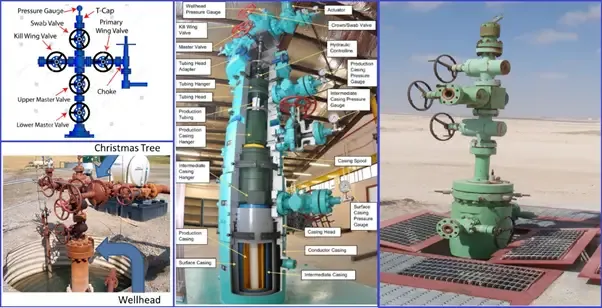

## Table of Contents

## What is a Christmas tree in the context of oil and gas?

In the oil and gas industry, a Christmas tree is a piece of equipment used to control the flow of oil or gas from a well. It is called a Christmas tree because it looks like a decorated tree with its many valves and fittings arranged in a tree-like structure. The Christmas tree is installed on top of the wellhead, which is the top part of the well where the oil or gas comes out.

The main job of the Christmas tree is to regulate the flow of the well's production. It has several valves that can be opened or closed to control how much oil or gas comes out. This helps to manage the pressure inside the well and ensures that the oil or gas is extracted safely and efficiently. The Christmas tree is an important part of the well's operation and is used throughout the life of the well.

## What are the main components of a Christmas tree?

A Christmas tree in the oil and gas industry has several important parts. The main part is the master valve, which is like a big switch that can turn the whole well on or off. There are also smaller valves called wing valves that control the flow of oil or gas into different pipes. These valves help to manage where the oil or gas goes after it leaves the well.

Another important part is the choke, which is used to control the pressure and flow rate of the oil or gas. The choke can be adjusted to make the flow faster or slower, depending on what is needed. There are also pressure gauges and flow meters that help to keep track of how the well is doing. All these parts work together to make sure the well is safe and productive.

Sometimes, a Christmas tree also has safety devices like emergency shutdown valves. These are important because they can quickly stop the flow of oil or gas if something goes wrong. This helps to prevent accidents and keep everyone safe. Overall, the Christmas tree is a key piece of equipment that helps to manage the well's production and keep things running smoothly.

## How does a Christmas tree function in oil and gas operations?

A Christmas tree in oil and gas operations works like a control center for a well. It sits on top of the well and has many valves and parts that help to manage the flow of oil or gas. The main valve, called the master valve, can turn the whole well on or off. There are also smaller valves called wing valves that control where the oil or gas goes after it leaves the well. These valves help to make sure the oil or gas is sent to the right place, like a pipeline or a storage tank.

Another important part of the Christmas tree is the choke. The choke helps to control how fast the oil or gas comes out of the well. It can be adjusted to make the flow faster or slower, depending on what is needed. The Christmas tree also has pressure gauges and flow meters that keep track of how the well is doing. If something goes wrong, there are safety devices like emergency shutdown valves that can quickly stop the flow of oil or gas. This helps to keep everyone safe and prevent accidents. Overall, the Christmas tree is a key piece of equipment that helps to manage the well's production and keep things running smoothly.

## What is the difference between a surface and a subsea Christmas tree?

A surface Christmas tree is used on wells that are on land or in shallow water. It sits right on top of the wellhead where you can easily see and reach it. This type of Christmas tree is easier to work on because you can get to it without special equipment. It has all the valves and controls needed to manage the flow of oil or gas, and it's used for wells that are not too deep under the ground or water.

A subsea Christmas tree, on the other hand, is used for wells that are deep under the ocean. It sits on the ocean floor and is much harder to reach. Special underwater robots and remote controls are needed to work on it. Even though it's harder to get to, a subsea Christmas tree can handle the high pressure and harsh conditions at the bottom of the sea. Both types of Christmas trees do the same job of controlling the flow of oil or gas, but they are designed for different environments.

## What are the safety features incorporated in a Christmas tree?

A Christmas tree in the oil and gas industry has several safety features to make sure everything stays safe. One important safety feature is the emergency shutdown valve. This valve can quickly stop the flow of oil or gas if something goes wrong. It's like a big emergency switch that helps to prevent accidents and keep everyone safe. Another safety feature is the pressure relief valve. This valve helps to control the pressure inside the well. If the pressure gets too high, the valve opens to let some of the pressure out, which helps to keep the well safe.

There are also sensors and alarms on the Christmas tree that keep an eye on things like pressure and temperature. If something is not right, these sensors can send a warning to the people in charge. This helps them to fix the problem before it turns into a big accident. All these safety features work together to make sure the Christmas tree and the well are safe and under control.

## How is a Christmas tree installed and maintained?

Installing a Christmas tree starts with getting the well ready. Once the well is drilled and the wellhead is in place, the Christmas tree is put on top. Special tools and sometimes cranes are used to lift and secure the Christmas tree to the wellhead. It has to be connected just right so it can control the flow of oil or gas. After it's installed, the valves and other parts are checked to make sure everything works well. This is important to keep the well safe and working properly.

Maintaining a Christmas tree involves regular checks and upkeep. Workers need to look at the valves, pressure gauges, and other parts to make sure they are working correctly. They might use special tools to test the pressure and see if any parts need fixing or replacing. If the Christmas tree is on land, this is easier to do. But if it's underwater, special robots and remote controls are needed to keep it in good shape. Keeping the Christmas tree well-maintained helps to prevent problems and keeps the well running smoothly.

## What are the common operational challenges faced with Christmas trees?

Christmas trees in the oil and gas industry can face many challenges. One big challenge is dealing with harsh conditions, like high pressure and temperature. These conditions can wear out the valves and other parts of the Christmas tree over time. If these parts get worn out or broken, it can cause leaks or other problems that can be dangerous. Another challenge is keeping the Christmas tree safe from things like corrosion, which happens when the metal parts get damaged by water or chemicals. This can weaken the Christmas tree and make it less safe.

Another operational challenge is maintenance, especially for subsea Christmas trees. These trees are hard to reach because they are on the ocean floor. Special underwater robots and remote controls are needed to check and fix them, which can be tricky and costly. Even surface Christmas trees need regular checks and repairs, but they are easier to work on. Keeping everything in good shape is important to make sure the well keeps running smoothly and safely. If something goes wrong, it can cause big delays and cost a lot of money to fix.

## How does the design of a Christmas tree vary depending on the well's conditions?

The design of a Christmas tree changes depending on where the well is and what kind of oil or gas it has. For wells on land or in shallow water, the Christmas tree is simpler because it's easier to reach and fix. It has all the basic parts like valves and chokes to control the flow of oil or gas. But for wells in deep water, the Christmas tree needs to be stronger and more complex. It has to handle the high pressure and rough conditions at the bottom of the sea. Special materials and safety features are used to make sure it works well and stays safe.

Different wells also have different kinds of oil or gas, which can affect the Christmas tree's design. If the well has a lot of sand or other stuff mixed in with the oil or gas, the Christmas tree might need special filters or other parts to keep things flowing smoothly. Also, if the well is very hot or has a lot of pressure, the Christmas tree needs to be built to handle those conditions. All these things are thought about when designing the Christmas tree to make sure it works well and safely for the specific well it's on.

## What are the latest technological advancements in Christmas tree systems?

New technology is making Christmas tree systems better and safer. One big change is using smart technology to keep an eye on the Christmas tree from far away. Sensors and computers can watch things like pressure and temperature all the time. If something goes wrong, these systems can send a warning to the people in charge. This helps them fix problems quickly and keep the well safe. Another cool thing is using robots to work on Christmas trees that are underwater. These robots can do repairs and checks without people having to dive down to the ocean floor, which makes things easier and safer.

There are also new materials and designs that make Christmas trees stronger and able to handle tough conditions. For example, some Christmas trees are made with special metals that don't get damaged by water or chemicals as easily. This helps them last longer and work better. Also, some new designs have fewer parts, which makes them simpler and less likely to break. All these new ideas are helping to make Christmas tree systems more reliable and easier to take care of, which is good for the oil and gas industry.

## How do regulations and standards impact the design and operation of Christmas trees?

Regulations and standards play a big role in how Christmas trees are designed and used in the oil and gas industry. These rules make sure that the Christmas trees are safe and good for the environment. Different countries have their own rules, but they all want the same thing: to keep people and nature safe. For example, there might be rules about what materials can be used to make the Christmas tree, or how often it needs to be checked and fixed. These rules help make sure that the Christmas tree can handle the tough conditions of the well and doesn't cause any accidents.

Following these rules also means that the Christmas tree has to be designed in a certain way. Engineers need to think about things like how strong the valves and other parts need to be, and how to make sure they don't leak. They also have to make sure the Christmas tree can be used without hurting the environment. For example, there might be rules about how to get rid of old Christmas trees so they don't pollute the water or land. All these rules help make sure that the Christmas tree works well and safely, and that it's good for the world around it.

## What are the economic considerations when choosing a Christmas tree for a specific operation?

When picking a Christmas tree for an oil or gas well, the cost is a big thing to think about. A Christmas tree can be expensive, especially if it needs to be strong and able to handle tough conditions. The price can change depending on if it's for a well on land or deep under the sea. Subsea Christmas trees cost more because they need special materials and tools to work on them. Also, the cost of keeping the Christmas tree in good shape and fixing it if it breaks can add up. So, people in charge need to think about how much money they can spend and how long the Christmas tree will last.

Another thing to think about is how the Christmas tree can help make money. A good Christmas tree can help the well work better and produce more oil or gas. This can make more money in the end. But if the Christmas tree is too cheap and breaks a lot, it can cause big problems and cost a lot to fix. So, it's important to find a balance between spending money on a good Christmas tree and making sure it helps the well make more money. People in charge need to look at all these things to pick the right Christmas tree for their operation.

## How do Christmas trees contribute to the overall efficiency and productivity of oil and gas wells?

Christmas trees help make oil and gas wells work better and produce more. They control how much oil or gas comes out of the well by using valves and other parts. This helps keep the pressure inside the well just right, so the oil or gas can flow smoothly. If the Christmas tree works well, the well can produce more oil or gas without problems. This means more money for the people who own the well, because they can sell more oil or gas.

Christmas trees also help keep the well safe and running smoothly. They have safety features like emergency valves that can stop the flow of oil or gas if something goes wrong. This helps prevent accidents and keeps everyone safe. Also, if the Christmas tree is easy to take care of and doesn't break often, it saves time and money. This means the well can keep working without big delays or expensive fixes. Overall, a good Christmas tree makes the well more efficient and productive.

## What are the synergies between oil and gas equipment and algo trading?

Digital technologies and data analytics are increasingly serving as a bridge between industrial operations and financial markets, creating synergies that were once non-existent. In the oil and gas sector, particularly within wellhead equipment, such as Christmas trees, these advancements offer a myriad of opportunities. 

Algorithmic trading (algo trading) principles can be applied to optimize oil and gas production through several innovative means. Predictive maintenance is a key area where these principles can be beneficial. By utilizing real-time data from wellhead equipment, [machine learning](/wiki/machine-learning) algorithms can predict equipment failures before they occur. This proactive approach to maintenance reduces downtime and enhances productivity. For instance, a predictive maintenance algorithm might use sensor data to forecast the likelihood of equipment failure over time. This can be modeled mathematically as follows:

$$
P(failure) = \frac{1}{1 + e^{-(\beta_0 + \beta_1 \cdot X_1 + \beta_2 \cdot X_2 + \cdots + \beta_n \cdot X_n)}}
$$

Where $P(failure)$ is the probability of failure, $X_1, X_2, \ldots, X_n$ are the input variables (sensor data), and $\beta_0, \beta_1, \ldots, \beta_n$ are the weights learned by the model.

Flow management is another area ripe for enhancement through the principles of algo trading. By employing optimization algorithms, oil and gas companies can regulate the flow of resources more efficiently. These algorithms can analyze data from Christmas trees to adjust flow rates dynamically, ensuring maximum resource extraction without compromising safety or equipment integrity.

Moreover, data from Christmas tree wellheads can significantly enhance trading strategies in the commodities markets. Real-time data analytics can provide insights into production levels, enabling traders to make more accurate predictions about supply trends in the oil and gas markets. This level of data granularity can improve pricing strategies and facilitate a more responsive trading approach. For example, if a drop in production is detected via wellhead data, algorithms can preemptively adjust trading strategies to hedge against anticipated market shifts.

To harness these synergies fully, there is a need for robust data integration systems that connect wellhead data with financial markets. Python libraries like Pandas and NumPy can be employed for data handling, while machine learning frameworks such as TensorFlow and PyTorch can develop predictive models. Below is a simplified example of how Python can be used to process wellhead data for trading strategies:

```python
import pandas as pd
import numpy as np
from sklearn.linear_model import LogisticRegression

# Sample data
data = pd.read_csv('wellhead_data.csv')

# Features and target variable
X = data[['pressure', 'temperature', 'flow_rate']]
y = data['failure_status']

# Model initialization and training
model = LogisticRegression()
model.fit(X, y)

# Predicting failure probability
predictions = model.predict_proba(X)
data['failure_probability'] = predictions[:, 1]

# Implement trading strategy based on failure probability
data['trade_action'] = np.where(data['failure_probability'] > 0.5, 'sell', 'hold')
```

In conclusion, the convergence of digital technologies with oil and gas operations illustrates a promising path where industrial data can actively inform financial strategies, creating a more efficient and responsive ecosystem in both sectors.

## References & Further Reading

[1]: ["Petroleum Production Systems, 2nd Edition"](https://www.amazon.com/Petroleum-Production-Systems-Michael-Economides/dp/0137031580) by Michael J. Economides, A. Daniel Hill, and Christine Ehlig-Economides

[2]: ["Surface Production Operations, Volume 1: Design of Oil-Handling Systems and Facilities, 3rd Edition"](https://www.amazon.com/Surface-Production-Operations-Handling-Facilities/dp/0750678534) by Maurice Stewart and Ken Arnold

[3]: ["Advances in Financial Machine Learning"](https://www.amazon.com/Advances-Financial-Machine-Learning-Marcos/dp/1119482089) by Marcos Lopez de Prado

[4]: Pastor, M., & Stappen, A. J. V. (2014). ["Automation in Oil and Gas Offshore Operations: Emerging Trends and Challenges"](https://www.uu.nl/staff/AFvanderStappen/Publications) Society of Petroleum Engineers.

[5]: Bertsimas, D., & Lo, A. W. (1998). ["Optimal Control of Execution Costs."](http://web.mit.edu/dbertsim/www/papers/Finance/Optimal%20control%20of%20execution%20costs.pdf) Journal of Financial Markets.