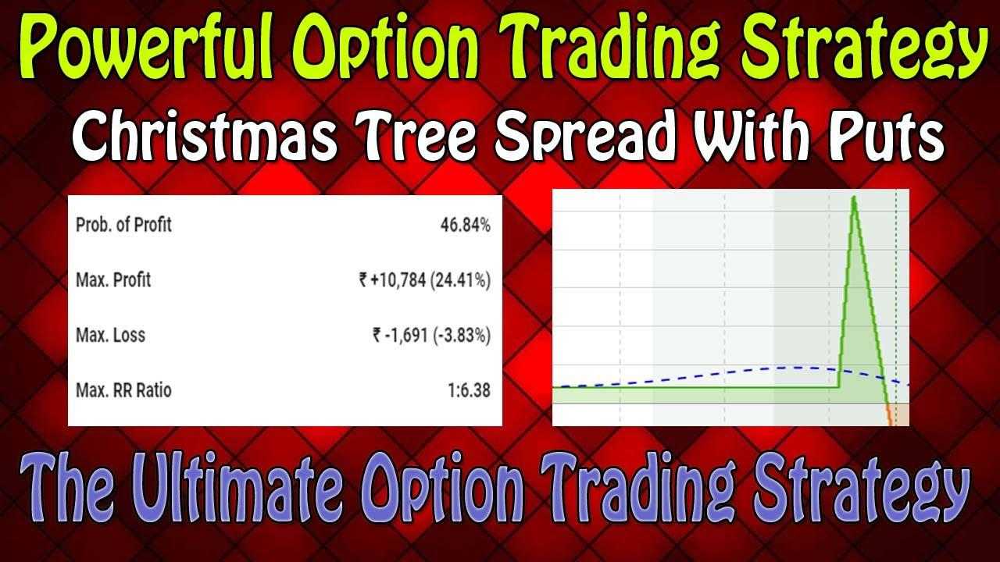

Options trading presents a multitude of strategies designed to help traders optimize their investment returns. Among these strategies, the Christmas Tree Options Strategy stands out for its complexity and distinctive advantages. Recognized for its intricate payoff structure, this strategy offers traders a way to manage risk while potentially capturing profits from market movements.

The Christmas Tree Strategy incorporates financial derivatives and can be applied through both call and put options. By taking advantage of price movements within a defined framework, it provides traders with flexible scenarios for both bullish and bearish market outlooks. The unique configuration of the strategy involves a combination of long and short positions, which can be visualized in its tree-like payoff diagram.



This article examines the mechanics behind the Christmas Tree Strategy and its applications within the field of algorithmic trading. As financial markets become increasingly fast-paced and data-driven, the integration of automated trading systems is crucial for the efficient execution of complex strategies. Traders can benefit from automation by implementing predefined rules, allowing them to focus on enhancing their trading strategies instead of manual execution.

The Christmas Tree Strategy serves as a potentially valuable tool for both novice and seasoned traders. By understanding its structure and employing it within an algorithmic framework, traders can enhance their capability to capture market opportunities and manage risks effectively.

## Table of Contents

## Understanding the Christmas Tree Strategy

The Christmas Tree Strategy in options trading is a sophisticated approach that leverages a combination of options to respond to specific market forecasts. It employs a spread consisting of six options, typically either calls or puts, allowing it to cater to neutral, bullish, or bearish market conditions. This flexibility is due to its construction method, which enables traders to tailor the strategy according to their market outlook.

The structure of the Christmas Tree Strategy involves a long vertical spread and two short vertical spreads. More specifically, in the construction of a Christmas Tree Strategy using calls, a trader would initiate a long call spread by purchasing a call option at a specific strike price (often at-the-money), followed by the sale of three call options at a higher strike price. Additionally, the strategy is completed by buying two more call options at an even higher strike price. This arrangement of buying and selling options results in a distinctive payoff diagram that resembles the branches of a Christmas tree, hence the name.

Mathematically, if $C_1, C_2, C_3, C_4,$ and $C_5$ are the option premiums for the corresponding call options at different strike prices, the payoff structure for a Christmas Tree can be represented as:

$$
\text{Net Premium} = - C_1 + 3 \times C_2 - 2 \times C_3
$$

The same structure can be mirrored using puts, allowing traders the option of constructing a short or bearish Christmas Tree by employing puts in a similar configuration. To do this with puts, the trader would initiate the strategy by buying a put option at a specific strike price, selling three puts at a lower strike, and then buying two puts at an even lower strike.

In summary, the Christmas Tree Strategy is not only recognized for its unique payoff diagram but also for its versatility. It can be adapted to both bullish (long Christmas Tree) and bearish (short Christmas Tree) market conditions. Its combination of a long vertical spread and two short vertical spreads allows traders to capitalize on small price movements of the underlying asset within a defined risk framework.

## Mechanics of the Christmas Tree Strategy

The Christmas Tree Options Strategy is a creative approach to options trading that involves a specific configuration of options contracts, designed to capitalize on certain market conditions. Constructing a Christmas Tree with call options involves the following steps:

1. **Buy an At-the-Money Call:** The first step requires purchasing one call option at the at-the-money (ATM) strike price. This option serves as the base for the strategy.

2. **Sell Three Calls at a Higher Strike:** Next, sell three call options at a higher strike price. This creates a vertical spread that limits the profit potential, while the collars offset some costs incurred from buying the ATM call.

3. **Buy Two Calls at an Even Higher Strike:** To complete the setup, buy two call options at a yet higher strike price. These long calls further cap the maximum risk and potential profit, while aiding in creating a symmetrical payoff profile.

Conversely, constructing a Christmas Tree with puts follows a parallel structure:

1. **Buy an At-the-Money Put:** Purchase one put option at the ATM strike price.

2. **Sell Three Puts at a Lower Strike:** Sell three put options at a lower strike, establishing a bearish vertical spread that controls the upside gain.

3. **Buy Two Puts at an Even Lower Strike:** Finish by buying two put options at an even lower strike price, balancing out the strategy with capped risk.

The Christmas Tree strategy is designed to generate profit from small price movements of the underlying asset. Maximum profit occurs when the underlying asset's price at expiration aligns with the middle strike price—specifically, the price at which the majority of calls or puts were sold.

Key elements for traders to master in deploying this strategy include careful selection of strike prices, choosing appropriate expiration dates, and precise premium calculations. The understanding of these components is crucial as they directly affect the risk-reward balance. While setting up the strategy, a trader should consider the potential outcomes and their probabilities to ensure alignment with financial goals and market outlook.

For a more hands-on illustration, here is a simple Python snippet to calculate potential outcomes:

```python
def calculate_profit(S, K1, K2, K3, C1, C2, C3):
    """
    S: Spot price at expiration
    K1, K2, K3: Strike prices (K1 < K2 < K3)
    C1, C2, C3: Premiums for long ATM, middle (short), and high strike (long) calls respectively
    """
    if S <= K1:
        return C1 + C2 + C3  # Loss limited to premium paid
    elif K1 < S <= K2:
        return (S - K1) - 3*(S - K2) + C1 + C2 + C3  # Profit between strike prices
    elif K2 < S <= K3:
        return (S - K1) - 3*(S - K2) + 2*(S - K3) + C1 + C2 + C3  # Further adjustments
    else:
        return 2*(K3 - K2) - K1 + 2*C1 + 2*C2 + 2*C3  # Profit capped beyond K3

# Example usage:
profit = calculate_profit(S=105, K1=100, K2=110, K3=120, C1=5, C2=2, C3=0.5)
print("Profit at expiration:", profit)
```

Note: S denotes the spot price at expiration, and K1, K2, K3 the strike prices. C1, C2, C3 are the premiums. By simulating various spot prices, traders can visualize how profits change with the underlying asset's movement, solidifying their understanding of the strategy's mechanics.

## Examples and Applications

For a Long Christmas Tree with Calls, the trader would initiate the position by buying one call option at a specific strike price, selling three call options at a higher strike, and then buying two more call options at an even higher strike. This arrangement creates a strategic spread where the trader seeks to capitalize on slight upward movements in the underlying asset's price. The goal is to generate profit when the asset closes near the middle strike price at expiration. This setup results in a distinctive profit-loss graph, shaped like a Christmas tree.

Conversely, a Short Christmas Tree with Puts involves selling one put option at a certain strike price, buying three put options at a lower strike, and then selling two puts at an even lower strike. The strategy aims to benefit from minor downward movements of the underlying asset, with optimal profit achieved when the asset value nears the middle strike at the expiration point.

These strategies can be customized according to market conditions, investor outlook, and risk tolerance. For example, a trader anticipating a steady rise in the market might favor a Long Christmas Tree with Calls, whereas a trader expecting a slight decline might opt for a Short Christmas Tree with Puts. This adaptability allows traders to fine-tune their positions to fit various market scenarios and personal risk profiles.

In real market applications, technology plays a vital role in executing these complex strategies efficiently. Advanced trading platforms can manage the myriad of trades required by a Christmas Tree Strategy. For instance, using Python-coded algorithms, traders can automate the process of monitoring price movements and executing orders to conform to the desired payoff structure.

Here is a basic outline of how a Python script could be used to manage a Long Christmas Tree with Calls:

```python
from datetime import datetime
import pandas as pd

# Sample market data for call options
options_data = pd.DataFrame({
    'strike': [100, 105, 110, 115],
    'price': [5, 3, 2, 1]
})

# Define a function to evaluate the strategy
def evaluate_christmas_tree_call(options, underlying_price):
    long_call = options.loc[options['strike'] == 100, 'price'].values[0]
    short_calls = 3 * options.loc[options['strike'] == 110, 'price'].values[0]
    long_calls = 2 * options.loc[options['strike'] == 115, 'price'].values[0]
    total_cost = long_call - short_calls + long_calls

    # Calculate profit/loss
    if underlying_price < 110:
        profit = max(0, (underlying_price - 100)) - total_cost
    else:
        profit = max(0, (underlying_price - 115)) - total_cost

    return profit

# Example evaluation at expiration
underlying_prices = [95, 100, 105, 110, 115, 120]
profits = [evaluate_christmas_tree_call(options_data, price) for price in underlying_prices]

for price, profit in zip(underlying_prices, profits):
    print(f"Underlying price: {price}, Profit: {profit:.2f}")
```

This Python code snippet demonstrates a method to evaluate the potential profitability of a Long Christmas Tree Strategy based on different underlying asset prices. By incorporating such automated systems, traders can enhance their ability to implement intricate trading strategies like the Christmas Tree, improving accuracy and responsiveness to market changes.

## Algorithmic Trading and Automation

Algorithmic trading facilitates the implementation of the Christmas Tree Options Strategy by automating complex tasks that would otherwise require significant manual intervention. Utilizing algorithms, traders can perform repetitive tasks efficiently, such as calculating optimal entry and [exit](/wiki/exit-strategy) points, based on predefined strategies. 

For instance, a key advantage of [algorithmic trading](/wiki/algorithmic-trading) is its real-time monitoring capability, continuously assessing market conditions to adapt the strategy as needed. This adaptability ensures that the Christmas Tree Strategy maintains its intended payoff structure, aiming to maximize potential returns while controlling risk exposure.

To achieve precision, traders can leverage programming languages like Python to code their trading algorithms. Using libraries such as pandas for data manipulation and numpy for numerical calculations, an automated system can handle large volumes of data and execute trades under strict criteria. Below is a basic example in Python to illustrate how one might set up a trading algorithm for executing a Christmas Tree Strategy using calls:

```python
import numpy as np
import pandas as pd

def monitor_market(prices, lower_bound, middle_bound, upper_bound):
    # Check whether market conditions are favorable
    current_price = prices[-1]  # Assume prices is a list of recent prices
    if lower_bound < current_price < upper_bound:
        if middle_bound - 5 < current_price < middle_bound + 5:
            return "Execute Trade"
    return "Hold"

# Example price data
historical_prices = np.array([100, 102, 101, 103, 104])
lower_strike = 95
middle_strike = 100
upper_strike = 110

# Decide whether to act based on current market conditions
trade_decision = monitor_market(historical_prices, lower_strike, middle_strike, upper_strike)

print(trade_decision)
```

This script illustrates a rudimentary decision-making process that could be expanded to include more sophisticated logic and integration with brokerage APIs for automated order execution. The automation significantly reduces the risk of human error and ensures trades are executed precisely when the market conditions align with the predetermined strategy.

Moreover, algorithmic trading frees traders from being tethered to their computer screens by automating execution, thus providing more time for analyzing and developing new strategies. Predefined criteria and systematic processes enable traders to focus on the creative aspects of trading strategy development while maintaining confidence in the execution fidelity of the Christmas Tree Options Strategy.

## Conclusion

The Christmas Tree Options Strategy represents a sophisticated approach for traders aiming to capitalize on market movements, with a well-defined risk-reward framework. This strategy, characterized by its use of multiple spread positions, allows traders to articulate their market views with precision, be they bullish, bearish, or neutral. By effectively combining long and short options positions, market participants can construct scenarios that align with their risk appetites and market outlooks.

Incorporating algorithmic trading with this strategy enhances traders' capabilities, offering a high degree of accuracy and efficiency in executing trades. Algorithmic systems can automate complex tasks such as monitoring real-time market data, executing multi-leg trades, and adjusting positions as necessary. This technological intervention minimizes human error, allowing traders to focus on strategy refinement and decision-making rather than executional logistics. For instance, utilizing Python libraries like `pandas` and `NumPy`, traders can develop scripts to backtest this strategy under various market conditions, fine-tune parameters, and optimize their approach before committing real capital.

Understanding the nuances and inherent risks in the Christmas Tree Strategy is essential. Market unpredictability, option premium changes, and expiration dynamics must be thoroughly evaluated. Each component of the strategy—defined by specific strike prices and expiration—influences the overall effectiveness and profitability. Missteps in these parameters can lead to unfavorable outcomes, which highlights the importance of a calculated approach to this particular strategy.

Whether deployed with a bullish, bearish, or neutral stance, the Christmas Tree Options Strategy remains a valuable tool in the trader's arsenal. When strategically combined with algorithmic trading, it offers a structured path to navigate the complexities of financial markets, enabling traders to manage risk effectively while potentially capturing profitable opportunities. Understanding these mechanics and diligently applying them can transform the Christmas Tree Strategy from a theoretical construct into a practical asset in any trader's toolkit.

## References & Further Reading

[1]: Hull, J. C. (2017). ["Options, Futures, and Other Derivatives"](https://www.semanticscholar.org/paper/Options%2C-Futures%2C-and-Other-Derivatives-Hull/89bdee500c8623864fc9eb7a471546aa713acc44), 10th Edition. Pearson. 

[2]: CBOE. (2020). ["Understanding Options Strategies: Christmas Tree Spreads with Calls."](https://cdn.cboe.com/resources/options/Trading_Strategies.pdf) CBOE Exchange.

[3]: Natenberg, S. (1994). ["Option Volatility and Pricing: Advanced Trading Strategies and Techniques."](https://www.amazon.com/Option-Volatility-Pricing-Strategies-Techniques/dp/0071818774) McGraw-Hill Education.

[4]: Chan, E. (2008). ["Quantitative Trading: How to Build Your Own Algorithmic Trading Business."](https://github.com/ftvision/quant_trading_echan_book) Wiley Finance.

[5]: Pardo, R. (2008). ["The Evaluation and Optimization of Trading Strategies."](https://onlinelibrary.wiley.com/doi/book/10.1002/9781119196969) Wiley Trading.