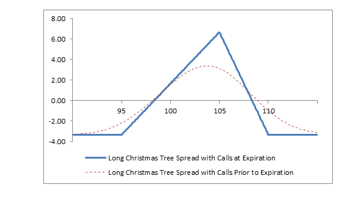

## Table of Contents

## What is the Christmas Tree Options Strategy?

The Christmas Tree Options Strategy is a complex trading approach used by investors to potentially profit from a stock's price movement. It involves buying and selling multiple options contracts with different strike prices, usually set up in a specific pattern that resembles a Christmas tree. This strategy is typically used when an investor has a neutral to slightly bullish outlook on the underlying stock. The idea is to create a position that can benefit from a small upward move in the stock price while also limiting potential losses if the stock price stays the same or drops slightly.

To set up a Christmas Tree Options Strategy, an investor typically buys one in-the-money call option, sells two at-the-money call options, and buys one out-of-the-money call option. The strike prices of these options are arranged in a way that forms the "tree" shape. The goal is to collect a net credit from the premiums of the options sold, which helps offset the cost of the options bought. This strategy can be profitable if the stock price stays within a certain range, but it also comes with risks, as significant moves in either direction can lead to losses. It's important for investors to understand the potential outcomes and risks before using this strategy.

## How does the Christmas Tree Options Strategy work?

The Christmas Tree Options Strategy is a way to trade options that can make money if a stock stays in a certain price range. It's called a "Christmas tree" because the options are set up in a pattern that looks like a tree. To do this, you buy one call option that's already in the money, sell two call options that are right at the current stock price, and buy one more call option that's out of the money. The goal is to get more money from selling the two middle options than you spend on buying the other two. This way, you start with some money in your pocket, which is called a net credit.

This strategy can work well if the stock price doesn't move too much. If the stock stays about the same or goes up a little bit, you can make money from the net credit you got at the start. But, there are risks too. If the stock price moves a lot in either direction, you could lose money. If it goes up a lot, the options you sold could cost you more than the money you made from the net credit. If it goes down a lot, the options you bought might not be worth much. So, it's important to know the stock well and understand that this strategy is best for times when you think the stock will stay pretty steady.

## What are the key components of the Christmas Tree Options Strategy?

The Christmas Tree Options Strategy involves buying and selling different options to make money if a stock stays in a certain price range. To set it up, you buy one call option that's in the money, which means the stock price is already higher than the price at which you can buy the stock with the option. Then, you sell two call options that are at the money, meaning the stock price is right at the price where you can buy the stock with those options. Finally, you buy one more call option that's out of the money, meaning the stock price would need to go up more for that option to be worth using. This setup looks like a tree because of how the strike prices are arranged.

The goal of this strategy is to get more money from selling the two middle options than you spend on buying the other two. This extra money is called a net credit, and it's like starting with some profit. The strategy can work well if the stock price doesn't move too much. If the stock stays about the same or goes up a little, you can keep the net credit as profit. But, there are risks too. If the stock price moves a lot in either direction, you could lose money. If it goes up a lot, the options you sold could cost you more than the net credit. If it goes down a lot, the options you bought might not be worth much. So, it's important to understand these risks and use this strategy when you think the stock will stay pretty steady.

## What are the potential benefits of using the Christmas Tree Options Strategy?

One of the main benefits of using the Christmas Tree Options Strategy is that it can help you make money if the stock price stays in a certain range. When you set up this strategy, you get to keep some money right away, called a net credit. This means you start with some profit, which is great if the stock price doesn't move much. If the stock stays steady or goes up just a little bit, you can keep that net credit as your gain. This can be really useful if you think the stock will not move a lot in either direction.

However, there are also risks to consider. If the stock price moves a lot, either up or down, you could lose money. If it goes up a lot, the options you sold might cost you more than the net credit you received. If it goes down a lot, the options you bought might not be worth much. So, this strategy works best when you have a good understanding of the stock and believe it will stay in a certain price range. It's important to weigh these potential benefits against the risks before deciding to use this strategy.

## What are the risks associated with the Christmas Tree Options Strategy?

The Christmas Tree Options Strategy comes with some risks that you should know about. If the stock price goes up a lot, you could lose more money than the net credit you got when you set up the strategy. This happens because the two call options you sold at the money could end up being worth a lot more than you expected, and you'd have to buy them back at a higher price. So, if the stock price shoots up, you might lose money even though you started with some profit from the net credit.

Another risk is if the stock price drops a lot. When this happens, the in-the-money and out-of-the-money call options you bought might lose value and not be worth much. This means you won't be able to make money from those options, and you could end up losing the money you spent on them. So, this strategy works best when the stock price stays pretty steady, but if it moves a lot in either direction, you could face losses.

## How do you set up a Christmas Tree Options Strategy?

To set up a Christmas Tree Options Strategy, you need to buy and sell different call options. Start by buying one call option that's in the money. This means the stock price is already higher than the price at which you can buy the stock with the option. Then, sell two call options that are at the money, which means the stock price is right at the price where you can buy the stock with those options. Finally, buy one more call option that's out of the money, meaning the stock price would need to go up more for that option to be worth using. The strike prices of these options should be arranged to look like a tree.

When you set up this strategy, you aim to get more money from selling the two middle options than you spend on buying the other two. This extra money is called a net credit, and it's like starting with some profit. The strategy can work well if the stock price doesn't move too much. If the stock stays about the same or goes up a little, you can keep the net credit as your gain. But remember, there are risks too. If the stock price moves a lot in either direction, you could lose money. So, it's important to use this strategy when you think the stock will stay pretty steady.

## What are the ideal market conditions for implementing the Christmas Tree Options Strategy?

The Christmas Tree Options Strategy works best when the stock price doesn't move too much. If you think the stock will stay pretty steady or go up just a little bit, this strategy can help you make money. When you set it up, you get some money right away, called a net credit. This means you start with some profit, which is great if the stock price stays in a certain range.

But, if the stock price moves a lot, either up or down, you could lose money. If it goes up a lot, the options you sold might cost you more than the net credit you received. If it goes down a lot, the options you bought might not be worth much. So, it's important to use this strategy when you believe the stock will not move a lot in either direction.

## How does the Christmas Tree Options Strategy compare to other options strategies?

The Christmas Tree Options Strategy is a bit different from other options strategies because it involves buying and selling multiple options in a specific way. It's like a mix of a bull call spread and a butterfly spread. In a bull call spread, you buy one call option and sell another at a higher strike price to make money if the stock goes up a bit. A butterfly spread uses three strike prices and can make money if the stock stays in a narrow range. The Christmas Tree strategy is more complex because it involves four options, and it's set up to make money if the stock stays steady or goes up a little. It gives you a net credit at the start, which is like starting with some profit.

Compared to simpler strategies like buying a single call or put option, the Christmas Tree strategy can be riskier but also potentially more rewarding if the stock behaves as expected. Buying a call option is straightforward—you make money if the stock goes up. Buying a put option is the opposite—you make money if the stock goes down. These strategies are easier to understand and set up, but they don't give you the net credit that the Christmas Tree strategy does. On the other hand, if the stock moves a lot, the Christmas Tree strategy could lose more money than a simple call or put option. So, it's important to choose the right strategy based on what you think the stock will do and how much risk you're willing to take.

## What are some real-world examples of the Christmas Tree Options Strategy in use?

Imagine you own a stock that's trading at $50 per share, and you think it will stay around that price or maybe go up a little over the next month. You decide to use the Christmas Tree Options Strategy to make some money from this. So, you buy one call option with a strike price of $45 (in the money), sell two call options with a strike price of $50 (at the money), and buy one call option with a strike price of $55 (out of the money). You get a little bit of money right away from selling the two middle options, which is your net credit. If the stock stays around $50 or goes up to $52, you keep that net credit as your profit. But if the stock jumps to $60 or drops to $40, you could lose money because the options you sold or bought might not work out as planned.

Another example could be if you're watching a stock that's currently at $100 and you believe it will stay close to that price for the next few weeks. You set up the Christmas Tree Options Strategy by buying one call option with a strike price of $95, selling two call options with a strike price of $100, and buying one call option with a strike price of $105. You get a net credit from this setup, which is like starting with some profit. If the stock stays around $100 or goes up to $102, you can keep that net credit. But if the stock price moves a lot, either up to $110 or down to $90, you could end up losing money because the options you sold or bought might not be worth what you expected.

## How can you adjust the Christmas Tree Options Strategy to maximize profits or minimize losses?

To adjust the Christmas Tree Options Strategy to maximize profits or minimize losses, you need to pay close attention to how the stock is moving. If the stock price starts to go up more than you expected, you might want to buy back the two call options you sold at the money. This can help you avoid big losses if the stock keeps going up. Also, if the stock goes up a lot, you could sell the in-the-money call option you bought at a higher price to make more money. It's all about watching the stock and making quick decisions to protect your profits or cut your losses.

On the other hand, if the stock price starts to drop a lot, you might want to sell the in-the-money call option you bought to get some money back before it loses all its value. You could also think about buying back the two at-the-money call options you sold, but this might cost you more money than you want to spend. The key is to keep an eye on the stock and be ready to make changes to your strategy if things aren't going as planned. By being flexible and making smart adjustments, you can try to make the most money or lose the least amount possible.

## What advanced techniques can be used to enhance the effectiveness of the Christmas Tree Options Strategy?

One advanced technique to enhance the effectiveness of the Christmas Tree Options Strategy is to use delta hedging. Delta is a measure of how much an option's price changes when the stock price changes. By watching the delta of your options, you can buy or sell more options to balance out your position. If the stock starts moving more than you expected, you can use delta hedging to make adjustments and protect your profits or limit your losses. This can help you keep the strategy working well even when the stock price starts to move around a lot.

Another technique is to use time decay to your advantage. Options lose value as they get closer to their expiration date, and this is called time decay. You can set up your Christmas Tree Strategy so that the options you sell have a shorter time until expiration than the options you buy. This way, the options you sold lose value faster, which can increase your net credit and help you make more money if the stock stays in the right range. By understanding and using time decay, you can make the strategy more effective and increase your chances of making a profit.

## How can you evaluate the performance of a Christmas Tree Options Strategy over time?

To evaluate the performance of a Christmas Tree Options Strategy over time, you need to keep track of how much money you made or lost from each trade. Look at the net credit you got when you set up the strategy and see if you were able to keep that money or if you had to give it back because the stock moved too much. Also, check how often the stock stayed in the price range you expected. If it usually stayed steady or went up a little, your strategy might be working well. But if the stock often moved a lot in either direction, you might need to adjust your strategy or try something different.

Another way to evaluate the strategy is to compare it to other options strategies you've used. See if the Christmas Tree Strategy gives you more profit or less loss than simpler strategies like buying a single call or put option. You can also look at the risk and reward of each trade. If you're making good money but also taking big risks, you might want to find a way to reduce those risks. By keeping a record of your trades and analyzing the results, you can figure out if the Christmas Tree Options Strategy is a good fit for your trading style and the stocks you're interested in.

## What is the Christmas Tree Strategy and how can it be understood?

The Christmas Tree Strategy in options trading is a sophisticated approach that leverages a combination of options to respond to specific market forecasts. It employs a spread consisting of six options, typically either calls or puts, allowing it to cater to neutral, bullish, or bearish market conditions. This flexibility is due to its construction method, which enables traders to tailor the strategy according to their market outlook.

The structure of the Christmas Tree Strategy involves a long vertical spread and two short vertical spreads. More specifically, in the construction of a Christmas Tree Strategy using calls, a trader would initiate a long call spread by purchasing a call option at a specific strike price (often at-the-money), followed by the sale of three call options at a higher strike price. Additionally, the strategy is completed by buying two more call options at an even higher strike price. This arrangement of buying and selling options results in a distinctive payoff diagram that resembles the branches of a Christmas tree, hence the name.

Mathematically, if $C_1, C_2, C_3, C_4,$ and $C_5$ are the option premiums for the corresponding call options at different strike prices, the payoff structure for a Christmas Tree can be represented as:

$$
\text{Net Premium} = - C_1 + 3 \times C_2 - 2 \times C_3
$$

The same structure can be mirrored using puts, allowing traders the option of constructing a short or bearish Christmas Tree by employing puts in a similar configuration. To do this with puts, the trader would initiate the strategy by buying a put option at a specific strike price, selling three puts at a lower strike, and then buying two puts at an even lower strike.

In summary, the Christmas Tree Strategy is not only recognized for its unique payoff diagram but also for its versatility. It can be adapted to both bullish (long Christmas Tree) and bearish (short Christmas Tree) market conditions. Its combination of a long vertical spread and two short vertical spreads allows traders to capitalize on small price movements of the underlying asset within a defined risk framework.

## References & Further Reading

[1]: Hull, J. C. (2017). ["Options, Futures, and Other Derivatives"](https://www.semanticscholar.org/paper/Options%2C-Futures%2C-and-Other-Derivatives-Hull/89bdee500c8623864fc9eb7a471546aa713acc44), 10th Edition. Pearson. 

[2]: CBOE. (2020). ["Understanding Options Strategies: Christmas Tree Spreads with Calls."](https://cdn.cboe.com/resources/options/Trading_Strategies.pdf) CBOE Exchange.

[3]: Natenberg, S. (1994). ["Option Volatility and Pricing: Advanced Trading Strategies and Techniques."](https://www.amazon.com/Option-Volatility-Pricing-Strategies-Techniques/dp/0071818774) McGraw-Hill Education.

[4]: Chan, E. (2008). ["Quantitative Trading: How to Build Your Own Algorithmic Trading Business."](https://github.com/ftvision/quant_trading_echan_book) Wiley Finance.

[5]: Pardo, R. (2008). ["The Evaluation and Optimization of Trading Strategies."](https://onlinelibrary.wiley.com/doi/book/10.1002/9781119196969) Wiley Trading.