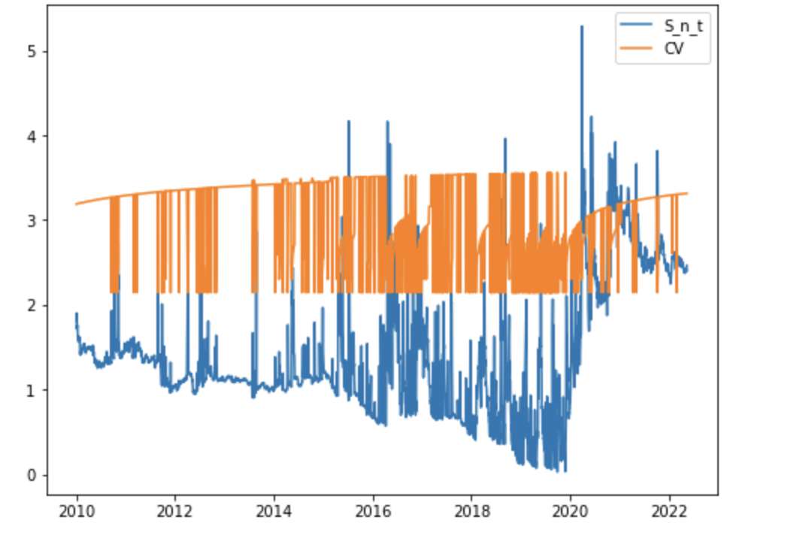

## Table of Contents

## What is the Chu-Stinchcombe-White CUSUM test?

The Chu-Stinchcombe-White CUSUM test is a statistical tool used to check if a model's predictions are stable over time. It helps us see if the way we predict things stays the same or if it changes. This test is important because if a model's predictions start changing unexpectedly, it might mean the model is no longer working well and needs to be updated.

The test works by looking at the differences between what the model predicts and what actually happens. It adds up these differences over time and checks if they get too big. If they do, it suggests that the model's predictions are not stable anymore. This method is called CUSUM, which stands for Cumulative Sum, because it keeps a running total of the differences.

## What are the main purposes of using the Chu-Stinchcombe-White CUSUM test?

The main purpose of using the Chu-Stinchcombe-White CUSUM test is to check if a model's predictions stay the same over time. Imagine you have a model that helps predict things like the weather or stock prices. You want to make sure that the way it makes predictions doesn't change suddenly. If it does, the model might not be useful anymore. The CUSUM test helps you find out if the model's predictions are getting worse or if they're still good.

Another important reason to use the CUSUM test is to see if there are any big changes in how well the model is doing. Sometimes, things in the world change, like new laws or big events, and these can affect what the model is trying to predict. The CUSUM test can spot these changes by looking at the differences between what the model says will happen and what actually happens. If these differences start to add up a lot, it's a sign that something has changed and the model might need to be updated.

## How does the Chu-Stinchcombe-White CUSUM test differ from other CUSUM tests?

The Chu-Stinchcombe-White CUSUM test is a special version of the CUSUM test that's used to check if a model's predictions stay the same over time. It's different from other CUSUM tests because it's made to work with models that predict things, like weather or stock prices. Other CUSUM tests might be used to check if things like the average of a set of numbers changes over time, but the Chu-Stinchcombe-White test focuses on how well a model keeps predicting things right.

One big difference is that the Chu-Stinchcombe-White test looks at the difference between what the model predicts and what actually happens. It adds up these differences over time and checks if they get too big. If they do, it means the model might not be working as well anymore. Other CUSUM tests might just look at the data itself without comparing it to a model's predictions. This makes the Chu-Stinchcombe-White test very useful for people who make and use prediction models, because it helps them know when their models need to be fixed or changed.

## What are the key components of the Chu-Stinchcombe-White CUSUM test?

The Chu-Stinchcombe-White CUSUM test has a few key parts that help it check if a model's predictions are stable over time. One important part is the difference between what the model predicts and what actually happens. This difference is called the residual. The test looks at these residuals over time to see if they are getting bigger or smaller. If the residuals start to add up and get too big, it means the model might not be working as well as it used to.

Another key component is the way the test adds up the residuals. It uses a method called the Cumulative Sum, or CUSUM, which keeps a running total of the residuals. The test keeps track of this total and checks if it goes above a certain limit. If it does, it's a sign that the model's predictions are not stable anymore. This helps people know when it's time to update their model to make sure it keeps working well.

## Can you explain the mathematical formula behind the Chu-Stinchcombe-White CUSUM test?

The Chu-Stinchcombe-White CUSUM test uses a simple formula to check if a model's predictions are stable. It looks at the difference between what the model predicts and what actually happens. This difference is called the residual. The test then adds up these residuals over time, keeping a running total. This total is what we call the Cumulative Sum, or CUSUM. The formula for the CUSUM at any point in time is the sum of all the residuals up to that point. If this total gets too big, it means the model's predictions might be changing and not working as well as before.

The test also uses something called a critical value. This is a number that we compare the CUSUM to. If the CUSUM goes above the critical value, it's a sign that the model's predictions are not stable anymore. The critical value helps us know when to start worrying about the model. So, the main part of the formula is just adding up the residuals, and then we check if this sum is bigger than the critical value. This way, we can keep an eye on the model and see if it needs to be updated.

## What types of data are suitable for the Chu-Stinchcombe-White CUSUM test?

The Chu-Stinchcombe-White CUSUM test is best used with data that comes from models that make predictions over time. This could be data about things like the weather, stock prices, or sales numbers. The test looks at the difference between what the model says will happen and what actually happens. So, the data should be in a time series format, where each piece of data is linked to a specific time.

For the test to work well, the data should be the kind where you expect the model's predictions to stay the same over time. If the model is supposed to predict the weather for next week, the test can help check if the model's predictions are still good or if they are starting to change. The data should be continuous and have enough points in time to see if there are any big changes in the model's performance.

## How do you interpret the results of the Chu-Stinchcombe-White CUSUM test?

When you use the Chu-Stinchcombe-White CUSUM test, you are looking to see if a model's predictions are staying the same over time. The test adds up the differences between what the model predicts and what actually happens. These differences are called residuals. If the total of these residuals, or the CUSUM, stays small, it means the model's predictions are still good and haven't changed much. But if the CUSUM gets too big and goes above a certain limit called the critical value, it's a sign that the model's predictions might not be as good as they used to be.

When the CUSUM goes above the critical value, it tells you that something might be wrong with the model. It could mean that the way the model makes predictions is changing, or that something in the world has changed and the model can't predict things as well anymore. If you see this happen, it's a good idea to check the model and maybe update it to make sure it keeps working well. The CUSUM test helps you keep an eye on the model and know when it's time to make some changes.

## What are the common applications of the Chu-Stinchcombe-White CUSUM test in various fields?

The Chu-Stinchcombe-White CUSUM test is used in many different fields where people need to make sure their models keep working well over time. For example, in finance, people use models to predict stock prices or how much money they might make from investments. The CUSUM test helps them check if these models are still good at predicting things or if they need to be changed. If the test shows that the model's predictions are getting worse, they know it's time to update the model to keep making good guesses about the future.

Another field where the CUSUM test is helpful is in weather forecasting. Weather models predict things like rain, temperature, and storms. The CUSUM test can tell if these models are still working well or if they are starting to miss the mark. If the test shows that the residuals, or the difference between the model's predictions and what actually happens, are getting too big, it means the model might need to be updated. This helps make sure that weather forecasts stay accurate and reliable.

In the field of economics, the CUSUM test is also very useful. Economists use models to predict things like how much people will spend, how many jobs there will be, or how fast the economy will grow. The CUSUM test helps them see if these models are still good at making predictions or if they need to be adjusted. If the test shows that the model's predictions are not stable anymore, economists can update their models to make sure they keep giving useful information about the economy.

## How can one implement the Chu-Stinchcombe-White CUSUM test in statistical software like R or Python?

To implement the Chu-Stinchcombe-White CUSUM test in R, you first need to calculate the residuals, which are the differences between the model's predictions and the actual values. You can do this by running your model and then using the residuals function. Next, you'll need to add up these residuals over time to get the CUSUM. You can do this using a simple loop or by using the cumsum function in R. After you have the CUSUM, you need to compare it to a critical value to see if it's too big. You can use a function like qnorm to find the critical value based on the number of data points you have. If the CUSUM goes above this critical value, it means the model's predictions might not be stable anymore, and you should think about updating the model.

In Python, implementing the Chu-Stinchcombe-White CUSUM test is similar. First, you run your model and calculate the residuals using the model's predict method and then subtracting the actual values. To get the CUSUM, you can use a loop or the numpy.cumsum function to add up the residuals over time. Once you have the CUSUM, you need to compare it to a critical value. You can use scipy.stats.norm.ppf to find the critical value based on your data's size. If the CUSUM exceeds this critical value, it suggests that the model's predictions are no longer stable, and you might need to update the model to keep it working well.

## What are the limitations and potential pitfalls of using the Chu-Stinchcombe-White CUSUM test?

The Chu-Stinchcombe-White CUSUM test can be really helpful, but it's not perfect and has some limitations. One big problem is that it might give false alarms. This means it might say your model's predictions are changing when they're actually still good. This can happen if there are random changes in the data that aren't really important. Another issue is that the test can be slow to notice when things really do change. If the change in the model's predictions is small or happens slowly, the CUSUM test might not see it right away. This means you might keep using a model that's not working as well as it should.

Another thing to watch out for is choosing the right critical value. If you set it too low, the test might tell you to update your model too often, which can be a waste of time. If you set it too high, you might miss when the model really does need to be updated. Also, the CUSUM test works best with a lot of data. If you don't have enough data points, the test might not be very accurate. So, it's important to make sure you have enough data before you start using the test to check your model's predictions.

## How does the Chu-Stinchcombe-White CUSUM test handle structural breaks in time series data?

The Chu-Stinchcombe-White CUSUM test is useful for spotting changes in how well a model predicts things, which can happen because of something called a structural break. A structural break is when the rules that the data follows change suddenly, like when a new law affects the economy or a big event changes the weather patterns. The CUSUM test looks at the differences between what the model says will happen and what actually happens. If these differences start to add up a lot, it might mean there's a structural break, and the model needs to be updated to keep working well.

But the CUSUM test isn't perfect at finding these structural breaks. It can sometimes miss small changes or changes that happen slowly over time. Also, it might give false alarms, saying there's a structural break when there isn't one, especially if the data has a lot of random ups and downs. So, while the CUSUM test can help you spot when a model's predictions start to go wrong because of a structural break, you need to be careful and use other ways to check if the test is right.

## What recent advancements or modifications have been made to the Chu-Stinchcombe-White CUSUM test?

Recently, there have been some new ideas to make the Chu-Stinchcombe-White CUSUM test even better. One big change is using something called [machine learning](/wiki/machine-learning) to help the test work more accurately. Machine learning can look at a lot of data and find patterns that the regular CUSUM test might miss. This can help the test spot when a model's predictions start to change more quickly and with fewer false alarms. Another change is making the test more flexible so it can work with different kinds of data, not just the usual time series data. This means the test can be used in more places and for more types of models.

Another advancement is using something called bootstrap methods with the CUSUM test. Bootstrap methods help by making lots of pretend sets of data that are similar to the real data. This helps the test figure out what the critical value should be more accurately. This can make the test more reliable because it's less likely to say there's a problem with the model when there isn't one. These new ideas are making the Chu-Stinchcombe-White CUSUM test more useful and helping people keep their models working well over time.

## What is the Chu-Stinchcombe-White CUSUM Test?

The Chu-Stinchcombe-White CUSUM test, also known as the CSW CUSUM test, is an advanced statistical technique designed to identify deviations from expected market behavior. This test was developed by Homm and Breitung to enhance the detection of structural breaks within financial time series data.

Fundamentally, the CSW CUSUM test leverages cumulative sum control charts to analyze statistical data. This involves monitoring the cumulative sum of deviations from a target value over time to determine whether these cumulatively exceed a predetermined threshold. When compared against a reference distribution of white noise, substantial divergences from the anticipated behavior can be indicative of significant structural breaks. Such analysis enables traders to detect these breaks early, facilitating timely adaptations in trading strategies.

The mathematical foundation of the CSW CUSUM test can be understood by considering the cumulative sum $S_t$ at time $t$, which is calculated as:

$$
S_t = \sum_{i=1}^{t} (X_i - \mu)
$$

where $X_i$ represents the observed values of the financial data, and $\mu$ denotes the target or expected mean level. The test identifies a structural break when the cumulative sum exceeds the control limits, adjusted according to the statistical properties of the observed data.

By employing the Chu-Stinchcombe-White CUSUM test, traders can precisely identify the timing of structural changes. This precise identification is crucial for maintaining the robustness of trading models, ensuring that they can adapt quickly to new market conditions and reduce the risk of financial loss due to unforeseen market behaviors.

## What is the implementation process in algorithmic trading?

Implementing the Chu-Stinchcombe-White CUSUM test in [algorithmic trading](/wiki/algorithmic-trading) hinges on a solid grasp of its statistical underpinnings. This test primarily employs the log-price of financial data, which helps in calculating the standardized departure of observed values from expected trends. The log transformation serves to stabilize the variance of financial data, making it more amenable to statistical analysis.

When applying the Chu-Stinchcombe-White CUSUM test, the core idea is to detect deviations from the expected trajectory of asset prices. This is achieved by computing the cumulative sum of the standardized departures over time. Mathematically, this can be expressed as:

$$

C_t = \sum_{i=1}^{t} (e_i) 
$$

where $e_i$ is the error term derived from the difference between observed and expected log prices at time $i$.

Algorithmic trading systems can be configured to utilize these cumulative sums to detect significant deviations, which may indicate a structural break. Upon detecting such a break, advanced algorithms are capable of dynamically adjusting their trading models. This might involve recalibrating prediction models or reweighting portfolios to align with the new market conditions.

To illustrate the application in a practical setting, consider a scenario where an algorithm is calibrated to execute trades based on certain predictive models of financial time series. Incorporating the Chu-Stinchcombe-White CUSUM test allows the algorithm to monitor for structural breaks continuously. Once a significant break is detected, the algorithm can switch from a mean-reverting strategy to a [momentum](/wiki/momentum)-based one, allowing it to adapt quickly to market changes.

In Python, implementing such adaptability might involve using libraries like NumPy and SciPy to track the cumulative sums and identify breaks using a predefined threshold. Below is a simplified Python example:

```python
import numpy as np

def detect_breaks(log_prices, threshold):
    # Calculate errors based on expected trend
    errors = log_prices - np.mean(log_prices)
    # Compute cumulative sum of errors
    cumulative_sum = np.cumsum(errors)
    # Detect structural breaks
    breaks = np.where(np.abs(cumulative_sum) > threshold)[0]
    return breaks

# Example log prices
log_prices = np.log([100, 101, 99, 102, 100, 98, 103])
breaks = detect_breaks(log_prices, threshold=0.5)
print(f'Structural breaks detected at indices: {breaks}')
```

This code snippet demonstrates a basic approach to implementing the test. In real-world applications, more sophisticated mechanisms would need to be put in place to decide on threshold levels and integrate the results into trading decision-making processes.

The inclusion of the Chu-Stinchcombe-White CUSUM test in algorithmic trading platforms aids in quicker responses to market price changes. This agility can be particularly beneficial in high-frequency trading, where the early identification of structural shifts is crucial for maintaining competitive advantage.

## What are the advantages of using the CUSUM test?

The Chu-Stinchcombe-White CUSUM test provides significant advantages in the context of financial markets, particularly in algorithmic trading. One of the primary benefits is its robust predictive capabilities. By detecting early indicators of market shifts, traders can proactively adjust their strategies to accommodate new trends, minimizing potential negative impacts on their trades. This early identification is crucial in volatile markets, where timing is often critical.

Furthermore, the computational efficiency of the CUSUM test makes it exceptionally well-suited for high-frequency trading environments. In these scenarios, computational speed is paramount, and the ability to perform swift calculations allows for near real-time adjustments to trading algorithms. This efficiency is partly derived from the test's mathematical simplicity, as it essentially involves monitoring the cumulative sum of deviations from zero, expressed as:

$$
C_t = \sum_{i=1}^{t} (x_i - \mu)
$$

where $C_t$ is the cumulative sum at time $t$, $x_i$ represents the observed value, and $\mu$ is the mean of the series expected under the null hypothesis of no structural break.

By identifying and responding to structural breaks, traders can manage risks more effectively and potentially enhance returns. The ability to dynamically recognize when underlying assumptions of trading models are no longer valid can save significant time and resources that might otherwise be spent on post-analysis adjustments or re-optimization of models. This functionality enables traders to maintain an edge in rapidly changing financial markets.

## References & Further Reading

[1]: Chu, C.-S. J., Stinchcombe, M., & White, H. (1996). ["Monitoring Structural Change."](https://www.jstor.org/stable/2171955) Econometrica, 64(5), 1045-1065.

[2]: Homm, U., & Breitung, J. (2012). ["Testing for Speculative Bubbles in Stock Markets: A Comparison of Alternative Methods."](https://academic.oup.com/jfec/article-abstract/10/1/198/757787) Journal of Financial Econometrics, 10(1), 198-231.

[3]: López de Prado, M. (2018). ["Advances in Financial Machine Learning"](https://www.amazon.com/Advances-Financial-Machine-Learning-Marcos/dp/1119482089). Wiley.

[4]: Hudson, T., & Thames, C. "MlFinLab: Open Source Package for Financial Machine Learning."](https://hudsonthames.org/mlfinlab/) GitHub.

[5]: "Quantitative Finance Stack Exchange." [Quantitative Finance Q&A.](https://quant.stackexchange.com/)