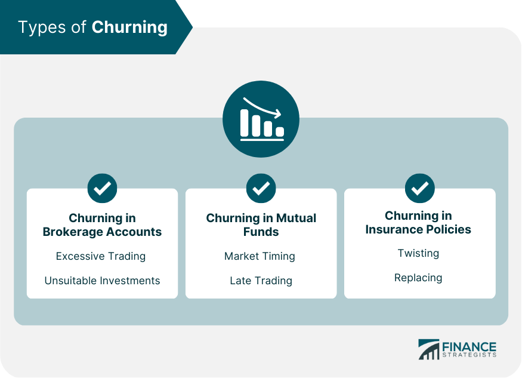

## Table of Contents

## What is churning in the context of finance?

Churning in finance happens when a broker or advisor trades a client's account too much. They do this to earn more commissions for themselves, not to help the client's investments grow. This is bad because it can lower the value of the client's investments due to high trading fees and taxes.

Churning is against the law. It's considered a type of fraud. If a client thinks their broker is churning their account, they can complain to the Financial Industry Regulatory Authority (FINRA) or the Securities and Exchange Commission (SEC). These organizations can investigate and take action against the broker if they find evidence of churning.

## How does churning affect investors?

Churning can hurt investors a lot. When a broker trades too much just to make more money for themselves, it can make the investor's account lose value. Every time a trade happens, the investor has to pay fees. These fees add up and can take away a big part of the investor's money. Also, if the investor has to pay taxes on the gains from these trades, it can make their situation even worse.

Over time, churning can stop an investor's portfolio from growing like it should. Instead of the money being used to buy good investments that can grow over time, it's being spent on fees and taxes. This can make it hard for the investor to reach their financial goals, like saving for retirement or buying a house. It's important for investors to watch their accounts and make sure their brokers are not churning.

## What are the legal implications of churning for financial advisors?

Churning is illegal and can get financial advisors in big trouble. It's considered a type of fraud because the advisor is not doing what's best for the client. They are trading too much just to make more money for themselves. If a client complains about churning, groups like the Financial Industry Regulatory Authority (FINRA) or the Securities and Exchange Commission (SEC) can look into it. If they find the advisor was churning, they can punish them.

The punishments for churning can be serious. The advisor might have to pay a big fine. They could also lose their license to work as a financial advisor. In some cases, they might even go to jail. This is why it's so important for advisors to follow the rules and always do what's best for their clients, not just for themselves.

## Can you explain the difference between high trading activity and churning?

High trading activity and churning both mean a lot of buying and selling in an investment account, but they are different. High trading activity can happen when an investor or their advisor is trying to make money by taking advantage of changes in the market. This kind of trading can be good if it is done to make the investor's money grow and if the investor knows about it and agrees to it.

Churning, on the other hand, is bad. It happens when a broker or advisor trades too much just to make more money for themselves through commissions. This is not good for the investor because it can make their account lose value because of high fees and taxes. Churning is against the law, and it's done without thinking about what's best for the investor.

## What are the signs that an account might be subject to churning?

If you see a lot of buying and selling in your investment account, it might be a sign of churning. Churning happens when a broker trades too much just to make more money for themselves through commissions. You might notice that your account is always busy with trades, even when the market isn't changing much. This can be a red flag that your broker might be churning your account.

Another sign is if your account is losing value even though the market is doing okay. This can happen because every trade costs money in fees, and these fees can add up quickly. If you're paying a lot in fees but not seeing your investments grow, it might mean your broker is churning your account. It's important to keep an eye on your account and ask questions if you see these signs.

## How can investors protect themselves from churning?

Investors can protect themselves from churning by keeping a close eye on their investment accounts. They should regularly check their account statements to see how often their broker is trading. If they see a lot of buying and selling, they should ask their broker why. It's important for investors to understand the reasons behind each trade and make sure it's meant to help their investments grow, not just to make money for the broker.

Another way to protect against churning is to have a clear agreement with the broker about how often they will trade. Investors can set limits on the number of trades or ask for approval before any trade is made. This can help stop the broker from trading too much without the investor knowing. Talking openly with the broker and setting these rules can help keep the investor's money safe and make sure it's being used to reach their financial goals.

## What role does the suitability rule play in preventing churning?

The suitability rule is important because it helps stop churning. This rule says that brokers must make sure any investment they suggest is right for the investor. They need to think about the investor's goals, how much risk they want to take, and how long they plan to invest. If a broker trades too much just to make more money for themselves, it's usually not good for the investor. The suitability rule helps make sure the broker is doing what's best for the investor, not just trying to earn more commissions.

If a broker follows the suitability rule, they will be less likely to churn an account. They will think about the investor's needs before making any trades. This means they won't trade too much just to make more money for themselves. By following this rule, brokers help keep the investor's money safe and make sure it's being used to reach their financial goals. If an investor thinks their broker is not following the suitability rule, they can complain to groups like FINRA or the SEC, who can look into it and take action if needed.

## How do regulatory bodies like the SEC and FINRA address churning?

Regulatory bodies like the SEC and FINRA work hard to stop churning. They do this by making rules that brokers have to follow. If someone complains about churning, the SEC and FINRA can look into it. They check the account to see if the broker was trading too much just to make more money for themselves. If they find out that the broker was churning, they can punish them. This can mean making the broker pay a fine, taking away their license to work as a broker, or even sending them to jail.

The SEC and FINRA also try to stop churning before it happens. They do this by making sure brokers know the rules and by checking on them to make sure they are following those rules. They also tell investors how to watch their accounts and what to do if they think their broker is churning. By doing all these things, the SEC and FINRA help keep investors safe and make sure brokers are doing what's best for their clients, not just trying to make more money for themselves.

## What are the quantitative measures used to detect churning, such as turnover ratio?

One way to spot churning is by looking at the turnover ratio. This is a number that shows how much of an account's money is being traded over a year. If the turnover ratio is high, it means the broker is trading a lot. A turnover ratio of more than six is often seen as a sign of churning. This is because it means the broker is trading the whole value of the account more than six times a year, which can be too much and not good for the investor.

Another measure is the cost-to-equity ratio. This looks at how much the investor is paying in trading costs compared to the total value of their account. If this ratio is high, it means the investor is losing a lot of money to fees. A cost-to-equity ratio of more than 2% is often seen as a warning sign of churning. These numbers help investors and regulators see if a broker is trading too much just to make more money for themselves, which can hurt the investor's account.

## How has technology and data analysis improved the detection of churning?

Technology and data analysis have made it easier to spot churning. Computers can now look at lots of trading data quickly. They can find patterns that might show a broker is trading too much just to make money for themselves. This helps regulatory bodies like the SEC and FINRA check accounts faster and catch brokers who are churning. It also helps investors keep an eye on their accounts and see if something doesn't look right.

With new tools, it's easier to calculate things like the turnover ratio and cost-to-equity ratio. These numbers help show if an account is being churned. Before, it was hard to keep track of all the trades and fees. Now, software can do this work and give clear reports. This makes it easier for investors to understand what's happening with their money and for regulators to take action if they find churning.

## What are some case studies or historical examples of churning in the financial industry?

One famous case of churning happened in the 1980s with a broker named Robert Brennan. He ran a brokerage firm called First Jersey Securities. Brennan was found guilty of churning the accounts of his clients to make more money for himself. He would trade their money a lot, even when it wasn't good for them. This made his clients lose a lot of money because of high fees and taxes. Brennan was eventually sent to jail for his actions, showing how serious the crime of churning is.

Another example is the case of Michael J. Caragine in the early 2000s. Caragine, a broker at Salomon Smith Barney, was caught churning the accounts of elderly clients. He made many trades in their accounts, not to help them make money, but to earn more commissions for himself. This hurt his clients' savings because they had to pay a lot in fees. Caragine was fined and banned from working in the financial industry, which shows how regulators like the SEC and FINRA work to protect investors from such practices.

## What are the current trends and future predictions regarding churning in finance?

Right now, the use of technology and data analysis is making it easier to catch churning. Computers can look at lots of trading data quickly and find patterns that might show a broker is trading too much just to make money for themselves. This helps groups like the SEC and FINRA check accounts faster and take action if they find churning. Also, more investors are learning about churning and how to spot it, which makes them more careful and less likely to be hurt by it.

In the future, we might see even better ways to stop churning. As technology keeps getting better, it will be easier to watch accounts and find problems quickly. New rules and better education for investors could also help. If more people know about churning and how to protect themselves, fewer brokers will try to do it. But, it's still important for investors to keep an eye on their accounts and ask questions if they see a lot of trading that doesn't make sense.

## What is Finance Churning: A Deep Dive?

Churning constitutes an egregious breach in the financial services industry, classified as an illegal maneuver where brokers conduct an excessive number of trades to inflate their commissions unjustifiably. This practice directly contravenes the principle of acting in the client's best interest as stipulated by regulatory bodies, such as the U.S. Securities and Exchange Commission (SEC).

The phenomenon of churning not only burdens investors with unnecessary transactional costs but also potentially erodes the value of their investments. Each unwarranted trade incurs commission fees and other expenses that, while benefiting the broker, eat into the investor's capital. Over time, the compounded effect of these expenses can be significant, leading to diminished overall returns for the investor.

Detecting churning poses a substantial challenge due to its subtle nature and the dynamic environment of the stock market. Determining what constitutes excessive trading can be subjective and requires a careful analysis of the investor's profile, objectives, and the type of investment account. Typically, the detection process involves scrutinizing the turnover ratio or cost-equity ratio in an account, with unusually high figures potentially signaling churning. The turnover ratio is calculated as follows:

$$
\text{Turnover Ratio} = \frac{\text{Total Value of Purchases}}{\text{Average Account Value}}
$$

A turnover ratio that exceeds the typical norms for the applicable investment strategy can suggest that churning activity is occurring.

The financial repercussions of unchecked churning can be severe, impacting the investor's ability to achieve their financial goals. High-frequency trading resulting from churning can lead to capital losses as trades executed purely to generate commissions may not align with the investor's strategic interests or market conditions.

Investors are advised to adopt a proactive approach to safeguard against churning. Vigilance involves regularly monitoring account activities, staying informed about each transaction, and ensuring they are congruent with their financial goals. They should review the account statements on a monthly basis or utilize tools provided by brokers that offer transaction summaries and insights into trading patterns.

Awareness of one's rights and the responsibilities of the broker is critical. Investors should clearly communicate their investment objectives and restrictions to their brokers and insist on maintaining a transparent communication channel. Additionally, investors might consider working with fee-based advisors rather than commission-based brokers to eliminate the conflict of interest where brokers benefit from trades that do not align with the investor's best interest.

In summary, churning represents a violation of fiduciary duty and can severely affect investor returns through unnecessary cost accrual and capital depreciation. Investors must remain vigilant, informed, and proactive to detect and prevent such unethical practices to ensure their investment objectives are not compromised.

## References & Further Reading

[1]: Bergstra, J., Bardenet, R., Bengio, Y., & Kégl, B. (2011). ["Algorithms for Hyper-Parameter Optimization."](https://dl.acm.org/doi/10.5555/2986459.2986743) Advances in Neural Information Processing Systems 24.

[2]: ["Advances in Financial Machine Learning"](https://www.amazon.com/Advances-Financial-Machine-Learning-Marcos/dp/1119482089) by Marcos Lopez de Prado

[3]: ["Evidence-Based Technical Analysis: Applying the Scientific Method and Statistical Inference to Trading Signals"](https://www.amazon.com/Evidence-Based-Technical-Analysis-Scientific-Statistical/dp/0470008741) by David Aronson

[4]: ["Machine Learning for Algorithmic Trading"](https://github.com/stefan-jansen/machine-learning-for-trading) by Stefan Jansen

[5]: ["Quantitative Trading: How to Build Your Own Algorithmic Trading Business"](https://github.com/LucindaYa/quant-resources/blob/master/Quantitative%20Trading%20How%20to%20Build%20Your%20Own%20Algorithmic%20Trading%20Business.pdf) by Ernest P. Chan