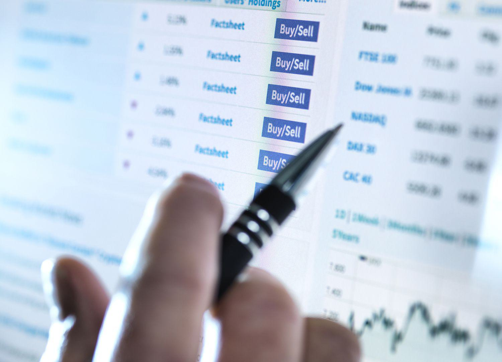

Investment strategies have evolved over the years, incorporating advanced techniques like algorithmic trading. These strategies are designed to optimize portfolio management and enhance investor returns through the effective allocation of assets. By leveraging statistical models and computational power, investors can execute trades with precision, speed, and minimal human intervention.

Algorithmic trading, a cornerstone of modern investment practices, uses computer algorithms to automatically execute a series of trades without direct human input. This approach allows for the implementation of complex strategies that can quickly adapt to changing market conditions. However, despite these advancements, the integrity of investment strategies can be compromised by unethical practices such as churning.



Churning refers to the excessive trading of securities by a broker to generate higher commissions, often at the expense of the client's best interests. This malpractice not only erodes investor returns but also distorts the performance of well-crafted investment strategies. Detecting churning can be challenging, as it may be disguised within the normal trading activities, thus necessitating vigilance from investors and regulators alike.

In this article, we will explore the intersection of investment strategies, finance churning, and algorithmic trading. We will discuss how these elements affect portfolio management and investor returns, highlighting the importance of ethical practices within the financial sector. By examining the mechanisms and impacts of these practices, investors can enhance their understanding of both the opportunities and risks present in modern trading environments.

## Table of Contents

## Understanding Investment Strategies

Investment strategies play a crucial role in the financial landscape, providing frameworks for managing risks and optimizing returns. These strategies vary widely, enabling investors to tailor their approach based on market conditions, personal goals, and risk tolerance.

One prominent strategy is long-term investment, which focuses on buying assets with the expectation that they will appreciate over a sustained period, typically years or decades. This approach is grounded in the belief that, over the long haul, markets tend to rise, and thus, the value of investments will increase. Long-term investing also takes advantage of the power of compounding returns, where earnings are reinvested to generate additional returns over time.

Day trading represents another strategy at the opposite end of the spectrum. It involves buying and selling financial instruments within the same trading day, aiming to capitalize on short-term price movements. Day traders rely heavily on technical analysis and must respond quickly to market changes, requiring a high level of skill and experience.

Algorithmic trading has gained popularity due to advancements in technology. It involves using algorithms to execute trades based on predetermined criteria, such as timing, price, or [volume](/wiki/volume-trading-strategy). The primary goal is to enhance efficiency, speed, and precision in executing trades. Algorithms can swiftly analyze vast datasets and implement trading commands at a frequency beyond human capability. This not only reduces delays but can also eliminate the emotional bias often present in human decision-making.

Each investment strategy comes with its own set of advantages and limitations. Long-term investing is generally less stressful and time-intensive compared to active strategies like [day trading](/wiki/day-trading-spy) and [algorithmic trading](/wiki/algorithmic-trading), but it may require significant patience and tolerance for market fluctuations. On the other hand, short-term strategies such as day trading can offer quick profits but also [carry](/wiki/carry-trading) higher risks and transaction costs. Algorithmic trading, while providing significant advantages in speed and accuracy, requires substantial infrastructure, understanding of complex algorithms, and careful oversight to prevent malfunctions and unintended excessive trading.

Understanding these strategies enables investors to align their financial actions with their individual goals, risk tolerance, and the market environment. By carefully selecting and managing investment strategies, investors can enhance their potential for achieving sustainable returns.

## Finance Churning: A Deep Dive

Churning constitutes an egregious breach in the financial services industry, classified as an illegal maneuver where brokers conduct an excessive number of trades to inflate their commissions unjustifiably. This practice directly contravenes the principle of acting in the client's best interest as stipulated by regulatory bodies, such as the U.S. Securities and Exchange Commission (SEC).

The phenomenon of churning not only burdens investors with unnecessary transactional costs but also potentially erodes the value of their investments. Each unwarranted trade incurs commission fees and other expenses that, while benefiting the broker, eat into the investor's capital. Over time, the compounded effect of these expenses can be significant, leading to diminished overall returns for the investor.

Detecting churning poses a substantial challenge due to its subtle nature and the dynamic environment of the stock market. Determining what constitutes excessive trading can be subjective and requires a careful analysis of the investor's profile, objectives, and the type of investment account. Typically, the detection process involves scrutinizing the turnover ratio or cost-equity ratio in an account, with unusually high figures potentially signaling churning. The turnover ratio is calculated as follows:

$$
\text{Turnover Ratio} = \frac{\text{Total Value of Purchases}}{\text{Average Account Value}}
$$

A turnover ratio that exceeds the typical norms for the applicable investment strategy can suggest that churning activity is occurring.

The financial repercussions of unchecked churning can be severe, impacting the investor's ability to achieve their financial goals. High-frequency trading resulting from churning can lead to capital losses as trades executed purely to generate commissions may not align with the investor's strategic interests or market conditions.

Investors are advised to adopt a proactive approach to safeguard against churning. Vigilance involves regularly monitoring account activities, staying informed about each transaction, and ensuring they are congruent with their financial goals. They should review the account statements on a monthly basis or utilize tools provided by brokers that offer transaction summaries and insights into trading patterns.

Awareness of one's rights and the responsibilities of the broker is critical. Investors should clearly communicate their investment objectives and restrictions to their brokers and insist on maintaining a transparent communication channel. Additionally, investors might consider working with fee-based advisors rather than commission-based brokers to eliminate the conflict of interest where brokers benefit from trades that do not align with the investor's best interest.

In summary, churning represents a violation of fiduciary duty and can severely affect investor returns through unnecessary cost accrual and capital depreciation. Investors must remain vigilant, informed, and proactive to detect and prevent such unethical practices to ensure their investment objectives are not compromised.

## Algorithmic Trading and Its Impact on Churning

Algorithmic trading utilizes sophisticated computer programs to execute trades at speeds and frequencies that are impossible for a human trader. These programs rely on complex mathematical models and automated decision-making systems to carry out trading strategies. By analyzing market data in real-time, algorithms aim to identify profitable opportunities based on predefined instructions. This technology offers several advantages, such as increased efficiency and the ability to execute high-frequency trades, thereby capturing fleeting market inefficiencies.

However, the proliferation of algorithmic trading also poses certain challenges, particularly concerning its potential to encourage churning. Churning refers to the unethical practice of conducting excessive trades to generate commissions, which can erode investor returns. Algorithmic trading, by its nature, can execute thousands of transactions in a fraction of a second, thus amplifying the risk of churning if not properly controlled.

For example, consider an algorithm designed to capitalize on short-term price movements. If the algorithm is not optimally configured, it may inadvertently execute an excessive number of trades, leading to high transaction fees without corresponding benefits to the investor. This issue is compounded by the fact that some trading algorithms operate with minimal human oversight, relying on their programming to interpret market signals. If these algorithms are not rigorously monitored, they could engage in trading behaviors that prioritize activity over actual return on investment.

To understand the potential impact of algorithms on churning, consider a hypothetical trading algorithm outlined in Python:

```python
def execute_trades(market_data, trade_threshold):
    trade_count = 0
    for data_point in market_data:
        if evaluate_signal(data_point) > trade_threshold:
            make_trade(data_point)
            trade_count += 1
    return trade_count
```

In this simplified example, `evaluate_signal` represents a function that determines whether the conditions are right for a trade. If the threshold is set too low, the algorithm may execute trades unnecessarily, leading to churning.

Thus, monitoring the implementation of these algorithms is crucial. Ensuring that the trade threshold is appropriately calibrated and periodically reviewed can prevent unintended consequences. Furthermore, implementing safeguards within the algorithm to track and limit the number of trades executed within a certain period can mitigate the risk of churning.

Balancing the advantages of algorithmic trading with the need for ethical execution requires that investors and developers apply robust risk management strategies. This includes regularly auditing algorithmic strategies for compliance and effectiveness, as well as adjusting them to align with long-term investment objectives rather than short-term gains. By striking a balance between leveraging the power of automated trading and adhering to ethical standards, the financial industry can safeguard against the detrimental effects of churning and promote sustainable investment practices.

## Strategies to Prevent Churning

Investors can prevent churning by first gaining a clear understanding of their investment objectives and maintaining strong control over their accounts. Establishing clear financial goals enables investors to make informed decisions about their portfolios and detect any anomalies that might indicate churning. 

One effective strategy to prevent churning is to regularly review account statements. By consistently monitoring these statements, investors are more likely to notice any unusual trading patterns that could suggest excessive trading. For example, if there is a sudden increase in transaction volume without a clear correlation to market conditions or investment strategies, it may indicate a problem. Setting trading limits is another crucial step; these limits can be aligned with the investor's strategic objectives to ensure that trading activity stays within acceptable bounds.

Transitioning to fee-based accounts can further mitigate the risk of churning. Unlike commission-based setups, where brokers earn a commission on every trade, fee-based accounts charge a fixed rate, reducing the broker's incentive to conduct unnecessary trades purely to earn more commissions. By eliminating the conflict of interest associated with commission-based systems, fee-based accounts align the interests of both the investor and the broker toward long-term growth and sustainable portfolio management.

Lastly, technology can play a pivotal role in curbing churning. Responsible use of algorithms can help monitor and control excessive trades. For instance, if employing algorithmic trading systems, investors can design algorithms with built-in checks to prevent frequent trading that lacks justification based on the prevailing market conditions. Algorithms can be programmed to flag trades that fall outside pre-established parameters, allowing investors or their representatives to investigate further. Using Python, investors can write a simple script to analyze trade frequency:

```python
def flag_excessive_trades(trades, threshold):
    excessive_trades = []
    for trade in trades:
        if trade['frequency'] > threshold:
            excessive_trades.append(trade)
    return excessive_trades

# Example usage:
trades = [{'trade_id': 1, 'frequency': 50}, {'trade_id': 2, 'frequency': 20}]
threshold = 30
excessive_trades = flag_excessive_trades(trades, threshold)
print(excessive_trades)
```

This script identifies trades exceeding a set frequency threshold, enabling investors to quickly pinpoint and address potential issues of excessive trading. By integrating such technological solutions and fostering an awareness of their investment strategies, investors can effectively safeguard their portfolios from the detrimental effects of churning.

## Conclusion

Churning remains a significant threat to investors' returns and can undermine the integrity of financial markets. This unethical practice, primarily driven by the desire to generate excessive commissions, poses considerable risks to portfolio performance. By comprehensively understanding investment strategies, investors can enhance their ability to protect their portfolios from such detrimental behaviors. Algorithmic trading, when properly monitored and managed, offers an opportunity to create more efficient trading environments; however, without adequate oversight, it could also inadvertently facilitate churning due to its capability to execute numerous trades in rapid succession.

Moving forward, preventive measures and investor awareness are crucial in safeguarding investments from churning. Investors must remain vigilant, regularly review their trading activities, and choose financial advisors who prioritize client interests over commission generation. Setting clear investment objectives and establishing trading limits are effective strategies in mitigating the risk of excessive trading.

The evolution of technology holds promise for more robust solutions to combat churning. Future advancements may yield sophisticated tools and algorithms capable of identifying unethical trading patterns, thereby strengthening market integrity and enhancing investor protection. Continued innovation in this area could lead to a safer and more transparent financial ecosystem, ultimately fostering greater confidence among investors.

## References & Further Reading

[1]: Bergstra, J., Bardenet, R., Bengio, Y., & Kégl, B. (2011). ["Algorithms for Hyper-Parameter Optimization."](https://dl.acm.org/doi/10.5555/2986459.2986743) Advances in Neural Information Processing Systems 24.

[2]: ["Advances in Financial Machine Learning"](https://www.amazon.com/Advances-Financial-Machine-Learning-Marcos/dp/1119482089) by Marcos Lopez de Prado

[3]: ["Evidence-Based Technical Analysis: Applying the Scientific Method and Statistical Inference to Trading Signals"](https://www.amazon.com/Evidence-Based-Technical-Analysis-Scientific-Statistical/dp/0470008741) by David Aronson

[4]: ["Machine Learning for Algorithmic Trading"](https://github.com/stefan-jansen/machine-learning-for-trading) by Stefan Jansen

[5]: ["Quantitative Trading: How to Build Your Own Algorithmic Trading Business"](https://github.com/LucindaYa/quant-resources/blob/master/Quantitative%20Trading%20How%20to%20Build%20Your%20Own%20Algorithmic%20Trading%20Business.pdf) by Ernest P. Chan