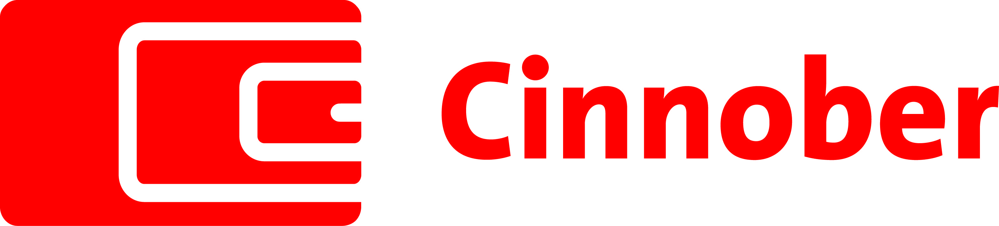

## Table of Contents

## What is Cinnober Financial Technology?

Cinnober Financial Technology is a company that makes software for financial markets. They help banks and other financial companies trade stocks, bonds, and other things more easily. Their software is used all over the world to make trading faster and safer.

The company started in Sweden in 1998. They are known for being good at what they do and for helping to make financial markets work better. Cinnober works with big exchanges and clearing houses to make sure everything runs smoothly.

## When was Cinnober Financial Technology founded?

Cinnober Financial Technology was founded in 1998. They started in Sweden and have been working on software for financial markets ever since.

The company helps banks and other financial organizations trade things like stocks and bonds more easily. Their software is used all around the world to make trading faster and safer.

## What are the main products and services offered by Cinnober?

Cinnober Financial Technology offers software that helps with trading in financial markets. Their main product is called TRADExpress, which is a platform that makes it easier for banks and other financial companies to trade things like stocks and bonds. This platform is used by big exchanges and clearing houses around the world to make trading faster and more reliable.

Another important service they provide is called Cinnober Clearing. This service helps to make sure that all trades are settled correctly and safely. It's important for keeping the financial markets running smoothly and making sure everyone follows the rules.

Cinnober also offers consulting services. They help financial companies figure out how to use their technology best and how to improve their trading systems. This can include advice on how to set up new trading systems or how to make existing ones work better.

## In which countries does Cinnober operate?

Cinnober Financial Technology has offices in several countries. They started in Sweden, where their headquarters is located. They also have offices in other places like the United Kingdom and Australia. This helps them work closely with customers all over the world.

Their software is used in many countries. Big financial markets in Europe, Asia, and other places use Cinnober's products to trade stocks, bonds, and other things. This makes Cinnober an important part of the global financial system.

## Who are the key competitors of Cinnober in the financial technology sector?

Cinnober Financial Technology has several key competitors in the financial technology sector. One big competitor is Nasdaq, which not only runs its own stock exchange but also provides technology solutions for other exchanges and financial institutions. Another competitor is FIS (Fidelity National Information Services), a large company that offers a wide range of financial services and technology, including trading and clearing solutions.

Other important competitors include ION Trading, which focuses on providing trading and workflow solutions for financial markets, and Bloomberg, known for its financial data services but also offering trading platforms. These companies all try to provide the best technology to help banks and other financial companies trade more efficiently and safely.

## What are some of the major clients of Cinnober?

Cinnober has many big clients in the financial world. They work with big stock exchanges like the London Stock Exchange and the Australian Securities Exchange. These exchanges use Cinnober's software to help them trade stocks and other things quickly and safely.

They also work with clearing houses like LCH.Clearnet, which use Cinnober's clearing services to make sure all trades are settled correctly. Banks and other financial companies, like the Swedish bank SEB, use Cinnober's technology to improve their trading systems. This helps them trade better and follow the rules.

## How does Cinnober's technology help in trading and clearing?

Cinnober's technology helps in trading by making it faster and easier for financial companies to buy and sell things like stocks and bonds. Their main product, TRADExpress, is a platform that big exchanges around the world use. It helps them handle lots of trades quickly and safely. This means that when someone wants to buy or sell something, the trade can happen almost instantly. This speed and safety are important because it makes the financial markets work better and helps everyone trust the system.

Cinnober's clearing service, called Cinnober Clearing, helps make sure that all trades are settled correctly. When a trade happens, both sides need to make sure they get what they agreed on. Cinnober's technology makes this process smooth and safe. It helps to check that everyone follows the rules and that the trades are done right. This is important for keeping the financial markets running smoothly and making sure everyone can trust that their trades will be completed properly.

## What technological innovations has Cinnober introduced in the financial sector?

Cinnober has brought some important new ideas to the financial world. One big thing they did was make a trading platform called TRADExpress. This platform helps big stock exchanges trade things like stocks and bonds very quickly and safely. Before TRADExpress, trading could be slow and risky. But with Cinnober's technology, exchanges can handle a lot of trades at once without problems. This makes the whole financial market work better and helps everyone trust that their trades will go through smoothly.

Another innovation from Cinnober is their clearing service, called Cinnober Clearing. Clearing is important because it makes sure that when a trade happens, both sides get what they agreed on. Cinnober's technology makes this process easy and safe. It checks that everyone follows the rules and that trades are settled correctly. This is a big deal because it helps keep the financial markets running smoothly and makes sure everyone can trust the system. By making clearing better, Cinnober helps make the whole financial world more reliable.

## What is the business model of Cinnober?

Cinnober makes money by selling software and services that help financial companies trade stocks, bonds, and other things. Their main product, TRADExpress, is a platform that big stock exchanges use to handle lots of trades quickly and safely. Cinnober charges these exchanges money to use their software. This helps the exchanges work better and makes trading faster and more reliable.

Cinnober also offers a clearing service called Cinnober Clearing. This service makes sure that when a trade happens, both sides get what they agreed on. They charge financial companies to use this service, which helps keep the markets running smoothly and safely. On top of that, Cinnober provides consulting services, where they help companies figure out how to use their technology best and improve their trading systems. This way, Cinnober earns money from both selling their software and giving advice on how to use it.

## How has Cinnober adapted to regulatory changes in the financial industry?

Cinnober has had to change how they do things because of new rules in the financial world. These rules are made to make sure trading is safe and fair. Cinnober has updated their software, like TRADExpress, to follow these new rules. This means they help their customers, like big stock exchanges, meet the new requirements easily. By doing this, Cinnober helps keep the financial markets working well and trusted by everyone.

They also keep a close eye on what regulators are doing. If there's a new rule coming, Cinnober works quickly to make sure their clearing service, Cinnober Clearing, can handle it. This helps make sure all trades are done right and everyone follows the rules. By staying ahead of these changes, Cinnober helps their clients stay out of trouble and keep trading smoothly.

## What are the future growth strategies of Cinnober?

Cinnober wants to grow by making their software even better. They plan to add new features to their trading platform, TRADExpress, to make it faster and easier to use. They also want to make their clearing service, Cinnober Clearing, work with more types of trades. By doing this, they hope to attract more customers around the world and help more financial companies trade better.

Another way Cinnober plans to grow is by working in more countries. They already have offices in Sweden, the UK, and Australia, but they want to open more offices in other places. This will help them be closer to their customers and understand what they need. By being in more places, Cinnober can sell their software to more financial companies and help them trade more easily and safely.

## Can you discuss any recent mergers or acquisitions involving Cinnober?

In 2018, Cinnober was bought by Nasdaq, a big company that runs stock exchanges and makes financial technology. This was a big deal because it helped Nasdaq get even better at making software for trading and clearing. Cinnober's technology, like TRADExpress and Cinnober Clearing, became part of Nasdaq's products. This helped Nasdaq offer more services to their customers and make their trading systems work even better.

Since being bought by Nasdaq, Cinnober has been working closely with them to keep improving their technology. They still help big stock exchanges and financial companies around the world trade safely and quickly. The merger made Cinnober a part of a bigger team, which gives them more resources to grow and come up with new ideas. This is good for Cinnober because it helps them reach more customers and keep being a leader in financial technology.

## References & Further Reading

[1]: "Nasdaq Completes Acquisition of Cinnober," [Nasdaq Press Release](https://www.nasdaq.com/press-release/nasdaq-hold-fourth-quarter-and-full-year-2024-investor-conference-call-2025-01-02), January 31, 2019.

[2]: Arnuk, S., & Saluzzi, J. (2012). ["Broken Markets: How High Frequency Trading and Predatory Practices on Wall Street are Destroying Investor Confidence and Your Portfolio"](https://ptgmedia.pearsoncmg.com/images/9780132875240/samplepages/0132875241.pdf). FT Press.

[3]: Riordan, R., & Storkenmaier, A. (2012). ["Latency, Liquidity, and Price Discovery"](https://www.sciencedirect.com/science/article/abs/pii/S1386418112000237). The Journal of Finance, 67(4), 1329-1365.

[4]: "Markets in Financial Instruments Directive (MiFID II)," [European Commission Website](https://finance.ec.europa.eu/regulation-and-supervision/financial-services-legislation/implementing-and-delegated-acts/markets-financial-instruments-directive-ii_en).

[5]: Aldridge, I. (2013). ["High-Frequency Trading: A Practical Guide to Algorithmic Strategies and Trading Systems"](https://onlinelibrary.wiley.com/doi/pdf/10.1002/9781119203803.fmatter). Wiley.

[6]: "London Metal Exchange Selects Cinnober," [Press Release](https://www.miamiherald.com/press-releases/article298047218.html), October 25, 2012. 

[7]: "Cinnober’s TRADExpress Platform," [Cinnober Archives](https://www.marketswiki.com/wiki/Cinnober_Financial_Technology).