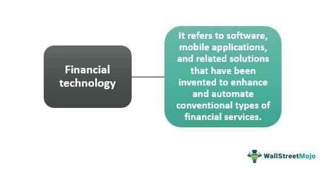

Cinnober Financial Technology has consistently led advancements in fintech solutions aimed at enhancing the financial trading industry. Since its inception, the company has garnered a reputation for providing some of the most advanced trading and clearing technologies available. These innovations are instrumental to leading financial markets worldwide, ensuring seamless operation and robust infrastructure.

Founded in Stockholm in 1998, Cinnober quickly emerged as a significant entity within the financial technology sector, offering robust, dynamic solutions tailored for exchanges, clearinghouses, and major financial institutions globally. Their technological prowess is exemplified by the TRADExpress platform, which has become a benchmark in facilitating fast and reliable financial transactions.

Cinnober's journey took a pivotal turn in 2019 when it was acquired by Nasdaq. The acquisition highlighted Cinnober's critical role in enhancing Nasdaq's Market Technology segment, reflecting its impactful contributions to the industry. This integration represented not just an expansion of Cinnober's reach but also an affirmation of its technological significance in shaping modern trading systems.

This article delves into Cinnober's rich history and examines the innovative solutions it developed to revolutionize algorithmic trading. By understanding Cinnober's contributions, financial institutions can gain insights into the transformative potential of technology in optimizing trading processes. This exploration underscores the importance of innovation in maintaining efficient, secure, and transparent financial market operations amid evolving market demands.

## Table of Contents

## The Legacy of Cinnober

Cinnober Financial Technology, established in 1998 in Stockholm, Sweden, swiftly emerged as a significant innovator within the financial technology industry. The company carved out its niche by developing and providing robust technological solutions tailored for exchanges, clearinghouses, and prominent financial institutions worldwide. Central to Cinnober's success was its versatile technology suite known as TRADExpress. This platform was engineered to ensure fast, efficient, and reliable financial transactions, meeting the high demands of modern trading environments.

TRADExpress incorporates a comprehensive architecture that supports multiple functionalities, such as order management, order matching, and post-trade processing. The adaptability and reliability of this platform cemented Cinnober's reputation as a leader in fintech solutions, enabling clients to achieve rapid transaction processing and enhanced market access.

The acquisition of Cinnober by Nasdaq in 2019 marked a pivotal milestone in the firm's evolution. This acquisition significantly expanded Cinnober's influence and reach, integrating its robust solutions into Nasdaq's extensive Market Technology segment. This strategic move also reinforced Nasdaq's commitment to establishing cutting-edge technological capabilities within its trading and market infrastructure.

Cinnober's client portfolio is diverse and includes renowned exchanges such as the London Metal Exchange (LME) and the Dubai Gold & Commodities Exchange (DGCX). These collaborations demonstrated the company's ability to deliver tailored solutions that meet the specific needs of different financial markets, enhancing both operational efficiency and market connectivity. The London Metal Exchange, a major global player in industrial metals trading, benefitted from Cinnober's technology by improving their trading systems and clearing processes. Similarly, the Dubai Gold & Commodities Exchange leveraged Cinnober's TRADExpress platform to boost transaction processing speeds and expand their market offerings.

Through its innovative solutions and strategic partnerships, Cinnober has significantly contributed to the modernization of financial trading systems, establishing a legacy of excellence in the fintech sector.

## Cinnober's Algorithmic Trading Solutions

Cinnober Financial Technology has firmly established itself as a pioneer in the field of [algorithmic trading](/wiki/algorithmic-trading) solutions, emphasizing the critical role technology plays in executing orders with precision and speed. At the heart of Cinnober's success lies its TRADExpress platform, a highly versatile and robust system known for its comprehensive functionality in supporting sophisticated trading activities.

One of the key attributes of the TRADExpress platform is its capability in price discovery—a process crucial for determining the value of financial instruments in volatile markets. By integrating advanced algorithms and data analytics, the platform ensures that trades are executed at optimal prices, thus maximizing the efficiency of market operations.

In addition to price discovery, the TRADExpress platform excels in order matching. This functionality is paramount for any exchange or trading system, as it involves pairing buy and sell orders in a manner that minimizes latency. Cinnober’s technological architecture supports high-frequency trading ([HFT](/wiki/high-frequency-trading-strategies)), allowing the platform to process extensive volumes of data with minimal delays, thereby ensuring trades are executed in real time.

Market surveillance, another significant component of the TRADExpress platform, empowers exchanges and financial brokers to monitor trading activities effectively. By employing cutting-edge surveillance tools, the system can identify and flag suspicious trading patterns, aiding in the prevention of market abuse and ensuring compliance with global financial regulations.

Cinnober's solutions have significantly enhanced the trading capabilities of major stock exchanges and financial brokers globally. By providing a platform that combines speed, reliability, and accuracy, Cinnober has enabled these institutions to adopt complex trading strategies that were previously untenable. The ability to handle large data volumes and execute intricate trading strategies efficiently has positioned Cinnober as a formidable player in the algorithmic trading sector.

As the landscape of algorithmic trading continues to advance, Cinnober's technological innovations serve as a blueprint for future developments in trading systems. The TRADExpress platform exemplifies how robust technology can transform trading environments by fostering agility, resilience, and innovation. Cinnober's continued evolution and adaptation to market needs reflect its commitment to driving the future of trading technology.

## Impact on Market Technology

The integration of Cinnober's technology into Nasdaq's Market Technology division has significantly enhanced its market presence and influence within the financial technology landscape. Cinnober's expertise in developing comprehensive surveillance and risk management tools has been pivotal in addressing the evolving demands of global financial markets. These systems enable exchanges and financial institutions to monitor trading activities with precision, ensuring market integrity and reducing systemic risk. 

Cinnober introduced efficient clearing and settlement processes, which have streamlined operations across diverse financial markets. By modernizing these crucial functions, Cinnober has contributed to reducing latency and increasing reliability in trade execution and settlement cycles. This is particularly important as rapid trade execution and the subsequent clearance of transactions are critical in maintaining the [liquidity](/wiki/liquidity-risk-premium) and stability of financial markets.

Furthermore, Cinnober's platforms have been instrumental in facilitating compliance with a range of global financial regulations, including the Markets in Financial Instruments Directive II (MiFID II). By implementing solutions that align with regulatory requirements, Cinnober has helped financial institutions to manage regulatory obligations effectively, thus supporting a more transparent and accountable market environment.

Cinnober's technology continues to be a vital component of Nasdaq's strategy to provide world-class market infrastructure. The collaboration has strengthened Nasdaq's ability to deliver cutting-edge technologies that support the evolving needs of exchanges worldwide. As markets continue to grow in complexity, Nasdaq’s reliance on Cinnober's proven solutions underscores a commitment to maintaining excellence in market infrastructure and technology innovation.

## Future of Fintech Solutions

Cinnober Financial Technology, with its proven track record and deep-rooted expertise, sets a strong precedent for the future landscape of fintech solutions in trading. The ongoing evolution in financial technology demands that financial institutions continually embrace new advancements to remain competitive and enhance operational efficiency. This is especially true as the industry witnesses rapid changes and growing complexity in trading environments.

One significant aspect of this evolution is Nasdaq's ongoing investment in Cinnober’s technology, which underscores the commitment towards continuous innovations in algorithmic trading capabilities. Nasdaq's strategy indicates a future where algorithmic trading solutions will become even more sophisticated, adaptable, and capable of processing vast amounts of data with high precision.

Emerging trends such as [cryptocurrency](/wiki/cryptocurrency) trading platforms and real-time client clearing are areas that present unique opportunities for technological expansion. The rise of digital currencies necessitates robust trading systems capable of handling the inherent [volatility](/wiki/volatility-trading-strategies) and decentralized nature of these assets. Cinnober's technological infrastructure offers a robust foundation to tackle these challenges, potentially leading to advancements that facilitate smoother, faster, and more secure cryptocurrency trading.

Moreover, real-time client clearing represents a transformative step in trade processing, aiming to reduce counterparty risk and enhance transaction speed. By leveraging Cinnober’s sophisticated platforms, financial institutions can achieve near-instantaneous clearing and settlement, which is crucial for maintaining market stability and trust.

As these trading environments continue to grow in complexity, the legacy of Cinnober will be instrumental in guiding the development of more agile and resilient fintech solutions. The ability to adapt quickly to market changes and regulatory demands will be a defining feature of successful trading systems. Consequently, the innovations pioneered by Cinnober will undoubtedly influence the architecture of future trading solutions, ensuring they are not only effective but also sustainable in the long term.

In conclusion, as financial markets evolve, Cinnober’s contributions will serve as a cornerstone for innovation, paving the way for a more integrated and efficient future in financial trading.

## Conclusion

Cinnober Financial Technology has undeniably made significant contributions to the fintech industry, with a particular focus on trading and clearing solutions. The company's integration into Nasdaq has marked a pivotal evolution, offering robust enhancements in trading technology capabilities for exchanges worldwide. This strategic move underscores Nasdaq's commitment to leveraging Cinnober's innovative solutions to boost market efficiency and security. Cinnober has been instrumental in ensuring that financial markets run smoothly, adhering to the highest standards of transparency and efficiency. The company's technological advancements have been crucial in addressing contemporary market demands, thereby solidifying its role in propelling the future of financial technologies.

Moreover, Cinnober's journey highlights the importance of advanced technology as a fundamental driver in reshaping the global financial landscape. The firm's pioneering work in algorithmic trading serves as a continuous source of inspiration for future fintech developments. As financial systems grow increasingly complex, the foundations laid by Cinnober are expected to guide the development of more agile and resilient fintech solutions. This ongoing evolution suggests that, while financial technology continues to shift, the innovative spirit embodied by Cinnober will remain a cornerstone of progress in the industry.

## References & Further Reading

[1]: "Nasdaq Completes Acquisition of Cinnober," [Nasdaq Press Release](https://www.nasdaq.com/press-release/nasdaq-hold-fourth-quarter-and-full-year-2024-investor-conference-call-2025-01-02), January 31, 2019.

[2]: Arnuk, S., & Saluzzi, J. (2012). ["Broken Markets: How High Frequency Trading and Predatory Practices on Wall Street are Destroying Investor Confidence and Your Portfolio"](https://ptgmedia.pearsoncmg.com/images/9780132875240/samplepages/0132875241.pdf). FT Press.

[3]: Riordan, R., & Storkenmaier, A. (2012). ["Latency, Liquidity, and Price Discovery"](https://www.sciencedirect.com/science/article/abs/pii/S1386418112000237). The Journal of Finance, 67(4), 1329-1365.

[4]: "Markets in Financial Instruments Directive (MiFID II)," [European Commission Website](https://finance.ec.europa.eu/regulation-and-supervision/financial-services-legislation/implementing-and-delegated-acts/markets-financial-instruments-directive-ii_en).

[5]: Aldridge, I. (2013). ["High-Frequency Trading: A Practical Guide to Algorithmic Strategies and Trading Systems"](https://onlinelibrary.wiley.com/doi/pdf/10.1002/9781119203803.fmatter). Wiley.

[6]: "London Metal Exchange Selects Cinnober," [Press Release](https://www.miamiherald.com/press-releases/article298047218.html), October 25, 2012. 

[7]: "Cinnober’s TRADExpress Platform," [Cinnober Archives](https://www.marketswiki.com/wiki/Cinnober_Financial_Technology).