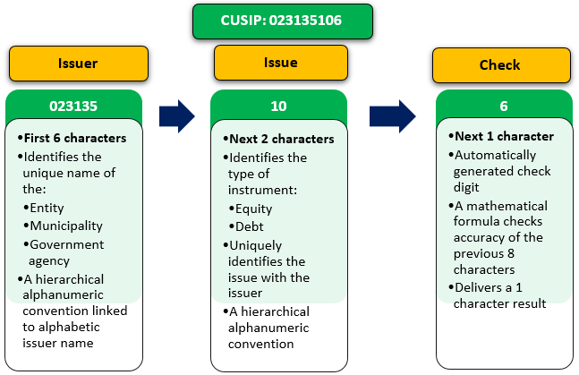

## Table of Contents

## What is a CINS number?

A CINS number, or CUSIP International Numbering System number, is a unique identifier used for securities that are traded outside of the United States and Canada. It is similar to a CUSIP number, which is used for securities in the U.S. and Canada. The CINS number helps to keep track of and organize information about these securities, making it easier for investors and financial institutions to buy, sell, and manage them.

The CINS number is made up of nine characters. The first six characters are letters that represent the issuer of the security. The next two characters are numbers that identify the specific security. The last character is a check digit, which helps to make sure the number is entered correctly. By using CINS numbers, people around the world can easily understand and work with different securities, no matter where they come from.

## What does CINS stand for?

CINS stands for CUSIP International Numbering System. It is a special code used to identify securities that are traded outside of the United States and Canada.

This code helps people keep track of and organize information about these securities. It makes it easier for investors and financial institutions to buy, sell, and manage them, no matter where they are in the world.

## Why was the CINS number created?

The CINS number was created to help people around the world keep track of and manage securities that are traded outside of the United States and Canada. Before CINS, it was hard for investors and financial institutions to work with securities from different countries because there was no common way to identify them. The CINS number solved this problem by giving each security a unique code that everyone could understand and use.

The CINS number works a lot like the CUSIP number, which is used for securities in the U.S. and Canada. By using CINS numbers, people can easily buy, sell, and manage securities from anywhere in the world. This makes the global financial market easier to navigate and helps investors make better decisions.

## Who uses CINS numbers?

CINS numbers are used by people and organizations that work with securities from outside the United States and Canada. This includes investors who buy and sell these securities, as well as financial institutions like banks and brokerages that help them do this.

These numbers help everyone involved to keep track of and manage these securities easily. By using CINS numbers, people around the world can understand and work with different securities, no matter where they come from. This makes it easier for the global financial market to run smoothly.

## How is a CINS number structured?

A CINS number is made up of nine characters. The first six characters are letters that tell you who issued the security. This helps you know which company or organization the security comes from. The next two characters are numbers that show which specific security it is. This is important because one company can have many different securities.

The last character of a CINS number is a special digit called a check digit. This digit helps make sure the number is entered correctly. When someone types in a CINS number, the check digit can be used to see if there are any mistakes. By using this structure, CINS numbers help people around the world keep track of and manage securities easily.

## What is the difference between a CINS and a CUSIP number?

A CINS number and a CUSIP number are both used to identify securities, but they are used in different parts of the world. A CUSIP number is used for securities that are traded in the United States and Canada. It helps investors and financial institutions keep track of these securities and make sure they are buying and selling the right ones. On the other hand, a CINS number is used for securities that are traded outside of the United States and Canada. It makes it easier for people around the world to work with these securities and understand what they are.

Both CINS and CUSIP numbers have a similar structure. They are made up of nine characters, with the first six characters being letters that tell you who issued the security. The next two characters are numbers that show which specific security it is. The last character is a check digit, which helps make sure the number is entered correctly. Even though they look similar, the main difference is where they are used: CUSIP for the U.S. and Canada, and CINS for the rest of the world.

## How can one obtain a CINS number?

To get a CINS number, you need to go to the organization that gives them out. This organization is called the CUSIP Global Services (CGS), which is part of Standard & Poor's. They are the ones who make and give out CINS numbers for securities that are traded outside of the United States and Canada. You can contact CGS and ask them to give a CINS number to the security you need.

Once you contact CGS, you will need to give them information about the security. This includes details about who issued the security and what kind of security it is. After they get this information, CGS will make a unique CINS number for that security. This number will help people around the world keep track of and manage the security easily.

## Can a CINS number be used internationally?

Yes, a CINS number can be used internationally. It is made for securities that are traded outside of the United States and Canada. This means that people and organizations from all over the world can use CINS numbers to keep track of these securities. By using CINS numbers, everyone can understand and work with securities no matter where they come from.

CINS numbers help make the global financial market easier to navigate. Investors and financial institutions can use these numbers to buy, sell, and manage securities from different countries. This makes it simpler for them to make good decisions and work together, no matter where they are in the world.

## What are some common examples of CINS numbers?

CINS numbers are used for securities traded outside the United States and Canada. An example of a CINS number might be "G0453H105". Here, the first six letters "G0453H" tell you who issued the security. The next two numbers "10" show which specific security it is. The last number "5" is a check digit to make sure the number is entered correctly.

Another example could be "E0980T109". In this case, "E0980T" is the issuer code, "10" identifies the specific security, and "9" is the check digit. These numbers help people around the world easily understand and work with securities from different countries. By using CINS numbers, investors and financial institutions can keep track of and manage these securities smoothly.

## How does the CINS number system ensure uniqueness?

The CINS number system ensures uniqueness by using a special combination of letters and numbers. Each CINS number is made up of nine characters. The first six characters are letters that tell you who issued the security. This means that no two companies or organizations can have the same first six letters. The next two characters are numbers that show which specific security it is. This helps to make sure that each security from the same issuer has a different number. The last character is a check digit, which helps to make sure the number is entered correctly.

By using this structure, the CINS number system makes sure that every security has its own unique code. This is important because it helps people around the world to keep track of and manage securities easily. If two securities had the same CINS number, it would be hard to tell them apart and could lead to mistakes. But with the unique codes, everyone can understand and work with different securities, no matter where they come from.

## What are the benefits of using CINS numbers in financial transactions?

Using CINS numbers in financial transactions makes things easier and clearer for everyone. These numbers give each security its own special code, so people around the world can keep track of them without getting mixed up. This means that investors and financial institutions can buy, sell, and manage securities from different countries without any trouble. It helps them make sure they are working with the right security and not making mistakes.

CINS numbers also help the global financial market run smoothly. Because these numbers are used all over the world, they make it easier for people to work together and understand each other's securities. This can lead to more trading and better decisions, as everyone has the same information. By using CINS numbers, the financial world becomes a little simpler and more connected.

## What are the potential challenges or limitations of using CINS numbers?

Using CINS numbers can have some challenges. One challenge is that people need to understand how to use them correctly. If someone makes a mistake when entering the number, it can cause problems. The check digit at the end of the CINS number helps catch these mistakes, but it's still important for everyone to be careful. Another challenge is that not all countries use CINS numbers in the same way. Some places might have their own systems for identifying securities, which can make things confusing when trading across different countries.

Another limitation is that getting a CINS number can take time and cost money. You have to go through CUSIP Global Services to get one, and this process can slow down financial transactions. Plus, there might be fees involved, which can add up if you need a lot of CINS numbers. Despite these challenges, CINS numbers are still very helpful for keeping track of securities from around the world and making the global financial market easier to navigate.

## References & Further Reading

[1]: ["International Securities Identification Number (ISIN)"] (https://www.isin.org/) - Provides comprehensive information on the ISIN system, which is closely related to CINS numbers.

[2]: CUSIP Global Services (CGS). ["CUSIP International Numbering System (CINS)"](https://www.cusip.com/identifiers.html) - An overview of CINS numbers by CGS, the authoritative source for CUSIP and CINS identifiers.

[3]: Chan, Ernest P. ["Algorithmic Trading: Winning Strategies and Their Rationale"](https://github.com/ftvision/quant_trading_echan_book) - A detailed guide on algorithmic trading, relevant for understanding the integration of CINS numbers in trading strategies.

[4]: Palepu, Krishna G., Healy, Paul M., Bernard, Victor L., & Peek, Erik. ["Business Analysis and Valuation: Using Financial Statements"](https://researchers.mq.edu.au/en/publications/business-analysis-and-valuation-using-financial-statements) - Discusses financial statement analysis, useful for understanding the broader financial identification context.