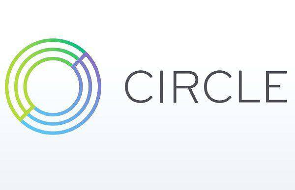

In the rapidly evolving world of finance, Circle Financial Services has emerged as a key player with its innovative use of blockchain technology. Established in 2013, Circle initially focused on providing a peer-to-peer payment system for consumers but has since evolved into a multifaceted financial services provider catering primarily to businesses. This transformation highlights Circle's strategic pivot towards leveraging blockchain technology to deliver a range of financial services that meet contemporary demands.

Circle's journey from a consumer-centric platform to a leading business-oriented entity has been marked by strategic initiatives and technological advancements. Through the integration of algorithmic trading into its business model, Circle has enhanced the efficiency, speed, and accuracy of its financial transactions. Algorithmic trading, which involves using automated and pre-programmed instructions to execute trades, has become crucial in Circle's ability to optimize trading decisions and reduce human intervention, thereby setting it apart in the financial industry.

As Circle continues to innovate and expand its service offerings, it remains focused on reshaping the digital finance landscape. The company's forward-thinking approach and strategic use of cutting-edge technology underscore its commitment to advancing the integration of traditional finance with digital currency solutions. This article will explore Circle's journey, its products, and the pivotal role of algorithmic trading in its growth trajectory, providing insights into how these elements combine to redefine digital finance.

## Table of Contents

## The Evolution of Circle Financial Services

Circle Financial Services, founded in 2013, initially began as a peer-to-peer cryptocurrency payment platform, enabling individuals to easily manage and transfer digital currency. Over the years, Circle has undergone a significant transformation, evolving from its original consumer-focused services into a multi-faceted financial services provider.

In 2020, Circle strategically shifted its focus towards blockchain applications for businesses, emphasizing the importance of stablecoins within its ecosystem. This strategic refocus marked a pivotal moment in the company's history, as it began prioritizing the development and use of stablecoins to facilitate robust and secure business solutions. This transition highlights how Circle leveraged blockchain technology to expand its offerings beyond simple payment services.

A notable development in Circle's history was its acquisition by Concord Acquisition Corp., a move that exemplified the company's market value and readiness for public trading. This acquisition positioned Circle in a favorable light, setting it up for potential growth and increased investment opportunities in public markets.

One of the major milestones in Circle's journey was the launch of USD Coin (USDC) in 2018. As a stablecoin backed by the US dollar, USDC quickly became integral to Circle's business model, providing a stable and reliable digital currency that facilitates seamless transactions across various platforms. The adoption of USDC signified Circle's commitment to integrating traditional financial elements with innovative digital currency solutions.

Circle's evolution is also marked by its notable fundraising efforts, which have played a crucial role in supporting its expansion and the development of new products and services. These efforts have enabled Circle to secure the necessary capital to innovate and adapt to the rapidly changing financial landscape, further solidifying its standing in the industry.

In summary, Circle's history and evolution highlight its ability to adapt and innovate within the digital finance sector. From its early days as a peer-to-peer payment platform to its current role as a leader in blockchain applications for businesses, Circle's journey sets the stage for its comprehensive offerings in financial services today.

## Circle’s Algorithmic Trading Strategy

Circle Financial Services extensively employs [algorithmic trading](/wiki/algorithmic-trading), which fundamentally alters the way it conducts transactions in the [cryptocurrency](/wiki/cryptocurrency) and digital asset sectors. Algorithmic trading involves executing trades with precision, speed, and efficiency using automated pre-programmed instructions, which significantly reduces the likelihood of human error.

Circle leverages algorithmic trading to enhance its [liquidity](/wiki/liquidity-risk-premium) techniques and market-making capabilities. By employing algorithms, Circle continuously evaluates market conditions to make informed trading decisions that maximize liquidity. This is crucial in volatile cryptocurrency markets where prices can fluctuate rapidly. The use of sophisticated algorithms allows Circle to maintain market equilibrium and execute trades at optimal prices.

Beyond improving transaction accuracy, algorithmic trading minimizes costs associated with trading operations. Automation reduces the need for manual intervention, decreasing the costs incurred in human capital and minimizing the bid-ask spread, and this breadth of operations enables Circle to execute large volumes of trades efficiently, significantly cutting down transaction costs.

Algorithmic trading also provides Circle with a competitive advantage by optimizing trading decisions through advanced data analysis and predictive modeling. The use of algorithms allows the company to analyze vast amounts of data and execute trades based on market insights that would be imperceptible to human traders. This leads to enhanced revenue generation, as trading strategies can be adjusted instantaneously to align with market developments, ensuring maximum profitability.

Incorporating algorithms into trading strategies also facilitates improved scalability for Circle. As trading volumes increase, algorithmic systems can handle larger transactions without the need for proportional human resource expansion, ensuring Circle remains agile and responsive to market demands.

As the cryptocurrency markets continue to evolve, Circle's algorithmic trading strategy will remain a pivotal component of its operations, ensuring that it maintains its position as a leader in digital finance services. This dynamic approach not only underscores Circle’s technological adeptness but also reinforces its commitment to leveraging cutting-edge tools to improve its service delivery and competitive stance in the rapidly changing financial landscape.

## The Role of USD Coin (USDC) in Circle's Business Model

USD Coin (USDC) stands as a cornerstone in Circle's business model, offering a stablecoin solution that bridges the gap between cryptocurrency and traditional finance. USDC is a fully backed digital dollar, providing users with a stable medium of exchange by pegging its value directly to the US dollar. This characteristic of USDC enables users to transition smoothly into digital currency, making it an ideal choice for international trade and cross-border payments.

Circle ensures stability and trust in USDC by maintaining robust reserve backing and adhering to strict regulatory compliance. Each USDC token is redeemable for one US dollar, which is held in reserve, safeguarding its value. This approach not only establishes credibility but also attracts a broader user base that might be cautious about the [volatility](/wiki/volatility-trading-strategies) typical of cryptocurrencies.

Regulatory compliance is another critical component of USDC's framework. Circle works closely with financial regulators to align with legal standards, further assuring users of the token's legitimacy and safety. This transparency in operations and regulatory adherence significantly enhances user confidence, facilitating the rapid adoption of USDC.

The swift adoption of USDC highlights its pivotal role in Circle's strategy to integrate cryptocurrency with traditional finance markets. By providing a stable and reliable digital currency, USDC serves as a link that enables diverse financial transactions, ranging from retail payments to sophisticated trading activities, thereby enhancing liquidity and market participation.

USDC's integration into Circle’s broader vision is evident in its contribution to global crypto markets. It acts as a critical tool for achieving global financial inclusion by providing a dependable and accessible financial instrument for users worldwide. Circle's focus on expanding USDC's utility aligns with its mission to innovate financial infrastructures and provide enhanced financial services through blockchain technology.

Consequently, USDC's position within Circle’s business strategy not only represents an innovative financial product but also plays a significant role in revolutionizing the intersection of cryptocurrency and conventional finance.

## Blockchain Technology and Innovation at Circle

Circle Financial Services leverages blockchain technology as a pivotal element in its ambition to transform the global financial landscape. Blockchain technology underpins the company's commitment to providing secure, efficient, and transparent financial transactions. By utilizing blockchain, Circle ensures that all transactions are immutable, verifiable, and free from the risk associated with central points of failure — a frequent issue with traditional financial systems.

At the heart of Circle's blockchain innovation is its open-source project, Centre. This initiative is dedicated to standardizing and advancing digital wallet interactions, aiming to enhance the interoperability of digital currencies across various platforms. Centre plays a crucial role in facilitating seamless transactions, thereby reducing friction in commerce and expanding accessibility to financial services on a global scale. By promoting a set of protocols for issuing fiat-backed stablecoins, Centre supports the vision for a connected digital economy.

Circle continuously adapts blockchain features to sustain its competitive advantage within the fintech sector. The company employs state-of-the-art cryptographic techniques and consensus algorithms to enhance its products' robustness and security. Through rigorous research and development, Circle integrates advancements in scaling solutions, such as layer 2 technologies, which are designed to increase transaction throughput without sacrificing security or decentralization.

Moreover, Circle's use of blockchain technology aligns with its strict adherence to compliance and regulatory standards. The transparency inherent in blockchain allows for improved auditing capabilities and facilitates compliance with various regulatory requirements. By maintaining a transparent reserve backing for its stablecoin, USDC, Circle engenders trust among users and regulators, providing assurances that the digital assets are fully backed by traditional fiat reserves.

In conclusion, blockchain technology is central to Circle's financial products and aligns with a broader commitment to innovation, security, and regulatory compliance. As Circle continues advancing its blockchain applications, it remains well-positioned to drive significant changes in how global financial systems operate, fostering an environment for more inclusive and efficient financial services.

## Conclusion: The Future of Circle Financial Services

Circle Financial Services stands at the forefront of the financial sector with its strategic integration of blockchain and algorithmic trading technologies. Its ambitious efforts suggest a substantial potential to reshape digital currency landscapes. Algorithmic trading, a key component of Circle's strategy, is expected to continue enhancing the company's offerings. By leveraging complex algorithms, Circle optimizes trading accuracy, speed, and cost-efficiency, thereby solidifying its market position and increasing customer value. 

Additionally, Circle’s future prospects are bright as it seeks to expand its algorithm-driven services. This expansion is coupled with ongoing innovations in blockchain applications, aimed at further bridging the gap between traditional finance and modern digital currency technologies. Through these initiatives, Circle is positioned to offer more versatile and robust financial products and services, enabling smoother transitions and integrations for both businesses and consumers.

A core commitment of Circle is fostering greater financial inclusion and efficiency within global markets. By addressing barriers to entry and enhancing transaction processes, Circle aims to democratize access to financial services across diverse demographics and geographical areas. This mission aligns with global trends towards inclusivity and equitable access to financial systems.

As Circle navigates the complexities of the rapidly evolving fintech sector, it remains poised to lead significant advancements in the integration of traditional finance frameworks with the capabilities of digital currencies. The company's strategic vision and technological prowess position it as a pivotal player in advancing the financial industry's future, setting standards for innovation while ensuring compliance with regulatory standards.

## References & Further Reading

[1]: ["Blockchain Revolution: How the Technology Behind Bitcoin Is Changing Money, Business, and the World"](https://dl.acm.org/doi/10.5555/3051781) by Don Tapscott and Alex Tapscott

[2]: ["Algorithmic Trading: Winning Strategies and Their Rationale"](https://www.wiley.com/en-us/Algorithmic+Trading%3A+Winning+Strategies+and+Their+Rationale-p-9781118746912) by Ernest P. Chan

[3]: ["Mastering Bitcoin: Unlocking Digital Cryptocurrencies"](https://www.amazon.com/Mastering-Bitcoin-Unlocking-Digital-Cryptocurrencies/dp/1449374042) by Andreas M. Antonopoulos

[4]: ["Cryptoassets: The Innovative Investor's Guide to Bitcoin and Beyond"](https://www.amazon.com/Cryptoassets-Innovative-Investors-Bitcoin-Beyond/dp/1260026671) by Chris Burniske and Jack Tatar

[5]: ["Smart Contracts and Blockchains"](https://www.investopedia.com/terms/s/smart-contracts.asp) by Michael Huth

[6]: ["Keeping up with Fast-Paced Cryptocurrency Markets: Authorization and Compliance"](https://media.coinpayments.net/business-education/cryptocurrency-compliance/) - Cambridge Centre for Alternative Finance

[7]: ["Blockchain Technology: Principles and Applications"](https://ieeeaccess.ieee.org/closed-special-sections/blockchain-technology-principles-and-applications/) by Zibin Zheng, Shaoan Xie, Hongning Dai, Xiangping Chen, and Huaimin Wang