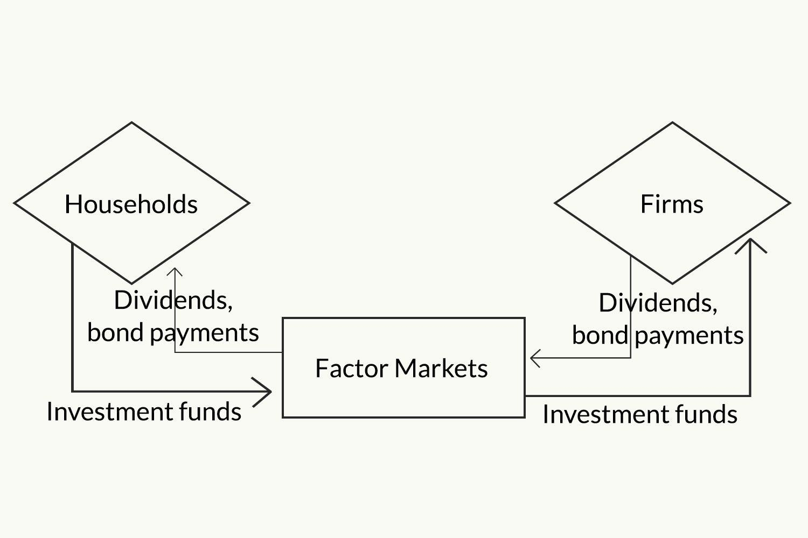

## Table of Contents

## What is the Circular Flow Model?

The Circular Flow Model is a simple economic model that shows how money and goods move between households and businesses in an economy. It's like a big circle where households give money to businesses when they buy things, and businesses give money to households when they pay workers or buy things from them. This model helps us understand how the economy works by showing the basic ways money moves around.

In the model, there are two main parts: the product market and the resource market. In the product market, households spend their money to buy goods and services from businesses. This is like when you go to a store and buy a toy or food. In the resource market, businesses pay households for their work or for using their resources, like when a company pays someone to work or rents land from someone. These two markets work together to keep the money flowing in a circle.

This model can be more complex when you add things like government, banks, and other countries, but the basic idea stays the same. It's all about showing how money and goods move in a cycle, helping everyone in the economy. By understanding this, we can see how different parts of the economy depend on each other and how changes in one part can affect the whole system.

## What are the main components of the Circular Flow Model?

The Circular Flow Model has two main parts: households and businesses. Households are families or people who live together. They have money that they use to buy things they need or want. Businesses are companies that make or sell these things. They need money to keep running and to pay the people who work for them. In the model, households give money to businesses when they buy goods and services, and businesses give money back to households when they pay workers or buy things from them.

The model also shows two markets where these exchanges happen: the product market and the resource market. The product market is where households spend their money to buy things from businesses, like toys, food, or clothes. This is the part where you see money moving from households to businesses. The resource market is where businesses pay households for their work or for using their resources, like paying someone to work or renting land. This part shows money moving from businesses back to households. Together, these markets keep the money flowing in a circle, showing how the economy works in a simple way.

## How does money flow in the Circular Flow Model?

In the Circular Flow Model, money moves in a big circle between households and businesses. Households are like families who have money to spend. When they go shopping, they use their money to buy things like food, toys, or clothes from businesses. This is called the product market. When households buy these things, their money goes to the businesses. So, in the product market, money flows from households to businesses.

The other part of the circle is the resource market. Here, businesses need people to work for them or they need to use resources like land. So, they pay households for their work or for using their resources. When businesses pay workers or rent land, money goes back to the households. This makes the money flow from businesses back to households. By going back and forth between these two markets, money keeps moving in a circle, helping the economy work.

## What is the difference between the two-sector and three-sector models?

The two-sector model of the Circular Flow Model is the simplest version. It only includes households and businesses. In this model, households buy goods and services from businesses in the product market, and businesses pay households for their work or resources in the resource market. Money flows in a circle between these two groups. This model is easy to understand because it shows the basic way money moves around in an economy.

The three-sector model adds the government to the mix. In this model, you still have households and businesses, but now the government is also part of the circle. The government collects taxes from both households and businesses. It uses this money to buy goods and services from businesses and to pay for things like schools, roads, and hospitals. The government also gives money back to households through things like social security or unemployment benefits. This model is more complex because it shows how the government affects the flow of money in the economy.

## How do households and businesses interact in the Circular Flow Model?

In the Circular Flow Model, households and businesses interact in two main ways: through the product market and the resource market. In the product market, households use their money to buy goods and services from businesses. This could be anything from food and clothes to toys and electronics. When households buy these things, their money goes to the businesses. This part of the model shows how money flows from households to businesses, helping businesses earn the money they need to keep running.

The other way households and businesses interact is in the resource market. Here, businesses need workers and other resources to make their goods and services. So, they pay households for their work or for using their resources, like paying someone to work or renting land. When businesses do this, money goes back to the households. This part of the model shows how money flows from businesses back to households, helping households earn the money they need to buy things. Together, these two markets keep the money moving in a circle, showing the basic way the economy works.

## What role do governments play in the Circular Flow Model?

In the three-sector model of the Circular Flow Model, the government plays an important role. The government collects taxes from both households and businesses. These taxes are like money that households and businesses have to give to the government. The government uses this money to buy goods and services from businesses. For example, they might buy things like computers, cars, or even buildings. This means that some of the money from households and businesses goes to the government, and then the government spends it back into the economy by buying from businesses.

The government also gives money back to households through things like social security, unemployment benefits, and other programs. This helps households have more money to spend on goods and services. So, in the Circular Flow Model, the government not only takes money out of the economy through taxes but also puts money back in by buying things and giving benefits. This makes the flow of money more complex but also helps keep the economy running smoothly by balancing out how money moves around.

## How does the inclusion of a foreign sector affect the Circular Flow Model?

When you add a foreign sector to the Circular Flow Model, it becomes a four-sector model. This means you now have households, businesses, the government, and other countries in the mix. Households and businesses can buy things from other countries, which is called imports. They pay money to businesses in other countries for these goods and services. On the other hand, businesses in your country can sell things to other countries, which is called exports. When they do this, they get money from businesses in other countries. This makes the flow of money more complicated because it now goes beyond just your own country.

Adding the foreign sector changes how money moves in the economy. Money can flow out of your country when you buy imports, and it can flow into your country when you sell exports. This means that the total amount of money in your country's economy can change because of what happens in other countries. The government might also get involved by setting rules about imports and exports to help balance the flow of money. Overall, the foreign sector makes the Circular Flow Model more realistic by showing how countries depend on each other in the global economy.

## What are leakages and injections in the Circular Flow Model?

In the Circular Flow Model, leakages are things that take money out of the circle. Imagine the money flowing around in a big circle between households and businesses. Sometimes, money can leak out of this circle. For example, when households save money instead of spending it, that money doesn't go to businesses. Another type of leakage happens when households or businesses pay taxes to the government. The money goes to the government and doesn't stay in the circle between households and businesses. If a country buys things from other countries, that's also a leakage because the money goes abroad.

Injections are the opposite of leakages. They are things that put money back into the circle. For example, when the government spends money on things like building roads or paying for schools, that money goes back to businesses. This is an injection because it adds money to the circle. Another injection happens when businesses in your country sell things to other countries. The money they get from these sales comes back into your country's economy. Investments by businesses, like buying new machines or starting new projects, are also injections because they add money to the circle. Injections help keep the economy moving by balancing out the leakages.

## How can the equilibrium in the Circular Flow Model be calculated?

In the Circular Flow Model, equilibrium happens when the total amount of money flowing into the circle equals the total amount flowing out. This means that the money households spend on goods and services from businesses is the same as the money businesses pay to households for their work and resources. If there are leakages, like savings, taxes, or money spent on imports, and injections, like government spending, investments, or money from exports, equilibrium is reached when the total leakages equal the total injections. When this happens, the economy is balanced, and the money keeps flowing smoothly.

To calculate this equilibrium, you need to add up all the leakages and all the injections. If the total leakages are the same as the total injections, then the economy is in equilibrium. For example, if households save $100, pay $200 in taxes, and spend $50 on imports, the total leakages are $350. If the government spends $150, businesses invest $100, and exports bring in $100, the total injections are also $350. Since the leakages equal the injections, the economy is in equilibrium, and the money flow is balanced.

## What are the limitations of the Circular Flow Model?

The Circular Flow Model is a simple way to understand how money moves around in an economy, but it has some limitations. One big limitation is that it can be too simple. It doesn't show all the different things that can happen in a real economy. For example, it might not show how prices change or how people make decisions about what to buy. It also doesn't show how things like inflation, unemployment, or interest rates can affect the economy. Because it's so simple, it can miss out on important details that are needed to understand how the economy really works.

Another limitation is that the model assumes that everything is always in balance. In the real world, things are not always balanced. Sometimes there are more leakages than injections, or more injections than leakages. This can lead to problems like recessions or booms. The model also doesn't show how money can be affected by things happening in other countries, like changes in the global economy. It's good for understanding the basic idea of how money moves, but it doesn't give the full picture of all the things that can happen in a real economy.

## How can the Circular Flow Model be used to analyze economic policies?

The Circular Flow Model can help us understand how different economic policies might affect the economy. When the government makes a new policy, like changing taxes or spending more money, it can change the flow of money in the model. For example, if the government decides to lower taxes, households will have more money to spend on goods and services from businesses. This would increase the flow of money from households to businesses in the product market. On the other hand, if the government decides to spend more on things like building roads, that money goes back into the economy as an injection, helping businesses and creating more jobs for households.

However, the model has its limits when it comes to analyzing these policies. It's a simple model, so it doesn't show all the details that can affect how a policy works in the real world. Things like how people react to policy changes, how prices might change, or how the policy might affect other countries are not shown in the model. So, while the Circular Flow Model can give us a basic idea of how money moves and how policies might change that flow, it's not enough on its own to understand all the effects of a new economic policy. We need to use other, more detailed models and real-world data to get a full picture.

## What advanced mathematical models can be applied to enhance the Circular Flow Model's accuracy?

To make the Circular Flow Model more accurate, economists can use more advanced mathematical models like the Input-Output Model. This model looks at how different parts of the economy depend on each other. It shows how the output from one industry becomes the input for another. For example, if a car factory needs steel, the Input-Output Model can show how the car industry depends on the steel industry. By using this model, we can see how changes in one part of the economy can affect other parts, making our understanding of the economy more detailed and accurate than just using the simple Circular Flow Model.

Another useful model is the Computable General Equilibrium (CGE) Model. This model is very detailed and can show how different economic policies might affect the whole economy. It takes into account things like prices, taxes, and how people make choices about what to buy. The CGE Model can help us see how a change in government spending or taxes might affect different groups of people and different industries. While these models are more complex and need a lot of data, they give a more complete picture of how the economy works and how policies can change the flow of money in ways that the basic Circular Flow Model can't show.

## What is the Circular Flow Model and how does it work?

The circular flow model serves as a fundamental framework in economics to represent how money, goods, and services circulate within an economy. This model provides insights into the interactions between two main economic [agents](/wiki/agents): producers (firms) and households. These interactions are crucial for understanding the structure and functioning of economic systems.

In its simplest form, the circular flow model includes two sectors: households and firms. Households provide factors of production, such as labor, land, and capital, to firms. In return, they receive wages, rent, and dividends, which constitute their income. Households then use this income to purchase goods and services produced by firms, creating a continuous flow of money that sustains economic activity.

Mathematically, the total economic activity can be encapsulated by the equation:

$$
GDP = C + I + G + (X - M)
$$

where $GDP$ is the Gross Domestic Product, $C$ represents consumption expenditures by households, $I$ denotes investments by firms, $G$ accounts for government spending, $X$ stands for exports, and $M$ for imports. This formula illustrates how the various elements of the circular flow contribute to the overall economic output.

The circular flow model is not static; it evolves with economic conditions. Events such as technological advancements, regulatory changes, and shifts in consumer preferences dynamically influence the interactions between households and firms. This adaptability of the model is essential for reflecting real-world economic fluctuations and trends over time.

In more complex versions of the model, additional sectors like government and foreign markets are included to portray a more comprehensive economic picture. These sectors introduce additional layers of interaction. For instance, governments collect taxes from households and firms and redistribute this income through public spending, altering the flow of resources. International trade introduces exchanges between domestic and foreign entities, impacting the balance of payments and economic equilibrium.

The circular flow model is pivotal in calculating a nation's GDP and understanding income distribution patterns. By tracking the flow of money between sectors, economists can derive valuable insights into economic health and sustainability. It is a vital tool for policymakers, aiding in strategic economic planning and informing decisions that affect economic stability and growth.

## How do Economic Models relate to Financial Flows?

Economic models play a pivotal role in understanding financial flows within an economy, offering a comprehensive framework for tracing the movement of funds across various sectors. Financial flow models are instrumental in delineating how investments, consumption, and government expenditures interact to shape economic dynamics. These models capture the intricate web of transactions that form the backbone of economic activity.

One fundamental application of financial flow models is to map the pathways through which monetary resources are allocated among different sectors, such as households, businesses, and government entities. This mapping is crucial for grasping the subsequent economic impacts resulting from these interactions. For example, increased consumer spending can stimulate production levels, leading to enhanced business revenue, employment, and, ultimately, further economic growth. Conversely, disruptions in these flows can trigger economic instability, necessitating corrective measures by policymakers.

Financial flow models typically embody the circular flow of income, which illustrates the cyclic nature of financial movement. In closed economies, this cycle involves only domestic entities, whereas in open economies, it includes international trade and finance aspects. The model comprises two core components: the real flow of goods and services and the financial flow of money. These flows are often represented in equations as:

$$
Y = C + I + G + (X - M)
$$

where $Y$ denotes the national income or GDP, $C$ is consumer spending, $I$ stands for investment, $G$ represents government expenditure, $X$ indicates exports, and $M$ refers to imports.

Such modeling facilitates the identification of bottlenecks or inefficiencies within an economy, enabling economists and policymakers to craft informed strategies for economic stabilization and growth. By analyzing financial flows, they can forecast potential adverse conditions, such as inflation or recession, and implement preemptive measures to mitigate their impact. This strategic foresight is vital for maintaining a balanced and healthy economic environment.

Moreover, the insights derived from financial flow models are essential for strategic planning. For instance, they assist in determining the optimal allocation of resources, ensuring that funds are directed toward sectors with the highest potential for economic return. Consequently, this supports sustainable economic development and resilience against macroeconomic fluctuations.

In conclusion, financial flow models serve as a cornerstone for understanding the intricate financial dynamics within economies. By tracing investment, consumption, and government expenditures, these models offer invaluable insights into fund movements and their economic repercussions, providing a foundation for effective policy formulation and economic management.

## References & Further Reading

[1]: Bergstra, J., Bardenet, R., Bengio, Y., & Kégl, B. (2011). ["Algorithms for Hyper-Parameter Optimization."](https://papers.nips.cc/paper/4443-algorithms-for-hyper-parameter-optimization) Advances in Neural Information Processing Systems 24.

[2]: ["Advances in Financial Machine Learning"](https://www.amazon.com/Advances-Financial-Machine-Learning-Marcos/dp/1119482089) by Marcos Lopez de Prado

[3]: ["Evidence-Based Technical Analysis: Applying the Scientific Method and Statistical Inference to Trading Signals"](https://www.amazon.com/Evidence-Based-Technical-Analysis-Scientific-Statistical/dp/0470008741) by David Aronson

[4]: ["Machine Learning for Algorithmic Trading"](https://github.com/PacktPublishing/Machine-Learning-for-Algorithmic-Trading-Second-Edition) by Stefan Jansen

[5]: ["Quantitative Trading: How to Build Your Own Algorithmic Trading Business"](https://books.google.com/books/about/Quantitative_Trading.html?id=j70yEAAAQBAJ) by Ernest P. Chan