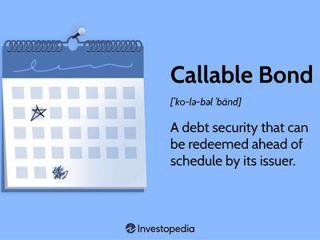

## Table of Contents

## What is a callable bond?

A callable bond is a type of bond that the issuer can decide to pay back early before it reaches its maturity date. This means the issuer can "call" the bond back from the investors. They usually do this when interest rates go down, so they can borrow money again at a lower rate.

For investors, this can be a bit risky because they might lose the chance to earn more interest if the bond is called back early. However, callable bonds often offer a higher interest rate at the start to make up for this risk. So, it's a trade-off: higher potential returns but also the chance that the bond might be called back sooner than expected.

## How does a callable bond work?

A callable bond works like this: when you buy it, you lend money to the issuer, like a company or government, and they promise to pay you back with interest over time. But there's a twist - the issuer can decide to pay you back early, before the bond's maturity date. They might do this if interest rates drop, because then they can borrow money again at a lower rate. This is called "calling" the bond.

For you, the investor, this means you might not get to earn all the interest you were hoping for if the bond gets called early. To make up for this risk, callable bonds usually offer a higher interest rate from the start. So, you have to weigh the chance of getting more interest against the possibility that the bond might be called back sooner than you expect. It's like a gamble - higher potential rewards, but also more uncertainty.

## What are the key features of a callable bond?

A callable bond has a few important features. First, it can be paid back early by the issuer before it reaches its maturity date. This is called being "called" back. The issuer might do this if interest rates go down, so they can borrow money again at a cheaper rate. This means that the investor might not get to earn all the interest they were expecting if the bond is called back early.

Second, because of this risk, callable bonds usually offer a higher interest rate at the start. This is to make up for the chance that the bond might be called back sooner than expected. So, investors have to think about whether the higher interest rate is worth the risk of the bond being called early. It's like a trade-off: you might get more money, but there's also more uncertainty.

## Why would a company issue a callable bond?

A company might issue a callable bond because it gives them flexibility. If interest rates go down after they've issued the bond, they can call it back and borrow money again at a lower rate. This saves them money on interest payments over time. It's like refinancing a loan when rates drop - it can make financial sense for the company.

However, this means the company has to offer a higher interest rate at the start to attract investors. Investors know there's a risk the bond might be called back early, so they want more interest to make up for that risk. It's a trade-off: the company gets flexibility and potential savings, but they have to pay more upfront to get it.

## What are the benefits of callable bonds for issuers?

Callable bonds give issuers a lot of flexibility. If interest rates go down after they issue the bond, they can call it back and borrow money again at a lower rate. This means they can save money on interest payments over time. It's like refinancing a loan when rates drop - it can be a smart move for the company to save money.

However, to get this flexibility, issuers have to offer a higher interest rate at the start to attract investors. Investors know there's a risk the bond might be called back early, so they want more interest to make up for that risk. It's a trade-off: the issuer gets the chance to save money later, but they have to pay more upfront to get it.

## What are the risks of callable bonds for investors?

Callable bonds can be risky for investors because the issuer might call the bond back early. This means the investor might not get to earn all the interest they were hoping for. If interest rates go down, the issuer can decide to pay back the bond and borrow money again at a lower rate. This is good for the issuer but bad for the investor, who loses out on future interest payments.

To make up for this risk, callable bonds usually offer a higher interest rate at the start. This is to attract investors, who know there's a chance the bond might be called back early. So, investors have to decide if the higher interest rate is worth the risk of the bond being called back before it matures. It's a bit like a gamble: you might get more money, but there's also more uncertainty.

## Under what circumstances can a callable bond be redeemed?

A callable bond can be redeemed by the issuer before it reaches its maturity date. This usually happens when interest rates go down. The issuer can then call back the bond and borrow money again at a lower rate. This saves them money on interest payments over time.

For the investor, this means they might not get to earn all the interest they were expecting if the bond is called back early. To make up for this risk, callable bonds often offer a higher interest rate at the start. This is to attract investors, who know there's a chance the bond might be called back before it matures. So, investors have to decide if the higher interest rate is worth the risk of the bond being called back early.

## How is the call price determined for a callable bond?

The call price for a callable bond is the amount the issuer has to pay to buy back the bond before it matures. This price is usually set when the bond is first issued and is often higher than the bond's face value. The reason for this is to give investors some extra money if the bond is called back early, as a way to make up for the interest they might miss out on.

The call price can also change over time, depending on the terms of the bond. Sometimes, the call price starts off high and then goes down as the bond gets closer to its maturity date. This gives the issuer an incentive to wait longer before calling the bond back, because it will cost them less to do so later on. So, the call price is a key part of the bond that both the issuer and the investor need to think about.

## What is the call protection period in a callable bond?

The call protection period is a time when the issuer of a callable bond can't call it back. This period is set at the start and gives investors some safety. They know they'll get to earn interest for at least that long before the bond might be called back early.

This protection is important for investors because it lets them plan better. They know they'll have a certain amount of time to earn interest without the risk of the bond being called back. It's like a promise from the issuer to leave the bond alone for a while, which can make the bond more attractive to investors.

## How do interest rate changes affect the likelihood of a bond being called?

When interest rates go down, it's more likely that a callable bond will be called back by the issuer. This is because the issuer can then borrow money again at a lower rate, which saves them money on interest payments. For example, if a company issued a bond at 5% interest and rates drop to 3%, they might call the bond back and issue a new one at the lower rate.

For investors, this means they might lose out on future interest payments if the bond is called back early. They have to think about this risk when they decide to buy a callable bond. The bond might offer a higher interest rate to start with, but there's always the chance it could be called back if rates go down.

## What strategies can investors use to manage the risk of callable bonds?

Investors can manage the risk of callable bonds by looking at the call protection period. This is a time when the issuer can't call the bond back, so investors know they'll get to earn interest for at least that long. By choosing bonds with longer call protection periods, investors can feel safer about their investment and plan better for the future.

Another strategy is to diversify their portfolio. Instead of putting all their money into callable bonds, investors can spread it out across different types of investments. This way, if one bond gets called back early, they won't lose all their potential interest. It's like not putting all your eggs in one basket - it helps to balance out the risk and reward.

## How do callable bonds compare to non-callable bonds in terms of yield and risk?

Callable bonds usually offer a higher yield than non-callable bonds. This is because they come with more risk for the investor. The issuer can decide to call the bond back early if interest rates go down, which means the investor might not get to earn all the interest they were hoping for. To make up for this risk, callable bonds start with a higher interest rate to attract investors. So, if you're thinking about buying a callable bond, you might get more money upfront, but there's also a chance you could lose out later.

Non-callable bonds, on the other hand, are safer for investors. Once you buy a non-callable bond, you know you'll get to keep it until it matures. This means you'll get all the interest payments you were promised, no matter what happens with interest rates. Because they're less risky, non-callable bonds usually offer a lower yield. So, it's a trade-off: you might earn less money with a non-callable bond, but you also have more certainty about what you'll get.

## What is the understanding of callable bonds?

Callable bonds are a type of fixed-income security issued by corporations or governments that allow the issuer to redeem the bonds before their maturity date, typically at a specified call price. This feature provides issuers with the flexibility to manage their debt more effectively, particularly in response to changing market conditions.

### Characteristics of Callable Bonds

1. **Call Feature**: The defining characteristic of callable bonds is the issuer's right to redeem the bonds, usually after an initial lockout period. The call price is often set above the bond's face value to compensate investors for the risk of early redemption.

2. **Interest and Coupon Rates**: Callable bonds usually offer higher interest or coupon rates than similar non-callable bonds to compensate investors for the risk of the bond being called.

3. **Call Protection**: This refers to the period during which the bond cannot be called. Call protection is crucial for investors as it safeguards against early redemption for a set period.

### Issuer Preference for Callable Bonds

Issuers may prefer callable bonds for several reasons:

1. **Interest Rate Environment**: If interest rates decline, issuers can call existing bonds and reissue new debt at a lower rate, reducing their cost of capital.

2. **Debt Management**: Callable bonds provide issuers with the flexibility to reduce or restructure debt as part of broader financial strategies.

3. **Strategic Opportunities**: By redeeming bonds early, issuers can take advantage of favorable market conditions, such as rising bond prices.

### Impact of Interest Rates on Callable Bonds

Interest rates play a pivotal role in the decision-making process for calling bonds:

- **Declining Interest Rates**: When interest rates fall, issuers are more likely to call bonds and refinance at lower rates.

- **Increased Call Probability**: The likelihood of a bond being called increases in a declining interest rate environment. This affects the yield calculations for investors, who must consider the possibility of reinvestment at lower rates.

The decision to call a bond can be influenced by the formula:

$$
\text{Call Decision} = \begin{cases} 
\text{Call the bond}, & \text{if } r_{current} < r_{coupon} \\
\text{Do not call}, & \text{otherwise}
\end{cases}
$$

where $r_{current}$ is the current market interest rate and $r_{coupon}$ is the bond's coupon rate.

### Differentiation from Non-Callable Bonds

Callable bonds differ from non-callable bonds principally in terms of risk and benefits:

1. **Risks**:
   - **Reinvestment Risk**: Investors face the risk of bonds being called during periods of declining interest rates, leading to reinvestment at lower yields.
   - **Price Volatility**: Callable bonds are generally more volatile due to the embedded call option, which affects pricing.

2. **Benefits**:
   - **Higher Yields**: In compensation for the call risk, callable bonds typically offer higher coupon rates than non-callable bonds.
   - **Potential for Capital Gain**: If an issuer does not call the bonds, investors may benefit from higher interest earnings.

Overall, callable bonds provide issuers with strategic financial options aligned with market conditions while presenting unique risk-reward profiles for investors. Understanding these dynamics is crucial for making informed investment decisions.

## References & Further Reading

[1]: ["Advances in Financial Machine Learning"](https://www.amazon.com/Advances-Financial-Machine-Learning-Marcos/dp/1119482089) by Marcos Lopez de Prado

[2]: ["Machine Learning for Algorithmic Trading"](https://www.amazon.com/Machine-Learning-Algorithmic-Trading-alternative/dp/1839217715) by Stefan Jansen

[3]: ["Quantitative Trading: How to Build Your Own Algorithmic Trading Business"](https://github.com/LucindaYa/quant-resources/blob/master/Quantitative%20Trading%20How%20to%20Build%20Your%20Own%20Algorithmic%20Trading%20Business.pdf) by Ernest P. Chan

[4]: Fabozzi, F. J. (2007). ["Fixed Income Analysis."](https://www.amazon.com/Fixed-Income-Analysis-Frank-Fabozzi/dp/047005221X) John Wiley & Sons.

[5]: Tuckman, B., & Serrat, A. (2011). ["Fixed Income Securities: Tools for Today's Markets."](https://www.amazon.com/Fixed-Income-Securities-Todays-Markets/dp/0470891696) John Wiley & Sons.