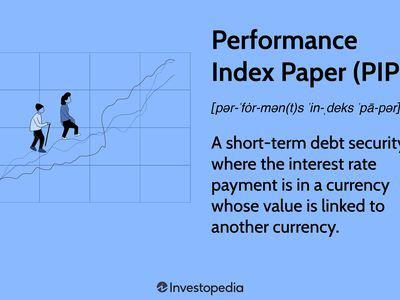

The world of finance is perpetually in a state of flux, driven by the interplay of various industries that continuously fuel innovation. An intriguing convergence is emerging among circus performances, exchange entertainment, and algorithmic trading—fields that initially seem unrelated. This article explores these domains to reveal their surprising intersections and how they shape the modern landscapes of entertainment and trading.

Circus performances have long captivated audiences with their blend of artistry, precision, and risk-taking. Similarly, financial markets necessitate a harmonious integration of diverse elements, requiring traders and algorithms to perform with timing and accuracy. By examining circus performances, we can gain insights into the high-stakes nature of algorithmic trading, where calculated risks are paramount.



Exchange entertainment adds another layer to this discussion by merging financial activities with performance art. This fusion not only entertains but also educates audiences about the mechanics of trading. It highlights the similarities between crafting an engaging performance and executing high-stakes financial maneuvers, both of which demand creativity and keen strategic foresight.

Algorithmic trading stands as the backbone of modern finance, altering the way financial transactions are executed with minimal human input. Understanding its history and the strategies employed offers a window into its strategic importance in today's fast-paced markets. By considering algorithmic trading through the lens of performance art, new perspectives on innovation and stakeholder engagement surface.

The convergence of performance and trading presents both challenges and opportunities. On one hand, issues such as data privacy and market volatility require careful management; on the other, creative authenticity and innovation at this intersection offer exciting possibilities for market participants. This evolution promises to blur industry lines even further in the future and foster cross-industry collaborations as technology continues to advance.

In conclusion, circus performance, exchange entertainment, and algorithmic trading illustrate the dynamic nature of our modern economy. Each field brings unique perspectives on innovation, risk, and creativity, and their convergence reveals the intricate ecosystems emerging at the junction of entertainment and finance. Understanding these synergies enriches our appreciation of how these ostensibly distinct realms influence and enhance each other.

## Table of Contents

## Circus Performance as a Metaphor

Circus performances serve as an apt metaphor for understanding complex systems, such as those found in financial markets. Both domains require a high degree of precision, timing, and creativity to achieve success. In a circus, performers must execute their acts with exactness and coordination to captivate audiences, much like how financial market participants must synchronize various elements and stakeholders to identify and capitalize on profitable opportunities.

In financial markets, traders and investors work within a multifaceted ecosystem, where prices are influenced by myriad factors, including economic indicators, geopolitical developments, and market sentiment. This environment mirrors the interdependent nature of a circus, where each act—whether it be trapeze artists, clowns, or acrobats—must be flawlessly timed and executed to ensure the show's overall harmony and success. Similarly, market participants must navigate an intricate web of variables and make timely decisions to realize gains and mitigate risks.

The calculated risks associated with [algorithmic trading](/wiki/algorithmic-trading) can be likened to the high-stakes nature of circus performances. Just as a tightrope walker carefully assesses the tension and angle of the rope before making a daring crossing, algorithmic traders devise strategies that account for variables such as market [volatility](/wiki/volatility-trading-strategies), [liquidity](/wiki/liquidity-risk-premium), and transaction costs. In both cases, the ability to manage risk and execute with precision can mean the difference between success and failure. 

Circus performers often push the boundaries of what is physically possible, relying on creativity to devise new acts that enthrall spectators. In a similar fashion, algorithmic trading strategies employ innovative techniques to capitalize on market inefficiencies. Developers of these algorithms use advanced statistical methods and [machine learning](/wiki/machine-learning) models to improve predictive accuracy and optimize trading performance. Python libraries such as NumPy and Pandas facilitate complex computations, while machine learning frameworks like TensorFlow and PyTorch are leveraged to enhance decision-making processes.

In essence, circus performances and financial markets converge in their shared requirement for precision, creativity, and risk management. Recognizing these parallels provides insights into how algorithmic trading strategies can be crafted to achieve optimal outcomes, much like planning and executing a successful circus act.

## Exchange Entertainment: Blending Creativity with Finance

Financial markets have evolved beyond traditional perceptions of dry, data-driven operations, increasingly incorporating elements of entertainment and engagement. This novel concept, often referred to as "exchange entertainment," blends the worlds of finance and performance art to create captivating experiences that not only entertain but also educate audiences about trading mechanisms.

Exchange entertainment is designed to demystify financial markets by using elements of storytelling, theater, and visual art. This approach allows audiences to better understand complex financial instruments and market behaviors. For example, trading competitions, interactive stock market simulations, and live demonstrations by market professionals can transform abstract trading concepts into engaging experiences. These events often attract significant audiences, keen to witness the dynamic interplay of financial decisions played out in real-time.

Live financial theater is one such form where actors dramatize market scenarios, bringing to life the strategies and decisions that traders face. This performance-based learning helps in illustrating how market dynamics work, explaining concepts like stock fluctuations, market trends, and trading strategies. By witnessing these dramatizations, audiences gain insights into market volatility and risk management, usually reserved for financial experts.

The integration of virtual reality (VR) and [artificial intelligence](/wiki/ai-artificial-intelligence) (AI) has further enhanced exchange entertainment. VR can simulate trading floors, providing immersive experiences where users can engage with holographic market data. Participants can manipulate market variables, witnessing the immediate impacts of their decisions. This hands-on approach to learning nurtures a deeper understanding of the financial landscape. AI, on the other hand, can analyze audience interactions and adapt educational content in real-time, offering a personalized learning journey.

Moreover, gamification plays a pivotal role in exchange entertainment. Platforms that incorporate game elements, such as leaderboards, rewards, and competitive trading challenges, make learning about financial markets more engaging. These gamified systems motivate participants by incorporating elements of challenge and reward, similar to how traditional games captivate their audiences. As participants strive to achieve objectives and climb leaderboards, they inadvertently absorb trading knowledge and skills.

By fostering an environment that blends creativity with finance, exchange entertainment not only serves as an educational tool but also broadens the appeal of financial markets to a wider audience. This innovative convergence underscores a fundamental shift in how financial education is approached, proving that markets can indeed be entertaining—without losing the depth and intricacy that characterize the world of trading. Through exchange entertainment, the esoteric world of financial markets becomes accessible and engaging, offering a window into the mechanics of trading that is as educational as it is exciting.

## Algorithmic Trading: The Backbone of Modern Finance

Algorithmic trading has fundamentally transformed the execution of financial transactions by eliminating much of the human intervention traditionally required. Its evolution is marked by technological advancements and a deeper understanding of financial markets, which have together paved the way for more precise and efficient trading mechanisms.

Historically, trading in financial markets relied heavily on human judgment and manual processes. However, with the advent of computers and the development of trading models, algorithms began to play a pivotal role. The use of algorithms in trading gained significant traction in the late 20th century with the rise of electronic exchanges and the growing need for speed and accuracy.

At its core, algorithmic trading involves the use of pre-programmed instructions to automate the trading process. These instructions, or algorithms, can consider a variety of factors such as time, price, and [volume](/wiki/volume-trading-strategy) to execute trades at optimal conditions. The primary advantage of this approach lies in its ability to process vast amounts of data at speeds far beyond human capability, allowing traders to exploit small market inefficiencies and execute orders at the best possible prices. 

Numerous strategies leverage algorithmic systems, each catering to different aspects of market dynamics. One common strategy is statistical [arbitrage](/wiki/arbitrage), which uses statistical models to identify and exploit price differentials between related securities. Another popular approach is [trend following](/wiki/trend-following), where historical data is analyzed to predict the likelihood of a future movement in a particular direction.

For instance, a simple moving average crossover strategy might involve buying a stock when a short-term moving average crosses above a long-term moving average and selling when the opposite occurs. Here is an example of how such a strategy might be implemented in Python:

```python
import numpy as np
import pandas as pd

# Simulated data
data = pd.DataFrame({'price': [...], 'date': [...]})

# Example of moving averages
data['short_mavg'] = data['price'].rolling(window=20).mean()
data['long_mavg'] = data['price'].rolling(window=50).mean()

# Generating signals
data['signal'] = 0
data['signal'][20:] = np.where(data['short_mavg'][20:] > data['long_mavg'][20:], 1, -1)

# Calculate returns
data['returns'] = data['price'].pct_change()
data['strategy_returns'] = data['signal'].shift(1) * data['returns']
```

Although algorithmic trading provides strategic advantages such as improved market efficiency and reduced transaction costs, it also introduces complexities and challenges. These include the potential for increased market volatility and systemic risk due to the high-frequency nature of some trading strategies. Regulatory bodies have thus introduced guidelines to mitigate these risks and ensure market stability.

In today's fast-paced market environment, algorithmic trading is not merely a technological innovation but a strategic necessity. Its continued evolution promises further efficiency gains and opportunities for expertise in financial markets. Understanding this landscape is crucial for recognizing its impact on modern finance.

## The Convergence of Performance and Trading

Circus performances, exchange entertainment, and algorithmic trading converge through their shared reliance on precision, timing, and engagement. This convergence can be analyzed by exploring how performance art principles influence algorithmic strategies and examining case studies that illustrate successful integrations of these fields.

Performance art is characterized by meticulous planning, execution, and audience interaction. Similarly, algorithmic trading strategies depend on precise calculations to execute trades at the optimal moment, factoring in variables such as market conditions, asset volatility, and liquidity. Algorithms are designed to capitalize on these elements, executing trades faster than human counterparts and responding instantaneously to market cues. The strategic aim is akin to a well-rehearsed circus act, where harmony and timing are crucial.

Conversely, the concepts used in algorithm design can enhance performance arts. For instance, predictive algorithms can analyze audience reaction data, allowing entertainers to adjust their acts in real-time, optimizing engagement and ensuring that performances remain captivating. This data-driven approach can refine traditional entertainment experiences, leading to productions that resonate more profoundly with audiences.

Numerous case studies exemplify the successful merging of these domains. One notable example is Cirque du Soleil, renowned for reinvigorating the circus industry by integrating technology with live performances. Their productions employ complex lighting algorithms and sound design that dynamically respond to performers' movements, enhancing the sensory experience for audiences.

In the exchange entertainment sphere, platforms like TradeHero gamify trading by simulating financial markets, allowing users to experience the thrills and intricacies of trading in an engaging manner. This integration of entertainment and finance educates users on market mechanics while keeping them engaged, a testament to the potential for cross-domain innovation.

The convergence of performance and trading highlights the potential for creative and technological synergies, showing how disciplines can inspire new strategies and experiences in seemingly unrelated industries.

## Challenges and Opportunities

The fusion of entertainment and financial trading presents an intriguing landscape filled with both challenges and opportunities. The challenge lies primarily in balancing human creativity with technological precision while safeguarding the integrity of market operations. 

One of the foremost concerns in this integration is data privacy. Trading and entertainment platforms that merge must handle vast amounts of sensitive data, such as user demographic information, transaction histories, and behavioral patterns. Ensuring that this data remains secure is paramount. In response, companies need robust data protection protocols, such as end-to-end encryption and strict access controls, to prevent data breaches and maintain user trust. GDPR compliance, for example, serves as a critical framework to ensure data protection standards are met across the board [1].

Market volatility is another significant challenge that can disrupt the successful integration of entertainment and trading. The unpredictable nature of financial markets can render algorithmic trading strategies ineffective and impact the stability of entertainment offerings tied to market outcomes. To mitigate this, advanced machine learning algorithms can be employed to predict market movements more accurately, providing a buffer against volatility. These algorithms can analyze historical data and identify trends, allowing for more informed decision-making.

Creative authenticity represents a unique hurdle. As financial trading merges with entertainment, maintaining the creativity that captivates audiences without compromising the analytical rigor required in trading is essential. For this, collaborations between artists and financial experts are vital, fostering an environment where storytelling and financial narratives coalesce. 

Despite these challenges, there are abundant opportunities for innovation. Financial literacy stands to benefit significantly from the entertainment-infused trading approach. By gamifying trading and incorporating educational content into entertainment, platforms can make financial concepts accessible to a broader audience. Consider a scenario where interactive shows let audiences participate in constructing financial strategies or predicting market movements, enhancing their understanding of complex financial systems.

Moreover, this convergence can spur technological advancements. Developing immersive experiences such as virtual reality (VR) environments for trading simulations not only enriches user experience but also offers practical training for aspiring traders. The cross-pollination of ideas between sectors encourages the creation of cutting-edge technologies capable of transforming how we perceive both finance and entertainment.

In summary, while there are challenges to overcome in the integration of these two complex fields, the potential benefits such as enhanced data security, improved market forecasts, and increased financial literacy provide a promising outlook for market participants eager to innovate.

---

References:

[1] European Union. (2016). General Data Protection Regulation (GDPR). Retrieved from https://gdpr.eu/

## Future Outlook

As technology advances, the possibilities within financial markets and entertainment continue to expand. A key trend expected to shape the future of algorithmic trading is the increasing incorporation of artificial intelligence (AI) and machine learning (ML). These technologies offer the ability to analyze vast amounts of data at unprecedented speeds, enabling traders to make more informed decisions. Predictive analytics powered by AI can identify patterns in market behavior, offering insights that were previously unattainable. For instance, advanced ML algorithms can adapt to changing market conditions, enhancing trading strategies significantly.

Quantum computing is another promising frontier that could revolutionize algorithmic trading. With its ability to process complex calculations exponentially faster than classical computers, quantum computing could optimize trading algorithms to unforeseen levels of efficiency. This could lead to more accurate pricing models and risk management strategies, benefiting the entire financial ecosystem.

Exchange entertainment is also poised for transformation, as virtual and augmented reality technologies become more prevalent. These immersive technologies can create engaging educational experiences for audiences, merging the excitement of performance art with the intricacies of financial markets. Virtual trading floors, for example, could allow users to interact with financial data in real-time, providing a deeper understanding of market dynamics through a gamified approach.

Cross-industry collaborations will likely further blur the lines between finance and entertainment. Collaborations between tech companies, financial institutions, and entertainment providers can lead to innovative solutions that enhance user engagement and offer novel experiences. For example, partnerships could lead to the development of interactive financial education platforms tailored to diverse audiences.

Moreover, the decentralization trend, highlighted by blockchain technology, presents opportunities to redefine the structures of both industries. Decentralized finance (DeFi) platforms are gaining traction, providing financial services through smart contracts without intermediaries. This disruption could be mirrored in the entertainment industry, where decentralized platforms enable artists to distribute their work directly to audiences, revolutionizing traditional content delivery models.

Lastly, sustainability is becoming a crucial focus, as both industries seek to minimize their environmental impact. Algorithmic trading systems can incorporate sustainability metrics, while entertainment productions increasingly adopt eco-friendly practices. The intersection of finance and entertainment could spur initiatives that support sustainable innovation.

In conclusion, the future of financial markets and entertainment is intertwined with emerging technologies and collaborative efforts. These developments promise a landscape where algorithmic trading and exchange entertainment not only coexist but enrich each other, driving both sectors toward unprecedented growth and innovation.

## Conclusion

Circus performance, exchange entertainment, and algorithmic trading exemplify the evolving dynamics of the modern economy, each contributing unique innovations and challenges. Circus performances represent the artistry, precision, and risk management necessary in the world of finance, transforming complex market movements into relatable, visual metaphors. This performance art exemplifies the creativity required to engage an audience, akin to capturing the attention of investors and traders through compelling market strategies.

Exchange entertainment merges creativity with finance, blending the thrill of performance with market transaction education. This hybrid approach not only makes financial markets more accessible to the public but also fosters a deeper understanding of financial mechanisms. Such engagement also inspires novel financial products and services, mirroring circus innovations that continually captivate audiences with fresh acts.

Algorithmic trading, the modern backbone of finance, epitomizes technological advancement and strategic precision, much like the coordination seen in circus acts. Its evolution demonstrates a successful marriage of computer science and economics, executing trades with a speed and accuracy that humans alone cannot achieve. This technology-driven component of finance showcases innovation's role in reducing market frictions and enhancing liquidity.

Understanding their convergence offers insights into the intricate ecosystems that entertainment and finance create. These converging fields encourage a culture of continual innovation, necessitating an agile response to market and audience demands. The symbiotic relationship between performance art and algorithmic trading paints a future where creativity and technology intersect seamlessly, driving both sectors forward. This fusion underscores the ineffable link between art and commerce, highlighting the necessity for multidisciplinary approaches in solving contemporary economic challenges.

## References & Further Reading

[1]: Bergstra, J., Bardenet, R., Bengio, Y., & Kégl, B. (2011). ["Algorithms for Hyper-Parameter Optimization."](https://dl.acm.org/doi/10.5555/2986459.2986743) Advances in Neural Information Processing Systems 24.

[2]: ["Advances in Financial Machine Learning"](https://www.amazon.com/Advances-Financial-Machine-Learning-Marcos/dp/1119482089) by Marcos Lopez de Prado

[3]: ["Evidence-Based Technical Analysis: Applying the Scientific Method and Statistical Inference to Trading Signals"](https://www.amazon.com/Evidence-Based-Technical-Analysis-Scientific-Statistical/dp/0470008741) by David Aronson

[4]: ["Machine Learning for Algorithmic Trading"](https://github.com/stefan-jansen/machine-learning-for-trading) by Stefan Jansen

[5]: ["Quantitative Trading: How to Build Your Own Algorithmic Trading Business"](https://www.amazon.com/Quantitative-Trading-Build-Algorithmic-Business/dp/1119800064) by Ernest P. Chan

[6]: White, L. H. (2017). ["Algorithmic and High-Frequency Trading."](https://academic.oup.com/book/55158/chapter/424085051) Mercatus Center at George Mason University. 

[7]: Dunn, J. (2018). ["Game On: Gamification, Gameful Design, and the Rise of the Gamer Educator."](https://muse.jhu.edu/book/57199) Simulation & Gaming.