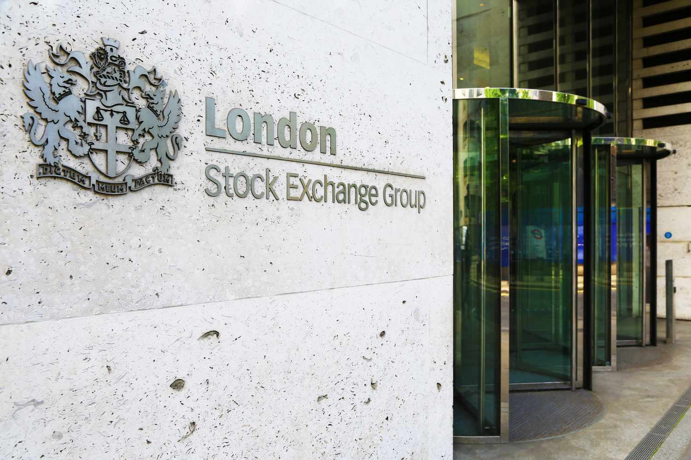

Hedge funds play a pivotal role within financial services, providing investment opportunities for both individual and institutional investors. Among these, Citadel Investment Group, established in 1990 by Kenneth C. Griffin, has gained remarkable prominence as a global hedge fund leader. A defining feature of Citadel's operations is its strategic use of algorithmic trading, a method designed to enhance both the speed and efficiency of trading activities. This involves the deployment of automated trading strategies driven by sophisticated algorithms. Such algorithms enable rapid decision-making in trading, leveraging large datasets to capitalize on market opportunities.

Emphasizing algorithm-driven strategies allows Citadel to maintain a competitive edge by executing trades with minimal latency and maximizing market inefficiencies. The firm's focus on technology and data analytics underpins its algorithmic trading, demonstrating the significant impact of technology in modern investment strategies. Understanding Citadel's approach offers insight into the evolving strategies employed by hedge funds in today's dynamic financial markets. This reflects an ongoing trend toward integrating technology, illustrating how algorithmic trading continues to revolutionize financial market operations.

## Table of Contents

## Citadel Investment Group: A Brief Overview

Citadel LLC, established by Kenneth C. Griffin in 1990, is a renowned global financial institution headquartered in Chicago. Since its inception, Citadel has expanded its presence, establishing offices in major financial centers worldwide, thus enhancing its ability to access a diverse array of markets and opportunities.

The institution is structured into two principal divisions: Citadel, which focuses on managing alternative investments, and Citadel Securities, a premier market-making entity. Citadel's [hedge fund](/wiki/hedge-fund-trading-strategies) business is known for managing a broad spectrum of asset classes, including equities, fixed income, commodities, and more. This diversification across various financial instruments allows Citadel to deploy multiple investment strategies, optimizing performance under varying market conditions.

A key [factor](/wiki/factor-investing) distinguishing Citadel is its advanced trading infrastructure, which supports both its hedge fund and market-making operations. The firm has consistently invested in developing and maintaining cutting-edge technology to address complex market challenges effectively. Such innovation is central to Citadel's approach, enabling it to execute trades with remarkable speed and precision while ensuring resilience in volatile markets.

Citadel's influence extends beyond mere transactional operations, significantly affecting market liquidity and price stability. By participating actively in numerous markets, Citadel helps facilitate smoother market movements and tighter bid-ask spreads, thereby contributing to overall market efficiency. Through its sophisticated trading capabilities and strategic market interactions, Citadel remains an integral player in maintaining and advancing market integrity.

## Algorithmic Trading in Financial Markets

Algorithmic trading, also known as algo trading, has revolutionized the financial markets by allowing the implementation of automated trading processes that can perform with remarkable speed and precision. These automations are executed through sophisticated algorithms designed to analyze market data and perform trades based on pre-defined criteria, which optimizes operational efficiency and harnesses market opportunities swiftly. One fundamental characteristic of [algorithmic trading](/wiki/algorithmic-trading) is its capacity for high-frequency trading ([HFT](/wiki/high-frequency-trading-strategies)), where traders execute numerous transactions within fractions of a second. This high-speed capability enables traders to capitalize on small price discrepancies that may exist for only very brief periods.

Utilizing advanced algorithms, financial firms are equipped to conduct trading operations at speeds unattainable by human traders. This is achieved by leveraging computational technologies to process vast amounts of market data in real-time and to execute trades correspondingly. The trading strategies often employed include statistical [arbitrage](/wiki/arbitrage), [trend following](/wiki/trend-following), and mean reversion, which contribute to rapid trade execution and enhanced market efficiency. Algorithmic trading helps in reducing transaction costs by allowing for optimal order execution and minimizing the market impact through smart order routing techniques.

A significant advantage of algorithmic trading is its ability to operate without the need for human intervention during the trading process. This autonomy eliminates the influence of human emotional biases, allowing decisions purely based on quantitative data and predefined algorithms. Human errors or emotional decisions, such as panic selling or irrational exuberance, which can adversely impact trading outcomes, are mitigated with automated strategies.

Real-time data processing capabilities are crucial to algorithmic trading systems. Algorithms leverage real-time data feeds to make informed decisions, employing APIs and other data integration tools to ensure quick and accurate trade execution. This enhances the reliability of trading activities and allows traders to respond swiftly to market changes. As technology continues to evolve, algorithmic trading is expected to broaden its reach across different financial instruments, including equities, commodities, and foreign exchange markets, by incorporating advances like [machine learning](/wiki/machine-learning) and [artificial intelligence](/wiki/ai-artificial-intelligence). These technologies aid in developing more adaptable strategies that can anticipate market shifts with greater accuracy, thereby refining decision-making processes and enhancing trade precision.

In summary, algorithmic trading stands as a transformative force in modern finance, delivering efficient trading solutions that promise increased accuracy, reduced costs, and greater market [liquidity](/wiki/liquidity-risk-premium). Its continued evolution holds the potential for even greater advancements in trade execution and strategy development.

## Citadel's Algorithmic Trading Strategies

Citadel Investment Group stands as a frontrunner in employing algorithmic trading strategies to sustain its competitive position in the financial industry. The firm extensively uses high-frequency trading (HFT) techniques, allowing them to execute a multitude of trades with minimal latency. This capability is primarily achieved through their significant investment in advanced technology and cutting-edge data analytics.

High-frequency trading necessitates the rapid execution of transactions, often in fractions of a second, providing Citadel an advantage in exploiting market inefficiencies that arise briefly. The firm’s algorithms are designed to process large datasets, identifying lucrative trading signals that might remain invisible to human traders. For instance, these algorithms can rapidly analyze price movements and historical data to predict short-term trends, providing opportunities for profit.

To maintain their stature as leaders in algorithmic trading, Citadel continually refines its trading models. This ongoing enhancement process involves leveraging machine learning techniques to optimize the predictive power of their algorithms. Machine learning models can be crafted by using Python libraries such as TensorFlow or PyTorch, where historical market data serves as the training dataset. The efficacy of these models is judged based on their capacity to minimize error in prediction, thereby increasing the accuracy of trade executions.

Citadel's algorithmic strategies are supported by their robust technological infrastructure, enabling swift data processing and decision execution. This ensures that their trading algorithms function optimally even during volatile market periods. By refining their models and integrating sophisticated data analysis tools, Citadel maintains its leadership and innovative edge in the algorithmic trading domain.

## Impact on the Financial Industry

Citadel's algorithmic trading operations significantly influence both market liquidity and price discovery within financial markets. By leveraging advanced algorithms, Citadel facilitates high trading volumes which contribute to tighter spreads in various asset classes. This efficiency is achieved through rapid transaction processing and the execution of trades at optimal prices, thus enhancing overall market functioning.

Algorithmic trading, while providing efficiency, also introduces risks such as "flash crashes." These are sudden and severe market price movements triggered by automated trading activities. Such events highlight the necessity for rigorous risk management protocols and regulatory oversight. By monitoring algorithmic trading activities, regulators aim to mitigate systemic risks and maintain market stability. For instance, implementing circuit breakers can temporarily halt trading to address extreme [volatility](/wiki/volatility-trading-strategies).

Despite these challenges, algorithmic trading remains a cornerstone of modern financial markets, driving innovation in trade execution. It enables quick adaptation to market conditions through the utilization of real-time data analysis, thus optimizing trading strategies. The strategic deployment of algorithms by institutions like Citadel exemplifies their critical role in advancing financial technology and bolstering market resilience. As financial markets continue to evolve, algorithmic trading's influence on market dynamics and efficiency will likely expand, reinforcing its integral role in contemporary finance.

## The Future of Algo Trading at Citadel

Citadel Investment Group is at the forefront of incorporating emerging technologies such as machine learning and quantum computing into its algorithmic trading strategies. These technologies promise to significantly enhance the firm's trading capabilities by enabling more predictive analytics. Machine learning, with its ability to process vast amounts of data and identify complex patterns, refines Citadel's decision-making processes. This results in enhanced trade precision and efficiency, as algorithms become adept at identifying profitable trading opportunities in real-time.

Quantum computing represents a potential leap in computational power, enabling Citadel to tackle problems and datasets that are currently beyond the reach of classical computing methods. By utilizing quantum algorithms, Citadel aims to solve optimization problems more efficiently, potentially leading to faster and more accurate trading decisions. This could transform trade execution strategies, particularly in high-frequency trading environments where speed and accuracy are paramount.

Citadel also emphasizes a strong commitment to ethical trading practices and rigorous regulatory compliance. This focus ensures that, even as it leverages advanced technologies, the firm adheres to industry standards and best practices. In doing so, Citadel not only protects itself from legal and reputational risks but also contributes to the overall trust and integrity of the financial markets.

In an era of rapid technological advancement and evolving regulations, Citadel's dedication to innovation positions it as a leader in the algorithmic trading landscape. By continuously exploring and integrating cutting-edge technologies, Citadel is well-prepared to navigate future challenges in the financial industry and maintain its competitive edge. As such, Citadel's approach serves as a benchmark for other firms in the field, highlighting the importance of balancing technological advancement with ethical and compliant trading practices.

## Conclusion

Citadel Investment Group showcases the significant impact of algorithmic trading within financial markets. By strategically employing advanced technology, Citadel enhances market operations through increased efficiency and stability. This deployment of technology streamlines processes, reduces transaction costs, and optimizes trade execution, thus reinforcing stability within the financial system. Citadel's emphasis on ethical trading practices, combined with its focus on innovation, sets a high standard for the industry, demonstrating how firms can balance profitability with responsible trading. 

As algorithmic trading continues to grow and evolve, Citadel stands as a leader in defining efficient investment strategies. By integrating emerging technologies, such as machine learning, Citadel is better equipped to handle complex market data, improving decision-making capabilities and trade precision. This adaptability positions Citadel as a critical player in shaping the future dynamics of financial markets. The firm's commitment to maintaining ethical standards and regulatory compliance ensures that its advancements in trading technologies will sustainably contribute to the evolution of financial markets. 

Through these efforts, Citadel not only solidifies its leadership in algorithmic trading but also underscores the potential for technology to drive progress and maintain stability in a rapidly changing financial landscape.

## References & Further Reading

[1]: Bergstra, J., Bardenet, R., Bengio, Y., & Kégl, B. (2011). ["Algorithms for Hyper-Parameter Optimization."](https://dl.acm.org/doi/10.5555/2986459.2986743) Advances in Neural Information Processing Systems 24.

[2]: ["Advances in Financial Machine Learning"](https://www.amazon.com/Advances-Financial-Machine-Learning-Marcos/dp/1119482089) by Marcos Lopez de Prado

[3]: ["Evidence-Based Technical Analysis: Applying the Scientific Method and Statistical Inference to Trading Signals"](https://www.amazon.com/Evidence-Based-Technical-Analysis-Scientific-Statistical/dp/0470008741) by David Aronson

[4]: ["Machine Learning for Algorithmic Trading"](https://github.com/stefan-jansen/machine-learning-for-trading) by Stefan Jansen

[5]: ["Quantitative Trading: How to Build Your Own Algorithmic Trading Business"](https://www.amazon.com/Quantitative-Trading-Build-Algorithmic-Business/dp/1119800064) by Ernest P. Chan