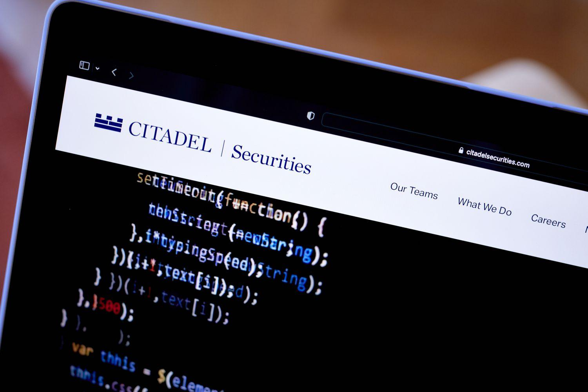

Citadel LLC stands as a titan within the hedge fund and financial services industry, recognized for its pioneering approach and impressive growth trajectory. Founded by Kenneth C. Griffin in 1990, Citadel has evolved from a small trading firm into a formidable powerhouse managing over $63 billion in assets. This remarkable growth underscores its strategic foresight and robust business practices, positioning it as an influential entity within the global financial markets.

Citadel's significance in the financial industry is particularly pronounced in algorithmic trading, where it has established itself as a leader. By leveraging technology and innovative strategies, Citadel has been able to execute trades with unprecedented speed and precision, thus setting a benchmark for efficiency and accuracy. The firm's focus on algorithmic trading not only enhances its performance but also contributes to market liquidity and price discovery, making it an integral player in shaping financial market dynamics. Through constant innovation and adaptation, Citadel continues to influence and lead the ever-evolving landscape of algorithmic trading.

## Table of Contents

## The Rise of Algorithmic Trading

Algorithmic trading has revolutionized the financial markets by transforming how trades are executed and strategies are developed. Initially emerging in the late 20th century, algorithmic trading leverages automated systems and complex algorithms to perform trades with remarkable speed and precision. These systems analyze vast amounts of data, capitalize on market inefficiencies, and execute trades faster than any human trader could.

At its core, algorithmic trading relies on a set of programmed instructions for trading, which can be based on timing, price, quantity, or any mathematical model. These algorithms follow prescribed rules to identify opportunities and [carry](/wiki/carry-trading) out transactions across various financial instruments like stocks, bonds, and currencies. The central advantage lies in its ability to process data and execute trades in milliseconds, outperforming traditional trading methods that involve human decision-making processes.

The benefits of [algorithmic trading](/wiki/algorithmic-trading) are manifold. Firstly, it enhances efficiency by enabling traders to respond swiftly to market changes and capitalize on fleeting opportunities. It improves accuracy, as algorithms can be rigorously backtested and optimized to follow precise entry and [exit](/wiki/exit-strategy) criteria. Additionally, algorithmic trading excels in handling large [volume](/wiki/volume-trading-strategy)s of trades. Consider a scenario where an algorithm can process and execute a million shares in fractions of a second, optimizing for the best price across multiple exchanges. This scale and speed are unachievable through manual trading.

Furthermore, algorithmic trading minimizes emotional bias, a common pitfall in human trading, thus promoting disciplined investment strategies. By systematically following predefined algorithms, traders can mitigate the impact of emotions such as fear or greed, which often lead to irrational decision-making.

In summary, the rise of algorithmic trading has ushered in a new era of trading strategies that prioritize speed, efficiency, and accuracy, offering significant advantages over traditional trading practices. As technology continues to advance, the role of algorithmic trading is expected to expand further, reshaping the landscape of the financial markets.

## Citadel’s Approach to Algorithmic Trading

Citadel LLC's integration of algorithmic trading strategies marks a significant leap in its performance enhancement initiatives. As a pioneering force, Citadel has set benchmarks through early adoption and innovation in trading methodologies. By leveraging algorithmic trading, the firm has been able to process trades with rapid execution and precision, crucial in maintaining its position in the competitive financial markets.

A core area of focus for Citadel is high-frequency trading ([HFT](/wiki/high-frequency-trading-strategies)), a form of algorithmic trading characterized by executing numerous trades at astonishing speeds. This method optimizes market efficiencies by narrowing bid-ask spreads and enhancing [liquidity](/wiki/liquidity-risk-premium), thereby contributing to a more fluid and dynamic marketplace. The firm's strategic emphasis on HFT enables it to capitalize on fleeting market opportunities that are often imperceptible to human traders.

At the heart of Citadel's algorithmic trading success lies its deployment of cutting-edge technology and sophisticated data analytics. The firm invests heavily in technological infrastructure, ensuring robust, scalable, and ultra-low latency trading platforms. Data analytics, in particular, plays a pivotal role by processing vast datasets in real-time to identify patterns and employ predictive analytics. These technologies enable Citadel to execute trades based on statistical models and complex algorithms, thus maximizing strategy outcomes.

Through continuous innovation and reliance on advanced computational techniques, Citadel has maintained its competitive edge. By blending technology with financial acumen, Citadel has distinguished itself as a leader in algorithmic trading, continually reshaping the fabric of market operations.

## Notable Achievements and Milestones

Citadel LLC has a remarkable track record of achievements and milestones in algorithmic trading that highlight its adaptability and innovation in the financial industry. One of its significant achievements was its ability to recover from financial setbacks and emerge stronger. During the financial crisis of 2008, many financial institutions struggled, but Citadel leveraged its sophisticated algorithmic trading strategies to navigate the turbulent market successfully. Its ability to manage risks and maintain liquidity allowed Citadel not only to weather the storm but also to capitalize on the opportunities presented by the volatile market conditions.

In terms of investments and collaborations, Citadel has strategically positioned itself by deploying state-of-the-art trading technology and data analytics. By integrating advanced technology into its trading operations, Citadel has enhanced its capacity to process large volumes of data swiftly and accurately, which is crucial for high-frequency trading. This technological edge has been a cornerstone of Citadel's trading capabilities, enabling it to execute trades with precision and efficiency.

Another notable milestone in Citadel’s journey is its achievement of record revenues, which can be attributed to its continuous innovation in algorithmic trading. The firm's focus on developing proprietary trading systems and investing in research and development has set it apart from its competitors. By fostering an environment that encourages technological advancement and collaboration, Citadel has been able to remain at the forefront of the financial markets.

Citadel's strategic decisions to form alliances and make investments in cutting-edge technology have significantly advanced its trading capabilities. By collaborating with technology firms and investing in leading-edge infrastructure, Citadel has maintained a robust and agile algorithmic trading platform, capable of adapting to ever-changing market conditions.

Overall, Citadel’s adept handling of complex market environments, particularly during challenging times like the 2008 financial crisis, underscores its prowess in algorithmic trading. Its continued focus on innovation and technological advancement positions Citadel as a leader in the industry, driving both its success and influence in the financial markets.

## Impact of Algorithmic Trading on Financial Markets

Algorithmic trading has become a transformative force in financial markets, largely due to firms like Citadel LLC leveraging advanced technology to enhance trading efficiency. One of the primary contributions of algorithmic trading is its role in increasing market liquidity. By employing algorithms capable of executing thousands of trades per second, Citadel and similar firms ensure that there are consistently buy and sell orders in the market. This high level of activity facilitates smoother transactions and tighter bid-ask spreads, ultimately making markets more liquid.

Moreover, algorithmic trading aids in enhancing price discovery, the process of determining the appropriate price of a security in the market. Algorithms analyze vast amounts of data, considering [factor](/wiki/factor-investing)s such as market trends, historical prices, and even social media sentiments, to make informed trading decisions. This level of analysis contributes to more accurate reflections of asset values, as algorithms adjust their strategies based on emerging data and trends.

Yet, despite its advantages, algorithmic trading is not without its criticisms and challenges. A notable concern is the occurrence of 'flash crashes', where rapid sell-offs caused by algorithms lead to abrupt, significant drops in asset prices within mere seconds. An infamous example is the Flash Crash of May 6, 2010, when the Dow Jones Industrial Average plunged about 1,000 points before recovering most of the losses within minutes. Such events raise questions about the stability that algorithmic trading brings to financial markets.

Additionally, there are concerns about market manipulation, where some algorithms are designed to deceive other market participants. Techniques like spoofing, where a trader places fake large orders to create a false impression of demand or supply, can manipulate prices to their advantage. Regulatory bodies are continually evolving rules to curb such practices, ensuring fairness and transparency.

In summary, while algorithmic trading significantly enhances liquidity and price discovery, it also poses challenges that need careful management and regulatory oversight to protect market integrity. Citadel's influence on these dynamics underscores both the potential and the pitfalls of algorithmic trading in today's financial landscape.

## Citadel’s Future in Algorithmic Trading

Citadel LLC, known for its prominence in algorithmic trading, continues to innovate and adapt to maintain its competitive edge. One of the strategies involves harnessing emerging technologies such as [machine learning](/wiki/machine-learning) and [artificial intelligence](/wiki/ai-artificial-intelligence) to fine-tune their trading algorithms. These technologies allow for enhanced pattern recognition and predictive analytics, which are crucial in making more informed and timely trading decisions. By leveraging big data analytics, Citadel can sift through vast amounts of market data to identify trends and anomalies that might influence trading strategies.

Furthermore, Citadel is likely to explore advancements in quantum computing. Although still in a nascent stage, quantum computing holds the potential to solve complex optimization problems much faster than current computational methods. This ability can significantly enhance the capability and efficiency of trading algorithms, providing Citadel with a notable competitive advantage.

Citadel's commitment to ethical trading practices is another cornerstone of its strategy. The firm places a strong emphasis on regulatory compliance to ensure that its trading activities are aligned with evolving financial regulations. This commitment is crucial not only for maintaining trust with regulators and clients but also for mitigating the risks associated with non-compliance, which can lead to significant financial and reputational damage.

To support regulatory compliance, Citadel invests in compliance technologies that monitor trades for any signs of irregularities or unethical practices. These systems are essential for identifying potential issues before they escalate, ensuring that Citadel adheres to the highest standards of ethical trading.

In summary, Citadel's future in algorithmic trading is anchored in continuous technological innovation and a steadfast commitment to ethical standards. By integrating advanced technologies and maintaining rigorous compliance practices, Citadel aims to sustain its leadership position in the high-frequency trading landscape.

## Conclusion

Citadel LLC has solidified its status as a forerunner in algorithmic trading, significantly influencing both the strategies employed in financial markets and the overall landscape of modern finance. Its pioneering work in integrating cutting-edge technology with sophisticated trading algorithms has set benchmarks in the industry. Citadel's commitment to leveraging advanced data analytics and high-frequency trading has not only enhanced its performance but also contributed substantially to the sustainability and liquidity of financial markets. This integration of technology enables Citadel to process vast amounts of data at unparalleled speeds, offering insights that drive decision-making and execute trades with precision and efficiency.

By continually innovating and refining its trading algorithms, Citadel exemplifies how algorithmic trading shapes the future of financial markets. It underlines the increasing reliance on technology-driven solutions in creating market efficiencies and price discovery. Citadel's approach has influenced the adoption of similar technologies across the industry, setting trends that redefine investment strategies.

As algorithmic trading continues to grow in importance, Citadel's dedication to ethical trading practices and regulatory compliance ensures not only its leadership position but also sets a positive precedent for the industry. This focus on ethical practices underscores the importance of responsible innovation, highlighting how technology can be harnessed to improve market operations while maintaining integrity.

Algorithmic trading is poised to evolve further, with Citadel at the forefront of this transformation. As financial markets become more complex, Citadel’s role in pioneering new technologies and methodologies positions it aptly to navigate and shape the future of finance, ensuring both its continued success and the advancement of the financial industry as a whole.

## References & Further Reading

[1]: ["Advances in Financial Machine Learning"](https://www.amazon.com/Advances-Financial-Machine-Learning-Marcos/dp/1119482089) by Marcos Lopez de Prado

[2]: Bergstra, J., Bardenet, R., Bengio, Y., & Kégl, B. (2011). ["Algorithms for Hyper-Parameter Optimization."](https://dl.acm.org/doi/10.5555/2986459.2986743) Advances in Neural Information Processing Systems 24.

[3]: ["Evidence-Based Technical Analysis: Applying the Scientific Method and Statistical Inference to Trading Signals"](https://www.amazon.com/Evidence-Based-Technical-Analysis-Scientific-Statistical/dp/0470008741) by David Aronson

[4]: ["Machine Learning for Algorithmic Trading"](https://github.com/stefan-jansen/machine-learning-for-trading) by Stefan Jansen

[5]: ["Quantitative Trading: How to Build Your Own Algorithmic Trading Business"](https://books.google.com/books/about/Quantitative_Trading.html?id=j70yEAAAQBAJ) by Ernest P. Chan