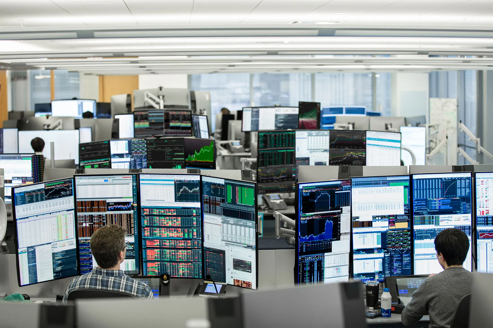

## Table of Contents

## What is Citadel?

Citadel is a big company that works with money and investments. It was started by a man named Ken Griffin in 1990. The company helps people and other companies invest their money in different ways, like stocks, bonds, and other financial products. Citadel has many smart people who use computers and math to make good investment choices.

The company is known for being very good at what it does. It makes a lot of money and is one of the biggest companies in the world that deals with investments. Citadel also has another part called Citadel Securities, which helps people buy and sell stocks. This part of the company is very important in the stock market and helps make trading easier and faster for everyone.

## Who founded Citadel?

Citadel was founded by a man named Ken Griffin. He started the company in 1990 when he was just 22 years old. Ken was very smart and good with numbers, and he wanted to use his skills to help people make money through investments.

At first, Citadel was a small company, but it grew quickly. Ken used computers and math to make smart investment choices, and this helped the company become very successful. Today, Citadel is one of the biggest investment companies in the world, and Ken Griffin is known as a very important person in the world of finance.

## When was Citadel established?

Citadel was established in 1990. It was started by a young man named Ken Griffin who was only 22 years old at the time. Ken was really good at math and wanted to use his skills to help people invest their money wisely.

At first, Citadel was a small company, but it grew quickly. Ken used computers and math to make smart investment choices. Over the years, Citadel became one of the biggest and most successful investment companies in the world. Today, it helps many people and other companies make money through different kinds of investments.

## What services does Citadel offer?

Citadel helps people and companies invest their money in different ways. They offer services like managing money for big investors, like pension funds and rich people. They use computers and math to pick good investments, like stocks, bonds, and other financial products. Citadel tries to make money for their clients by choosing the best investments and making smart choices.

Another part of Citadel is called Citadel Securities. This part helps people buy and sell stocks quickly and easily. They make the stock market work better by making trading faster and cheaper. Citadel Securities is very important in the world of trading and helps a lot of people and companies do their business in the stock market.

Overall, Citadel offers a wide range of services to help people and companies make money through investments. They use their knowledge and technology to make smart choices and improve the way the stock market works.

## How does Citadel make money?

Citadel makes money by helping people and companies invest their money wisely. They charge fees for managing money for big investors, like pension funds and rich people. Citadel uses computers and math to pick good investments, like stocks and bonds. When these investments do well, Citadel earns money from the fees they charge their clients. The more successful their investments are, the more money Citadel makes.

Another way Citadel makes money is through Citadel Securities, which helps people buy and sell stocks quickly and easily. Citadel Securities makes money by charging a small fee for each trade they help with. They make trading faster and cheaper, which means more people use their services. The more trades that happen, the more money Citadel Securities earns. Together, these two parts of Citadel help the company make a lot of money.

## What is Citadel's investment philosophy?

Citadel believes in using numbers and computers to make smart investment choices. They think that by using math and technology, they can find the best investments for their clients. Citadel looks at a lot of information and tries to understand how the world is changing. They use this knowledge to pick stocks, bonds, and other investments that they think will do well in the future.

Another important part of Citadel's investment philosophy is taking risks carefully. They know that investing always has some risk, but they try to manage it by being very careful and doing a lot of research. Citadel wants to make money for their clients, but they also want to keep their money safe. By balancing risk and reward, Citadel tries to make the best choices for their clients and help them grow their money over time.

## How has Citadel performed historically?

Citadel has done very well since it started in 1990. The company has made a lot of money for its clients and itself. Over the years, Citadel has been one of the top investment companies in the world. They have had some years where they made huge profits, like in 2020 when they made over $6 billion. Even during tough times, like the financial crisis in 2008, Citadel managed to make money when many other companies were losing it.

Citadel's success comes from their smart use of computers and math to pick good investments. They look at a lot of information and try to understand how the world is changing. This helps them make choices that work well for their clients. Citadel also takes risks carefully, which means they try to keep their clients' money safe while still making good profits. Overall, Citadel's history shows that they are good at what they do and can make money even when things are hard.

## What are some of Citadel's major investments?

Citadel has made many big investments over the years. They invest in all kinds of things, like stocks, bonds, and even real estate. One of their big investments is in technology companies. They believe that technology is changing the world, so they put a lot of money into companies that make new gadgets and software. Citadel also invests in healthcare, because they think that people will always need good healthcare, and that can be a good way to make money.

Another area where Citadel invests a lot is in big companies that are well-known and stable. They like to put money into companies that have been around for a long time and make a lot of money every year. This can be safer than investing in new or smaller companies. Citadel also sometimes invests in things like oil and gas, because these are important for the world and can make a lot of money. By spreading their money around in different kinds of investments, Citadel tries to make sure they can make money no matter what is happening in the world.

## What role does Citadel play in the financial markets?

Citadel plays a big role in the financial markets. They help people and companies invest their money in different ways, like stocks and bonds. Citadel uses computers and math to pick good investments. They manage money for big investors, like pension funds and rich people. By making smart choices, Citadel helps their clients make money and grow their investments.

Another important part of Citadel is Citadel Securities. This part helps people buy and sell stocks quickly and easily. They make trading faster and cheaper, which helps the stock market work better. Citadel Securities is very important because they handle a lot of trades every day. By making trading easier, they help a lot of people and companies do their business in the stock market.

## How does Citadel manage risk?

Citadel manages risk by being very careful and doing a lot of research. They use computers and math to look at a lot of information. This helps them understand how the world is changing and what might happen in the future. By knowing more, Citadel can make smarter choices about where to invest money. They try to pick investments that are likely to do well, even if things get tough.

Another way Citadel manages risk is by spreading their money around. They don't put all their money into one thing. Instead, they invest in many different kinds of things, like stocks, bonds, and even real estate. This way, if one investment doesn't do well, the others might still make money. By balancing their investments, Citadel tries to keep their clients' money safe while still making good profits.

## What are the key challenges Citadel faces?

One of the big challenges Citadel faces is keeping up with changes in the world. Things like new technology, new laws, and even big events like pandemics can change how the stock market works. Citadel needs to always be learning and adapting to make sure they can still pick good investments for their clients. If they don't keep up, they might miss out on good opportunities or make bad choices.

Another challenge is managing risk. Even though Citadel is good at using computers and math to pick investments, there is always a chance that something unexpected could happen. They need to be very careful and do a lot of research to try to keep their clients' money safe. Balancing the need to make money with the need to keep money safe is a big challenge for Citadel.

## What is Citadel's impact on the global economy?

Citadel has a big impact on the global economy because it helps move a lot of money around the world. They manage money for big investors, like pension funds and rich people, and they use that money to buy and sell things like stocks and bonds. When Citadel makes good investment choices, it helps their clients make money, which can then be spent or invested in other parts of the economy. This can create jobs and help businesses grow. Citadel also helps make the stock market work better through Citadel Securities, which makes trading faster and cheaper. This helps more people and companies trade, which keeps the economy moving.

Another way Citadel impacts the global economy is by investing in different industries, like technology and healthcare. When Citadel puts money into these industries, it helps them grow and create new products and services. This can lead to new jobs and better technology for everyone. By spreading their money around in different kinds of investments, Citadel helps make the economy more stable. If one part of the economy is doing badly, other parts might still be doing well, thanks to Citadel's investments.

## References & Further Reading

[1]: Aldridge, I. (2013). ["High-Frequency Trading: A Practical Guide to Algorithmic Strategies and Trading Systems."](https://www.wiley.com/en-us/High+Frequency+Trading%3A+A+Practical+Guide+to+Algorithmic+Strategies+and+Trading+Systems%2C+2nd+Edition-p-9781118343500) Wiley.

[2]: Easley, D., López de Prado, M. M., & O'Hara, M. (2013). ["High-Frequency Trading: The Big Data Challenge."](https://www.jstor.org/stable/41485533) Journal of Financial and Quantitative Analysis, 48(1).

[3]: Narang, R. K. (2009). ["Inside the Black Box: A Simple Guide to Quantitative and High-Frequency Trading."](https://onlinelibrary.wiley.com/doi/book/10.1002/9781118267738) Wiley.

[4]: Lopez de Prado, M. (2018). ["Advances in Financial Machine Learning."](https://www.amazon.com/Advances-Financial-Machine-Learning-Marcos/dp/1119482089) Wiley.

[5]: Chan, E. P. (2008). ["Quantitative Trading: How to Build Your Own Algorithmic Trading Business."](https://github.com/ftvision/quant_trading_echan_book) Wiley.