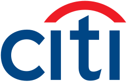

## Table of Contents

## What is Citigroup?

Citigroup is a big bank that helps people and businesses with their money. It started in 1998 when two other big banks, Citicorp and Travelers Group, joined together. Citigroup has many different parts, like banking, investing, and helping companies with their money. They work all over the world, in many countries, to help people save, borrow, and invest their money.

The bank is known for its logo, which is a red umbrella. This symbol shows that Citigroup wants to protect and help its customers, like an umbrella protects you from rain. Citigroup is very important in the world of money because it helps make the economy strong by lending money and helping businesses grow. They also have special programs to help people learn about money and how to use it wisely.

## When was Citigroup founded?

Citigroup was founded in 1998. It was made when two big banks, Citicorp and Travelers Group, decided to join together. This was a big deal because it made Citigroup one of the biggest banks in the world.

Before Citigroup was formed, Citicorp and Travelers Group were already important in the world of money. Citicorp focused on banking services, while Travelers Group was known for insurance and investments. When they combined, they created a bank that could offer all kinds of financial services in one place.

## Who are the founders of Citigroup?

Citigroup was created when two big companies, Citicorp and Travelers Group, decided to join together. The main people who made this happen were Sandy Weill and John S. Reed. Sandy Weill was the leader of Travelers Group, and John S. Reed was the leader of Citicorp. They worked together to make a plan to combine their companies.

Sandy Weill and John S. Reed thought that by joining their companies, they could create a bigger and better bank. They believed that having one company that could do banking, insurance, and investments would help more people and businesses. So, in 1998, they made it happen and Citigroup was born.

## What are the main services offered by Citigroup?

Citigroup offers a lot of different services to help people and businesses with their money. They have banking services where people can open accounts, save money, and use credit cards. They also help people borrow money through loans and mortgages. For businesses, Citigroup provides services like helping them manage their money, pay their employees, and grow their business through loans and other financial help.

Another big part of Citigroup is their investment services. They help people invest their money in stocks, bonds, and other ways to make their money grow. Citigroup also has a part that deals with big investments and trading, which is more for big companies and rich people. They help these clients buy and sell big amounts of money and investments.

Lastly, Citigroup offers services in insurance and wealth management. They help people protect their money and property with insurance. For people who have a lot of money, Citigroup has special services to help them manage their wealth and plan for the future. This includes things like retirement planning and advice on how to pass on their money to their family.

## In which countries does Citigroup operate?

Citigroup operates in many countries all over the world. They have offices and services in places like the United States, Mexico, Brazil, and Argentina in the Americas. They also work in Europe, with big operations in the United Kingdom, Germany, and France. In Asia, Citigroup is active in countries like Japan, China, India, and Singapore. They also have a presence in the Middle East and Africa, including in countries like the United Arab Emirates and South Africa.

The bank helps people and businesses in these countries with their money needs. Whether it's saving, borrowing, investing, or getting insurance, Citigroup tries to be there for its customers around the globe. By working in so many different places, Citigroup can help make the world's economy stronger and help people manage their money better, no matter where they live.

## What is the current market capitalization of Citigroup?

Citigroup's market capitalization changes every day because it depends on the price of its stock and how many shares are out there. As of the latest data available, Citigroup's market cap is around $115 billion. This number can go up or down based on how well the bank is doing and what's happening in the stock market.

Market capitalization is a way to figure out how much a company is worth. For Citigroup, this means adding up the value of all its shares. If you own a piece of Citigroup, the market cap tells you how much the whole company is worth, which can help you understand if your investment is doing well.

## How has Citigroup's stock performed over the last decade?

Over the last ten years, Citigroup's stock has had its ups and downs. At the start of the decade, Citigroup's stock was around $50 per share. It went through some tough times, especially during the economic problems in 2020 caused by the global health crisis. During that time, the stock dropped to as low as $30 per share. But Citigroup bounced back, and by the end of 2023, the stock was trading around $60 per share. This shows that while there were some rough patches, the stock managed to recover and even grow over the long term.

Looking at the bigger picture, Citigroup's stock has grown about 20% over the last ten years. This growth is not as fast as some other big banks, but it's still a positive sign. The stock's performance was influenced by many things, like how well the bank was doing, what was happening in the economy, and changes in the rules for banks. Even with these challenges, Citigroup kept working on improving its services and helping its customers, which helped the stock stay strong over time.

## What are some major acquisitions made by Citigroup?

Citigroup has grown bigger over the years by buying other companies. One of the biggest acquisitions was when Citicorp and Travelers Group joined together in 1998 to create Citigroup. This was a huge deal because it combined banking, insurance, and investment services into one big company. It helped Citigroup become one of the biggest banks in the world.

Another important acquisition was when Citigroup bought the Mexican bank Banamex in 2001. This helped Citigroup expand its services in Latin America. Banamex was a well-known bank in Mexico, and buying it allowed Citigroup to reach more customers and offer more services in that region. These acquisitions show how Citigroup has grown by bringing different financial services together and reaching more people around the world.

## What regulatory challenges has Citigroup faced in recent years?

In recent years, Citigroup has faced some big regulatory challenges. One big issue was a fine they had to pay in 2020. The bank was fined $400 million because they didn't have good enough systems to stop risky trades. This was a problem because banks need to have strong rules to make sure they don't do things that could hurt the economy. The regulators, who are like the police for banks, said Citigroup needed to fix their systems to prevent these risky trades.

Another challenge was related to how Citigroup handled customer data. In 2021, they were fined $40 million for not protecting customer information well enough. This is important because when people trust a bank with their money, they also trust them with their private information. The regulators made Citigroup pay the fine to remind them how important it is to keep customer data safe. These challenges show that even big banks like Citigroup need to keep working hard to follow the rules and protect their customers.

## How does Citigroup manage risk and compliance?

Citigroup manages risk and compliance by using special systems and rules to make sure they follow the law and keep their customers safe. They have teams of people who watch over the bank's activities to make sure everything is done right. These teams use computer programs to check for any problems or risky actions. If they find something that doesn't look right, they work quickly to fix it. This helps Citigroup avoid big fines and keep the trust of their customers.

Another way Citigroup manages risk is by training their employees. They teach their workers about the rules they need to follow and how to spot risks. This training helps everyone at the bank understand what to do to keep things safe and compliant. By having everyone on the same page, Citigroup can better manage the risks that come with running a big bank. This also helps them stay out of trouble with the regulators, who are always watching to make sure banks are doing things the right way.

## What are Citigroup's strategies for digital transformation?

Citigroup is working hard to change and improve its services using new technology. They call this digital transformation. One big part of their plan is to make banking easier for customers. They are building new apps and websites that people can use on their phones and computers. These tools help customers do things like check their bank accounts, pay bills, and invest money without having to go to a bank branch. Citigroup also uses special computer programs, like [artificial intelligence](/wiki/ai-artificial-intelligence), to make their services better and faster. They believe that by using technology, they can help more people and make banking simpler.

Another important part of Citigroup's digital transformation is making their own work easier and safer. They use technology to check for problems and risks inside the bank. This helps them follow the rules and keep their customers' money safe. Citigroup also works with other tech companies to bring new ideas into their services. They think that by staying up-to-date with technology, they can be a better bank for everyone. This focus on digital tools helps Citigroup stay strong and keep growing in the world of money.

## What is Citigroup's approach to sustainable finance and ESG criteria?

Citigroup cares a lot about making the world a better place through its money services. They focus on something called sustainable finance, which means helping people and businesses in ways that are good for the environment and society. Citigroup looks at Environmental, Social, and Governance ([ESG](/wiki/esg-investing)) criteria when they make decisions about where to invest money. They want to support projects that help fight climate change, protect nature, and make life better for people. By doing this, Citigroup hopes to create a healthier planet and a fairer world for everyone.

To make sure they follow their sustainable finance goals, Citigroup has set up special rules and teams to check their investments. They have promised to put a lot of money into projects that help the environment, like renewable energy and green buildings. Citigroup also works with other companies and groups to learn more about how to be sustainable. They believe that by working together, they can make bigger changes and help more people. This way, Citigroup is not just a bank but also a leader in making the world a better place.

## What are Financial Investment Strategies?

Investment strategies in financial markets encompass a spectrum of approaches tailored to meet diverse financial objectives. Traditional investment banking has historically focused on underwriting, mergers, and acquisitions, and providing advisory services to corporations and governments. These activities remain integral to modern financial markets, enabling capital formation and corporate restructuring. Concurrently, asset management has evolved to offer individualized portfolio management services designed to balance risk and return according to the specific goals of investors, whether they be wealth preservation, income generation, or growth maximization.

Individual and corporate investors are increasingly keen on optimizing their portfolios through strategic asset allocation and diversification. This process involves selecting a combination of asset classes—such as equities, fixed income, commodities, and alternative investments—that align with an investor’s risk tolerance and time horizon. Portfolio optimization is supported by Modern Portfolio Theory (MPT), which seeks to construct a portfolio that maximizes expected return for a given level of risk. The mathematical foundation of MPT is encapsulated in the efficient frontier concept and Sharpe ratio calculation:

$$
\text{Sharpe Ratio} = \frac{E[R_p] - R_f}{\sigma_p}
$$

Where $E[R_p]$ is the expected return of the portfolio, $R_f$ is the risk-free rate, and $\sigma_p$ is the standard deviation of the portfolio’s excess return.

Citigroup, as a prominent global financial institution, highlights the significance of systematic investment strategies within traditional banking and investment operations. Its focus on these models underscores the necessity of structured decision-making processes, which are increasingly data-driven. Advances in technology have equipped investors with sophisticated analysis tools and financial modeling capabilities. Such technologies provide deeper insights into market trends, investment risks, and potential returns, thus facilitating informed decision-making.

Algorithmic approaches further enhance investment strategy development by enabling the analysis of vast datasets to uncover patterns and insights. Machine learning algorithms, for instance, are employed to predict market behavior and optimize trading strategies. Below is a basic Python example that demonstrates how [machine learning](/wiki/machine-learning) could be applied to predict stock prices using historical data:

```python
import pandas as pd
from sklearn.model_selection import train_test_split
from sklearn.ensemble import RandomForestRegressor
from sklearn.metrics import mean_squared_error

# Load historical stock price data
data = pd.read_csv('stock_prices.csv')

# Features: historical prices and trading volumes
X = data[['price', '[volume](/wiki/volume-trading-strategy)']]
y = data['future_price']

# Split data into train and test sets
X_train, X_test, y_train, y_test = train_test_split(X, y, test_size=0.2, random_state=42)

# Initialize and train the Random Forest model
model = RandomForestRegressor(n_estimators=100, random_state=42)
model.fit(X_train, y_train)

# Predict and evaluate the model
predictions = model.predict(X_test)
mse = mean_squared_error(y_test, predictions)
print(f'Mean Squared Error: {mse}')
```

Such methodologies enable predictive analytics and risk management, allowing investors to adjust their strategies dynamically in response to market changes. As the financial sector continues to embrace technology, data-driven investment strategies are expected to play an increasingly critical role in shaping the future of asset management.

## References & Further Reading

[1]: Bergstra, J., Bardenet, R., Bengio, Y., & Kégl, B. (2011). ["Algorithms for Hyper-Parameter Optimization."](https://dl.acm.org/doi/10.5555/2986459.2986743) Advances in Neural Information Processing Systems 24.

[2]: ["Advances in Financial Machine Learning"](https://www.amazon.com/Advances-Financial-Machine-Learning-Marcos/dp/1119482089) by Marcos Lopez de Prado.

[3]: ["Evidence-Based Technical Analysis: Applying the Scientific Method and Statistical Inference to Trading Signals"](https://www.amazon.com/Evidence-Based-Technical-Analysis-Scientific-Statistical/dp/0470008741) by David Aronson.

[4]: ["Machine Learning for Algorithmic Trading"](https://github.com/stefan-jansen/machine-learning-for-trading) by Stefan Jansen.

[5]: ["Quantitative Trading: How to Build Your Own Algorithmic Trading Business"](https://www.amazon.com/Quantitative-Trading-Build-Algorithmic-Business/dp/1119800064) by Ernest P. Chan.

[6]: Aldridge, I. (2013). ["High-Frequency Trading: A Practical Guide to Algorithmic Strategies and Trading Systems"](https://onlinelibrary.wiley.com/doi/pdf/10.1002/9781119203803.fmatter) (2nd ed.). Wiley Finance.

[7]: Narang, R.K. (2013). ["Inside the Black Box: A Simple Guide to Quantitative and High-Frequency Trading"](https://onlinelibrary.wiley.com/doi/book/10.1002/9781118662717) (2nd ed.). Wiley.