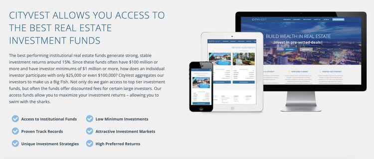

In the evolving world of financial investments, online platforms have fundamentally transformed the way individuals approach wealth growth. These platforms have made investment opportunities more accessible to a broader audience, utilizing technology to streamline processes and create innovative financial solutions. Among these platforms, CityVest stands out as a prominent player, offering a distinctive investment experience that integrates cutting-edge technology with real estate opportunities.

CityVest's approach is revolutionizing investment strategies by emphasizing accessibility and transparency. The platform connects investors to professionally managed real estate opportunities, which were traditionally reserved for institutional investors or those with substantial capital. By lowering entry barriers, CityVest democratizes real estate investments, allowing more individuals to participate in potentially lucrative opportunities.



In this article, we explore CityVest’s innovative features and the benefits they offer to investors. A significant aspect of this innovation lies in the platform’s integration of algorithmic trading, which leverages advanced algorithms to execute trades at optimal times, often resulting in enhanced returns and reduced risks for its users. This burgeoning role of algorithmic trading in the financial sector is pivotal, as it not only diversifies investment portfolios but also optimizes them to meet various financial goals.

CityVest is increasingly becoming a preferred choice for savvy investors who seek a blend of technology and traditional investment opportunities. By embracing innovation and maintaining a focus on investor education and transparency, CityVest positions itself as a leader in the evolving landscape of online investment platforms.

## Table of Contents

## What is CityVest?

CityVest represents a significant shift in the domain of real estate investments through its advanced online platform, which aims to make real estate investment accessible to a wider audience. With a focus on facilitating connections between investors and professionally managed real estate opportunities, CityVest addresses a primary challenge in the investment landscape: high capital requirements. The platform offers opportunities with reduced capital thresholds, making it feasible for more individuals to participate in potentially lucrative real estate markets.

CityVest's mission to democratize real estate investments reflects a broader trend towards increasing accessibility in financial markets. By lowering the barriers to entry, the platform allows a diverse range of investors to participate, thus broadening the scope of engagement beyond traditional high-net-worth individuals and institutional investors.

The origins of CityVest are rooted in a vision to leverage technology for improved investment experiences. Founded by a group of forward-thinking individuals with extensive experience in both real estate and financial technology, CityVest has progressively expanded its offerings and reach. Over the years, it has grown significantly, capitalizing on advancements in technology and evolving investor needs.

Through strategic partnerships and a robust digital infrastructure, CityVest has enhanced its platform to offer a user-friendly experience. The platform's historical growth trajectory underscores its commitment to innovation and adaptability, which have been key drivers of its expanding influence in the real estate investment sector. As it continues to scale, CityVest remains dedicated to fostering a diverse investment community, promoting inclusivity, and enabling a broader spectrum of investors to achieve their financial aspirations.

## Key Features of CityVest

CityVest provides several key features that augment the investment experience, making it a viable choice for a broad range of investors. A notable aspect of the platform is its user-friendly interface, which significantly simplifies the process of investing in real estate. The design is intuitive and easy to navigate, catering to both novice and experienced investors. This accessibility ensures that users can efficiently manage their portfolios, track performance, and make informed investment decisions with ease.

Central to CityVest's offering is its rigorous due diligence process. The platform ensures that each investment opportunity is thoroughly vetted, providing a layer of security and trust for its users. CityVest employs a team of experienced real estate professionals who meticulously analyze potential investments. This process includes evaluating the financial viability of properties, assessing market conditions, and examining the track records of involved parties. By conducting comprehensive due diligence, CityVest effectively minimizes risks and enhances the potential for positive returns.

Another key feature of CityVest is the exclusive investment opportunities available to its members. These opportunities are often high-quality real estate projects that might not be accessible to individual investors through conventional means. By pooling resources, CityVest enables its members to participate in larger deals that typically offer better returns and diversification benefits. These exclusive deals make the platform attractive to investors looking for unique and potentially lucrative investment options.

In summary, CityVest distinguishes itself with a succinct, user-friendly interface, a robust due diligence process ensuring vetted investment opportunities, and access to exclusive real estate deals that enhance the investment portfolio of its members.

## Algo Trading: The Next Frontier in Investments

Algorithmic trading, or algo trading, employs sophisticated algorithms to perform trades at the most opportune moments. These algorithms are pre-programmed instructions that account for variables such as timing, price, and [volume](/wiki/volume-trading-strategy). By automating the trading process, traders can achieve efficiencies and precision that would be impossible through manual trading.

CityVest integrates [algorithmic trading](/wiki/algorithmic-trading) to enhance returns for its users by employing algorithms that identify real estate investment opportunities. This integration allows CityVest to automate the decision-making process, leveraging data analytics and [machine learning](/wiki/machine-learning) to predict optimal investment paths. As a result, CityVest can consistently deliver higher returns by minimizing human errors and emotional decision-making—common pitfalls in traditional investing.

The significance of algorithmic trading in today's financial markets cannot be overstated. As markets grow increasingly complex and data-driven, algorithms can process vast amounts of information at speeds beyond human capability. According to a report by the Bank for International Settlements, algo trading accounts for a substantial portion of trading in financial markets, contributing to [liquidity](/wiki/liquidity-risk-premium) and market efficiency.

Furthermore, algorithms are pivotal in diversifying investment portfolios and minimizing risks. Through advanced data modeling and [backtesting](/wiki/backtesting), algorithms can perform simulations to forecast potential outcomes and strategies. This predictive ability allows for better risk management practices as investors have data-driven insights to make informed decisions.

Consider the following Python code snippet, which illustrates a basic structure of an algorithmic trading strategy using a moving average:

```python
import pandas as pd

def moving_average_strategy(prices, short_window=40, long_window=100):
    signals = pd.DataFrame(index=prices.index)
    signals['price'] = prices
    signals['short_mavg'] = prices.rolling(window=short_window, min_periods=1).mean()
    signals['long_mavg'] = prices.rolling(window=long_window, min_periods=1).mean()
    signals['signal'] = 0.0
    signals['signal'][short_window:] = np.where(signals['short_mavg'][short_window:] > signals['long_mavg'][short_window:], 1.0, 0.0)
    signals['positions'] = signals['signal'].diff()

    return signals

# Example usage
# prices = pd.Series(...)
# signals = moving_average_strategy(prices)
```

This basic strategy uses a short-term and a long-term moving average to generate buy and sell signals, a common method in algorithmic trading. The algorithm generates a buy signal when the short-term moving average crosses above the long-term moving average, indicating a potential upward trend.

Algorithms like this can significantly improve portfolio diversification. They allow CityVest to allocate investments across a range of asset classes, sectors, or geographic locations, thereby spreading risk. In doing so, investors can benefit from reduced [volatility](/wiki/volatility-trading-strategies) and enhanced returns, making algorithmic trading a crucial component in modern investment strategy.

## Benefits of Using CityVest for Investment

CityVest offers several significant advantages for investors looking to diversify their portfolios. The platform provides access to a wide array of real estate investments usually reserved for institutional investors. By pooling funds from multiple investors, CityVest enables participants to engage in larger real estate deals, offering a broader spectrum of investment opportunities that individuals might not access on their own. This collective approach lowers the capital barrier traditionally associated with high-value real estate, making it accessible to a wider audience.

A key feature of CityVest is its commitment to transparency and security, vital aspects that build investor confidence. The platform employs rigorous vetting processes and extensive due diligence for each investment opportunity. CityVest's proprietary system ensures that all projects meet stringent criteria before presenting them to investors. This level of transparency reduces information asymmetry, providing investors with clear insights into what their capital supports. Furthermore, CityVest incorporates advanced security measures to protect investor data and transactions, aligning with industry standards and employing encryption technologies to safeguard sensitive information.

When it comes to returns, CityVest has positioned itself to offer competitive yields compared to traditional real estate investments. By focusing on vetted and high-potential investment opportunities, the platform enables investors to benefit from attractive income streams and capital appreciation. The aggregation of investor funds allows the platform to leverage larger deals, often translating to better overall financial performance due to economies of scale.

CityVest's community and educational resources play a vital role in empowering its investors. The platform provides a suite of learning materials, including webinars, articles, and interactive sessions, designed to enhance investors' understanding of real estate markets and investment strategies. This educational content encourages informed decision-making and helps investors develop a comprehensive understanding of the financial landscape. Additionally, CityVest fosters a sense of community through forums and discussion groups, allowing investors to share insights, ask questions, and learn from one another's experiences. This combination of community support and educational resources ensures that CityVest investors are well-equipped to navigate the complexities of real estate investing.

## Challenges and Considerations

Every investment platform comes with its challenges, and CityVest is no exception. As with any investment, understanding the risks and conducting thorough research are imperative components for potential success.

One of the potential risks inherent in CityVest's model is associated with algorithmic trading and real estate investments. Algorithmic trading involves using complex algorithms to make trading decisions, executing orders at speeds and frequencies humans cannot match. While this can optimize trading performance, it also introduces the risk of market anomalies and technical failures. If the algorithm misinterprets data or market conditions, it can lead to significant financial losses. Additionally, these algorithms often don’t consider larger economic factors or unforeseen market disruptions.

Furthermore, real estate investments inherently [carry](/wiki/carry-trading) certain risks. Market volatility, economic downturns, and changes in interest rates can adversely affect property values. Investors must recognize that real estate, despite being tangible, is not immune to market dynamics that can lead to depreciation or liquidity issues.

The importance of due diligence and investor education cannot be overstated. Before committing to any investment, thorough due diligence should be performed. This involves a careful assessment of the investment opportunity, understanding the associated risks, and analyzing historical performance data. CityVest offers a detailed due diligence process that helps to mitigate some risks, but it is crucial for investors to engage actively in this process and not rely solely on the platform’s evaluations.

Investor education is another critical element in overcoming challenges associated with investment platforms like CityVest. Being informed about how the platform operates, understanding its fee structure, and recognizing the nature of real estate investments are vital. CityVest can provide educational resources and community support, empowering investors to make sound financial decisions.

To overcome common challenges when using CityVest, investors should consider several strategies:

1. **Diversify Investments:** Diversification can help mitigate risks by spreading investments across different assets or sectors. This approach lowers the impact of volatility in any single investment.

2. **Continuous Monitoring:** Keeping track of market trends and modifications to algorithms used in trading ensures that an investor can respond swiftly to potential issues.

3. **Engage with the Community:** By leveraging the experiences and insights of other investors on the platform, users can gain valuable knowledge and support that can highlight potential pitfalls and opportunities.

4. **Leverage Platform Resources:** CityVest offers a suite of tools, webinars, and consultations that can guide less experienced investors and complement the independent research process.

By considering these factors, investors can better navigate the challenges associated with algorithmic trading and real estate investing, utilizing CityVest's platform more effectively to achieve their financial goals.

## Testimonials and Case Studies

CityVest has garnered a reputation for delivering tangible investment success, as evidenced by numerous testimonials from its users. Investors consistently report achieving significant financial returns, with many attributing these outcomes to CityVest’s innovative approach to real estate investment. For instance, user John D., a mid-level professional with limited real estate investment knowledge, shared his experience, noting that CityVest’s platform enabled him to diversify his portfolio with minimal capital requirements. He emphasized the ease of use and the comprehensive support provided by the platform, which guided him through the investment process. 

Further illustrating CityVest’s impact, a case study of investor Samantha L. reveals how the platform transformed her financial strategy. With a background in tech and little exposure to real estate, Samantha initially found the sector intimidating. However, CityVest's user-friendly interface and educational resources empowered her to invest confidently. Over a period of two years, she saw a return on investment that surpassed her traditional stock market gains, attributing her success to the platform's transparent and rigorous due diligence process.

CityVest manages a diverse range of portfolios tailored to various investor goals and risk tolerances. Their portfolios span multiple asset classes within real estate, including residential, commercial, and mixed-use properties. This diversification has been pivotal for investors like Alan T., who sought to leverage real estate as a hedge against market volatility. By investing through CityVest, Alan constructed a balanced portfolio that mitigated risks while capitalizing on the intrinsic value appreciation of real assets.

The case of a collective investment group using CityVest's platform also underscores the platform's adaptability. This group, comprising six young professionals, pooled their resources to invest in a CityVest syndicated deal. The result was a substantial return on investment, exceeding their initial projections and fostering further collaborative ventures within the platform. This illustrates CityVest’s capacity to facilitate joint investment opportunities, democratizing access to high-value real estate deals.

Overall, the testimonials and case studies attest to CityVest's effectiveness in helping investors from diverse backgrounds and financial acumen achieve their goals. The platform not only provides unique investment opportunities but also nurtures investor confidence through its robust support systems and transparent processes.

## Conclusion

CityVest is reshaping investment strategies by seamlessly merging technology and real estate. Its platform provides users with access to exclusive real estate opportunities, historically accessible only to institutional investors. By lowering the capital requirements needed, CityVest democratizes real estate investing, opening doors to a broader audience. The platform's integration of algorithmic trading is a significant advancement, offering investors the potential for optimized returns through data-driven strategies. Algo trading employs sophisticated algorithms to analyze market conditions and execute trades at optimal moments, enhancing portfolio diversification and minimizing risks—a crucial advantage in the ever-fluctuating financial markets.

Investors are urged to consider CityVest as an attractive option, given the compelling benefits it offers. These include the user-friendly interface that enhances the investment experience and the comprehensive due diligence process that CityVest undertakes for each investment opportunity, ensuring transparency and security for its users. CityVest's track record of competitive returns compared to traditional real estate investing underscores its value proposition, providing not just investment opportunities but also educational resources that empower investors.

CityVest's continuous growth and innovation, evident in its ability to blend real estate with cutting-edge technologies, positions it as a leader in investment platforms. The company's dynamic approach, fostering a robust community of informed investors, signifies its commitment to advancing investment strategies in a rapidly changing economic landscape. For those seeking a modern, reliable investment platform, CityVest offers a forward-thinking solution that combines the best of real estate and technology.

## Call to Action

Explore the investment potential offered by CityVest today by visiting their official website. Discover an array of options designed to accommodate various investor preferences and levels of expertise. For those new to the platform, CityVest provides demo accounts and straightforward sign-up options, enabling you to begin your investment journey with ease.

Stay informed about special promotions and upcoming webinars hosted by CityVest. These webinars provide invaluable insights into maximizing returns and understanding the intricacies of real estate investments using advanced technology. Participating in these events can significantly enhance your investment strategy and broaden your knowledge base.

Additionally, CityVest offers the opportunity for personalized consultations. Reach out to set up a session with an investment expert who can guide you through the range of investment options available, ensuring your plans align with your financial goals. This personalized approach ensures that you receive advice tailored specifically to your needs, helping you navigate the investment landscape with confidence.

## References & Further Reading

[1]: Bergstra, J., Bardenet, R., Bengio, Y., & Kégl, B. (2011). ["Algorithms for Hyper-Parameter Optimization."](https://papers.nips.cc/paper/4443-algorithms-for-hyper-parameter-optimization) Advances in Neural Information Processing Systems 24.

[2]: ["Advances in Financial Machine Learning"](https://www.amazon.com/Advances-Financial-Machine-Learning-Marcos/dp/1119482089) by Marcos Lopez de Prado

[3]: ["Evidence-Based Technical Analysis: Applying the Scientific Method and Statistical Inference to Trading Signals"](https://www.amazon.com/Evidence-Based-Technical-Analysis-Scientific-Statistical/dp/0470008741) by David Aronson

[4]: ["Machine Learning for Algorithmic Trading"](https://github.com/stefan-jansen/machine-learning-for-trading) by Stefan Jansen

[5]: ["Quantitative Trading: How to Build Your Own Algorithmic Trading Business"](https://www.amazon.com/Quantitative-Trading-Build-Algorithmic-Business/dp/1119800064) by Ernest P. Chan