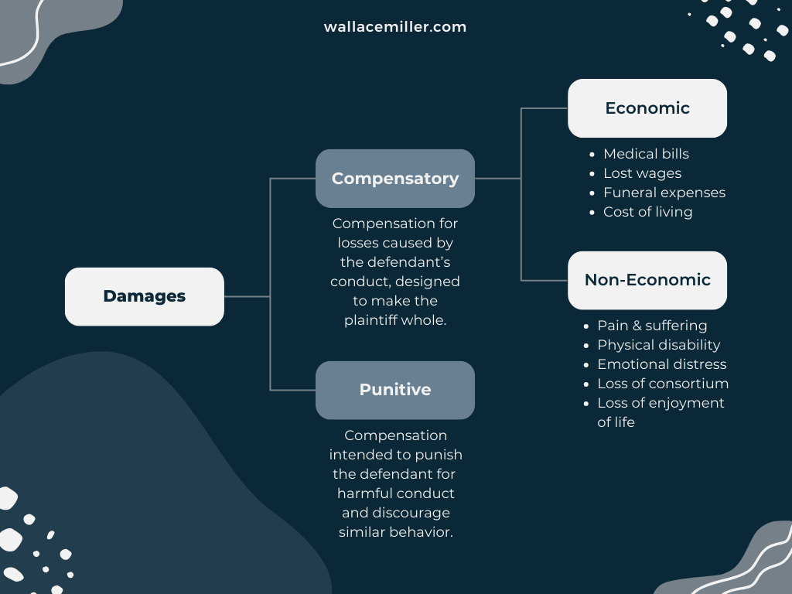

## Table of Contents

## What are civil damages?

Civil damages are a type of monetary compensation awarded to someone who has been harmed or wronged by another person or entity. This harm can come from things like accidents, broken contracts, or being treated unfairly. The purpose of civil damages is to help make the harmed person "whole" again by paying them for their losses, like medical bills or lost wages, and sometimes for the pain and suffering they went through.

There are different kinds of civil damages, but the main ones are compensatory and punitive damages. Compensatory damages are meant to cover the actual losses and costs someone faced because of the harm. For example, if someone's car was damaged in an accident, compensatory damages might cover the cost to fix the car. Punitive damages, on the other hand, are awarded to punish the person or entity that caused the harm, especially if they did something really bad on purpose. These damages are less common and are meant to stop others from doing similar harmful things in the future.

## What is the difference between compensatory and punitive damages?

Compensatory damages are money given to someone to make up for the harm they suffered. This can include things like medical bills, lost wages, or the cost to fix damaged property. The goal is to put the person back in the same position they were in before the harm happened. For example, if someone's car was wrecked in an accident, compensatory damages would help pay for the repairs so the person isn't out of pocket.

Punitive damages are different because they are not about covering losses. Instead, they are meant to punish the person or company that caused the harm, especially if they did something really bad on purpose. Punitive damages are like a fine to make sure the wrongdoer doesn't do it again and to warn others not to do the same thing. They are awarded less often than compensatory damages and usually only in cases where the behavior was especially harmful or reckless.

## Can you explain the concept of nominal damages?

Nominal damages are a small amount of money, usually just a few dollars, that a court gives to someone when their rights have been violated, but they haven't suffered any real harm or loss. It's like saying, "Yes, your rights were violated, but since you didn't lose anything, we'll give you a small amount to show that we recognize the violation."

For example, if someone trespasses on your property but doesn't cause any damage, you might be awarded nominal damages. This small amount of money shows that the court agrees the trespasser did something wrong, even though you didn't lose anything because of it. Nominal damages are different from compensatory damages, which are given to cover actual losses, and punitive damages, which are meant to punish bad behavior.

## What are the common scenarios where civil damages are awarded?

Civil damages are often awarded in cases where someone gets hurt because of someone else's actions. For example, if you are in a car accident because another driver was not paying attention, you might get money to help pay for your medical bills and to make up for the time you missed at work. This kind of money is called compensatory damages. Another common scenario is when someone breaks a contract. If you hire a company to build your house and they do a bad job, you might get money to fix the problems or to cover the extra costs you have to pay.

Sometimes, civil damages are awarded when someone's rights are violated but they don't lose any money or get hurt. This is called nominal damages. For instance, if someone trespasses on your land but doesn't damage anything, you might get a small amount of money just to show that the court agrees the person did something wrong. In cases where someone does something really bad on purpose, like a company knowingly selling dangerous products, the court might award punitive damages. These are meant to punish the wrongdoer and to stop others from doing the same thing.

## How are damages calculated in personal injury cases?

In personal injury cases, damages are calculated to help the person who got hurt get back to how they were before the injury. This involves looking at things like medical bills, lost wages, and the cost to fix or replace any damaged property. For example, if you broke your leg in a car accident, the court would look at how much you had to pay for doctor visits, hospital stays, and any physical therapy. They would also consider how much money you lost because you couldn't work while you were recovering. These are called economic damages because they are based on actual money you spent or lost.

Sometimes, the court also looks at things that are harder to put a price on, like pain and suffering or emotional distress. These are called non-economic damages. For instance, if you were in a lot of pain because of your broken leg, the court might give you money to make up for that. It's not easy to figure out how much money to give for pain and suffering, so courts often use different methods, like looking at how bad the injury was, how long it took to recover, and how it affected your life. The goal is to make sure you are fairly compensated for everything you went through because of the injury.

## What role does negligence play in determining civil damages?

Negligence is a big part of figuring out civil damages in personal injury cases. It means someone did not take enough care and that caused someone else to get hurt. For example, if a driver is texting and crashes into another car, that driver was not being careful and might be found negligent. To decide if someone was negligent, courts look at things like if they did what a normal careful person would do and if they could have stopped the harm from happening.

If someone is found to be negligent, they might have to pay damages to the person who got hurt. The amount of money depends on how bad the harm was and how much the negligent person was to blame. Sometimes, both people in an accident can be a little negligent, and the court will decide how much each person should pay based on their share of the blame. This is important because it helps make sure the person who got hurt gets money to cover their losses, like medical bills and lost work time, and it also makes the person who was not careful think twice before doing it again.

## How do courts assess the amount of punitive damages?

Courts assess the amount of punitive damages by looking at how bad the behavior was that caused the harm. They want to make sure the punishment fits the crime. If someone did something really bad on purpose, like a company selling dangerous products knowing they could hurt people, the court might decide to give a lot of money in punitive damages. The goal is to punish the wrongdoer and to stop others from doing the same thing.

When deciding on the amount, courts also think about how much money the person or company has. They want to make sure the punishment will really make a difference. For example, a small fine might not bother a big company, but a large one could make them change their ways. Courts also look at other cases to see what amounts were given for similar bad behavior, to make sure their decision is fair and consistent.

## What are liquidated damages and when are they used?

Liquidated damages are a set amount of money that people agree to pay if one of them breaks a contract. It's like a pre-decided fine. They are used when it's hard to figure out how much money someone might lose if the contract is broken. For example, if a company hires a contractor to finish a building by a certain date, they might agree on liquidated damages to make sure the contractor finishes on time. If the contractor is late, they pay the agreed-upon amount without needing to argue about how much the delay actually cost.

These damages are useful because they make things simpler and help avoid long fights in court. They are common in construction projects, real estate deals, and other situations where timing is important. But, for liquidated damages to be fair, the amount has to be a good guess of the actual harm that might happen, not just a way to punish someone. If the amount is too high and seems more like a penalty, a court might not let it stand.

## Can you describe how statutory damages work?

Statutory damages are a set amount of money that the law says someone should get if their rights are violated. This is different from other kinds of damages because the amount is decided by the law, not by how much someone lost or how bad they were hurt. For example, if someone copies your music without permission, the law might say you should get a certain amount of money for each song that was copied, even if you can't prove exactly how much money you lost.

These damages are used in cases where it's hard to figure out how much someone lost, or when the law wants to make sure people follow the rules. They are common in areas like copyright law, where it's tough to say exactly how much money someone lost when their work was used without permission. By setting a fixed amount, the law helps make things fair and easier to handle in court.

## What is the process for appealing a civil damages award?

If you don't agree with the amount of money you were awarded in a civil case, you can try to appeal it. To start, you need to file a notice of appeal within a certain time, usually 30 days after the court's decision. You will need to explain why you think the judge made a mistake. This could be because the judge got the law wrong or because there was a problem with the evidence or how the trial was run. After you file the appeal, you will need to prepare and send in a written argument, called a brief, that explains your side of the story.

Once you've sent in your brief, the other side will do the same. Then, a higher court, called an appeals court, will look at both briefs and decide if the original judge made a mistake. Sometimes, the appeals court will have a hearing where lawyers from both sides can talk about the case. If the appeals court finds a mistake, they might send the case back to the lower court for another look, or they might change the amount of money awarded. If they don't find a mistake, the original decision stays the same.

## How do jurisdictions differ in their approach to civil damages?

Different places around the world have their own ways of deciding on civil damages. In the United States, for example, each state can have different rules about how much money someone can get for things like pain and suffering. Some states let juries decide, while others have limits on how much money can be awarded. Also, the U.S. uses a system where someone can get money for both their actual losses, like medical bills, and for things that are harder to put a price on, like emotional distress.

In other countries, like those in Europe, the approach can be different. Some European countries focus more on making sure the person who got hurt gets money to cover their actual losses, like medical bills and lost wages. They might not give as much money for pain and suffering as in the U.S. Also, in some places, the court might decide the amount of money instead of a jury, and there might be more rules about when someone can get money for being hurt. Each place tries to find a fair way to help people who have been harmed, but the details can be very different.

## What are some recent trends or changes in the law regarding civil damages?

In recent years, one big change in the law about civil damages is the way some places are putting limits on how much money people can get for things like pain and suffering. These are called "damage caps." Some states in the U.S. have these caps to stop very big awards that might make insurance costs go up. This means if someone gets hurt, they might not get as much money as they would have before these rules changed. It's a way to try to keep things fair for everyone, but it can be tough for people who are really hurt and need a lot of money to get better.

Another trend is the growing use of mediation and other ways to solve problems without going to court. More and more, people are trying to work things out with the help of a neutral person, called a mediator, instead of fighting in court. This can be faster and cheaper, and it lets people have more control over what happens. It's especially popular in cases where the amount of money is not too big, and both sides want to avoid the time and cost of a long court battle. This trend shows that people are looking for simpler and quicker ways to fix problems and get the money they need.

## How can one estimate liability and calculate damages?

Estimating liability in civil litigation requires a precise evaluation of both the extent of the damages incurred and the degree of responsibility held by the defendant. This process is vital in determining the appropriate legal remedy for the injured party.

**Compensatory Damages Calculation**

Compensatory damages aim to restore the injured party to the position they would have been in had the wrongdoing not occurred. These damages often involve straightforward calculations as they are based on quantifiable, "hard" costs or losses. For instance, if a plaintiff has incurred medical expenses or lost wages due to the actions of a defendant, these costs can be directly calculated from financial records and documented evidence.

To calculate compensatory damages, one typically aggregates all measurable losses. If `L` represents total losses, then:

$$
\text{Compensatory Damages} = L = \sum_{i=1}^{n} \text{Loss or Cost}_i
$$

Where each $\text{Loss or Cost}_i$ is supported by documentation such as bills, receipts, or income statements.

**General Damages Estimation**

Unlike compensatory damages, general damages address non-monetary aspects such as pain, suffering, or emotional distress. Estimating general damages is inherently more complex, as it lacks concrete financial benchmarks and thus requires judicial discretion. The assessment of general damages often relies heavily on case law precedents, where previous similar cases provide a framework for the evaluation.

The estimation process may involve the consideration of several subjective factors, including the severity and duration of the suffering, and its impact on the plaintiff's quality of life. Some legal systems utilize a "multiplier" method, where tangible damages are multiplied by a [factor](/wiki/factor-investing) (determined by the judge or jury) to estimate an appropriate amount for general damages.

Python could be employed to automate these calculations for scenarios requiring multiple inputs and uniform application of legal frameworks:

```python
def calculate_compensatory_damages(losses):
    return sum(losses)

def estimate_general_damages(economic_losses, multiplier):
    return economic_losses * multiplier

# Example usage
compensatory_losses = [5000, 15000]  # Example hard costs like medical bills, lost wages
compensatory_damages = calculate_compensatory_damages(compensatory_losses)

economic_loss = 20000  # Total direct economic losses
multiplier = 1.5  # Example multiplier for general damages
general_damages = estimate_general_damages(economic_loss, multiplier)

print(f"Compensatory Damages: {compensatory_damages}")
print(f"General Damages: {general_damages}")
```

Ultimately, both forms of damages require a thorough understanding of factual evidence, legal precedents, and often the employment of expert witness testimony to substantiate claims and guide judicial discretion. This meticulous process ensures compensation reflects the actual harm experienced, aligning with principles of justice and fairness in civil law.

## References & Further Reading

[1]: Posner, R. A. (2009). ["A Theory of Negligence."](https://www.jstor.org/stable/724011) Journal of Legal Studies.

[2]: Black, B., & Gross, M. (2004). ["Making Up for Lost Earnings: A Review of the Literature."](https://journals.sagepub.com/doi/abs/10.1177/003172170408600105) RAND Corporation Technical Report.

[3]: Davis, E. (2020). ["Algorithmic Trading: An Overview."](https://link.springer.com/chapter/10.1007/978-3-031-62843-6_8) SSRN Electronic Journal.

[4]: Jones, C. M. (2021). ["What Do We Know About High-Frequency Trading?"](https://papers.ssrn.com/sol3/papers.cfm?abstract_id=2236201) Financial Review Letters.

[5]: Kuserk, G. J., & Conroy, R. M. (2012). ["Compensatory and Punitive Damages: An Economic Analysis."](https://pubmed.ncbi.nlm.nih.gov/22807649/) Illinois Oil and Gas Journal.