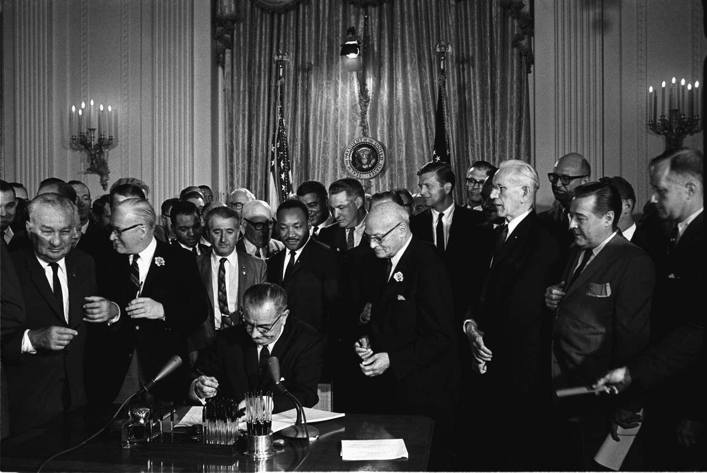

The Civil Rights Act of 1964 stands as a pivotal piece of legislation in United States history, marking a significant shift towards equality in American society. Enacted during a period of intense social upheaval and demands for justice, the Act sought to dismantle institutionalized discrimination and segregation prevalent in numerous facets of public life and employment. Its passage can be seen as a fundamental victory of the civil rights movement, driven by relentless advocacy and profound courage from individuals and organizations dedicated to achieving racial equality.

The Act's importance extends beyond its immediate social and legal impacts. It served as a catalyst for future reforms and policies aimed at ensuring equal rights, influencing subsequent legislation like the Voting Rights Act of 1965. The Civil Rights Act laid the groundwork for ongoing efforts to combat discrimination and foster inclusiveness across various domains of society.



In understanding the breadth of its implications, it becomes evident that the principles established by the Civil Rights Act are continuously relevant. The Act's foundational aim of promoting fairness and equality finds resonance in contemporary discussions around algorithmic trading and financial markets. These sectors, which were not a focal point during the 1964 discourse, now grapple with issues of bias and discrimination in their operations. The challenge of ensuring that technological advancements and financial practices are equitable reflects the enduring influence of the Civil Rights Act on modern society.

This article will examine the historical context of the Civil Rights Act, its provisions, and the far-reaching impacts it has had. Moreover, it will explore how civil rights principles intersect with and inform current practices and policies in financial markets and algorithmic trading, highlighting the ongoing quest for equity in an ever-evolving landscape.

## Table of Contents

## Historical Context of the Civil Rights Act

The Civil Rights Act of 1964 emerged against a backdrop of profound social and political tension in the United States, marked by systemic racial discrimination and a burgeoning civil rights movement demanding change. The period leading up to the passage of the Act was characterized by significant advocacy, activism, and legislative attempts to address persistent inequalities.

During the late 1950s and early 1960s, the United States was embroiled in intense racial conflict, particularly in the South, where segregation laws enforced a strict division between Black and white Americans. This period saw widespread civil rights activism, with events such as the Montgomery Bus Boycott of 1955-1956 and the Greensboro sit-ins of 1960 highlighting the inequities faced by African Americans and the growing demand for change.

Dr. Martin Luther King Jr. played a pivotal role in this climate as a leader who advocated for nonviolent resistance to racial discrimination. His leadership in campaigns such as the 1963 Birmingham Campaign and the March on Washington for Jobs and Freedom galvanized public opinion and placed significant pressure on the federal government to take action. The moral and ethical urgency conveyed through King’s speeches, particularly his famous “I Have a Dream” speech, underscored the imperative for comprehensive civil rights legislation.

President Lyndon B. Johnson also played a crucial role in the passage of the Civil Rights Act. After assuming office following the assassination of President John F. Kennedy in November 1963, Johnson leveraged his legislative acumen and commitment to civil rights to prioritize the Act's passage. His strong advocacy and strategic negotiation helped to overcome considerable opposition in Congress, particularly from the Southern bloc which had traditionally resisted civil rights legislation.

Before the Civil Rights Act of 1964, earlier legislative attempts had made modest strides toward racial equality. The Civil Rights Act of 1957 was the first civil rights legislation enacted by Congress since Reconstruction and aimed primarily at protecting voting rights. However, its impact was limited due to enforcement weaknesses and opposition from Southern legislators.

The Civil Rights Act of 1960 aimed to address some of these shortcomings by strengthening voting rights provisions and introducing new mechanisms for voter registration and oversight. Despite these efforts, both acts faced significant resistance and were often obstructed by procedural tactics, such as filibustering, in Congress. These challenges highlighted the pervasive institutional barriers that delayed progress and underscored the need for more comprehensive legislation.

The Civil Rights Act of 1964, therefore, represented a culmination of years of activism and political maneuvering. It addressed a broader range of issues beyond voting, including employment discrimination and segregation in public accommodations, and set the stage for further reforms in the quest for racial equality.

## Provisions and Impact of the Civil Rights Act

The Civil Rights Act of 1964 was a pivotal piece of legislation consisting of 11 titles, each addressing various forms of racial and other types of discrimination. The act sought to dismantle longstanding systems of segregation and unequal treatment in the United States.

### Titles of the Civil Rights Act

1. **Title I** addressed voting rights, tackling issues like unequal voter registration requirements and was intended to eliminate racial discrimination in voting.
2. **Title II** prohibited discrimination in public accommodations such as hotels, restaurants, and theaters, reinforcing the idea that access to public services should be available to all, irrespective of race, religion, or national origin.
3. **Title III** allowed for the desegregation of public facilities, granting the Attorney General the authority to file lawsuits to enforce integration.
4. **Title IV** aimed at desegregating public education systems, mandating that federal funds could be withheld from any school system that discriminated.
5. **Title V** expanded the Civil Rights Commission, enhancing its capabilities to investigate and address issues of discrimination.
6. **Title VI** prohibited discrimination by government agencies that receive federal funds, thus influencing a broad array of programs and activities.
7. **Title VII** addressed employment discrimination, establishing the Equal Employment Opportunity Commission (EEOC) to enforce laws against workplace discrimination.
8. **Title VIII** required compilation of voter registration and voting data in geographic areas specified by the Commission on Civil Rights.
9. **Title IX** made it easier to move civil rights cases from state to federal courts.
10. **Title X** created the Community Relations Service, a federal agency charged with assisting in the resolution of disputes involving discrimination claims.
11. **Title XI** included miscellaneous, technical provisions aimed at ensuring the smooth execution and enforcement of the law.

### Immediate and Long-term Impact

The immediate impact of the Civil Rights Act was profound, especially in public spaces, education, and employment. Schools across the nation, particularly in the South, began to integrate, breaking a major barrier to racial equality. Employment practices also shifted, with increased scrutiny and action taken against discriminatory hiring and workplace policies.

Over the long term, the act laid the groundwork for an ongoing dialogue about civil rights in various sectors. It inspired additional legislation, the most notable of which was the Voting Rights Act of 1965, which aimed to eliminate racial discrimination in voting, overcoming barriers that had been neglected or were inadequately addressed by the Civil Rights Act.

### Subsequent Legislation

The Voting Rights Act of 1965 was a direct consequence of the Civil Rights Act. Recognized as a crucial tool in overcoming legal barriers at the state and local levels, it ensured all citizens had a right to vote. Over the years, further legislation, including the Fair Housing Act (1968) and the Americans with Disabilities Act (1990), drew parallels to the principles established in the Civil Rights Act, reinforcing its legacy as a cornerstone for equality and anti-discrimination laws.

Overall, the Civil Rights Act of 1964 not only addressed immediate overt discrimination but also institutionalized the ongoing fight for equality, setting a precedent for examining and rectifying discrimination in all societal sectors.

## The Civil Rights Act and Financial Markets

The Civil Rights Act of 1964, primarily celebrated for its monumental impact on social justice, has also indirectly influenced modern financial markets and corporate governance. By establishing a precedent for combating discrimination, this legislation has played a significant role in shaping policies that promote diversity and inclusion within financial institutions.

### Diversity and Inclusion in Financial Institutions

Diversity and inclusion have become critical components within financial institutions. The principles instilled by the Civil Rights Act emphasize equal opportunity and the elimination of bias. These values have been integrated into corporate governance, influencing hiring practices, leadership composition, and client servicing strategies. The recognition of diverse perspectives is now seen as a vital asset that enhances decision-making and business strategy. As noted in recent studies, companies with diverse boards are often more innovative and financially successful, underscoring the business case for diversity [McKinsey & Company, 2020](https://www.mckinsey.com/business-functions/organization/our-insights/diversity-wins-how-inclusion-matters).

Financial regulations have continually evolved to address discrimination. The Equal Credit Opportunity Act (ECOA) and the Community Reinvestment Act (CRA), for example, are legislative offshoots that align with the Civil Rights Act's ethos. These laws ensure that lending and credit practices do not discriminate based on race, color, religion, national origin, sex, marital status, or age.

### Discrimination in Lending and Investment Practices

Current regulatory frameworks emphasize transparency and fairness in lending, credit, and investment. These regulations strive to mitigate discriminatory practices that have historically marginalized specific groups. The Dodd-Frank Wall Street Reform and Consumer Protection Act, particularly its establishment of the Consumer Financial Protection Bureau (CFPB), underscores the importance of monitoring financial institutions to prevent discriminatory practices. Financial firms are now required to collect and report demographic data to ensure compliance with anti-discrimination laws, thus fostering equitable access to financial services.

Despite progress, challenges remain. The 2021 report by the National Community Reinvestment Coalition highlighted ongoing disparities in loan approvals for minority-owned businesses, reflecting the persistent need to combat systemic discrimination in financial systems [National Community Reinvestment Coalition, 2021](https://ncrc.org/wp-content/uploads/2021/09/NCRC_Home_Mortgage_Discrimination.pdf).

Python code can be used to analyze financial data to identify potential bias. For instance, using Python's pandas and scikit-learn libraries, financial institutions can implement algorithms to detect patterns of discrimination in lending data:

```python
import pandas as pd
from sklearn.model_selection import train_test_split
from sklearn.ensemble import RandomForestClassifier
from sklearn.metrics import classification_report

# Load data
data = pd.read_csv('lending_data.csv')

# Preprocess data (hypothetical preprocessing steps)
data['is_minority'] = data['race'].apply(lambda x: 1 if x in ['Black', 'Hispanic', 'Native American'] else 0)
X = data[['income', 'loan_amount', 'credit_score', 'is_minority']]
y = data['loan_approved']

# Split data
X_train, X_test, y_train, y_test = train_test_split(X, y, test_size=0.3, random_state=42)

# Train model
model = RandomForestClassifier()
model.fit(X_train, y_train)

# Evaluate model
predictions = model.predict(X_test)
print(classification_report(y_test, predictions))
```

This code trains a model to predict loan approval and evaluates its fairness, identifying discrimination if minority groups are less likely to receive approval despite similar financial profiles.

The Civil Rights Act's foundational principles continue to inform financial regulations and corporate practices, striving for an inclusive financial environment free from discrimination. As institutions refine algorithms and regulatory bodies enhance oversight, the challenges of inequity in financial markets remain a priority, necessitating vigilance and continuous improvement.

## Algorithmic Trading: A Modern Perspective

Algorithmic trading refers to the use of computer algorithms to execute trading orders in financial markets. These algorithms make decisions based on pre-defined criteria, processing large datasets at speeds and frequencies impractical for human traders. This technological innovation has transformed the financial industry by increasing trade efficiency, reducing transaction costs, and enhancing the [liquidity](/wiki/liquidity-risk-premium) of markets. In today's financial landscape, [algorithmic trading](/wiki/algorithmic-trading) is responsible for a significant [volume](/wiki/volume-trading-strategy) of stock market transactions, especially in high-frequency trading ([HFT](/wiki/high-frequency-trading-strategies)), where firms seek to capitalize on minute price discrepancies within fractions of a second.

However, algorithmic trading also raises ethical considerations and potential biases within trading systems. The reliance on historical data to train algorithms can lead to biases reflecting existing market prejudices or systemic inequalities. For instance, if historical market behavior exhibits biases—a common concern in credit scoring, where minority groups might be underrepresented—those biases might be inadvertently embedded into trading algorithms. This can lead to discriminatory outcomes, as the algorithms may unintentionally favor certain groups over others in their trading strategies.

Addressing these biases requires a multi-faceted approach informed by principles from civil rights legislation. Here, the central ethos of the Civil Rights Act—ensuring equal and fair treatment—can guide the development of trading algorithms. Transparency, accountability, and fairness must be integral to algorithmic systems. Developers and financial institutions can incorporate fairness constraints into algorithmic models to mitigate biased outcomes. For example, one might use techniques like fairness-aware [machine learning](/wiki/machine-learning), which adjusts algorithmic outputs to align with fairness criteria:

```python
from sklearn.linear_model import LogisticRegression
from fairness import FairnessConstraints

# Sample code illustrating fairness constraint integration
model = LogisticRegression()
fair_model = FairnessConstraints(model, protected_attributes=['race', 'gender'])

fair_model.fit(X_train, y_train)
predictions = fair_model.predict(X_test)
```

This approach enforces that algorithmic decisions do not vary unjustly across different demographics, thereby aligning trading practices with the non-discriminatory tenets of civil rights laws. Furthermore, regulators and financial watchdogs play a vital role in enforcing these principles by setting guidelines and standards to ensure algorithms operate fairly, transparently, and without inherent biases. Through collaboration between developers, stakeholders, and policymakers, the financial industry can work towards algorithmic systems that are both powerful and ethically sound, echoing the promise of the Civil Rights Act to eliminate discrimination in all its forms.

## Interconnection: Civil Rights Principles and Algorithmic Fairness

The principles underpinning civil rights advocacy, particularly those focused on equality and non-discrimination, have found a new frontier in algorithmic fairness. As technology continues to transform various sectors, including employment, finance, and law enforcement, the mechanisms ensuring fairness and equality require critical examination.

### Parallels Between Civil Rights Advocacy and Algorithmic Fairness

Civil rights advocacy has traditionally centered on eliminating discrimination in areas such as employment, education, and public accommodations. These principles are now being extended to the digital age, where algorithms play a significant decision-making role. The core parallel lies in addressing biases that result in unequal outcomes. Just as civil rights laws aim to dismantle systemic racism and bias, efforts in algorithmic fairness focus on identifying and mitigating biases encoded within algorithms. 

Algorithms, if not carefully designed, can perpetuate existing biases present in training data or the decision criteria. For example, if an algorithm for loan approval is trained on historical data influenced by discriminatory lending practices, it may replicate those biases. Fortunately, there are steps to ensure algorithms make equitable decisions.

### Initiatives and Methodologies for Algorithmic Fairness

Several methodologies are employed to ensure that algorithms are developed and function fairly:

1. **Bias Auditing**: This involves assessing algorithms to identify and rectify any biases. It often includes analyzing input data for representativeness and examining output for disparate impacts across different demographic groups.

2. **Fairness Constraints**: Implementing fairness constraints within algorithmic models helps promote equitable decision-making. This could involve techniques like equal opportunity functions, ensuring that the probability of favorable outcomes is equally distributed among different groups.

3. **Transparent Design**: Encouraging transparency in algorithmic design enables stakeholders to understand the rationale behind decision-making processes. This encompasses open-source algorithms and disseminating how input data is weighted.

4. **Human-in-the-Loop Systems**: Combining human oversight with automated systems can provide an additional layer of fairness by allowing human judgment to guide algorithmic outcomes, particularly in ambiguous cases.

### Stakeholder Involvement in Upholding Standards

Various stakeholders are actively working to ensure algorithmic systems incorporate principles of fairness:

- **Regulators**: Policymakers are establishing frameworks to hold companies accountable for the ethical use of algorithms. This includes enacting laws that mandate transparency and fairness in AI applications, similar to civil rights laws that prosecute discriminatory practices.

- **Developers and Tech Companies**: Organizations like IBM and Google are investing in research on bias and fairness. They develop tools to help identify and mitigate bias, such as IBM's AI Fairness 360, a comprehensive toolkit for promoting fairness in machine learning.

- **Academic Institutions**: Research in universities provides critical insights into algorithmic bias and fairness. Academic papers propose new fairness metrics and design recommendations, furthering the field's understanding and application of equitable algorithms.

- **Civil Rights Organizations**: These groups advocate for policies ensuring fair algorithmic practices, mirroring their efforts to combat discrimination in traditional domains. They often collaborate with tech companies to provide expertise on civil rights implications.

Ensuring algorithmic fairness is a multifaceted challenge that requires continuous dialogue between technologists, policymakers, and civil rights advocates. Through concerted efforts, it is possible to create systems that reflect the egalitarian principles championed by the Civil Rights Act of 1964, securing fairness and equality in both societal and digital contexts.

## Conclusion

The Civil Rights Act of 1964 remains a pivotal milestone in the journey toward equality, with its influence pervading various contemporary issues. Its enactment marked a crucial turning point, providing the legal framework to dismantle systemic discrimination and segregation. The Act has been instrumental in shaping subsequent reforms and legislation, effectively embedding the values of equality and non-discrimination into the national ethos.

Despite significant progress in the decades following its passage, challenges persist in achieving full equality. In social justice, issues such as racial disparities in criminal justice, economic inequality, and access to quality education continue to demand attention and action. The principles enshrined in the Civil Rights Act serve as a guide for addressing these persistent inequalities, reminding society of its moral and legal obligations to uphold fairness and justice for all individuals.

The financial markets, too, reflect this ongoing struggle for equality. While the principles of diversity and inclusion have gained traction, there are still substantial challenges to overcome. Discriminatory practices in lending, credit, and investment persist, albeit in more subtle forms. The integration of civil rights principles into financial regulations and corporate governance is crucial to fostering an environment where all stakeholders can participate equitably.

Looking ahead, continuous advocacy is essential to confront and mitigate emerging forms of discrimination. Technological advancements, particularly in algorithmic trading and decision-making systems, present new ethical dilemmas. The principles of fairness embedded in civil rights legislation must inform the design and regulation of these technologies to prevent systemic biases that could exacerbate existing inequalities. For instance, ensuring algorithms are trained on diverse datasets and regularly audited for bias can help in maintaining fairness.

Innovative solutions, driven by collaboration between policymakers, technologists, and civil societies, are vital in addressing these challenges. Embracing multidisciplinary approaches enables a more comprehensive understanding of how discrimination manifests and provides a platform for creating effective interventions. As society continues to evolve, the foundational principles of the Civil Rights Act of 1964 will remain crucial in guiding the pursuit of equality across all sectors, urging collective action toward a just and inclusive future.

## References & Further Reading

[1]: McKinsey & Company. (2020). ["Diversity Wins: How Inclusion Matters."](https://www.mckinsey.com/featured-insights/diversity-and-inclusion/diversity-wins-how-inclusion-matters)

[2]: National Community Reinvestment Coalition. (2021). ["NCRC 2021 Home Mortgage Discrimination Report."](https://ncrc.org/2021-impact-report/)

[3]: Kennedy, R. (1978). ["The Civil Rights Movement."](https://www.nps.gov/articles/000/the-kennedys-and-civil-rights.htm) The Journal of American History.

[4]: United States Department of Justice. ["Civil Rights Act of 1964."](https://www.justice.gov/crt/fcs/TitleVI) 

[5]: King, M. L. (1963). ["I Have a Dream."](https://static.pbslearningmedia.org/media/media_files/Full_text_I_Have_a_Dream_.pdf) National Archives.