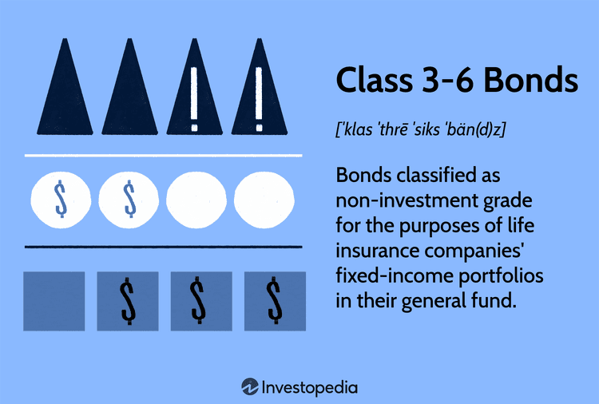

In the world of investments, bonds provide a relatively stable option for both individual and institutional investors, serving as a fundamental component of diversified portfolios. Within this broad landscape, Class 3-6 bonds, although not as widely recognized as traditional bonds, hold distinct importance. These bonds represent a specific category tied closely to risk and reward dynamics, attracting investors who are willing to navigate higher levels of uncertainty for the potential of substantial returns.

The central aim of this article is to examine the concept of Class 3-6 bonds, understanding their role, functionality, and how modern financial technologies, specifically algorithmic trading, are reshaping their investment landscape. While traditional bonds are commonly associated with predictable income streams, Class 3-6 bonds offer opportunities alongside heightened risk, primarily because they are non-investment grade with increased susceptibility to default. This makes their management and investment notably different from more secure bonds, demanding a detailed understanding of their characteristics and the broader market factors influencing them.



Algorithmic trading is revolutionizing the bond market, including high-risk segments like Class 3-6 bonds. By utilizing sophisticated computational techniques to parse through vast datasets, investors can efficiently discover investment opportunities and manage associated risks. This fusion of technology with finance not only expedites transaction capabilities but also enhances liquidity, enabling investors to make informed decisions rapidly and adjust strategies dynamically to optimize returns.

This article will further clarify the intricacies associated with Class 3-6 bonds, identifying the risks and opportunities they present. With a comprehensive understanding of these bonds, investors can gain insights into an alternative and potentially lucrative investment vehicle. As the financial industry continues to innovate and evolve, staying informed about such lesser-known yet promising investment options could confer significant competitive advantages.

## Table of Contents

## What Are Class 3-6 Bonds?

Class 3-6 bonds are categorized as non-investment grade securities predominantly crafted for the fixed-income portfolios of life insurance companies. Distinctly, these bonds fall within the riskier spectrum compared to their investment-grade counterparts, namely Classes 1 and 2. This classification reflects the elevated financial risk and heightened probability of default attributed to Class 3-6 bonds.

The National Association of Insurance Commissioners (NAIC) is responsible for the rating of these bonds. The NAIC ratings provide a detailed assessment of the default risk associated with insurance company investments. Class 3 to Class 6 serve as a critical indicator for insurers and investors, reflecting different degrees of risk. Class 3 bonds are considered the least risky within this non-investment grade category, whereas Class 6 bonds are perceived as carrying the highest risk of default. Consequently, the classification underpins the investment risk related to these securities, making them a strategic but precarious choice for building a diversified portfolio.

This risk categorization is pivotal for understanding the investment appeal of Class 3-6 bonds. While higher risk often correlates with potential for higher yields, the risk of default necessitates a thorough analysis before investment. The principal [factor](/wiki/factor-investing) distinguishing Class 3-6 bonds is their specific classification by investment risk, determined by both market conditions and issuer financial health. The precise classification procedure by the NAIC involves assessing the financial stability and historical performance of the bond issuer, compounded by macroeconomic factors influencing the wider financial landscape. These assessments ensure that investors remain informed about the intrinsic challenges and opportunities tethered to investing in these bonds.

## Understanding the Risks and Functionalities

Class 3-6 bonds are characterized by a higher risk profile which contributes to their greater [volatility](/wiki/volatility-trading-strategies). This inherent risk offers investors the opportunity to achieve higher yields compared to investment-grade bonds. These non-investment grade bonds are essential components of life insurance companies' portfolios, serving as significant reserves to counterbalance economic fluctuations. During downturns, these bonds can provide a buffer, helping insurance companies to stabilize their financial footing due to their elevated return potential.

Insurance regulators categorize Class 6 bonds as carrying the highest risk among this classification. Consequently, these bonds require rigorous investment strategies tailored to manage their inherent risks. The precarious nature of these bonds underscores the necessity of precise handling to mitigate potential losses and maximize their return on investment.

An intricate understanding of credit ratings is indispensable for investors engaging with Class 3-6 bonds. These ratings, provided by rating agencies such as the National Association of Insurance Commissioners (NAIC), reflect the creditworthiness and likelihood of default associated with these bonds. The ratings impact bond performance significantly, influencing investor confidence and perceived risk. Higher default risk pressures these bonds to offer more attractive yields to compensate investors for the increased uncertainty.

Investors managing portfolios containing Class 3-6 bonds must remain vigilant to fluctuations in credit ratings, as downgrades can lead to diminished bond value and increased yield spreads. An analytical approach, combined with an understanding of market dynamics, provides investors with the tools needed to navigate the inherent risks of these bonds effectively. Leveraging financial models and credit risk assessments can offer valuable insights for optimizing investment strategies in this volatile yet potentially rewarding segment of the bond market.

## Algorithmic Trading and Its Impact

Algorithmic trading is a transformative force in the investment landscape of Class 3-6 bonds, fundamentally changing how investors approach these high-risk financial instruments. By leveraging complex algorithms and automated systems, traders can efficiently analyze large volumes of financial data to spot profitable investment opportunities and effectively manage associated risks. This advanced computational approach uses predefined criteria such as timing, price, and quantity, enabling swift execution of trades that minimize latency—a critical aspect for high-yield, non-investment-grade bonds.

The rapid execution facilitated by [algorithmic trading](/wiki/algorithmic-trading) improves [liquidity](/wiki/liquidity-risk-premium) in the bond market, particularly for high-risk bonds which traditionally suffer from liquidity constraints. This heightened liquidity allows investors to capitalize on market inefficiencies and swiftly adjust their portfolios in response to evolving market conditions. The enhanced fluidity in transactions not only benefits individual investors but also aids institutions like insurance companies that manage significant non-investment-grade bond portfolios.

Investors employing algorithmic trading in their strategies gain access to data-driven insights that inform decision-making processes. For example, algorithms can assess market trends, historical data, and potential default risks, providing a comprehensive framework for investment strategy optimization. Python, a popular choice for implementing these algorithms, can execute data analysis tasks using libraries such as NumPy and pandas. Below is a sample Python code snippet demonstrating how algorithmic trading might be set up to evaluate bond performance:

```python
import pandas as pd
import numpy as np
from sklearn.linear_model import LinearRegression

# Load bond market data
bond_data = pd.read_csv('bond_data.csv')
X = bond_data[['interest_rate', 'market_volatility', 'bond_duration']]
y = bond_data['bond_return']

# Fit linear regression model
model = LinearRegression()
model.fit(X, y)

# Prediction based on input features
predicted_return = model.predict(np.array([[2.5, 1.1, 5]]))
print(f'Predicted Bond Return: {predicted_return[0]}')
```

Algorithmic trading not only equips investors with powerful analytical tools but also enables the design of responsive and adaptive investment strategies. By incorporating real-time data analysis and economic models, investors can make informed and timely decisions, thus optimizing their engagement with Class 3-6 bonds. As a result, algorithmic trading fosters a more dynamic investment approach that aligns with the inherent complexities and opportunities of high-risk bonds.

## Investment Strategies for Class 3-6 Bonds

Investing in Class 3-6 bonds requires a thorough understanding of market dynamics and risk assessment to navigate their complexities effectively. These bonds, characterized by their higher risk profiles, necessitate careful portfolio management to maximize potential returns while minimizing exposure to volatility.

Diversification is a cornerstone strategy when dealing with Class 3-6 bonds. Investors should aim to create a balanced portfolio that includes a mix of investment-grade bonds to cushion against potential losses from high-risk bonds. This approach helps mitigate the inherent risks of Class 3-6 bonds and provides a buffer during market downturns. The allocation between high-risk and secure investments should be determined by an investor's risk tolerance and investment goals.

Monitoring ratios, such as the proportion of non-investment grade bonds to total bonds, is essential for assessing company risks. This ratio offers insights into the level of risk an investor is exposed to and can highlight potential areas for adjustment. By regularly evaluating these ratios, investors can make data-driven decisions regarding their bond investments, ensuring that the portfolio remains aligned with their risk management strategies.

Consultation with financial advisors is highly recommended for investors venturing into Class 3-6 bonds. Advisors bring expertise and a nuanced understanding of market trends, helping investors navigate complex scenarios and adjust strategies as necessary. Additionally, leveraging algorithmic tools can further enhance investment outcomes. These tools utilize sophisticated algorithms to analyze large datasets, identify market trends, and streamline investment processes for more efficient decision-making.

The combination of diversification, proactive risk monitoring, professional consultation, and data-driven algorithmic tools positions investors to effectively manage Class 3-6 bond investments. By adopting these strategies, investors can optimize their portfolios to harness the high-yield potential of Class 3-6 bonds, while maintaining a balanced approach to risk management.

## Conclusion

Class 3-6 bonds present a unique opportunity for high returns, due to their inherently higher risks compared to investment-grade bonds. Understanding the specific classification of these bonds, which are rated by the National Association of Insurance Commissioners (NAIC), is critical to evaluating their potential. These bonds are often integral to the fixed-income portfolios of life insurance companies, providing a cushion against economic fluctuations. However, their high-risk status, particularly with Class 6 being the riskiest, necessitates a comprehensive knowledge of bond functionalities.

The rise of algorithmic trading has transformed how investors engage with Class 3-6 bonds. Automated trading systems can effectively dissect large volumes of data to identify profitable opportunities or signals, which help mitigate risk factors associated with these bonds. Such trading mechanisms offer enhanced liquidity and faster transaction processes, turning high-risk bonds into viable investment options. Investors using these tools gain data-driven insights, which are invaluable for crafting informed and strategic investment approaches.

As the financial market landscape continues to advance, staying well-informed about investment vehicles like Class 3-6 bonds can yield significant competitive advantages. The finance industry is under constant innovation, and investors who adapt to these changes by leveraging technology and deepening their understanding of non-investment grade bonds can unlock substantial potential despite the inherent risks. Appropriate strategies, such as diversification and the use of advanced algorithmic tools, are crucial for investing in these high-risk, high-reward bonds. Such proactive and strategic investment planning can turn the perceived limitations of Class 3-6 bonds into lucrative opportunities for savvy investors.

## References & Further Reading

[1]: National Association of Insurance Commissioners (NAIC). ["Risk-Based Capital (RBC) for Insurers."](https://content.naic.org/sites/default/files/inline-files/MDL-312.pdf) 

[2]: Lopez de Prado, M. (2018). ["Advances in Financial Machine Learning."](https://www.amazon.com/Advances-Financial-Machine-Learning-Marcos/dp/1119482089) Wiley.

[3]: Jansen, S. (2020). ["Machine Learning for Algorithmic Trading: Predictive Models to Extract Signals from Market and Alternative Data."](https://github.com/stefan-jansen/machine-learning-for-trading) Packt Publishing.

[4]: Chan, E. P. (2008). ["Quantitative Trading: How to Build Your Own Algorithmic Trading Business."](https://github.com/egorpe/EPChan-QuantitativeTrading/blob/master/example7_6.m) Wiley.

[5]: Fabozzi, F. J. (2012). ["The Handbook of Fixed Income Securities."](https://www.amazon.com/Handbook-Fixed-Income-Securities-Ninth/dp/1260473899) McGraw-Hill Education.