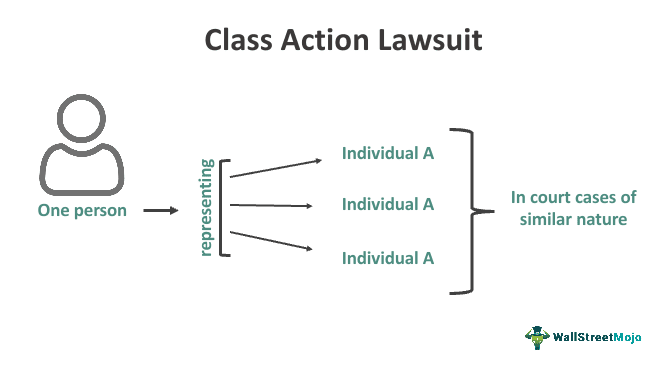

Algorithmic trading, commonly known as algo trading, has significantly transformed the landscape of financial markets over the past few decades. It utilizes sophisticated algorithms and high-speed computing to make trading decisions at speeds and frequencies that are not possible for human traders. This technological advancement allows for better market liquidity, price efficiency, and reduced transaction costs, fundamentally altering how trading is conducted and understood.

As the adoption of algorithmic trading continues to rise, this technological evolution intersects with an array of legal challenges. Among these, class action lawsuits have emerged as a critical legal tool for addressing disputes within the vast and often opaque world of algorithmic trading. These lawsuits are particularly vital for pointing out systemic issues and holding accountable the entities that engage in or enable unfair or unethical trading practices.

This article seeks to examine the legal benefits of class action lawsuits within the context of algorithmic trading and their broader implications on the financial sector. Class action lawsuits serve as a pivotal avenue for investors to collectively challenge and seek remedies for grievances related to algo trading practices. They offer a structured mechanism through which affected parties can address widespread harm that may result from manipulative or unethical practices involving complex trading algorithms.

To fully appreciate the intersection between class action lawsuits and algorithmic trading, it is essential to consider both the legal and historical significance of these lawsuits. Historically, class actions have played a fundamental role in empowering individuals against larger entities by allowing them to pool resources and claims, thereby increasing their potential for a successful outcome. This legal framework is increasingly relevant in cases involving algorithmic trading, where individual claims might be economically unfeasible to pursue individually.

By exploring the dynamics of class action lawsuits in relation to algorithmic trading, traders and investors can better comprehend the legal landscape they navigate. Understanding these intersections is crucial for maintaining an informed perspective on how to protect one's interests in the rapidly evolving financial market. As the financial industry continues to embrace technological innovations like algorithmic trading, legal frameworks must concurrently evolve to address new challenges and ensure fairer trading environments for all market participants.

## Table of Contents

## Understanding Class Action Lawsuits

Class action lawsuits serve as a crucial framework in legal proceedings where one or more plaintiffs initiate a case representing a larger group with similar legal claims. This mechanism is essential for ensuring large entities are held accountable for actions that impact many individuals collectively. The fundamental structure of these lawsuits allows a lead plaintiff to represent the broader group's interests, especially in situations where the cost of pursuing claims individually would be prohibitive. This not only democratizes access to justice but also amplifies the collective voice against potentially powerful adversaries.

The success of a class action lawsuit can lead to settlements which are distributed among the class members, often catalyzing changes in industry-wide practices. In this context, class actions serve a dual function: compensating the aggrieved parties and acting as a deterrent against future misconduct by addressing systemic issues.

To understand the applicability of class actions to regulatory issues, particularly in sectors like [algorithmic trading](/wiki/algorithmic-trading), examining the criteria for class action certification is essential. The primary conditions for certification typically include:

1. **Numerosity**: The class must be so large that individual lawsuits would be impracticable, demonstrating the efficiency of collective legal action.

2. **Commonality**: There must be common questions of law or fact across the claims, which form the basis for collective adjudication.

3. **Typicality**: The claims or defenses of the representative parties must be typical of those of the class, ensuring their interests align.

4. **Adequacy of Representation**: The representatives must be able to fairly and adequately protect the class's interests.

In the context of algorithmic trading, these criteria become particularly relevant due to the complex and often opaque nature of trading algorithms. Legal claims might arise from perceived market manipulations or antitrust violations where a single entity's conduct impacts a vast number of market participants. Here, class action lawsuits not only provide a venue for seeking restitution but also pressure companies towards greater transparency and adherence to equitable trading practices. As the field of algorithmic trading continues to evolve, ensuring rigorous application of these certification criteria can play a decisive role in maintaining the integrity of financial markets.

## Role of Class Action Lawsuits in Algorithmic Trading

Algorithmic trading, a deployment of sophisticated algorithms to execute trading strategies, has gained prominence for its efficiency and speed in financial markets. However, this advanced method also poses risks, such as market manipulation, front-running, and other unfair trading practices. Class action lawsuits offer a legal avenue for addressing these concerns by allowing aggrieved parties to collectively pursue claims against entities engaging in such misconduct.

Class action lawsuits serve as a powerful tool for investors looking to challenge unfair practices associated with algorithmic trading. These lawsuits consolidate individual claims into a single, larger case, thus amplifying the voice of potentially smaller investors who might not have the resources to litigate independently. This collective action can induce substantial pressure on algorithmic trading firms to alter or discontinue detrimental practices, thereby fostering a fairer and more transparent market environment.

Recent cases underscore the potency of class actions in combating anticompetitive behavior or market abuses facilitated by algorithmic trading algorithms. For instance, several notable class actions have been initiated against trading firms accused of using algorithms to engage in "spoofing" — a form of market manipulation where rapid orders are placed to deceive the market about supply or demand to artificially alter prices. Such activities not only harm investor confidence but can also culminate in broader market disturbances.

Furthermore, algorithmic trading providers might confront allegations of antitrust violations. This can occur when the algorithms collaboratively manipulate market conditions or when they create algorithmic trading environments that unfairly disadvantage certain market participants. Hence, class actions play a critical role in correcting these imbalances by holding firms accountable and incentivizing compliance with fair trading standards.

By aggregating individual claims, class action lawsuits have compelled changes that enhance the integrity and fairness of market operations linked to algorithmic trading. This includes prompting regulatory bodies to develop stricter guidelines and oversight mechanisms aimed at preventing algorithmic misconduct. A successful class action can also lead to significant monetary settlements, rewarding aggrieved parties for their losses and deterring future misconduct by trading entities.

In conclusion, while the intricacies of algorithmic trading present challenges, class actions serve as a crucial instrument for investors seeking redress against malpractices. Such collective legal actions not only provide restitution to affected investors but also drive necessary reforms in the trading industry, ultimately promoting a more equitable and robust financial market.

## Legal Benefits for Investors in Class Action Lawsuits

Class action lawsuits serve as a powerful tool for individual investors, especially in the context of algorithmic trading, where the complexity and scale of operations often tilt the balance in favor of large financial entities. By allowing investors to pool their claims, class actions reduce the per capita cost of legal action, making litigation feasible for individuals who might otherwise lack the resources to challenge sophisticated corporate defendants.

Financial compensation stands out as a primary benefit of successful class actions. Regulatory scrutiny and litigation have highlighted instances where algorithmic trading strategies have led to market manipulation or other unfair practices, causing significant financial harm to investors. Through class actions, affected investors can collectively seek recompense, potentially recovering losses incurred due to illicit trading algorithms or strategies. Settlements or judgments in favor of the class can provide financial restitution, enhancing investor confidence in seeking justice against unfair practices.

Moreover, class action lawsuits can drive transparency and accountability in algorithmic trading. They shine a light on the inner workings of trading algorithms that may otherwise remain hidden under layers of proprietary technology. By forcing disclosure and evaluation of these complex systems in a court setting, class actions can lead to enhanced industry standards and practices. Such legal challenges encourage financial firms to adopt ethical programming and implementation methods for their trading algorithms, ultimately benefiting the broader trading community.

Historically, several legal precedents underscore the benefits of class actions for investors. Notable settlements in financial markets have not only provided compensation but have also led to reforms within trading practices. The infamous "Flash Crash" of 2010, for instance, spurred multiple lawsuits that culminated in regulatory reforms addressing high-frequency trading risks. These precedents highlight the dual role of class actions: they act as a corrective measure for aggrieved investors and a catalyst for market-wide reforms.

The ethical dimension of class action lawsuits also plays a significant role. They underscore the collective power of investors to demand reasonable conduct from large corporations. By choosing to participate in class actions, investors advocate for a fairer and more transparent market environment, where algorithms are designed and deployed with accountability. This collective pressure is crucial in prompting firms to prioritize ethical considerations in their trading operations.

In conclusion, class action lawsuits offer substantial legal benefits to investors within the sphere of algorithmic trading. They provide a pathway for financial compensation, drive systemic changes in market practices, and reinforce ethical standards in the development and deployment of trading algorithms. As algorithmic trading continues to evolve, the role of class actions in safeguarding investor interests remains a vital component of the legal landscape.

## Challenges and Considerations

Class action lawsuits, while providing significant benefits to investors affected by algorithmic trading misconduct, also present notable challenges. One of the primary difficulties is the lengthy nature of legal proceedings. Class actions often involve complex, drawn-out processes that can take years to resolve. This extended timeframe can lead to varying outcomes for individual class members, who might experience different levels of satisfaction with the settlement or verdict.

A critical hurdle in these cases is the complexity of algorithmic trading systems. Algorithms are intricate and multifaceted, making it difficult to prove misconduct unequivocally. Plaintiffs must demonstrate that specific algorithms were deliberately designed or negligently implemented to manipulate markets or harm investors. This often requires technical expertise and sophisticated data analysis to identify and present evidence of malpractice convincingly. The technical complexity of these algorithms can also lead to challenges in communicating findings to a jury or judge unfamiliar with such systems.

Regulatory environments further complicate class actions in algorithmic trading. Regulations can vary significantly across jurisdictions, impacting the feasibility and success rates of class actions in different regions. The lack of a standardized global framework for addressing algorithmic trading misconduct can lead to inconsistencies in legal strategies and outcomes. Plaintiffs and their legal teams must navigate these regulatory landscapes carefully, often requiring cross-jurisdictional cooperation and expertise.

For potential plaintiffs, several strategic considerations must be taken into account. One critical [factor](/wiki/factor-investing) is the composition of the class, which can affect the lawsuit's overall strength and cohesiveness. Ensuring that the class is unified by common grievances can bolster the case. The choice of legal representation is another vital consideration; selecting attorneys with experience in both class action lawsuits and algorithmic trading is crucial for an effective legal strategy.

Finally, plaintiffs must weigh the strategic value of settlements versus trials. Settlements can provide quicker resolutions and guaranteed compensation, avoiding the uncertainties of a trial. However, they may also result in lower compensation than what might be achieved through a successful trial. Balancing these factors requires careful assessment of the case's merits, potential damages, and the risks involved in litigation. 

By considering these challenges and strategic elements, investors can better prepare themselves for involvement in class action lawsuits related to algorithmic trading.

## Conclusion

Class action lawsuits are a crucial element of the legal landscape surrounding algorithmic trading, offering a pathway to address systemic issues. As algorithmic trading's share in financial markets increases, so does the potential for unlawful activities, such as market manipulation and unfair trading practices. Class actions serve as a mechanism for investors to collectively challenge these injustices, thereby fostering more equitable market conditions.

Legal frameworks related to algorithmic trading are evolving alongside technological advancements. As these frameworks change, market participants must remain vigilant, adapting to new regulations and leveraging legal tools like class actions to safeguard their interests. The landscape of algorithmic trading is expected to witness a rise in litigation as regulatory scrutiny intensifies. This trend underscores the importance of class actions in maintaining market integrity and ensuring justice is served.

For investors, staying informed and maintaining a proactive approach is crucial. By participating in these legal proceedings, investors not only seek to recover potential losses but also contribute to industry-wide changes that enhance transparency and accountability. Understanding these dynamics empowers investors to better navigate the complexities of algorithmic trading and protect their investments in an increasingly complex financial environment. 

In summary, class action lawsuits offer more than just economic restitution—they are a pivotal force in shaping fair market practices and holding large entities accountable in the rapidly transforming world of algorithmic trading.

## Frequently Asked Questions

### What is a class action lawsuit and how is it relevant to algorithmic trading?
A class action lawsuit is a legal proceeding where a single plaintiff or a small group represents a larger group of individuals who have similar claims against a defendant. This type of lawsuit is essential for addressing grievances that affect many individuals but might not be economically feasible to pursue individually. In the context of algorithmic trading, class action lawsuits become relevant when investors collectively allege that an algorithmic trading practice has caused widespread harm, such as manipulation, fraud, or violation of antitrust laws. These legal actions enable a unified approach to seek remedial action against complex, systemic issues that arise from algorithmic trading strategies.

### How do investors benefit from participating in class action lawsuits?
Investors benefit from participating in class action lawsuits by sharing the litigation costs, which lowers financial barriers to seeking justice. Successful class actions can lead to settlements or judgments that compensate affected investors for financial losses incurred due to illegal or unethical algorithmic trading practices. Moreover, these lawsuits can impose structural changes in trading practices and enhance transparency and accountability in the industry. By participating, investors not only seek individual restitution but also contribute to broader market reforms.

### What challenges can arise when pursuing a class action related to algorithmic trading?
Pursuing a class action related to algorithmic trading poses several challenges. The complexity of the algorithms and trading systems makes it difficult to establish misconduct and causation. Additionally, collecting and analyzing the vast amount of trading data necessary to demonstrate systemic issues adds to the complexity. Jurisdictional variations in regulations can also affect the viability and strategy of a class action. Furthermore, the legal process is often lengthy, and outcomes may vary for different class members, requiring careful consideration of the costs and benefits involved.

### What legal protections exist for investors impacted by algorithmic trading?
Investors impacted by algorithmic trading are protected under various securities laws and regulations that prohibit fraudulent activities and market manipulation. Regulatory bodies, such as the U.S. Securities and Exchange Commission (SEC), enforce these laws, offering a layer of protection. In some jurisdictions, investors can also rely on consumer protection laws that apply to financial services. Class action lawsuits further provide a legal framework for collective action, allowing investors to derive both financial redress and preventive measures to deter future infractions.

### How have past class actions influenced current practices in algorithmic trading?
Past class actions have significantly influenced current practices in algorithmic trading by bringing attention to unethical or illegal strategies and their repercussions. These lawsuits have resulted in numerous settlements and regulatory actions that have prompted changes in how algorithmic strategies are developed and deployed. Increased regulatory scrutiny and compliance measures have been instituted to ensure that trading algorithms adhere to fair market practices. The ongoing legal pressure continues to foster an environment where transparency and accountability are increasingly prioritized within the financial industry.

## References & Further Reading

[1]: Bergstra, J., Bardenet, R., Bengio, Y., & Kégl, B. (2011). ["Algorithms for Hyper-Parameter Optimization."](https://papers.nips.cc/paper/4443-algorithms-for-hyper-parameter-optimization) Advances in Neural Information Processing Systems 24.

[2]: ["Advances in Financial Machine Learning"](https://www.amazon.com/Advances-Financial-Machine-Learning-Marcos/dp/1119482089) by Marcos Lopez de Prado

[3]: ["Evidence-Based Technical Analysis: Applying the Scientific Method and Statistical Inference to Trading Signals"](https://www.amazon.com/Evidence-Based-Technical-Analysis-Scientific-Statistical/dp/0470008741) by David Aronson

[4]: ["Machine Learning for Algorithmic Trading"](https://github.com/stefan-jansen/machine-learning-for-trading) by Stefan Jansen

[5]: ["Quantitative Trading: How to Build Your Own Algorithmic Trading Business"](https://www.amazon.com/Quantitative-Trading-Build-Algorithmic-Business/dp/1119800064) by Ernest P. Chan