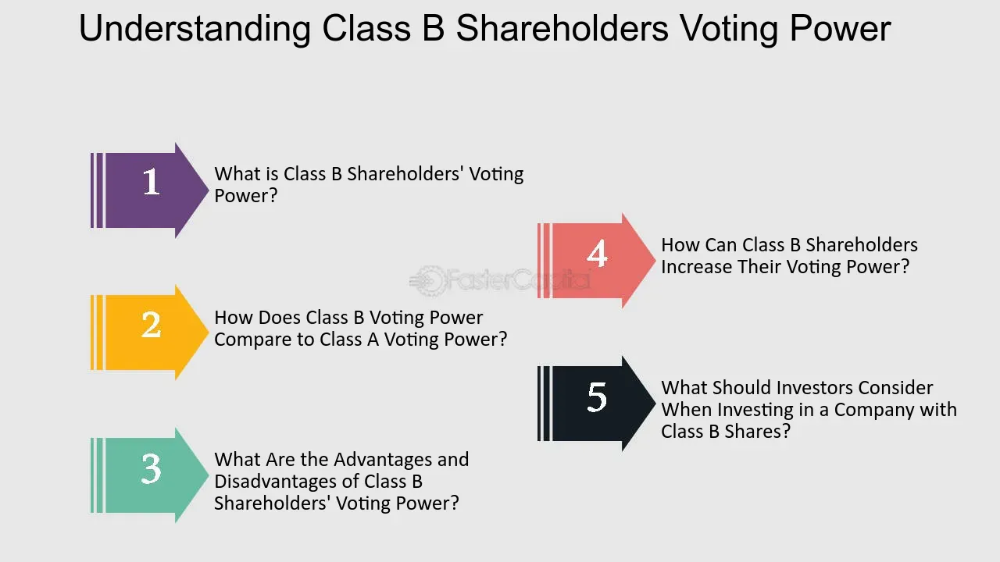

## Table of Contents

## What are Class B shares?

Class B shares are a type of stock that companies issue. They usually give the owners fewer voting rights than Class A shares. This means that if you own Class B shares, you might not have as much say in how the company is run compared to someone who owns Class A shares. Companies might create Class B shares to keep control within a certain group of people, like the founders or key executives, while still raising money from the public.

Sometimes, Class B shares can be a good deal for investors because they might be cheaper than Class A shares. Even though they come with fewer voting rights, they can still offer the same financial benefits, like dividends and potential growth in value. This makes them attractive to people who want to invest in the company but don't care as much about having a say in its decisions.

## How do Class B shares differ from Class A shares?

Class B shares and Class A shares are different types of stock that a company can issue. The main difference between them is usually the voting rights. Class A shares typically give the owner more votes per share than Class B shares. For example, one Class A share might give you 10 votes, while one Class B share might give you just one vote. This means that if you own Class B shares, you have less say in how the company is run compared to someone who owns Class A shares.

Another difference can be the price. Sometimes, Class B shares are cheaper than Class A shares. This can make them more attractive to investors who want to buy into the company but don't need as much control. Even though Class B shares come with fewer voting rights, they can still offer the same financial benefits, like dividends and the chance for the stock price to go up. So, if you're more interested in the financial returns than in having a say in the company's decisions, Class B shares might be a good choice for you.

## What is the typical voting power associated with Class B shares?

Class B shares usually have less voting power than Class A shares. For example, one Class B share might give you just one vote, while one Class A share might give you ten votes. This means that if you own Class B shares, you don't have as much say in the company's decisions compared to someone who owns Class A shares.

The exact voting power of Class B shares can vary from one company to another. Some companies might give Class B shares no voting rights at all, while others might give them a small amount of voting power. The main idea is that Class B shares are designed to let the company raise money from investors without giving up too much control over how the company is run.

## Can Class B shares be converted into other classes of shares?

Yes, Class B shares can sometimes be converted into other classes of shares, but it depends on the company's rules. Some companies let you change your Class B shares into Class A shares after a certain time or if certain conditions are met. This can be good for you because Class A shares usually have more voting power.

Not all companies allow this conversion, though. It's important to read the company's rules and talk to a financial advisor to understand if and how you can convert your shares. Knowing the details can help you make better decisions about your investments.

## What are the advantages of holding Class B shares for a company?

For a company, holding Class B shares can help keep control in the hands of a few key people, like the founders or top executives. By issuing Class B shares with fewer voting rights, the company can raise money from the public without giving up too much say in how the company is run. This can be really important for the people who started the company because they want to keep making the big decisions.

Another advantage is that Class B shares can attract more investors. These shares are often cheaper than Class A shares, so more people can afford to buy them. Even though they come with less voting power, they can still offer the same financial benefits, like dividends and the chance for the stock price to go up. This means the company can get more money from investors who are more interested in making money than in having a say in the company's decisions.

## How do Class B shares affect corporate governance?

Class B shares can change how a company is run because they usually give owners less voting power than Class A shares. This means that the people who started the company or are in charge can keep more control over big decisions. They can raise money from the public by selling Class B shares without losing their say in how the company works. This can be good for the founders because they want to keep making the important choices.

On the other hand, Class B shares can make some investors feel left out. If you own Class B shares, you might not have as much say in the company's decisions as someone with Class A shares. This can lead to less input from a wide range of shareholders, which might not be good for the company in the long run. But, if the people in charge use their control well, it can help the company grow and succeed.

## What industries commonly use Class B shares and why?

Some industries that often use Class B shares are tech companies and media companies. These industries like Class B shares because they help the founders and top executives keep control over their companies. For example, tech companies like Google and Meta (formerly known as Facebook) have used Class B shares to make sure the people who started the company can still make the big decisions, even after the company goes public and sells shares to the public.

Media companies also use Class B shares a lot. They do this because they want to keep control over what they create and how they run their business. For example, companies like The New York Times and News Corp have used Class B shares to keep the power in the hands of the people who know the industry best. This helps them stay true to their mission and keep making content that their audience likes.

## How does the issuance of Class B shares impact the stock market?

When a company issues Class B shares, it can change things in the stock market. Class B shares usually give owners less voting power than Class A shares. This means the company can raise money from the public without losing control over how it's run. More people might want to buy Class B shares because they are often cheaper than Class A shares. This can make the company's stock more popular and increase the demand for it on the stock market.

However, the issuance of Class B shares can also make some investors feel left out. If you own Class B shares, you have less say in the company's decisions compared to someone with Class A shares. This can lead to less input from a wide range of shareholders, which might not be good for the company in the long run. But if the people in charge use their control well, it can help the company grow and succeed, which can be good for the stock market overall.

## What are the tax implications of holding Class B shares?

The tax implications of holding Class B shares are pretty much the same as holding any other type of stock. When you get dividends from Class B shares, you have to pay taxes on them. The tax rate depends on how much money you make and how long you've held the shares. If you sell your Class B shares and make a profit, you'll also have to pay capital gains tax. The tax rate for capital gains can be different depending on how long you owned the shares before selling them.

Sometimes, the tax rules can be a bit different if the company that issued the Class B shares is based in another country. If that's the case, you might have to deal with foreign taxes on your dividends. But, you might be able to get some of that money back when you do your taxes in your home country. It's a good idea to talk to a tax advisor to understand all the details and make sure you're doing everything right.

## How do Class B shares influence shareholder rights and investor relations?

Class B shares can change how much say shareholders have in a company. These shares usually give owners less voting power than Class A shares. This means if you own Class B shares, you don't get as much of a say in big decisions like who runs the company or how it's managed. This can make some investors feel like they're not as important, which might make them less happy with the company. But it can also help the company because the people who started it or are in charge can keep making the big decisions, which they think is best for the company's future.

When it comes to investor relations, Class B shares can be a bit tricky. On one hand, they can attract more investors because they're often cheaper than Class A shares. This can make more people want to buy into the company, which is good for raising money. On the other hand, investors who own Class B shares might feel left out because they don't have as much control. This can make it harder for the company to keep good relationships with all its investors. It's important for the company to communicate well and make sure everyone understands why they're using Class B shares and how it can help the company grow.

## What are the regulatory considerations for companies issuing Class B shares?

When companies want to issue Class B shares, they have to follow rules set by places like the Securities and Exchange Commission (SEC) in the United States. These rules are there to make sure everything is fair and clear for investors. Companies need to tell everyone about the different rights that come with Class B shares, like how many votes each share gets. They also need to say if and how Class B shares can be changed into other types of shares. This helps investors understand what they're buying and how it might affect their say in the company.

Sometimes, stock exchanges also have their own rules about Class B shares. For example, the New York Stock Exchange (NYSE) and NASDAQ might have different rules about how much voting power Class B shares can have. Companies need to make sure they follow these rules too. If they don't, they might get in trouble or not be allowed to list their shares on the exchange. It's important for companies to work with lawyers and other experts to make sure they're doing everything right when they issue Class B shares.

## How have Class B shares evolved historically and what might future trends look like?

Class B shares have been around for a long time, but they became more popular in the late 20th century. Companies started using them to keep control in the hands of founders and key people while still raising money from the public. One big example is when Google went public in 2004. They used Class B shares to make sure the founders, Larry Page and Sergey Brin, could keep making the big decisions. Over time, more tech and media companies started using Class B shares for the same reason. They wanted to grow and get money from investors but didn't want to lose control over how their companies were run.

In the future, Class B shares might become even more common, especially in new industries like tech startups and green energy companies. These companies might want to use Class B shares to keep control while still getting the money they need to grow. But there could also be changes in the rules about Class B shares. Some people think that giving too much control to a few people isn't fair to other investors. So, regulators might make new rules to make sure everyone has a fair say in how companies are run. This could change how Class B shares are used and might make companies think of new ways to balance control and investment.

## What are the differences between share classes in the context of algorithmic trading?

Algorithmic trading capitalizes on the computational power to exploit price differences and [volatility](/wiki/volatility-trading-strategies) between various share classes, including Class A and Class B shares. This approach relies heavily on mathematical models and sophisticated software to execute trades at speeds beyond human capability, aiming to profit from market inefficiencies.

Two notable strategies employed in [algorithmic trading](/wiki/algorithmic-trading) are pairs trading and statistical [arbitrage](/wiki/arbitrage). Pairs trading involves simultaneously buying and selling two correlated securities to profit from their relative price changes, which deviate from a historical equilibrium. For example, if the historical ratio between a company's Class A and Class B shares is disrupted, an algorithm can simultaneously short the overvalued share and buy the undervalued counterpart, anticipating a reversion to their historical price ratio. This is typically represented as:

$$
\text{Position}_{\text{A}} = - \beta \cdot \text{Position}_{\text{B}}
$$

where $\beta$ denotes the hedge ratio derived from historical price data.

Statistical arbitrage takes this a step further by relying on statistical models to discern anomalies in price movements, offering traders high-frequency, automated opportunities for profit. These algorithms continuously analyze large datasets to identify patterns and forecast future price movements. Key inputs include historical prices, volatility measures, [volume](/wiki/volume-trading-strategy) trends, and fundamental data. The algorithm determines the probability of potential price convergence based on statistical metrics, such as mean reversion or stochastic calculus, and executes trades accordingly.

Both strategies hinge on an in-depth understanding of share class dynamics, which is crucial for developing algorithms that leverage pricing disparities. These algorithms rely on real-time data streams and can execute trades in milliseconds, a critical advantage in highly competitive markets.

Implementing these strategies requires advanced programming skills and a robust understanding of quantitative finance principles. For instance, in Python, one might use libraries such as NumPy and pandas for data manipulation, alongside dedicated financial libraries for implementing trading strategies efficiently. A basic snippet might look like this:

```python
import numpy as np
import pandas as pd

def pairs_trading_strategy(class_a_prices, class_b_prices):
    ratio = class_a_prices / class_b_prices
    mean_ratio = np.mean(ratio)
    std_dev = np.std(ratio)

    z_score = (ratio - mean_ratio) / std_dev

    # Long/Short signals based on z-score threshold
    long_signals = z_score < -1
    short_signals = z_score > 1

    return long_signals, short_signals

# Example price data
class_a_prices = pd.Series([...])
class_b_prices = pd.Series([...])
long_signals, short_signals = pairs_trading_strategy(class_a_prices, class_b_prices)
```

Here, the z-score indicates how many standard deviations the current ratio is from the mean, dictating long and short trading signals. By meticulously coding such strategies, algorithmic traders can efficiently exploit the nuanced differences between share classes to obtain optimal trading results. Understanding these share class differences is vital for maximizing profits and minimizing risks, positioning traders to capitalize on market opportunities effectively.

## References & Further Reading

- **Common Stock Classification and Corporate Power by Adolf A. Berle and Gardiner C. Means**: This foundational text provides an in-depth analysis of common stock classifications and their implications for corporate governance and decision-making power.

- **Dual-Class Share Structures in the U.S.** by Council of Institutional Investors, Harvard Law School Forum on Corporate Governance: This document explores the prevalence of dual-class share structures in the United States, examining the advantages and disadvantages for investors and companies, and the impact on corporate control and shareholder value.

- **Algorithmic Trading and DMA: An Introduction to Direct Access Trading Strategies by Barry Johnson**: This book offers insights into the mechanics and strategies of algorithmic trading, emphasizing the role of direct market access (DMA) in executing efficient and effective trades.

- **Optimal Enterprise Risk Trading by David Durrett**: Durrett's work discusses risk management strategies within trading environments, providing frameworks and methodologies for optimizing enterprise risk trading decisions.

- **Mechanisms of Market Efficiency by Sanford J. Grossman and Joseph E. Stiglitz**: This paper analyzes the various mechanisms that contribute to market efficiency, challenging the notion of perfectly efficient markets and highlighting the role of information asymmetry and transaction costs in trading strategies.

