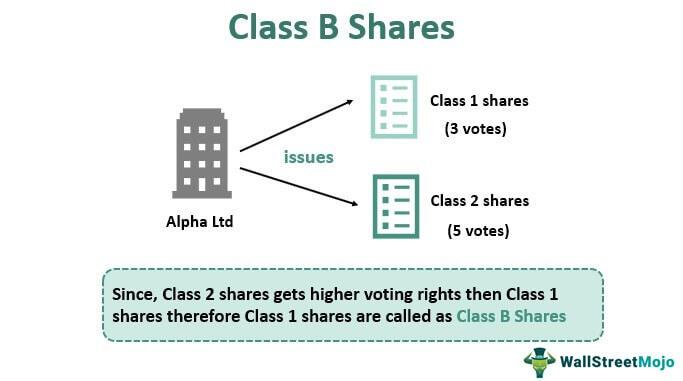

In the complex world of investing, understanding the nuances of share structures is crucial for maximizing returns and managing risks. Among various types, Class B shares emerge as a popular form of common stock with distinct characteristics. These shares are typically structured with reduced voting power compared to Class A shares, making them more accessible to a broader range of investors. This accessibility can influence the strategic decisions made by companies regarding capital structure and control.

Class B shares' unique traits, such as their voting structure, play a significant role in shaping algorithmic trading strategies. Algorithmic trading, which involves using computer algorithms to execute trades automatically, exploits these differences to optimize trading outcomes. By analyzing share class distinctions, algorithmic traders can identify inefficiencies and opportunities within the market, potentially enhancing their returns.



The impact of share class differences extends to market capitalization, which is the total market value of a company's outstanding shares. This metric is critical for evaluating a company's size, investment potential, and market perception. Differences between Class A and Class B shares, particularly in terms of their voting rights and perceived value, can affect a company's market capitalization significantly. For both individual investors and seasoned traders, understanding these dynamics becomes essential for navigating the complexities of modern financial markets, thereby aligning their investment strategies with their financial goals and risk profiles.

## Table of Contents

## Understanding Share Classes: An Overview

Common shares represent a key component of equity ownership in corporations, typically categorized into distinct classes, with Class A and Class B being among the most prevalent. These classifications play a significant role in defining shareholder rights, impacting elements such as voting power, accessibility, and convertibility, contributing uniquely to the influence held by a shareholder within a corporation.

Class A shares typically confer elevated voting rights per share compared to other classes, such as Class B. This characteristic is strategically designed to allow company insiders, such as founders and management, to retain substantial control over corporate decisions and governance even if they hold a minority of the total equity. For instance, a company might structure its Class A shares to offer ten votes per share while Class B shares might offer only one vote per share. This distribution ensures that voting control remains concentrated among insiders, even when a significant portion of shares is sold to the public.

Conversely, Class B shares are frequently structured to be more accessible to a broader range of investors. They generally offer lower voting rights, resulting in a reduced influence on corporate governance. The reduced voting power is often compensated by a lower price point, making Class B shares an attractive option for retail investors and those looking to participate in a company's financial growth without a substantial investment. Consequently, Class B shares can widen the base of investors, which might benefit the company's liquidity and capital-raising efforts.

Understanding the nuances of these share classes is crucial for developing sound investment strategies. From an investor's perspective, selecting between Class A and B shares involves weighing the trade-offs between voting influence and potential financial returns. For instance, investors prioritizing control and influence within a company might opt for Class A shares, despite possibly higher costs. Meanwhile, those more interested in potential upside and broader market participation might favor Class B shares due to their affordability.

In the context of financial analysis, knowing the structure of a company’s share classes is essential for accurate valuation and assessment of risk. It allows investors to align their portfolio strategies with their specific financial goals and risk tolerance levels. This distinction is also pivotal for institutions engaged in [algorithmic trading](/wiki/algorithmic-trading), where understanding share class dynamics can influence trading strategies and outcomes, though this discussion extends beyond the current section.

To summarize, the categorization of common shares into classes like A and B significantly shapes the investment landscape, with distinct implications for control, accessibility, and strategic planning. As such, they are a fundamental consideration in shareholder decision-making and corporate governance.

## Class B Shares: Features and Voting Power

Class B shares are typically crafted to be more accessible to the general public due to their relatively lower price compared to Class A shares. This structure aims to expand investor participation, allowing a broader base of individuals to partake in the company's financial growth. Despite offering reduced voting rights, Class B shares appeal to many investors for their ability to provide equitable financial benefits without the premium price associated with Class A shares.

The issuance of Class B shares is often a strategic decision made by companies to raise capital while maintaining a concentrated control structure. By providing fewer voting rights per share, organizations ensure that decision-making power remains with a select group of insiders or founding members. This approach allows companies to attract necessary investment capital without ceding significant control over corporate governance.

To contrast the differences in voting rights, many firms delineate their share classes such that one Class A share may [carry](/wiki/carry-trading) multiple votes, while a Class B share might only carry one vote. This imbalance underscores the importance of understanding the trade-offs between voting influence and potential investment returns. For instance, a company might stipulate that each Class A share carries ten votes while each Class B share carries one vote. Such configurations are pivotal for investors seeking to balance financial returns with governance influence.

The financial benefits provided by Class B shares are often equivalent to those of Class A shares, especially when it comes to dividends and potential for capital appreciation. As a result, retail investors are attracted to Class B shares as a means to invest in the company's success without prioritizing governance role. This democratization of share ownership allows more investors to participate in the market, potentially increasing the [liquidity](/wiki/liquidity-risk-premium) and market presence of the company.

Ultimately, investors must weigh the trade-offs between voting rights and financial returns when considering Class B shares. While these shares afford less control over corporate decisions, they are often more accessible and still offer substantial financial gains. This balance allows investors to align their holdings with their financial goals and governance preferences, ensuring a well-rounded investment strategy.

## Algorithmic Trading and Share Class Differences

Algorithmic trading capitalizes on the computational power to exploit price differences and [volatility](/wiki/volatility-trading-strategies) between various share classes, including Class A and Class B shares. This approach relies heavily on mathematical models and sophisticated software to execute trades at speeds beyond human capability, aiming to profit from market inefficiencies.

Two notable strategies employed in algorithmic trading are pairs trading and statistical [arbitrage](/wiki/arbitrage). Pairs trading involves simultaneously buying and selling two correlated securities to profit from their relative price changes, which deviate from a historical equilibrium. For example, if the historical ratio between a company's Class A and Class B shares is disrupted, an algorithm can simultaneously short the overvalued share and buy the undervalued counterpart, anticipating a reversion to their historical price ratio. This is typically represented as:

$$
\text{Position}_{\text{A}} = - \beta \cdot \text{Position}_{\text{B}}
$$

where $\beta$ denotes the hedge ratio derived from historical price data.

Statistical arbitrage takes this a step further by relying on statistical models to discern anomalies in price movements, offering traders high-frequency, automated opportunities for profit. These algorithms continuously analyze large datasets to identify patterns and forecast future price movements. Key inputs include historical prices, volatility measures, [volume](/wiki/volume-trading-strategy) trends, and fundamental data. The algorithm determines the probability of potential price convergence based on statistical metrics, such as mean reversion or stochastic calculus, and executes trades accordingly.

Both strategies hinge on an in-depth understanding of share class dynamics, which is crucial for developing algorithms that leverage pricing disparities. These algorithms rely on real-time data streams and can execute trades in milliseconds, a critical advantage in highly competitive markets.

Implementing these strategies requires advanced programming skills and a robust understanding of quantitative finance principles. For instance, in Python, one might use libraries such as NumPy and pandas for data manipulation, alongside dedicated financial libraries for implementing trading strategies efficiently. A basic snippet might look like this:

```python
import numpy as np
import pandas as pd

def pairs_trading_strategy(class_a_prices, class_b_prices):
    ratio = class_a_prices / class_b_prices
    mean_ratio = np.mean(ratio)
    std_dev = np.std(ratio)

    z_score = (ratio - mean_ratio) / std_dev

    # Long/Short signals based on z-score threshold
    long_signals = z_score < -1
    short_signals = z_score > 1

    return long_signals, short_signals

# Example price data
class_a_prices = pd.Series([...])
class_b_prices = pd.Series([...])
long_signals, short_signals = pairs_trading_strategy(class_a_prices, class_b_prices)
```

Here, the z-score indicates how many standard deviations the current ratio is from the mean, dictating long and short trading signals. By meticulously coding such strategies, algorithmic traders can efficiently exploit the nuanced differences between share classes to obtain optimal trading results. Understanding these share class differences is vital for maximizing profits and minimizing risks, positioning traders to capitalize on market opportunities effectively.

## The Impact on Market Capitalization

The structure of share classes significantly impacts a company’s overall market capitalization, which is a crucial indicator of its equity value. Market capitalization is calculated by multiplying the total number of a company’s outstanding shares by the current market price per share. When a company issues multiple classes of shares, such as Class A and Class B, the market capitalization can be influenced by how these shares are distributed and priced. This, in turn, affects evaluations of company size and investment potential.

Differences in voting rights and perceived value between Class A and Class B shares can affect investor appeal and market perception. Class A shares, often associated with higher voting power, might attract investors interested in corporate influence. However, Class B shares typically offer broader accessibility, being more affordable, which can attract retail investors. The perceived value of these shares can fluctuate based on the strategic goals of different investor groups, ultimately impacting the company's market capitalization.

For investors, assessing the entire share structure is essential to align investments with their risk tolerance and financial objectives. A thorough understanding helps in evaluating the potential appreciation in value and associated risks. Some investors may prefer more voting rights for a sense of control, while others might prioritize financial returns, focusing on the potential growth of Class B shares.

Algorithmic trading strategies are particularly attuned to the share class differences that impact market capitalization and trading volumes. Traders use algorithms to exploit price discrepancies and volatility among different share classes. For instance, pricing anomalies between Class A and Class B shares can be identified and leveraged by executing automated trades that capitalize on these market inefficiencies. By taking advantage of share class distinctions, algorithmic traders can enhance their strategies to optimize trading outcomes, ultimately influencing market dynamics and capitalization metrics.

## Conclusion

Class A and Class B shares provide investors and companies with distinct advantages in managing corporate strategy and decision-making processes. Class A shares typically grant higher voting rights, allowing founders and key management to retain control over significant corporate decisions. Meanwhile, Class B shares, generally offering fewer voting rights, attract a broader investor base due to often being more affordable, thus enhancing liquidity and expanding the company's access to capital.

The significance of these share classes extends to algorithmic trading, where understanding their nuances can lead to profitable outcomes. Algorithmic traders employ strategies that leverage variations in voting rights and pricing between Class A and B shares. For instance, discrepancies in perceived value and market behavior between these classes can be exploited through techniques such as pairs trading and [statistical arbitrage](/wiki/statistical-arbitrage), which depend on identifying and acting on minute price differences.

Informed knowledge of share class distinctions is indispensable for traders and investors aiming to maximize market opportunities. The ability to accurately interpret these distinctions aids in developing sophisticated trading strategies that can capture market inefficiencies. Ultimately, mastering the intricacies of Class A and Class B shares is imperative for securing favorable results in today's rapidly evolving financial markets, where precision and timing often define the line between profit and loss.

## References & Further Reading

- **Common Stock Classification and Corporate Power by Adolf A. Berle and Gardiner C. Means**: This foundational text provides an in-depth analysis of common stock classifications and their implications for corporate governance and decision-making power.

- **Dual-Class Share Structures in the U.S.** by Council of Institutional Investors, Harvard Law School Forum on Corporate Governance: This document explores the prevalence of dual-class share structures in the United States, examining the advantages and disadvantages for investors and companies, and the impact on corporate control and shareholder value.

- **Algorithmic Trading and DMA: An Introduction to Direct Access Trading Strategies by Barry Johnson**: This book offers insights into the mechanics and strategies of algorithmic trading, emphasizing the role of direct market access (DMA) in executing efficient and effective trades.

- **Optimal Enterprise Risk Trading by David Durrett**: Durrett's work discusses risk management strategies within trading environments, providing frameworks and methodologies for optimizing enterprise risk trading decisions.

- **Mechanisms of Market Efficiency by Sanford J. Grossman and Joseph E. Stiglitz**: This paper analyzes the various mechanisms that contribute to market efficiency, challenging the notion of perfectly efficient markets and highlighting the role of information asymmetry and transaction costs in trading strategies.

