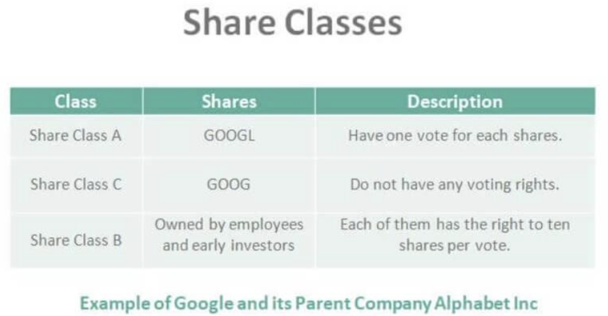

## Table of Contents

## What are Class C Shares?

Class C Shares are a type of mutual fund share that usually come with higher annual fees but lower upfront costs compared to other share classes. When you buy Class C Shares, you might not have to pay a sales charge right away, which is called a front-end load. Instead, these shares often have a small fee if you sell them within a short period, usually one year, known as a contingent deferred sales charge (CDSC). This makes Class C Shares attractive if you plan to keep your investment for a shorter time.

However, Class C Shares have higher ongoing expenses, like annual management fees, which can eat into your returns over time. These fees are charged as a percentage of the assets you have invested in the fund. Because of these higher costs, Class C Shares might not be the best choice if you plan to hold onto your investment for many years. It's important to think about how long you want to keep your money in the fund and compare the costs of different share classes before you decide.

## How do Class C Shares differ from Class A and Class B Shares?

Class C Shares are different from Class A and Class B Shares mostly because of their fees and how long you plan to keep your investment. Class A Shares usually have a front-end load, which means you pay a fee when you buy them. This fee can be big, but Class A Shares often have lower yearly fees, making them a good choice if you're planning to keep your investment for a long time. Class B Shares, on the other hand, don't charge you when you buy them, but they have a back-end load. This means you pay a fee if you sell your shares within a certain time, usually a few years. The fee gets smaller the longer you keep your investment, and Class B Shares might turn into Class A Shares after a while, which can lower your yearly fees.

Class C Shares work differently. They don't have a front-end load like Class A Shares, so you don't pay anything when you buy them. They might have a small back-end load like Class B Shares, but this fee is only charged if you sell your shares within a short time, usually one year. The big difference is that Class C Shares have higher yearly fees than both Class A and Class B Shares. This makes them less good for long-term investments because the high yearly fees can add up over time. So, Class C Shares are often better if you're thinking about keeping your money in the fund for just a few years.

## What are the typical fees associated with Class C Shares?

Class C Shares usually don't charge you a fee when you buy them, which is called a front-end load. But if you sell your shares within a short time, like a year, you might have to pay a small fee called a contingent deferred sales charge (CDSC). This fee is usually around 1% of what you're selling, but it can be different depending on the fund.

The main thing to know about Class C Shares is that they have higher yearly fees than other types of shares. These fees, called expense ratios, are charged every year as a percentage of the money you have in the fund. They can be around 1% to 2% or even more. Because these yearly fees are higher, they can take a bigger bite out of your investment over time, especially if you keep your money in the fund for many years.

## What are the advantages of investing in Class C Shares?

One big advantage of investing in Class C Shares is that you don't pay a fee when you buy them. This means you can put all your money into the fund right away, without any of it going towards a front-end load like with Class A Shares. This can be really helpful if you want to start investing without a big upfront cost.

Another good thing about Class C Shares is that they are great for shorter investments. If you think you might need your money back within a few years, Class C Shares can be a smart choice. They might have a small fee if you sell them within the first year, but after that, you can take your money out without paying extra. This makes them more flexible if your plans might change.

## What are the disadvantages of investing in Class C Shares?

One major downside of Class C Shares is their high yearly fees. These fees, called expense ratios, can be around 1% to 2% or even more. This means you pay a lot every year just to keep your money in the fund. Over time, these high fees can eat away at your returns, making it harder for your investment to grow as much as it could with lower-cost shares.

Another disadvantage is that Class C Shares are not the best for long-term investments. If you plan to keep your money in the fund for many years, the high yearly fees can really add up. Class A Shares, which have lower yearly fees but a front-end load, might be a better choice if you're planning to hold onto your investment for a long time. So, if you're thinking about keeping your money invested for the long haul, Class C Shares might not be the most cost-effective option.

## How does the load structure of Class C Shares work?

Class C Shares have a special way of charging fees that's different from other types of shares. When you buy Class C Shares, you don't have to pay any money right away. This is called no front-end load, which means you can put all your money into the fund without losing any to fees at the start.

But, if you decide to sell your Class C Shares within a short time, usually one year, you might have to pay a small fee. This fee is called a contingent deferred sales charge (CDSC), and it's often about 1% of the amount you're selling. After that first year, you can take your money out without paying this fee. The big thing to remember is that Class C Shares have higher yearly fees, which can make them more expensive over time if you keep your money in the fund for a long time.

## Who are the typical investors that might benefit from Class C Shares?

People who might benefit from Class C Shares are usually those who don't want to pay a fee when they start investing. If you're someone who wants to put all your money into a fund right away without losing any to upfront costs, Class C Shares could be a good choice for you. They are especially helpful if you don't have a lot of extra money to spend on fees at the beginning.

Class C Shares are also good for people who might need their money back soon. If you think you might want to take your money out of the fund within a few years, Class C Shares can be a smart pick. They have a small fee if you sell them within the first year, but after that, you can get your money out without paying more. This makes them a flexible option for people whose plans might change.

## How do Class C Shares impact long-term investment returns?

Class C Shares can make your long-term investment returns smaller because they have high yearly fees. These fees, which can be around 1% to 2% or even more, are taken out of your investment every year. Over many years, these fees add up and eat away at the money you could be [earning](/wiki/earning-announcement). If you keep your money in Class C Shares for a long time, you might end up with less money than if you chose a different type of share with lower fees.

For example, if you invest $10,000 in Class C Shares and they grow by 6% each year, but you pay 2% in fees every year, after 20 years, you would have about $22,000. But if you chose a share class with a 0.5% fee, you could end up with around $27,000 instead. That's a big difference! So, if you're planning to keep your money invested for a long time, Class C Shares might not be the best choice because their high fees can really hurt your long-term returns.

## What are the tax implications of investing in Class C Shares?

When you invest in Class C Shares, you need to think about how taxes might affect your investment. The main tax you'll deal with is capital gains tax. This tax is on the profit you make when you sell your shares for more than you paid for them. If you hold onto your Class C Shares for more than a year before selling, you might pay a lower long-term capital gains tax rate. But if you sell them within a year, you'll pay a higher short-term capital gains tax rate, which is the same as your regular income tax rate.

Another tax thing to remember is that the yearly fees you pay for Class C Shares can't be used to lower your taxes. These fees come out of your investment before you see any returns, so they don't count as a tax deduction. Also, if the mutual fund makes money from selling investments inside the fund, you might have to pay taxes on that too, even if you don't sell any of your shares. This is called a capital gains distribution, and it can happen even if you're not planning to take your money out of the fund.

## How does the conversion feature of Class C Shares function, if applicable?

Some Class C Shares have a special feature where they can turn into a different type of share after a certain time. This is called a conversion feature. Usually, Class C Shares might turn into Class A Shares after you've held them for a while, like 8 to 10 years. When this happens, you start to pay lower yearly fees because Class A Shares have smaller expense ratios. This can be good for you if you plan to keep your money in the fund for a long time because it can save you money on fees in the future.

The conversion from Class C to Class A Shares happens automatically, so you don't have to do anything. It's set up by the fund company to help investors save on costs over time. But not all Class C Shares have this feature, so it's important to check the details of the fund you're investing in. If your Class C Shares do convert, it's a way to enjoy the benefits of lower fees without having to switch funds yourself.

## What should investors consider when comparing Class C Shares to other investment options?

When comparing Class C Shares to other investment options, investors should think about how long they plan to keep their money invested. Class C Shares are good if you might need your money back within a few years because they don't charge you anything when you buy them. But if you're planning to keep your money in the fund for a long time, Class C Shares might not be the best choice. They have high yearly fees that can add up and take away from your returns over time. Other share classes, like Class A Shares, might be better for long-term investments because they have lower yearly fees, even though you pay a fee when you buy them.

Investors should also look at the total costs of Class C Shares compared to other options. Class C Shares don't have a front-end load, which can be nice if you don't want to pay a fee right away. But they do have a small fee if you sell them within the first year, and their high yearly fees can make them more expensive in the long run. It's important to think about all these fees and compare them to what you would pay with other types of shares or different investments. By looking at the total costs and how long you plan to invest, you can decide if Class C Shares are right for you or if another option might be better.

## How have Class C Shares performed historically compared to other share classes?

Class C Shares have generally underperformed compared to other share classes over the long term. This is mostly because they have higher yearly fees, which can eat into your investment returns over time. For example, if you keep your money in Class C Shares for many years, the high fees can add up and make your investment grow less than if you chose Class A Shares, which have lower yearly fees but a front-end load. Studies have shown that over 10 or 20 years, the difference in returns between Class C Shares and other share classes can be significant, mainly because of these higher ongoing costs.

However, Class C Shares can sometimes do better in the short term, especially if you don't keep your money in the fund for very long. Since Class C Shares don't charge you a fee when you buy them, all your money goes into the fund right away. This can be good if you plan to take your money out within a few years because you won't have to pay a big front-end load like with Class A Shares. But even in the short term, the performance of Class C Shares can vary a lot depending on the specific fund and the market conditions, so it's important to look at the details of the fund you're thinking about investing in.

## References & Further Reading

[1]: Bergstra, J., Bardenet, R., Bengio, Y., & Kégl, B. (2011). ["Algorithms for Hyper-Parameter Optimization."](https://dl.acm.org/doi/10.5555/2986459.2986743) Advances in Neural Information Processing Systems 24.

[2]: ["Advances in Financial Machine Learning"](https://github.com/FIONA-Youkyung/Financial_Engineering/blob/master/Advances_in_Financial_Machine_Learning_Marcos_Lopez_de_Prado.pdf) by Marcos Lopez de Prado

[3]: ["Evidence-Based Technical Analysis: Applying the Scientific Method and Statistical Inference to Trading Signals"](https://www.amazon.com/Evidence-Based-Technical-Analysis-Scientific-Statistical/dp/0470008741) by David Aronson

[4]: ["Machine Learning for Algorithmic Trading"](https://github.com/stefan-jansen/machine-learning-for-trading) by Stefan Jansen

[5]: ["Quantitative Trading: How to Build Your Own Algorithmic Trading Business"](https://www.amazon.com/Quantitative-Trading-Build-Algorithmic-Business/dp/1119800064) by Ernest P. Chan