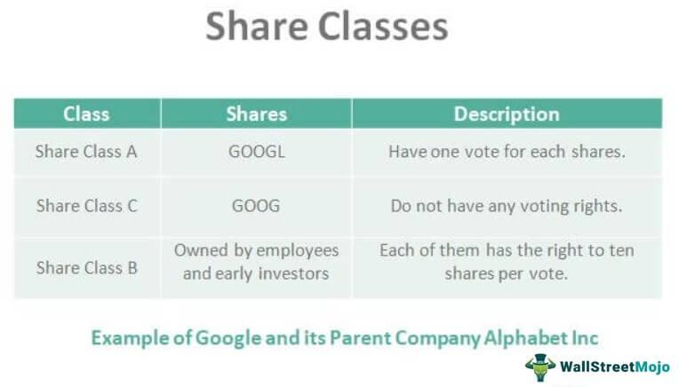

Investing in mutual funds is a widespread strategy adopted by individuals aiming to diversify their portfolios and reduce financial risk exposure. Among the investment avenues available, mutual fund Class C shares present distinct features that necessitate understanding by investors. Unlike Class A or B shares, Class C shares typically do not impose upfront or back-end sales charges, making them particularly appealing to investors seeking flexibility and simplicity in their investment approach.

Algorithmic trading, often referred to as algo trading, has seen significant growth in popularity within the investment community. This strategy leverages computer algorithms to execute trades based on predefined criteria, enhancing efficiency, and reducing market impact. The growing use of algorithmic trading technologies complements the liquidity attributes of mutual fund investments, offering strategic benefits when integrating Class C shares with algorithmic approaches.



By exploring the advantages and disadvantages of investing in mutual fund Class C shares and their applicability within algorithmic trading strategies, investors can enhance their decision-making processes. Understanding these concepts enables investors to align their financial strategies with their goals, optimizing for both short-term gains and long-term financial security.

## Table of Contents

## Overview of Mutual Fund Class C Shares

Mutual fund shares are organized into various classes, each tailored to different investment strategies and objectives. Among these, Class C shares occupy a specific niche known for their 'level-load' structure. Unlike Class A shares, which often involve an upfront sales charge, or Class B shares, which may have a back-end load if sold within a certain time frame, Class C shares typically do not impose these types of sales charges. Instead, they feature ongoing annual fees that result in higher expenses relative to other classes.

The primary characteristic of Class C shares is the absence of initial or exit costs, which makes them attractive to investors who wish to have the entire sum of their investment working immediately. This fee structure can be beneficial for investors who prefer to avoid the larger immediate or delayed sales charges associated with Class A and B shares. However, this convenience comes at the cost of elevated expense ratios, which can erode returns more quickly if the investment is held over a long period.

Investors who choose Class C shares often have a short to mid-term investment horizon. These shares afford flexibility without the penalty of substantial upfront or [exit](/wiki/exit-strategy) fees, making them suitable for investors anticipating liquidity needs or expecting to rebalance their portfolio in the relatively near-term future. For longer-term investments, the higher annual fees can be disadvantageous, as these recurring costs can accumulate significantly, potentially impacting the overall returns.

Understanding the characteristics of Class C shares is essential for investors as they select the mutual fund class that aligns with their financial objectives. Each class offers distinct fee structures and potential benefits, but it is crucial to consider the trade-offs inherent in each choice. Class C shares, with their unique level-load fee structure, present a viable option for investors seeking convenience and flexibility in their investment strategy.

## Pros of Investing in Class C Shares

Class C shares of mutual funds offer several advantages that can appeal to investors seeking flexibility and simplicity in their investment strategies. A prominent benefit of Class C shares is the absence of a front-end sales load. This means that the entire investment amount is put to work immediately, allowing investors to maximize their initial capital and potentially increasing their returns from the start.

Additionally, Class C shares typically do not impose a back-end sales charge if the investment is held beyond a certain period, often averaging around one year. This feature provides investors with the flexibility to access their funds as needed without incurring additional costs, which can be especially beneficial for those who might require [liquidity](/wiki/liquidity-risk-premium) or need to reallocate assets within a relatively short timeframe.

The simplicity in the fee structure of Class C shares may appeal to investors who prefer not to deal with varying sales loads over different periods. With a consistent and predictable fee structure, these shares allow investors to better estimate the impact of fees on their net returns over time. This consistency also facilitates straightforward financial planning and aligns well with short to medium-term investment horizons, where reinvestment of initial capital without substantial deductions can be advantageous.

For investors targeting short to medium-term goals, Class C shares offer an aligned strategy. Their structure facilitates the immediate reinvestment of the full investment amount, potentially capitalizing on short-term market opportunities and compounding returns without the concern of front-end charges. By maintaining a level annual expense, Class C shares offer predictability that can be a decisive [factor](/wiki/factor-investing) for investors seeking stable and clear long-term expense management.

## Cons of Investing in Class C Shares

Mutual fund Class C shares, while offering certain benefits, present several drawbacks that investors must consider. One key disadvantage is their higher annual fees compared to Class A shares. Class C shares typically have increased expense ratios, primarily due to the ongoing 12b-1 fees, which can significantly erode investment returns over an extended period. This fee structure makes Class C shares particularly less cost-effective for long-term investors. Unlike Class A shares, which might require a front-end load but generally have lower ongoing expenses, Class C shares continue to charge these fees annually, potentially diminishing the compound growth of investments over time.

Investors in Class C shares may also face restrictions when attempting to convert to other share classes. Many funds offer limited opportunities for conversion without incurring additional charges. This lack of flexibility can be a disadvantage for individuals seeking to adjust their investment strategy over time or to shift to a share class better suited for long-term growth.

Another concern with Class C shares is that the focus on saving initial fees can lead investors to overlook the potential for long-term growth. By prioritizing the absence of front-end sales charges, investors may unintentionally forgo the benefits of lower expense ratios available in other share classes over extended periods.

Furthermore, it is crucial for investors to be aware of the variability in fees and expenses across different mutual fund providers. While some funds may offer relatively competitive expense structures, others might impose substantially higher costs associated with Class C shares. Hence, a diligent comparison of different funds' fee structures is essential to ensure that the chosen investment aligns with the investor's financial objectives and cost considerations.

In conclusion, the appeal of Class C shares lies in their avoidance of initial sales charges and back-end fees when held beyond a stipulated period. However, their ongoing higher annual fees and the potential limitations in share class conversion make them less suitable for long-term investment horizons. Investors must carefully assess these factors alongside their investment goals and horizons to make informed decisions.

## Understanding Algorithmic Trading

Algorithmic trading employs computer algorithms to execute trades based on predefined criteria. This innovative trading method allows investors to set specific parameters or triggers, such as timing, price, or quantity, which the algorithm uses to make trading decisions. One of the primary advantages of [algorithmic trading](/wiki/algorithmic-trading) is its ability to conduct rapid trade execution, significantly reducing the time it takes to complete transactions. This rapid execution helps minimize market impact and slippage, as trades are completed within milliseconds, often faster than a human trader could manage manually.

Hedge funds and financial institutions have widely adopted algorithmic trading due to its efficiency and ability to process large volumes of transactions with precision. This method is not restricted to large entities; individual investors also utilize algo trading to exploit market opportunities, leveraging technologies that were once accessible only to professionals. The algorithms can analyze vast amounts of market data in real time, enabling investors to capitalize on market inefficiencies and price discrepancies.

The alignment of algorithmic trading with mutual fund investments highlights the benefits of liquidity. Many mutual funds, including Class C shares, offer daily liquidity, allowing investors to buy or sell shares at the net asset value (NAV) at the end of each trading day. Algorithmic systems can optimize these transactions by synchronizing trades with the daily NAV calculations, ensuring that optimal pricing and timings are achieved.

For investors interested in integrating technology into their investment strategies, understanding algorithmic trading is essential. Developing an effective algo trading strategy involves not only coding the algorithm but also thoroughly [backtesting](/wiki/backtesting) it against historical data to gauge its performance under various market conditions. Investors might use programming languages like Python to develop their trading algorithms. Here is a simple example of how an algorithm could be designed to identify a moving average crossover strategy:

```python
import pandas as pd
import numpy as np

def moving_average(data, window):
    return data.rolling(window=window).mean()

# Example data
data = pd.Series([10, 11, 12, 13, 12, 11, 10, 14, 15, 16])

# Define short-term and long-term windows
short_window = 3
long_window = 5

# Calculate moving averages
short_ma = moving_average(data, short_window)
long_ma = moving_average(data, long_window)

# Generate trading signals: 1 (buy) when short MA crosses above long MA, -1 (sell) when the reverse occurs
signals = np.where(short_ma > long_ma, 1, 0)
signals = np.where(short_ma < long_ma, -1, signals)

print(signals)
```

This code snippet represents a basic strategy where buy signals are generated when the short-term moving average crosses above the long-term moving average, and sell signals are generated when the opposite occurs. Algorithmic trading strategies, though sometimes complex, are grounded in these types of systematic approaches that can be backtested and refined to improve performance over time. Understanding these mechanisms is crucial for investors seeking to make informed decisions about using technology-driven trading strategies.

## Integrating Class C Shares into Algo Trading Strategies

Algorithmic trading can effectively incorporate mutual fund Class C shares by exploiting their liquidity and fee structure. The key advantage of Class C shares is their short-term liquidity, which aligns with algo trading strategies that require frequent buying and selling. Since Class C shares do not impose front-end sales loads, investors can invest their full capital upfront, enabling algorithms to deploy funds more efficiently. Moreover, the absence of back-end loads after a minimum period allows for flexibility in portfolio rebalancing and rapid position adjustments, which is essential for capturing short-term market gains.

The ongoing fee structure of Class C shares, which typically involves higher annual expenses rather than upfront or deferred sales loads, complements algorithmic strategies that do not demand long holding periods. Algo trading can exploit this to capitalize on quick market movements without incurring the prohibitive costs associated with staying invested over extended durations. Algorithms can be programmed to assess these expense ratios and optimize trading decisions based on the cost-benefit analysis, ensuring that only the most promising trades are executed.

Python's versatility facilitates the integration of Class C shares into algo trading strategies. For instance, investors can use a Python script to determine the best trading times by analyzing market data:

```python
import pandas as pd
import numpy as np

# Example function to optimize buy/sell timing
def optimize_trades(prices, expense_ratio):
    signals = []
    sma_short = prices.rolling(window=7).mean()
    sma_long = prices.rolling(window=30).mean()

    for i in range(len(prices)):
        if sma_short[i] > sma_long[i]:  # Signal to buy
            signals.append('Buy')
        elif sma_short[i] < sma_long[i]:  # Signal to sell
            signals.append('Sell')
        else:
            signals.append('Hold')

    # Adjust for ongoing fees
    adjusted_signals = [signal if np.random.rand() > expense_ratio else None for signal in signals]
    return adjusted_signals

# Example data
price_data = pd.Series([120, 121, 119, 122, 125, 126, 127, 124, 123, 126, 130, 129, 128])

# Simulated expense ratio for Class C shares
expense_ratio = 0.015

trade_signals = optimize_trades(price_data, expense_ratio)
print(trade_signals)
```

Risk management plays a crucial role in optimizing algo trading integrating Class C shares, as algorithmic systems can adjust positions based on real-time market data. These systems reduce human emotional bias, often a significant obstacle in trading, by making impartial, data-driven decisions. Algorithms can respond quickly to market fluctuations and adjust the portfolio to mitigate risks, enhancing overall investment strategy resilience.

Incorporating Class C shares into algorithmic trading strategies allows investors to harness the benefits of both fund and technology features, providing better control over timing and costs, and thus potentially improving total returns.

## Conclusion: Weighing Options for Different Investors

Investors need to carefully weigh the pros and cons of Class C shares when aligning their investment strategies with their financial goals and time horizons. Class C shares, characterized by their level-load structure and absence of front-end or back-end sales charges, are often favored by those looking for short-term holdings. This feature aligns well with algorithmic trading, providing opportunities to capitalize on market conditions and take advantage of quick gains without the immediate impact of sales charges.

For investors focused on long-term growth potential, Class C shares may not be the most cost-effective option due to higher annual expenses. Alternative classes, like Class A shares with lower ongoing fees, might better serve long-term investors looking to minimize fees and optimize compound growth over time. The analysis thus becomes a trade-off between initial fee savings and ongoing cost considerations over the investment period.

Algorithmic trading introduces both opportunities and challenges to these investment choices. The use of sophisticated algorithms to execute trades on predetermined criteria allows for rapid decision-making, minimizing market impact and potentially enhancing returns. However, algorithmic strategies require a thorough understanding of both technological and financial aspects to effectively integrate them into a broader investment strategy. Investors must stay informed about the latest developments in trading technologies and mutual fund options to harness the full potential while mitigating risks.

Conclusively, informed decision-making demands comprehensive research and understanding of mutual fund classes and trading methodologies. While Class C shares and algo trading may offer attractive features for specific investor profiles, these options should be carefully considered in the context of individual financial objectives and market conditions.

## References & Further Reading

[1]: Bergstra, J., Bardenet, R., Bengio, Y., & Kégl, B. (2011). ["Algorithms for Hyper-Parameter Optimization."](https://dl.acm.org/doi/10.5555/2986459.2986743) Advances in Neural Information Processing Systems 24.

[2]: ["Advances in Financial Machine Learning"](https://github.com/FIONA-Youkyung/Financial_Engineering/blob/master/Advances_in_Financial_Machine_Learning_Marcos_Lopez_de_Prado.pdf) by Marcos Lopez de Prado

[3]: ["Evidence-Based Technical Analysis: Applying the Scientific Method and Statistical Inference to Trading Signals"](https://www.amazon.com/Evidence-Based-Technical-Analysis-Scientific-Statistical/dp/0470008741) by David Aronson

[4]: ["Machine Learning for Algorithmic Trading"](https://github.com/stefan-jansen/machine-learning-for-trading) by Stefan Jansen

[5]: ["Quantitative Trading: How to Build Your Own Algorithmic Trading Business"](https://www.amazon.com/Quantitative-Trading-Build-Algorithmic-Business/dp/1119800064) by Ernest P. Chan