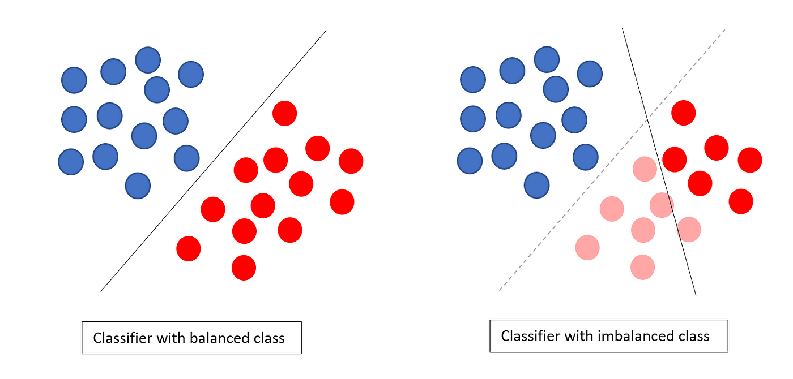

## Table of Contents

## What is a class-imbalanced dataset in machine learning?

A class-imbalanced dataset in machine learning is when the different categories or classes in your data are not represented equally. Imagine you're trying to teach a computer to recognize cats and dogs from pictures. If you show it 90 pictures of dogs and only 10 pictures of cats, the dataset is imbalanced because there are many more dog pictures than cat pictures. This can make it harder for the computer to learn about cats because it sees them less often.

When training a model on an imbalanced dataset, the model might become biased towards the majority class. In our cat and dog example, the model might get really good at identifying dogs but struggle with cats because it has seen so many more dog pictures. This can lead to poor performance when the model is used in the real world, where it needs to correctly identify both cats and dogs equally well. To fix this, people use different techniques like collecting more data for the underrepresented class or using special algorithms that help balance the dataset.

## Why are class-imbalanced datasets a problem in machine learning?

Class-imbalanced datasets are a problem in machine learning because they can make the model biased towards the class that appears more often. Imagine you're teaching a computer to tell the difference between apples and oranges. If you show it 90 pictures of apples and only 10 pictures of oranges, the computer will see apples a lot more. It might get really good at recognizing apples but not so good at recognizing oranges. This means the model might guess "apple" a lot, even when it should guess "orange," because it's used to seeing more apples.

This bias can lead to poor performance in real-world situations where the model needs to correctly identify all classes equally well. For example, in medical diagnosis, if a disease is rare, a model trained on an imbalanced dataset might miss it because it's not used to seeing it often. This can have serious consequences. To deal with this, people use different techniques like collecting more data for the rare class or using special methods to balance the dataset, so the model can learn about all classes fairly.

## What are common causes of class imbalance in datasets?

Class imbalance often happens because of how data is collected or because of what's naturally common in the world. For example, if you're trying to predict if a credit card transaction is fraudulent, there will be way more normal transactions than fraudulent ones. This is because fraud doesn't happen very often. So, when you collect data, you end up with a lot more examples of normal transactions, which makes the dataset imbalanced.

Another reason for class imbalance is when data is sampled incorrectly. Imagine you're studying a rare disease. If you collect data from a general hospital, you might not see many cases of this disease because it's rare. But if you collect data from a specialized hospital that treats this disease, you might see more cases. How and where you collect your data can change how balanced your dataset is.

Sometimes, class imbalance can also come from how data is labeled or processed. If some classes are harder to label correctly, they might be underrepresented in the dataset. For example, if you're classifying pictures of animals, some animals might be harder to spot or label, so you end up with fewer examples of those animals in your dataset. This can also lead to an imbalance.

## How can you detect class imbalance in a dataset?

To detect class imbalance in a dataset, you need to look at how many examples there are of each class. You can do this by counting the number of examples in each class and comparing them. If one class has a lot more examples than the others, your dataset is imbalanced. For example, if you're trying to classify emails as spam or not spam, you might find that you have 900 not spam emails and only 100 spam emails. This big difference shows that your dataset is imbalanced.

A simple way to check for class imbalance is to use a tool like a bar chart or a pie chart to see the distribution of classes visually. You can also use code to find the percentage of each class in your dataset. For instance, if you're using Python, you might write a small script to count the examples in each class and then calculate the percentage of each class. If one class makes up a much larger percentage than the others, you know you have an imbalance.

## What are the basic techniques to handle class imbalance?

One basic technique to handle class imbalance is called oversampling. This means making more copies of the examples from the class that doesn't have many examples. Imagine you have a dataset with 90 pictures of dogs and 10 pictures of cats. To balance it, you could make more copies of the cat pictures until you have about the same number of cat and dog pictures. This way, the computer sees more cat pictures and learns about them better. Another way to oversample is to create new, similar examples of the minority class using a method called SMOTE, which stands for Synthetic Minority Over-sampling Technique. This method makes new examples that are similar to the existing ones but slightly different, so the model can learn from a variety of examples.

Another technique is called undersampling. This means taking away some examples from the class that has too many examples. Using the same example, if you have 90 pictures of dogs and 10 pictures of cats, you could remove some dog pictures until you have about the same number of dog and cat pictures. This way, the computer doesn't see so many dog pictures and can focus more on learning about cats. However, undersampling can lead to losing important information, so it's important to be careful when using this method. Both oversampling and undersampling can help make your dataset more balanced, which can lead to a better [machine learning](/wiki/machine-learning) model.

A third technique is to use different weights for different classes during training. This means telling the computer to pay more attention to the class with fewer examples. For example, if you're trying to classify emails as spam or not spam, and you have a lot more not spam emails, you could tell the computer to focus more on learning about the spam emails. This can be done by adjusting the class weights in the model's loss function. For instance, if you're using a logistic regression model, you might adjust the weights like this: $$ w_{spam} = \frac{\text{total examples}}{\text{2} \times \text{spam examples}} $$. This makes the model try harder to correctly classify the spam emails, helping to balance the dataset.

## What is oversampling and how does it help with class imbalance?

Oversampling is a technique used to balance a dataset by increasing the number of examples from the class that doesn't have many examples. Imagine you're teaching a computer to tell the difference between cats and dogs, but you have 90 pictures of dogs and only 10 pictures of cats. To balance this, you could make more copies of the cat pictures until you have about the same number of cat and dog pictures. This way, the computer sees more cat pictures and can learn about them better.

Another way to oversample is to create new, similar examples of the minority class using a method called SMOTE, which stands for Synthetic Minority Over-sampling Technique. SMOTE makes new examples that are similar to the existing ones but slightly different. For example, if you have a dataset with 90 not spam emails and 10 spam emails, SMOTE could create new spam emails that are similar to the existing ones. This helps the model learn from a variety of examples and can improve its performance on the minority class.

## What is undersampling and in what scenarios might it be preferred over oversampling?

Undersampling is a technique used to balance a dataset by removing some examples from the class that has too many examples. Imagine you're teaching a computer to tell the difference between cats and dogs, but you have 90 pictures of dogs and only 10 pictures of cats. Instead of making more copies of the cat pictures, you could remove some dog pictures until you have about the same number of cat and dog pictures. This way, the computer doesn't see so many dog pictures and can focus more on learning about cats. However, undersampling can lead to losing important information, so it's important to be careful when using this method.

Undersampling might be preferred over oversampling in scenarios where you have a very large dataset and the majority class has many examples. For example, if you're trying to classify credit card transactions as fraudulent or not, and you have millions of normal transactions but only a few thousand fraudulent ones, it might be more practical to reduce the number of normal transactions rather than creating millions of copies of the fraudulent ones. This can help the model learn more efficiently and save computational resources. Additionally, if you're concerned about overfitting, which can happen when you oversample by making too many copies of the same examples, undersampling can be a better choice because it doesn't increase the risk of the model learning the same examples too well.

## What are advanced methods like SMOTE and how do they work?

SMOTE, which stands for Synthetic Minority Over-sampling Technique, is an advanced method used to balance datasets by creating new examples of the class that doesn't have many examples. Imagine you're teaching a computer to recognize rare animals in pictures, but you only have a few pictures of these animals. SMOTE helps by making new pictures that are similar to the ones you already have but slightly different. It does this by looking at the features of the existing examples and creating new ones that are combinations of these features. For example, if you have a dataset with 90 pictures of common animals and only 10 pictures of rare animals, SMOTE could create new pictures of rare animals that look a bit different from the original ones, helping the model learn about them better.

SMOTE works by finding the k-nearest neighbors for each example in the minority class and then creating new examples along the line segments joining these neighbors. For instance, if you have a rare animal picture with certain features, SMOTE will find other rare animal pictures that are similar and create new pictures that are a mix of these features. This helps the model see more variety in the minority class, which can improve its performance. While SMOTE can be very helpful, it's important to use it carefully because creating too many new examples can sometimes lead to overfitting, where the model learns the new examples too well and doesn't perform well on real, unseen data.

## How does class weighting affect model training in imbalanced datasets?

Class weighting is a way to help a computer learn better from imbalanced datasets by telling it to pay more attention to the class that doesn't have many examples. Imagine you're trying to teach a computer to recognize spam emails, but you have a lot more not spam emails. By using class weighting, you can tell the computer to focus more on learning about the spam emails. This is done by adjusting the weights in the model's loss function. For example, if you're using a logistic regression model, you might adjust the weights like this: $$ w_{spam} = \frac{\text{total examples}}{\text{2} \times \text{spam examples}} $$. This makes the model try harder to correctly classify the spam emails, helping to balance the dataset.

Using class weighting can help the model learn more fairly from all classes, even when some classes have a lot fewer examples. This can improve the model's performance on the minority class without needing to change the dataset itself. For example, if you're trying to predict if a credit card transaction is fraudulent, and you have many more normal transactions than fraudulent ones, class weighting can help the model focus on learning about the rare fraudulent transactions. This way, the model can become better at recognizing fraud, which is important for real-world use.

## What performance metrics should be used when evaluating models on imbalanced datasets?

When you're evaluating how well a model works on a dataset where some classes have a lot more examples than others, you need to use special performance metrics. Accuracy, which is how often the model gets things right, can be misleading because the model might just guess the class that appears most often and still seem to do well. Instead, you should use metrics like precision, recall, and F1-score. Precision tells you how many of the times the model said "yes" to a class were actually correct. Recall tells you how many of the actual examples of a class the model found. The F1-score is a way to balance precision and recall, and it's calculated like this: $$ F1 = 2 \times \frac{\text{precision} \times \text{recall}}{\text{precision} + \text{recall}} $$. These metrics help you see how well the model is doing on the classes that don't have many examples.

Another useful metric is the area under the receiver operating characteristic curve (AUC-ROC). This metric looks at how well the model can tell the difference between classes across different thresholds. It's especially helpful when you're dealing with imbalanced data because it gives you a good overall picture of the model's performance. If you're working with more than two classes, you might also want to use the area under the precision-recall curve (AUC-PR). This metric focuses on the trade-off between precision and recall, which is important when one class is much rarer than the others. By using these metrics, you can get a better understanding of how your model is handling the imbalanced dataset and make sure it's performing well on all classes, not just the ones with lots of examples.

## How can ensemble methods be used to improve performance on imbalanced datasets?

Ensemble methods can help improve a model's performance on imbalanced datasets by combining several models to make better predictions. Imagine you have a few friends who are good at different things. If you ask them all to help you solve a problem, you might get a better answer than if you only asked one friend. In machine learning, ensemble methods work the same way. They use different models, like decision trees or neural networks, and combine their predictions to get a better overall result. This can help the model pay more attention to the classes that don't have many examples, making it better at recognizing them.

One popular ensemble method is called Random Forest. It works by creating many decision trees and then voting on the final prediction. Each tree might be a bit different, but together they can make a more accurate prediction. For imbalanced datasets, Random Forest can be adjusted to focus more on the minority class by changing how it builds the trees. Another method is called Boosting, where models are trained one after the other, and each new model tries to fix the mistakes of the previous ones. For example, AdaBoost can be used to give more weight to the examples that are hard to classify, which often includes examples from the minority class. By using these ensemble methods, you can make your model more balanced and better at recognizing all classes, even the ones with fewer examples.

## What are the latest research trends in handling class-imbalanced datasets?

Recent trends in handling class-imbalanced datasets focus on developing more advanced techniques that go beyond traditional methods like oversampling and undersampling. One of the latest trends is the use of [deep learning](/wiki/deep-learning) models, such as neural networks, which can learn complex patterns in data. Researchers are exploring ways to modify these models to better handle imbalanced data, such as using techniques like focal loss. Focal loss helps the model focus more on the hard-to-classify examples, which are often from the minority class. This can be expressed as $$ FL(p_t) = -\alpha_t (1 - p_t)^\gamma \log(p_t) $$, where $\alpha_t$ and $\gamma$ are hyperparameters that control the focus on difficult examples. Another trend is the use of generative adversarial networks (GANs) to create synthetic examples of the minority class, helping to balance the dataset without simply copying existing examples.

Another important trend is the development of new evaluation metrics that are better suited for imbalanced datasets. Traditional metrics like accuracy can be misleading when classes are imbalanced, so researchers are focusing on metrics like the area under the precision-recall curve (AUC-PR). AUC-PR is particularly useful because it shows how well the model can distinguish between classes when one class is much rarer. Additionally, there's growing interest in using ensemble methods that combine multiple models to improve performance on imbalanced datasets. Techniques like boosting and bagging are being refined to give more weight to minority class examples, helping the model to learn from them more effectively. These trends show that the field is moving towards more sophisticated and nuanced approaches to handling class imbalance.

## References & Further Reading

[1]: He, H., & Garcia, E. A. (2009). ["Learning from Imbalanced Data."](https://ieeexplore.ieee.org/document/5128907) IEEE Transactions on Knowledge and Data Engineering, 21(9), 1263-1284.

[2]: Chawla, N. V., Bowyer, K. W., Hall, L. O., & Kegelmeyer, W. P. (2002). ["SMOTE: Synthetic Minority Over-sampling Technique."](https://arxiv.org/abs/1106.1813) Journal of Artificial Intelligence Research, 16, 321-357.

[3]: Sun, Y., Wong, A. K., & Kamel, M. S. (2009). ["Classification of Imbalanced Data: A Review."](https://www.researchgate.net/publication/263913891_Classification_of_imbalanced_data_a_review) International Journal of Pattern Recognition and Artificial Intelligence, 23(4), 687-719.

[4]: Japkowicz, N., & Stephen, S. (2002). ["The Class Imbalance Problem: A Systematic Study."](https://dl.acm.org/doi/10.5555/1293951.1293954) Intelligent Data Analysis, 6(5), 429-449.

[5]: Buda, M., Maki, A., & Mazurowski, M. A. (2018). ["A Systematic Study of the Class Imbalance Problem in Convolutional Neural Networks."](https://arxiv.org/abs/1710.05381) Neural Networks, 106, 249-259.

[6]: Fernández, A., García, S., Galar, M., Prati, R., Krawczyk, B., & Herrera, F. (2018). ["Learning from Imbalanced Data Sets."](https://link.springer.com/book/10.1007/978-3-319-98074-4) Springer.

[7]: Riquelme, C., & Calderon, M. (2017). ["A Breaking Down of Focal Loss: An Iterative Approach for Large Scale Imbalanced Learning."](https://www.sciencedirect.com/science/article/pii/S0895611121001750) arXiv preprint arXiv:1805.07525.

[8]: Brownlee, J. (2020). [“Imbalanced Classification with Python: Better Metrics, Balance Skewed Classes, Cost-Sensitive Learning”](https://books.google.com/books/about/Imbalanced_Classification_with_Python.html?id=jaXJDwAAQBAJ) Machine Learning Mastery.