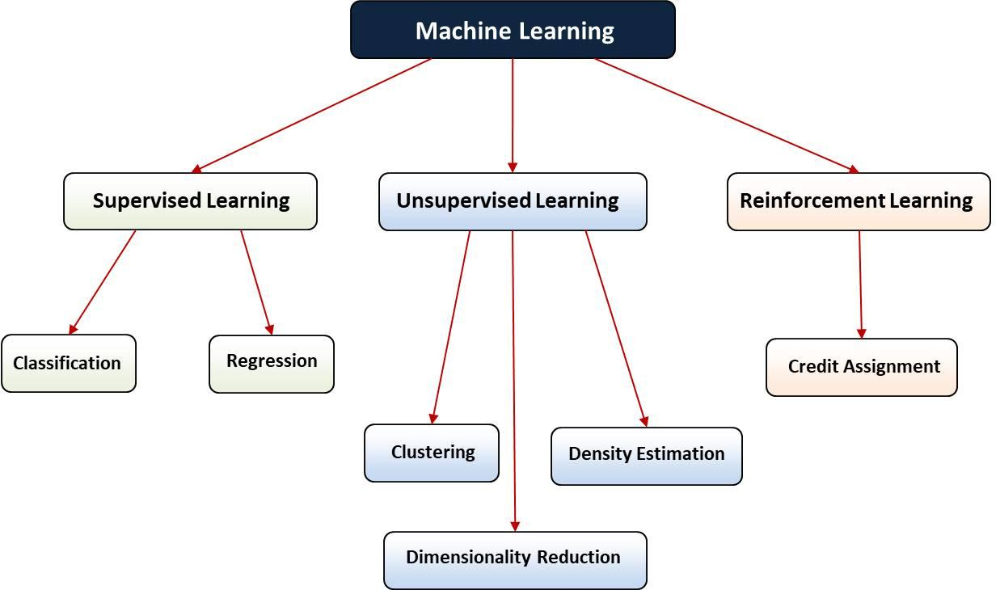

## Table of Contents

## What is a class in the context of machine learning?

In the context of machine learning, a class refers to a category or group that an item or data point can belong to. When you're trying to teach a computer to recognize different types of things, like pictures of dogs and cats, each type (dogs or cats) is a class. The computer learns from examples to figure out which class a new, unseen item belongs to. This is called classification, and it's a common task in machine learning where the goal is to assign labels to data.

For example, if you're using machine learning to identify whether an email is spam or not, "spam" and "not spam" are the two classes. The machine learning model uses features from the emails, like certain words or the sender's address, to decide which class an email falls into. By training on a large set of emails labeled as spam or not spam, the model learns to predict the class of new emails accurately. This process helps in organizing and filtering emails effectively.

## How does the concept of a class relate to supervised learning?

In supervised learning, the concept of a class is central to how the machine learning model learns and makes predictions. Supervised learning involves training a model on a dataset where each example is labeled with the correct class. For instance, if you're teaching a computer to recognize pictures of fruits, each picture would be labeled with its class, like "apple" or "banana." The model uses these labeled examples to learn the patterns and features that distinguish one class from another. Once trained, the model can then predict the class of new, unseen data by recognizing these patterns.

The process of assigning a class to new data is called classification. During training, the model adjusts its internal parameters to minimize the error in its predictions, aiming to correctly classify as many examples as possible. This is often done using algorithms like logistic regression or decision trees, which are designed to separate data into different classes. For example, in logistic regression, the model might use a formula like $$ P(Y=1|X) = \frac{1}{1 + e^{-(\beta_0 + \beta_1 X_1 + ... + \beta_n X_n)}} $$ to predict the probability that a data point belongs to a certain class. The goal is for the model to generalize well, meaning it can accurately classify new data it hasn't seen before based on what it learned from the training data.

## Can you explain the difference between a class and a label in machine learning?

In [machine learning](/wiki/machine-learning), a class and a label are related but not exactly the same thing. A class is a category or group that an item or data point can belong to. For example, if you're trying to identify different types of animals in pictures, "dog," "cat," and "bird" are classes. A label, on the other hand, is the specific tag or identifier assigned to a data point to show which class it belongs to. So, if you have a picture of a dog, the label for that picture would be "dog," indicating that the picture belongs to the "dog" class.

Think of it this way: classes are the categories you're trying to predict, and labels are the actual values you assign to your data to tell the model which class each data point is in. During training, a machine learning model learns from labeled data to understand the characteristics of each class. For example, in a binary classification problem to predict if an email is spam or not, "spam" and "not spam" are the classes, and each email in the training set would be labeled as either "spam" or "not spam." The model uses these labels to learn how to classify new emails correctly.

## What is the role of classes in classification algorithms?

In classification algorithms, classes are the different groups or categories that the algorithm tries to sort data into. For example, if you're using a machine learning model to tell the difference between pictures of apples and oranges, "apple" and "orange" are the classes. The algorithm learns from examples that are already labeled with their correct class. By looking at these examples, the algorithm figures out what makes an apple different from an orange, like color or shape. Then, when it sees a new picture, it can guess which class the picture belongs to based on what it learned.

The role of classes is crucial because they define what the algorithm is trying to predict. During training, the algorithm adjusts its internal settings to better separate the data into the right classes. For instance, in logistic regression, the algorithm might use a formula like $$ P(Y=1|X) = \frac{1}{1 + e^{-(\beta_0 + \beta_1 X_1 + ... + \beta_n X_n)}} $$ to predict the probability that a data point belongs to a certain class. The goal is for the algorithm to get good at guessing the right class for new data it hasn't seen before. This way, the algorithm can be used to sort new data into the correct categories, which is helpful in many real-world applications, like spam detection or medical diagnosis.

## How do you handle multi-class classification problems?

In multi-class classification problems, you're trying to sort things into more than two groups. For example, if you're trying to recognize different types of fruits like apples, oranges, and bananas, each fruit type is a class. There are a few ways to handle this. One common way is to use algorithms that can naturally deal with multiple classes, like decision trees or random forests. These algorithms can look at the features of your data and figure out how to split them into different classes. Another way is to use techniques that turn the multi-class problem into several binary classification problems, where you decide if something is in one class or not, one class at a time.

One popular method for multi-class classification is the "one-vs-rest" (OvR) approach. In this method, you create a separate binary classifier for each class. For example, if you have three classes (apple, orange, banana), you would train three classifiers: one to tell apples apart from everything else, one for oranges, and one for bananas. When you want to classify a new item, you run it through all three classifiers and pick the class with the highest score. Another method is "one-vs-one" (OvO), where you train a classifier for every pair of classes. For three classes, you'd need three classifiers: one to tell apples from oranges, one for apples from bananas, and one for oranges from bananas. The class that wins the most "votes" is chosen as the final classification.

Both OvR and OvO methods can be used with algorithms like logistic regression or support vector machines (SVMs). For example, in logistic regression, you might use the formula $$ P(Y=k|X) = \frac{e^{\beta_k X}}{\sum_{j=1}^{K} e^{\beta_j X}} $$ to calculate the probability of an item belonging to class k, where K is the total number of classes. This way, the algorithm can handle multiple classes and make the best guess about which class a new item should be put into.

## What are some common metrics used to evaluate the performance of class predictions?

When you're trying to figure out how good your class predictions are in machine learning, you'll use different metrics to check the performance. One of the most common metrics is accuracy, which tells you the percentage of correct predictions out of all predictions. If you have 100 predictions and 90 of them are right, your accuracy is 90%. But accuracy isn't always the best way to judge performance, especially if your classes are not balanced. For example, if you're trying to predict rare diseases, most of your data might be "not disease," so even a model that always guesses "not disease" could seem accurate but wouldn't be useful.

Other important metrics include precision, recall, and F1 score. Precision measures how many of the positive predictions were actually correct. For example, if your model says 100 things are apples and 90 of them really are apples, your precision is 90%. Recall looks at how many of the actual positives your model caught. If there are 100 real apples and your model finds 90 of them, your recall is 90%. The F1 score is a way to combine precision and recall into one number. It's calculated as $$ F1 = 2 \times \frac{\text{precision} \times \text{recall}}{\text{precision} + \text{recall}} $$. This score is helpful when you want a single number to show how well your model is doing at both precision and recall.

## How does class imbalance affect machine learning models and how can it be addressed?

Class imbalance happens when one class has a lot more examples than the others in your data. This can make your machine learning model biased towards the class with more examples, because it learns more about that class. For example, if you're trying to predict if someone has a rare disease, and only 1% of your data has the disease, your model might just guess "no disease" all the time because that's what it sees most often. This can lead to poor performance, especially in predicting the less common class, because the model doesn't get enough chances to learn about it.

To fix class imbalance, you can try different things. One way is to use oversampling, where you make more copies of the less common class to balance things out. Another way is undersampling, where you remove some examples from the more common class. There's also a method called SMOTE (Synthetic Minority Over-sampling Technique), which creates new, similar examples of the less common class to help the model learn better. You can also change how your model works by using different costs for misclassifying different classes, so it pays more attention to the less common one. For example, you might tell the model that missing a rare disease is much worse than a false alarm, which can help it focus on getting the rare cases right.

## What is the significance of class probabilities in machine learning models?

Class probabilities in machine learning models tell us how likely it is that a piece of data belongs to a certain class. For example, if a model is trying to figure out if an email is spam or not, the class probabilities would show how sure the model is about its guess. If the model says there's a 90% chance the email is spam, it means the model is pretty confident. These probabilities help us understand how well the model is doing and can be useful when we need to make decisions based on the model's predictions.

One way to calculate class probabilities is through logistic regression, where the formula $$ P(Y=1|X) = \frac{1}{1 + e^{-(\beta_0 + \beta_1 X_1 + ... + \beta_n X_n)}} $$ gives us the probability that a data point belongs to class 1. By looking at these probabilities, we can set thresholds to decide which class a new piece of data should be put into. For instance, if we want to be very sure before calling an email spam, we might only label it as spam if the probability is over 95%. This way, class probabilities give us more control over how the model works and help us balance between catching all the right cases and avoiding mistakes.

## How can feature engineering improve the performance of class-based models?

Feature engineering can help class-based models work better by creating new features or changing existing ones to make the important patterns in the data easier to see. For example, if you're trying to tell if an email is spam, you might make a new feature that counts how many times certain spammy words appear in the email. This can help the model spot spam emails more easily because it gives the model a clear hint about what to look for. By making these new features, you're helping the model learn the difference between classes better.

Another way feature engineering helps is by making the data cleaner and more useful. Sometimes, the data you start with might have things that don't matter much for telling classes apart, or it might be messy. By getting rid of these unimportant parts and fixing the messy parts, you can make the model's job easier. For example, if you're trying to tell different types of fruits apart, you might turn the raw color data into simpler categories like "red," "orange," and "yellow." This makes it easier for the model to use the color to guess the right fruit. So, by using feature engineering, you can make your class-based model more accurate and reliable.

## What advanced techniques exist for handling complex class structures in machine learning?

When dealing with complex class structures in machine learning, one advanced technique is using hierarchical classification. This method organizes classes into a tree-like structure where classes are grouped into broader categories first, and then further divided into more specific ones. For example, if you're classifying animals, you might start with broad categories like "mammal," "bird," and "reptile," and then break these down into more specific classes like "dog," "cat," "eagle," and "snake." This approach can help the model handle classes with many levels of detail more effectively by learning the relationships between different levels of the hierarchy. Techniques like hierarchical softmax or tree-based classifiers can be used to implement this, allowing the model to make more nuanced predictions by considering the hierarchical relationships between classes.

Another technique is multi-label classification, which is useful when data can belong to more than one class at the same time. For instance, a movie might be classified as both "action" and "comedy." Multi-label classification methods, like binary relevance or label powerset, allow the model to predict multiple class labels for each data point. This can be more challenging than regular classification because the model needs to understand the relationships between different labels. To handle this, techniques like using a separate classifier for each label or transforming the problem into a set of binary classification tasks can be employed. This approach is particularly useful in fields like text classification, where documents can belong to multiple categories simultaneously, improving the model's ability to capture the complexity of real-world data.

## How do ensemble methods like Random Forests handle class predictions?

Random Forests are a type of ensemble method that combine many decision trees to make class predictions. Each decision tree in a Random Forest looks at the data and tries to guess the right class. But, instead of using all the data to build each tree, Random Forests use a technique called bootstrapping. This means they take random samples of the data with replacement, so each tree sees a slightly different version of the data. They also use a random selection of features when splitting the data in each tree. By doing this, each tree might make a different guess about the class, but when you put all their guesses together, the Random Forest can make a more accurate prediction.

When it comes time to predict the class of a new piece of data, each tree in the Random Forest votes on what the class should be. The class that gets the most votes wins. This voting system helps the Random Forest handle complex class structures better because it combines the strengths of many trees. If you want to know how sure the Random Forest is about its guess, you can look at the class probabilities. These probabilities show how many trees voted for each class. For example, if you're using a Random Forest to predict if an email is spam or not, and 80 out of 100 trees say it's spam, the probability of the email being spam is 80%. This way, Random Forests can not only make accurate class predictions but also give you an idea of how confident they are in those predictions.

## What are some state-of-the-art approaches to dealing with class noise in machine learning?

Class noise in machine learning happens when some of your data is labeled wrong. This can make it hard for your model to learn the right patterns and can lead to bad predictions. One state-of-the-art way to deal with class noise is using algorithms that can spot and fix these mistakes. For example, some methods use a technique called "noise filtering," which looks at the data and tries to find the noisy examples. These examples can then be removed or their labels can be corrected before the model is trained. Another approach is "noise-tolerant learning," where the model is built to handle some level of noise without getting too confused. These methods help the model learn better even when some of the data is wrong.

Another advanced technique to deal with class noise is using ensemble methods like "boosting." Boosting works by training many models one after the other, where each new model focuses more on the examples that the previous models got wrong. This can help because the noisy examples are often the ones that are hard to classify, so by paying more attention to them, the model can learn to handle them better. For example, the AdaBoost algorithm adjusts the weights of the training examples so that the harder (and potentially noisy) examples get more focus in later rounds of training. By doing this, the final model can be more robust to class noise and make better predictions overall.

## References & Further Reading

[1]: Bishop, C. M. (2006). ["Pattern Recognition and Machine Learning"](https://www.cs.uoi.gr/~arly/courses/ml/tmp/Bishop_book.pdf). Springer.

[2]: Murphy, K. P. (2012). ["Machine Learning: A Probabilistic Perspective"](https://www.cs.ubc.ca/~murphyk/MLbook/pml-toc-1may12.pdf). MIT Press.

[3]: Hastie, T., Tibshirani, R., & Friedman, J. (2009). ["The Elements of Statistical Learning: Data Mining, Inference, and Prediction"](https://link.springer.com/book/10.1007/978-0-387-84858-7). Springer.

[4]: Pedregosa, F., Varoquaux, G., Gramfort, A., Michel, V., Thirion, B., Grisel, O., ... & Duchesnay, É. (2011). ["Scikit-learn: Machine Learning in Python"](https://dl.acm.org/doi/10.5555/1953048.2078195). Journal of Machine Learning Research, 12, 2825-2830.

[5]: Kuhn, M., & Johnson, K. (2013). ["Applied Predictive Modeling"](https://link.springer.com/book/10.1007/978-1-4614-6849-3). Springer.

[6]: Breiman, L. (2001). ["Random Forests"](https://link.springer.com/article/10.1023/A:1010933404324). Machine Learning, 45(1), 5-32.

[7]: He, H., & Garcia, E. A. (2009). ["Learning from Imbalanced Data"](https://ieeexplore.ieee.org/document/5128907). IEEE Transactions on Knowledge and Data Engineering, 21(9), 1263-1284.