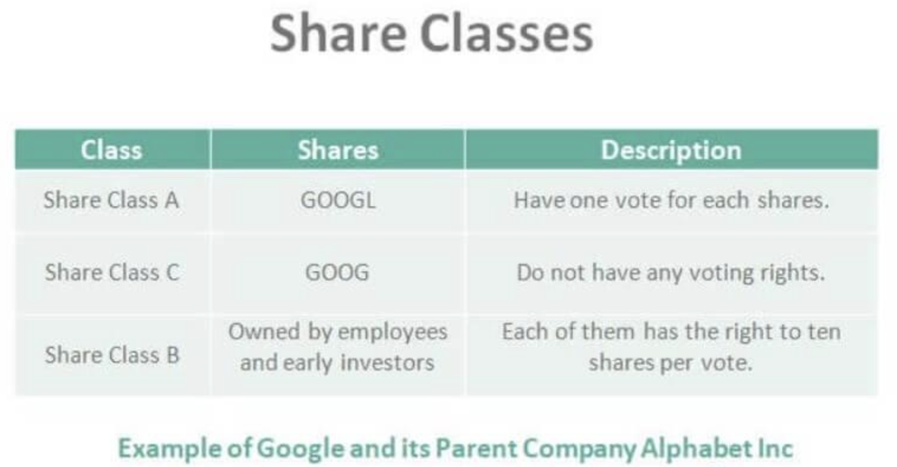

## Table of Contents

## What are classes of shares?

Classes of shares refer to different types of stock that a company can issue, each with its own set of rights and benefits. Companies create different classes of shares to attract various types of investors and to meet specific business needs. For example, some classes might offer more voting rights, while others might provide higher dividends or other financial benefits.

Common shares and preferred shares are two main types of share classes. Common shares usually give shareholders voting rights and the potential for capital gains if the company does well. On the other hand, preferred shares often do not offer voting rights but provide a fixed dividend and priority over common shareholders in the event of liquidation. This structure allows companies to tailor their offerings to different investor preferences and financial goals.

## Why do companies issue different classes of shares?

Companies issue different classes of shares to attract different types of investors and to meet their specific business needs. By offering various classes of shares, a company can appeal to investors who are looking for different things. For example, some investors might want to have a say in how the company is run, so they would be interested in shares that come with voting rights. Other investors might be more interested in getting regular income from their investment, so they would prefer shares that offer higher dividends.

Having different classes of shares also allows companies to keep control in the hands of certain shareholders, like the founders or key executives. For instance, a company might issue Class A shares with voting rights to the founders and Class B shares with no voting rights to the public. This way, the founders can still make important decisions even if they don't own a majority of the company's total shares. Overall, issuing different classes of shares gives companies flexibility in how they raise money and manage their ownership structure.

## What are the common types of share classes?

The two main types of share classes are common shares and preferred shares. Common shares are the most basic type of stock that a company issues. When you own common shares, you usually get to vote at shareholder meetings and have a chance to make money if the company does well. Common shareholders are last in line to get paid if the company goes bankrupt, but they can also benefit the most if the company grows and succeeds.

Preferred shares are different because they often don't come with voting rights, but they offer other benefits. People who own preferred shares usually get paid dividends before common shareholders. These dividends are often fixed, which means you know how much you'll get. If the company goes bankrupt, preferred shareholders get their money back before common shareholders. This makes preferred shares a bit safer, but they might not grow in value as much as common shares.

## How do voting rights differ between share classes?

Voting rights can be different for different classes of shares. Common shares usually come with voting rights. This means if you own common shares, you can vote on big decisions at the company's meetings, like choosing the board of directors or approving major changes. But not all common shares are the same. Some companies have different classes of common shares, like Class A and Class B. Class A shares might give you more votes per share than Class B shares. This way, the company can keep more control in the hands of certain shareholders, like the founders.

Preferred shares usually do not come with voting rights. People who own preferred shares are more interested in getting regular dividends than having a say in how the company is run. But sometimes, preferred shares can have special voting rights under certain conditions, like if the company misses paying dividends. Still, these voting rights are not as common as with common shares. So, when you're looking at different share classes, it's important to check what voting rights come with each one.

## What are the financial implications of owning different classes of shares?

Owning different classes of shares can affect your wallet in different ways. Common shares might make you more money if the company does well. If the company's value goes up, the price of common shares can go up too. This means you could sell your shares for more than you paid for them. But common shares can also be riskier. If the company does badly, the value of your shares could drop a lot. Plus, common shareholders are the last to get paid if the company goes bankrupt. You might not get anything back if there's no money left.

Preferred shares work a bit differently. They usually give you a fixed amount of money, called a dividend, every year. This can be good if you want a steady income from your investment. Even if the company has a tough year, you'll still get your dividend before common shareholders get anything. But preferred shares don't usually grow in value as much as common shares. So, you might not make as much money if the company does really well. Also, if the company goes bankrupt, preferred shareholders get paid before common shareholders, which makes them a bit safer.

## How do dividend policies vary across share classes?

Dividend policies can be different for common shares and preferred shares. Common shares might not always pay dividends. Companies can choose to pay dividends to common shareholders if they have extra money, but they don't have to. If the company is doing well and making a lot of money, they might decide to share some of that with common shareholders. But if they're saving up for something big or going through a tough time, they might skip the dividends. This means that owning common shares can be a bit unpredictable when it comes to getting regular payments.

Preferred shares usually come with a fixed dividend. This means if you own preferred shares, you can expect to get a certain amount of money every year, no matter how the company is doing. The company has to pay these dividends before they pay anything to common shareholders. This makes preferred shares a good choice if you want a steady income from your investment. But remember, if the company is really struggling and can't pay the dividends, preferred shareholders might have some special rights, like getting to vote on certain things, to help protect their investment.

## What are the conversion rights associated with different share classes?

Some share classes come with conversion rights, which means you can change one type of share into another type. For example, some preferred shares can be converted into common shares. This is good if you think the company will do well and you want to make more money from the growth of the stock. You might choose to convert your preferred shares into common shares to get a piece of that growth. But remember, once you convert, you might lose the fixed dividends that come with preferred shares.

Not all share classes have conversion rights. Common shares usually don't convert into anything else. But some companies might have different classes of common shares, like Class A and Class B, and they might let you convert from one to the other. This can be useful if you want to change your voting power or get different benefits. Always check the company's rules to see if conversion is allowed and what the terms are.

## How do share classes affect company control and governance?

Share classes can change how a company is controlled and run. Common shares usually give you the right to vote on big decisions, like who should be on the board of directors. But companies can make different classes of common shares, like Class A and Class B, where Class A might give more votes per share. This lets the company keep more control in the hands of certain people, like the founders or key leaders. So, even if they don't own most of the shares, they can still make important decisions.

Preferred shares often don't come with voting rights, so they don't affect company control as much. People who own preferred shares are usually more interested in getting regular dividends than having a say in how the company is run. But sometimes, preferred shares can have special voting rights if the company misses paying dividends. This is a way to protect the investment of preferred shareholders. Overall, the way a company sets up its share classes can really change who has the power to make decisions and how the company is governed.

## What are the legal and regulatory considerations for issuing multiple share classes?

When a company decides to issue different classes of shares, they need to follow certain laws and rules. These rules can be different depending on where the company is and what kind of company it is. For example, in the United States, companies listed on stock exchanges like the New York Stock Exchange or Nasdaq have to follow rules from the Securities and Exchange Commission (SEC). These rules make sure that the company tells investors clearly about the different share classes and what rights come with each one. This helps investors know what they're buying and how it might affect the company's control and governance.

Another important thing to think about is how different share classes can affect shareholders' rights. Some places have laws that protect all shareholders, no matter what class of shares they own. For example, some states in the U.S. have laws that say all shareholders must be treated fairly, even if they don't have voting rights. Companies also need to make sure their share classes fit with their own rules, like what's written in their company charter or bylaws. If a company wants to change its share classes, it might need to get approval from shareholders or even from a court. This can be a big process and needs careful planning.

## How do different share classes impact investor strategy and portfolio management?

Different share classes can change how investors think about their money and plan their investments. For example, if you want to have a say in how a company is run, you might choose to buy common shares with voting rights. But if you're more interested in getting a steady income, preferred shares might be a better choice because they usually come with fixed dividends. Investors also need to think about how much risk they want to take. Common shares can go up a lot in value if the company does well, but they can also lose a lot if the company struggles. Preferred shares are usually safer because they get paid first if the company has money problems, but they might not grow as much.

When managing a portfolio, investors often mix different share classes to balance their goals and risks. For instance, someone close to retirement might want more preferred shares for the steady income and less risk. A younger investor might be willing to take more risks and choose more common shares to try to make more money over time. By understanding the different rights and benefits of each share class, investors can make smarter choices about which stocks to buy and how to spread out their money. This helps them build a portfolio that fits their financial goals and how much risk they're comfortable with.

## What are some real-world examples of companies using multiple share classes?

One well-known example is Google's parent company, Alphabet Inc. They have three classes of shares: Class A, Class B, and Class C. Class A shares (GOOGL) have one vote per share and are available to the public. Class B shares have ten votes per share and are mostly owned by the founders, Larry Page and Sergey Brin. This gives them a lot of control over the company even though they don't own most of the shares. Class C shares (GOOG) have no voting rights and are also available to the public. This setup helps the founders keep control while still letting other people invest in the company.

Another example is Meta Platforms, the company behind Facebook. They have two classes of shares: Class A and Class B. Class A shares (META) are available to the public and come with one vote per share. Class B shares are mostly owned by Mark Zuckerberg and other insiders, and they have ten votes per share. This means Zuckerberg can make big decisions even if he doesn't own a majority of the total shares. This structure helps keep control in the hands of the key people while still allowing the company to raise money from the public.

## How can an investor evaluate the risks and benefits of investing in different classes of shares?

When thinking about investing in different classes of shares, it's important to look at the risks and benefits. Common shares can be riskier because they go up and down a lot with the company's success. If the company does well, the price of common shares can go up a lot, which means you could make a lot of money. But if the company does badly, the price can drop a lot too. Common shares also usually come with voting rights, so you can have a say in how the company is run. But remember, common shareholders are the last to get paid if the company goes bankrupt, so there's a bigger chance you might lose your money.

Preferred shares are often safer because they usually come with a fixed dividend. This means you get a certain amount of money every year, no matter how the company is doing. Preferred shareholders get paid before common shareholders, so if the company has money troubles, you're more likely to get something back. But preferred shares might not grow in value as much as common shares, so you might not make as much money if the company does really well. Also, preferred shares often don't come with voting rights, so you won't have a say in how the company is run. By understanding these differences, you can choose the share class that fits your goals and how much risk you're okay with.

## References & Further Reading

1. **"Common vs. Preferred Stock: Understanding Your Investment Choices"** - Investopedia provides a comprehensive guide on the distinctions and benefits of common and preferred stocks. It’s an essential resource for grasping the basics of these fundamental stock categories. [Investopedia](https://www.investopedia.com/articles/investing/082313/understanding-difference-between-preferred-stock-common-stock.asp)

2. **"Dual-Class Shares: A Recipe for Conflict"** - This research paper by the CFA Institute highlights the corporate governance challenges posed by dual-class share structures. It examines the implications for investor rights and corporate accountability. [CFA Institute](https://www.cfainstitute.org/en/research/market-integration/dual-class-shares)

3. **"Algorithmic Trading: A Comprehensive Overview"** - The book "Algorithmic Trading: Winning Strategies and Their Rationale" by Ernest Chan offers an in-depth exploration of algorithmic trading, including various strategies and their effectiveness in different market conditions. [Ernest P. Chan](https://www.amazon.com/Algorithmic-Trading-Winning-Strategies-Rationale/dp/1118460146)

4. **"The Impact of Algorithmic Trading on Market Dynamics"** - This study by the Bank of International Settlements provides insights into how algorithmic trading influences liquidity, volatility, and market efficiency. It's a valuable resource for understanding the broader market impacts of high-frequency trading. [BIS](https://www.bis.org/publ/qtrpdf/r_qt1912f.htm)

5. **"Corporate Governance and Equity Structures: Case Studies"** - Harvard Business Review features several case studies analyzing how companies like Google and Berkshire Hathaway have utilized their equity structures strategically. These cases offer practical insights into corporate governance and shareholder impact. [Harvard Business Review](https://hbr.org/)

6. **"Market Capitalization: The Influence of Share Classes"** - A paper published in the Journal of Finance discusses how different share classes affect company valuation and market capitalization, providing empirical evidence and theoretical analysis. [Journal of Finance](https://onlinelibrary.wiley.com/journal/15406261)

7. **"Pairs Trading: Quantitative Methods and Strategies"** - For those interested in the mechanics of pairs trading and its application in algorithmic strategies, this book by Ganapathy Vidyamurthy is a thorough quantitative analysis. [Ganapathy Vidyamurthy](https://www.amazon.com/Pairs-Trading-Quantitative-Methods-Strategies/dp/0471984653)

8. **"Effect of Voting Rights on Stock Prices"** - An article in the Financial Analysts Journal explores how variations in voting rights among different classes of shares can influence stock prices and investor behaviors. [Financial Analysts Journal](https://www.cfainstitute.org/en/research/financial-analysts-journal) 

These resources offer foundational and advanced insights into the topics of stock classes, equity types, and [algorithmic trading](/wiki/algorithmic-trading), equipping investors with the necessary knowledge to make informed decisions.

