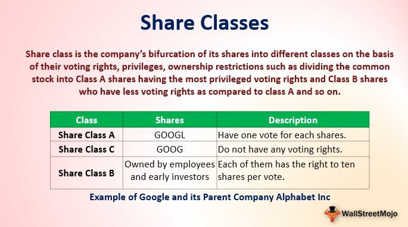

In stock markets, understanding the various categories of stocks is crucial for any investor. The stock market, a complex and multifaceted entity, offers a range of investment opportunities that require a keen understanding of different stock classifications and their implications. As investors, both novice and experienced, navigate this financial landscape, they encounter various stock categories such as common and preferred stocks, and specific share classes like Class A and Class B shares. These distinctions are not merely academic but have tangible impacts on investment strategies and outcomes.

The classification of stocks serves specific corporate governance purposes, allowing companies to balance control with the need for public investment. For instance, Class A and Class B shares often come with differing voting rights and dividend policies, presenting unique considerations for shareholders. Understanding these nuances is essential for making informed investment decisions.



Furthermore, the rise of technology in trading, particularly algorithmic trading, has transformed the way stock markets operate. Algorithmic trading—using computer algorithms to execute trades at speeds and frequencies that are impossible for human traders—has become a cornerstone of modern investing. These algorithms often leverage differences in share classes to optimize trading strategies, exploiting price variations and market inefficiencies.

By comprehending these elements—stock categories, types of equity, and the role of algorithmic trading—investors can navigate financial markets more efficiently. This knowledge not only aids in optimizing investment portfolios but also helps in understanding broader market dynamics, equipping investors to make strategic and well-informed decisions.

## Table of Contents

## Understanding Stock Categories

Understanding the various categories of stock is fundamental for investors aiming to maximize their returns while maintaining an understanding of their rights and responsibilities. The two primary categories of stock are common and preferred stock, each offering distinct benefits and characteristics.

Common stock is the most prevalent type of equity, representing ownership in a corporation and entitling the shareholder to vote on corporate matters, such as electing the board of directors. Common stockholders are also eligible to receive dividends, which are portions of a company's profits distributed to shareholders. These dividends are typically variable and not guaranteed. Despite their potential for capital appreciation, common stockholders are last in line to receive assets in the event of a liquidation, after creditors and preferred shareholders have been paid.

Preferred stock, by contrast, generally does not [carry](/wiki/carry-trading) voting rights. However, preferred shareholders are given priority over common stockholders when it comes to dividend payments and assets in the case of liquidation. Dividends for preferred stocks are often fixed and paid at regular intervals, offering a more stable income stream compared to the variable dividends of common stocks. Preferred stock can also be convertible, allowing holders to exchange them for a predetermined number of common shares, providing potential for capital appreciation.

Beyond these basic categories, stock can also be divided into different classes, namely Class A and Class B shares. These classifications are a strategy companies use to control corporate governance while still raising capital. Class A shares typically carry more voting rights than Class B shares. For instance, a company may allocate ten votes per Class A share compared to one vote per Class B share. This distribution allows founding members and major stakeholders to maintain control over the company's directions and decisions, despite selling equity to the public.

An example of this strategy can be seen with dual-class stocks. Companies might issue Class A shares with enhanced voting rights to insiders, founders, or strategic investors, and provide Class B shares to the public with diminished or no voting rights. This structure helps balance the need for controlling decision-making processes within the company while still allowing for public investment and capital influx.

In summary, the choice between common and preferred stock, along with the strategic use of varying share classes like Class A and Class B, are pivotal tools for both investors and corporations. Investors must comprehend these distinctions to better align their ownership needs with their investment goals, while companies leverage these dynamics to maintain control and support long-term strategic objectives.

## The Role of Equity Types

Equity types play a fundamental role in shaping the governance and financial structure of a corporation. The most common forms are common and preferred stocks, each providing distinct rights and obligations to shareholders. These differences can significantly impact a company's decision-making process and financial outcomes. 

**Voting Rights and Dividend Distribution**

One of the primary distinctions between equity types lies in voting rights and dividend distribution. Common stock typically grants shareholders voting rights, allowing them to have a say in corporate decisions such as electing the board of directors or approving major corporate actions. However, common shareholders are last in line for dividend payments and asset distributions in the event of liquidation.

In contrast, preferred stockholders generally do not possess voting rights, but they receive priority over common shareholders when it comes to dividend payments. Preferred dividends are often fixed and must be paid out before any dividends can be distributed to common shareholders. This preferential treatment can affect a company's capital structure by attracting investors seeking stable income.

**Strategic Advantages of Multiple Equity Types**

Companies sometimes issue multiple equity types to achieve strategic objectives, such as maintaining control or attracting specific investors. By creating dual-class share structures, firms can issue shares with differing voting rights. For instance, Class A shares might carry one vote per share, while Class B shares carry ten votes per share. This allows founding members or key insiders to retain control over the company's governance even when a substantial portion of the equity has been sold to the public.

Additionally, offering multiple equity types can help tailor a company's appeal to diverse investor profiles. Some investors might prioritize voting power and long-term capital appreciation, making common shares attractive, while others might prefer the stability and fixed income potential offered by preferred shares.

**Case Studies**

Case studies of companies like Google (now Alphabet Inc.) and Berkshire Hathaway illustrate the practical implications of employing different equity structures. Google's decision to implement a dual-class share structure allowed its founders to maintain significant control, despite public ownership, which supported their long-term innovation strategy without succumbing to short-term market pressures. Similarly, Berkshire Hathaway's use of Class A and Class B shares underscores Warren Buffet's intent to preserve control while enabling broader access to the company's equity. 

These equity arrangements demonstrate how organizations can effectively leverage different share class structures to balance corporate control with [capital raising](/wiki/hedge-fund-capital-raising) from broader investor bases. Consequently, understanding the intricacies of equity types is vital for both corporate strategists and investors seeking to optimize their engagement with financial markets.

## Algorithmic Trading: An Overview

Algorithmic trading, commonly known as algo trading, is a method of executing orders using pre-programmed and automated trading instructions accounting for variables such as timing, price, and [volume](/wiki/volume-trading-strategy). This form of trading is prevalent in today's financial markets due to its ability to process high-frequency data and execute trades at speeds and volumes impossible for a human trader. By relying on complex algorithms and often sophisticated mathematical models, [algorithmic trading](/wiki/algorithmic-trading) seeks to optimize trading strategies and reduce market impact.

### Types of Algorithmic Trading Strategies

1. **Trend-Following Strategies**: These algorithms identify trends in market prices and execute trades based on the anticipated continuation of these trends. Common indicators used in trend-following strategies include moving averages, channel breakouts, and related technical analysis tools. A basic Python example to compute a simple moving average might look like this:

   ```python
   def moving_average(data, period=30):
       return data.rolling(window=period).mean()
   ```

2. **Arbitrage Opportunities**: These algorithms exploit price discrepancies in different markets or securities that should theoretically be identical to make profits. For instance, if a stock is trading at different prices on two exchanges, an algo trading system can buy at the lower price and sell at the higher price simultaneously, capturing the difference.

3. **Market-Making Strategies**: This involves providing liquidity to the market by placing simultaneous buy and sell orders for a particular security to capture the spread. The algorithm must frequently adjust in response to market conditions to maintain profitability.

4. **Statistical Arbitrage**: This strategy involves creating, testing, and implementing statistical models to average returns and find the best combination of instruments to execute trades. Using statistical methods, these algorithms predict price movements based on historical data.

5. **Mean Reversion**: Based on the assumption that prices will return to their historical average, this strategy identifies excessive price movements away from the mean and sets trades expecting prices to revert.

### Benefits and Challenges of Adopting Algorithmic Trading

**Benefits**:
- **Speed and Efficiency**: Algorithms can process vast amounts of data and execute trades at a speed much faster than human capability, enhancing efficiency and turnaround times.
- **Reduced Transaction Costs**: Automated trading minimizes manual intervention, thereby decreasing direct and indirect transaction costs.
- **Backtesting Capability**: Algorithms can be tested on historical data to gauge their viability before live deployment, which improves strategy reliability.
- **Emotion-Free Trading**: Since trades are executed based on pre-defined algorithms rather than human emotions, the strategy execution is more consistent and unbiased.

**Challenges**:
- **Technical Failures**: System failures, connectivity issues, or algorithm bugs can lead to significant losses if not detected and managed in real-time.
- **Market Dependency**: Algorithms might rely heavily on specific market conditions which, when altered, can lead to diminished strategy performance.
- **Regulatory Concerns**: The rapid growth and complexity of algo trading have led to increased regulatory scrutiny to prevent market abuses such as flash crashes.
- **Model Overfitting**: Algorithms based on historical data might show excellent results during backtesting but could fail under future market conditions if overfitted.

In conclusion, while algorithmic trading provides significant advantages such as speed and efficiency, it also requires a robust technological framework and careful strategy formulation to mitigate the inherent risks. As markets evolve, continuous development and adaptation of algorithms are vital for maintaining their effectiveness.

## How Algo Trading Utilizes Share Classes

Algorithmic trading has become an integral part of modern financial markets due to its ability to efficiently analyze large datasets and execute trades at high speeds. One of the ways algorithmic trading is optimized is through the exploitation of price differences between various classes of shares, such as Class A and Class B shares. These differences can arise due to variations in voting rights, dividend entitlements, or market perceptions, turning them into opportunities for strategies like pairs trading.

Pairs trading, a popular strategy in algorithmic trading, involves taking long and short positions in two correlated securities to capitalize on any deviation in their relative pricing. When applied to different share classes of the same company, like Class A and Class B shares, algorithms can identify discrepancies in their pricing that are not justified by fundamentals. For instance, if Class A shares are trading at a significant premium compared to Class B shares without a commensurate difference in voting rights or dividends, an algorithm might short the overpriced Class A shares while going long on the undervalued Class B shares. The expectation is that the prices will converge over time, allowing the trader to profit from the differential.

The variability in share classes can also influence the development of algorithmic trading strategies by considering factors such as voting structures and market perception. For example, a dual-class structure will typically involve shares with enhanced voting rights (e.g., Class A) and those with limited or no voting rights (e.g., Class B). Algorithms may take into account the premium investors are willing to pay for greater influence in corporate governance. If the market perceives a potential change in management or strategic direction, algorithms can swiftly adapt trading strategies to reflect these shifts in sentiment.

Additionally, algorithmic models often incorporate market perception, recognizing that share prices are affected by investor sentiment toward governance issues and control. For instance, if news emerges about potential changes in control or strategic shifts in companies like Google or Facebook, where dual-class structures are prevalent, algorithms can adjust their trading strategies to exploit anticipated movements in related share prices.

Overall, the variability between share classes presents unique opportunities for algorithmic trading. By analyzing price differences and incorporating factors like voting rights and market sentiment, algorithms can refine trading strategies to capture inefficiencies and optimize returns.

## The Case Study of Google and Berkshire Hathaway

Google, now a part of Alphabet Inc., and Berkshire Hathaway, led by Warren Buffett, serve as prime examples of companies employing dual-class share structures, which significantly impact both corporate control and investor dynamics. These structures allow companies to issue different classes of shares, typically with varying voting rights, thereby enabling founders or major shareholders to retain control while still accessing capital markets.

Google's share structure is composed of Class A, Class B, and Class C shares. Class A shares trade publicly and carry one vote per share. Class B shares, primarily held by the company's founders and insiders, are not publicly traded and carry ten votes per share, granting substantial control to the founders despite representing a minority of the equity ownership. Class C shares also trade publicly but carry no voting rights. This structure was implemented to ensure the founders could continue steering the company's long-term vision despite the public offering of stock. Consequently, while Class C shareholders benefit economically from the company's performance, they have no influence over corporate governance decisions.

Berkshire Hathaway employs a slightly different dual-class structure with Class A and Class B shares. Class A shares are highly priced and carry substantial voting rights, while Class B shares are priced significantly lower and carry 1/10,000th of the voting power of Class A shares, albeit offering a more accessible investment option to the general public. The disparity in voting rights ensures that Warren Buffett and his associates maintain strategic control over the conglomerate, preserving their long-term investment philosophy.

These dual-class structures present unique challenges and opportunities for investors and algorithmic trading. For investors, understanding these structures is essential for assessing the true control dynamics within a company, as the concentration of voting power can affect merger, acquisition, and governance decisions. Algorithmically, share classes can create pricing inefficiencies that strategies like pairs trading seek to exploit. For instance, traders might anticipate discrepancies between Class A and Class C shares of Alphabet and leverage these through algorithmic models to achieve [arbitrage](/wiki/arbitrage) profits.

In both companies, the strategic use of dual-class shares has allowed preservation of distinct corporate governance models, aligning with the long-term goals of founders or key figures while still engaging with the broader investment community. Algorithmic trading faces the task of navigating these unique equity structures, adjusting to the market implications of such differential voting rights and capitalization strategies.

## Impact on Market Capitalization

Different classes of shares can significantly influence a company's market capitalization. Market capitalization, defined as the total market value of a company's outstanding shares, is calculated by multiplying the current share price by the total number of shares. This metric is an essential indicator of a company's size, market value, and investment potential.

### Influence of Share Classes on Market Capitalization

Companies often issue multiple share classes, such as Class A and Class B, which can differ in terms of voting rights, dividend payments, and price. These differences can directly affect a company's market capitalization. For instance, if Class A shares grant ten votes per share and Class B shares only one, investors may perceive Class A shares as more valuable due to greater control over company decisions. This perception can inflate Class A share prices relative to Class B, affecting overall market capitalization.

In scenarios where Class B shares are publicly traded and Class A shares are held by company insiders, the market capitalization may predominantly reflect the perceived value of Class B shares. Consequently, a significant discrepancy between share class values can emerge. For example, if Class A shares confer substantial influence but aren't widely traded, their value might not be fully realized in the market capitalization until a [liquidity](/wiki/liquidity-risk-premium) event occurs wherein Class A shares are marketed.

### Analyzing Market Perception

Market perception plays a crucial role in share class pricing. Investors assess the likelihood of control, influence, and stability when valuing shares with different voting rights and dividend entitlements. Companies with dual-class structures often see differentiated pricing for share classes based on anticipated governance benefits and risks.

For insight into these dynamics, consider a company with two share classes: Class A with enhanced voting rights and Class B with standard rights. If market sentiment favors strong governance and strategic guidance, Class A shares may attract a premium. Conversely, if investors fear over-concentration of power, the premium may decrease, aligning both classes more closely in price.

### Strategic Insights for Investors

Understanding share class structures provides investors with strategic insights into a company's market capitalization dynamics. Investors can gauge potential price movements by analyzing factors such as:

- **Voting Rights:** Disparities in voting rights can indicate the level of control insiders maintain, which may affect governance decisions and company direction.

- **Dividend Policies:** Differing dividend rights can lead to variations in investor income expectations and influence institutional investor participation.

- **Liquidity Considerations:** Publicly traded share classes generally provide liquidity, affecting market strength and investor engagement. Illiquid insider-held shares, despite potential value, can obscure true capitalization until marketized.

Investors should evaluate the strategic implications of share class differences to identify opportunities for capital appreciation or risk mitigation. For example, leveraging an algorithmic analysis of pricing trends across share classes may uncover arbitrage opportunities or rebalancing needs within a diversified portfolio.

In conclusion, recognizing how different classes of shares influence market capitalizations aids investors in making informed decisions, optimizing risk-return profiles, and understanding the broader implications of equity structures in market dynamics.

## Conclusion

Understanding the complexities of stock classes and equity types is essential for investors aiming to navigate the turbulent waters of financial markets effectively. Different classes of stock, such as common and preferred stocks, and within them, Class A and Class B shares, offer varying rights and privileges, including voting rights and dividend entitlements. This knowledge equips investors with the ability to align their investment strategies with their financial goals, whether they are interested in maintaining control within a company or ensuring dividend payouts.

Algorithmic trading has become an integral element of modern investing, leveraging technological advancements to optimize returns. By exploiting the variabilities in share classes, algorithms can execute swift transactions that capitalize on price differences and market inefficiencies. For example, strategies like pairs trading take advantage of the discrepancies in the valuation of similar classes of stock, ensuring that trade opportunities are maximized with precision and speed.

For investors, the synthesis of traditional investment knowledge with algorithmic trading strategies presents a dynamic opportunity to enhance their portfolios. Staying informed and strategic is not merely advantageous but necessary. By continuously updating their understanding of stock classes, equity types, and the intricacies of algorithmic trading, investors position themselves to not only protect but also grow their investments in an ever-changing market landscape.

## References & Further Reading

1. **"Common vs. Preferred Stock: Understanding Your Investment Choices"** - Investopedia provides a comprehensive guide on the distinctions and benefits of common and preferred stocks. It’s an essential resource for grasping the basics of these fundamental stock categories. [Investopedia](https://www.investopedia.com/articles/investing/082313/understanding-difference-between-preferred-stock-common-stock.asp)

2. **"Dual-Class Shares: A Recipe for Conflict"** - This research paper by the CFA Institute highlights the corporate governance challenges posed by dual-class share structures. It examines the implications for investor rights and corporate accountability. [CFA Institute](https://www.cfainstitute.org/en/research/market-integration/dual-class-shares)

3. **"Algorithmic Trading: A Comprehensive Overview"** - The book "Algorithmic Trading: Winning Strategies and Their Rationale" by Ernest Chan offers an in-depth exploration of algorithmic trading, including various strategies and their effectiveness in different market conditions. [Ernest P. Chan](https://www.amazon.com/Algorithmic-Trading-Winning-Strategies-Rationale/dp/1118460146)

4. **"The Impact of Algorithmic Trading on Market Dynamics"** - This study by the Bank of International Settlements provides insights into how algorithmic trading influences liquidity, volatility, and market efficiency. It's a valuable resource for understanding the broader market impacts of high-frequency trading. [BIS](https://www.bis.org/publ/qtrpdf/r_qt1912f.htm)

5. **"Corporate Governance and Equity Structures: Case Studies"** - Harvard Business Review features several case studies analyzing how companies like Google and Berkshire Hathaway have utilized their equity structures strategically. These cases offer practical insights into corporate governance and shareholder impact. [Harvard Business Review](https://hbr.org/)

6. **"Market Capitalization: The Influence of Share Classes"** - A paper published in the Journal of Finance discusses how different share classes affect company valuation and market capitalization, providing empirical evidence and theoretical analysis. [Journal of Finance](https://onlinelibrary.wiley.com/journal/15406261)

7. **"Pairs Trading: Quantitative Methods and Strategies"** - For those interested in the mechanics of pairs trading and its application in algorithmic strategies, this book by Ganapathy Vidyamurthy is a thorough quantitative analysis. [Ganapathy Vidyamurthy](https://www.amazon.com/Pairs-Trading-Quantitative-Methods-Strategies/dp/0471984653)

8. **"Effect of Voting Rights on Stock Prices"** - An article in the Financial Analysts Journal explores how variations in voting rights among different classes of shares can influence stock prices and investor behaviors. [Financial Analysts Journal](https://www.cfainstitute.org/en/research/financial-analysts-journal) 

These resources offer foundational and advanced insights into the topics of stock classes, equity types, and algorithmic trading, equipping investors with the necessary knowledge to make informed decisions.

