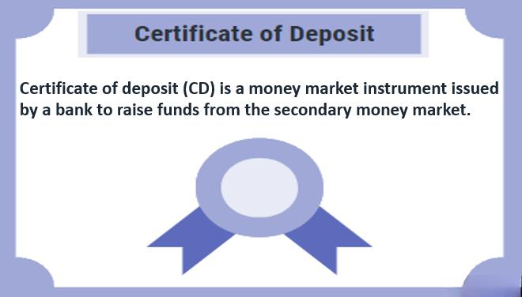

## Table of Contents

## What is a Certificate of Deposit (CD)?

A Certificate of Deposit, or CD, is a type of savings account that you can open at a bank or credit union. When you put money into a CD, you agree to leave it there for a certain amount of time, which can be anywhere from a few months to several years. In return, the bank pays you a fixed interest rate that is usually higher than what you would get from a regular savings account. This makes CDs a good choice if you want to save money and earn more interest without taking big risks.

The main thing to know about CDs is that you can't take your money out before the time is up without paying a penalty. This penalty can be a lot of money, so it's important to be sure you won't need the money before the CD matures. Once the time is up, you can take your money out, along with the interest you've earned, or you can roll it over into a new CD. CDs are a safe way to save because they are insured by the government, up to a certain amount, so you don't have to worry about losing your money.

## What is a bond?

A bond is like a loan that you give to a company or the government. When you buy a bond, you are lending them money. They promise to pay you back the full amount you lent them, called the principal, on a specific date in the future. Until that date, they also pay you interest, which is like a thank you for lending them the money. The interest is usually paid to you every six months or once a year.

Bonds are considered safer than stocks because they have a set schedule for getting your money back and the interest payments. But, they can still be risky if the company or government can't pay you back. To lower this risk, many people check the bond's credit rating before buying it. A higher credit rating means the bond is less risky. If you need to sell your bond before it matures, its value might go up or down depending on interest rates and how the market is doing.

## How are Certificates of Deposit similar to bonds?

Certificates of Deposit (CDs) and bonds are similar because they both help you save money and earn interest. When you put your money in a CD or buy a bond, you agree to leave it there for a certain amount of time. In return, you get paid interest. CDs usually pay a fixed [interest rate](/wiki/interest-rate-trading-strategies), and so do most bonds. This means you know exactly how much money you will earn if you keep your money in them until the end of the term.

Another way CDs and bonds are alike is that they are both considered safe ways to save money. CDs are insured by the government, so if the bank fails, you won't lose your money. Bonds are also safe, especially if they are from the government or a company with a good credit rating. Both CDs and bonds have penalties if you take your money out early, so you need to be sure you won't need the money before the term is up.

## What are the key differences between CDs and bonds?

Certificates of Deposit (CDs) and bonds are different in a few key ways. CDs are offered by banks and credit unions, while bonds are issued by companies or governments. This means that when you buy a CD, you are lending money to a bank, but when you buy a bond, you are lending money to a company or the government. CDs are also insured by the government, up to a certain amount, which makes them very safe. Bonds, on the other hand, are not insured, so they can be riskier, especially if the issuer has a low credit rating.

Another big difference is how you can get your money back. With a CD, you usually get all your money back, plus interest, at the end of the term. If you need to take your money out early, you will have to pay a penalty. With bonds, you can sell them before they mature, but the price you get might be higher or lower than what you paid, depending on interest rates and the market. Also, bonds often pay interest every six months or once a year, while CDs usually pay interest at the end of the term.

## Can Certificates of Deposit be classified as bonds?

Certificates of Deposit (CDs) cannot be classified as bonds. CDs are savings products offered by banks and credit unions, while bonds are debt securities issued by companies or governments. When you put money into a CD, you are essentially lending money to the bank, which promises to pay you back with interest at the end of the term. On the other hand, when you buy a bond, you are lending money to a company or government, which pays you interest periodically and returns your principal at maturity.

The key differences between CDs and bonds also highlight why they are not the same. CDs are insured by the government, making them very safe, whereas bonds are not insured and can be riskier depending on the issuer's creditworthiness. Additionally, CDs typically have a fixed term and a penalty for early withdrawal, while bonds can be sold before maturity at a price that may vary based on market conditions. These distinctions show that while both CDs and bonds can help you save and earn interest, they are fundamentally different financial instruments.

## What are the financial regulations governing the classification of CDs as bonds?

Financial regulations clearly separate Certificates of Deposit (CDs) from bonds. CDs are governed by banking regulations, specifically those related to deposit accounts. In the United States, the Federal Deposit Insurance Corporation (FDIC) insures CDs up to a certain amount, which makes them very safe for savers. This insurance means that even if the bank fails, your money in a CD is protected. The rules for CDs are designed to make sure banks can manage the money they take in from depositors and pay it back with interest when the CD matures.

On the other hand, bonds are regulated under securities laws. When a company or government issues a bond, they are borrowing money from investors. The Securities and Exchange Commission (SEC) oversees bonds to make sure that issuers provide accurate information to investors. Unlike CDs, bonds are not insured by the government, so they [carry](/wiki/carry-trading) more risk. The regulations for bonds focus on transparency and the ability of the issuer to pay back the bond at maturity. These different sets of rules show why CDs and bonds are classified separately and cannot be considered the same type of financial product.

## How do the interest rates of CDs compare to those of bonds?

The interest rates for Certificates of Deposit (CDs) and bonds can be different. CDs usually have fixed interest rates that the bank sets when you open the account. This means you know exactly how much interest you will earn if you keep your money in the CD until it matures. The interest rate for a CD can depend on how long you agree to leave your money in the bank and the current interest rates in the economy. CDs are often seen as safer, so they might offer lower interest rates compared to some bonds.

Bonds can have fixed or variable interest rates. A fixed-rate bond pays the same interest rate throughout its term, like a CD. But, some bonds, like those from companies, might have variable rates that can change over time. The interest rate on a bond can also depend on the credit rating of the issuer. Bonds from the government or from companies with high credit ratings are seen as safer and might offer lower interest rates. Bonds from companies with lower credit ratings can offer higher interest rates to make up for the higher risk. So, while CDs might offer lower but more predictable returns, bonds can offer a range of interest rates depending on their risk level.

## What are the maturity periods for CDs versus bonds?

Certificates of Deposit (CDs) have set maturity periods that can range from a few months to several years. Common terms for CDs include 3 months, 6 months, 1 year, 2 years, and 5 years. You choose the length of time when you open the CD, and you must leave your money in the CD until it matures to avoid penalties. The longer the term, the higher the interest rate might be, but you also have to wait longer to get your money back.

Bonds also have maturity periods, but these can be much longer than those of CDs. Government bonds can have terms as short as a few months or as long as 30 years. Corporate bonds usually have terms ranging from 1 to 30 years. Unlike CDs, you can sell a bond before it matures, but the price you get might be different from what you paid. This means you might make a profit or a loss if you sell early.

## How does the liquidity of CDs compare to that of bonds?

Certificates of Deposit (CDs) are not very liquid. This means it's hard to get your money out before the CD matures. If you need your money early, you have to pay a penalty, which can be a lot. So, you need to be sure you won't need the money before the CD's term is up. Once the CD matures, you can take your money out or roll it over into a new CD.

Bonds are more liquid than CDs. You can sell a bond before it matures if you need your money. The price you get might be higher or lower than what you paid, depending on the market. This means you might make a profit or a loss. So, bonds give you more flexibility to get your money when you need it, but there's more risk involved.

## What are the tax implications of classifying CDs as bonds?

If CDs were classified as bonds, the tax implications could change. Right now, the interest you earn from a CD is taxed as regular income. This means you pay taxes on the interest at your normal income tax rate. If CDs were treated like bonds, the interest might be taxed differently. For example, interest from some bonds, like municipal bonds, can be tax-free at the federal level, and sometimes at the state level too. So, if CDs were seen as bonds, you might not have to pay taxes on the interest, or you might pay a different kind of tax.

But, CDs and bonds are treated differently by the government now. CDs are considered deposit accounts, and the interest is taxed as income. Bonds are seen as investments, and the tax rules depend on the type of bond. If CDs were suddenly classified as bonds, it would mean a big change in how they are taxed. This could make CDs more or less attractive to people, depending on their tax situation. It's important to know that right now, CDs and bonds have different tax rules, and changing them would need new laws from the government.

## How do institutional investors view CDs in relation to bonds?

Institutional investors, like big banks or investment firms, see CDs and bonds as different ways to invest money. CDs are seen as very safe because they are insured by the government. This means that if a bank goes bankrupt, the money in CDs is still safe up to a certain amount. Because CDs are so safe, they usually offer lower interest rates than many bonds. Institutional investors might use CDs when they want to keep their money safe and don't need to take big risks.

Bonds, on the other hand, can be riskier but offer higher interest rates, especially if they come from companies with lower credit ratings. Institutional investors might buy bonds to earn more money, even though there's more risk involved. They can also sell bonds before they mature, which gives them more flexibility than with CDs. So, institutional investors might choose bonds when they are okay with taking more risk for a chance at higher returns.

## What are the implications of classifying CDs as bonds for portfolio diversification?

If Certificates of Deposit (CDs) were classified as bonds, it could change how people think about spreading their money in different investments. Right now, CDs are seen as very safe because they are insured by the government. They are a good way to keep some money safe without taking risks. If CDs were seen as bonds, people might think of them as part of their bond investments. This could make them put more money into CDs, thinking they are diversifying their bond holdings, but they would still be very safe and not really adding much variety to their investments.

On the other hand, if CDs were classified as bonds, it might make people think they are less safe than they really are. This could lead to people putting less money into CDs and looking for other types of bonds that offer higher returns but come with more risk. This could affect how well people diversify their portfolios because they might end up with more risk than they planned. So, classifying CDs as bonds could change how people see their investments and how they spread their money across different types of investments.

## What are Certificates of Deposit (CDs) and how do they work?

Certificates of Deposit (CDs) are financial instruments offered by banks and credit unions that serve as time-bound savings accounts with fixed interest rates. They are characterized by being low-risk investments, making them a suitable option for conservative investors seeking stable and predictable returns. CDs operate by allowing investors to deposit a sum of money for a predetermined period, known as the term, during which the funds earn interest at a specified rate.

The primary benefits of CDs include principal protection and FDIC insurance, which provides coverage up to $250,000 per depositor at insured banks, ensuring the safety of the principal amount. CDs offer a higher interest rate compared to regular savings accounts, reflecting their commitment to a longer-term lock-up of the funds. There are several types of CDs available, tailored to meet different investor needs:

1. **Traditional CDs**: These are the most common, offering a fixed rate for a specific term, ranging typically from three months to five years.
2. **No-Penalty CDs**: These allow for early withdrawal without a penalty, providing more liquidity but often at a slightly lower interest rate.
3. **Jumbo CDs**: Designed for large deposits, these typically require a minimum investment of $100,000 and may offer higher interest rates than standard CDs.
4. **Bump-Up CDs**: These allow investors to increase their interest rate (or 'bump it up') if rates rise during the term, offering some flexibility in optimizing returns.

However, CDs also come with limitations. The major drawback is their lower return potential compared to other investment opportunities such as stocks or bonds. The fixed rate nature of CDs means that investors miss out on higher rates of return available in a growing market environment. Additionally, there are usually penalties for early withdrawal, which can erode returns if funds are needed before the maturity date.

Mathematically, the future value of a CD can be calculated using the formula:

$$
\text{Future Value} = P \left(1 + \frac{r}{n}\right)^{nt}
$$

where:
- $P$ is the principal amount (initial deposit),
- $r$ is the annual nominal interest rate (as a decimal),
- $n$ is the number of compounding periods per year,
- $t$ is the number of years until maturity.

For conservative investors, CDs provide a low-risk investment vehicle with guaranteed returns, particularly appealing to those who prioritize preservation of capital over higher yields. The integration of CDs into a broader investment strategy can help in achieving a diversified portfolio, balancing risks while ensuring some portion of the investor's capital is secure and generating steady income.

## References & Further Reading

[1]: ["Investing in Bonds: A Step-by-Step Guide"](https://www.nerdwallet.com/article/investing/how-to-buy-bonds) - Investopedia

[2]: ["Certificates of Deposit (CDs)"](https://www.nerdwallet.com/best/banking/cd-rates) - Federal Deposit Insurance Corporation

[3]: Hull, J. C. (2015). ["Options, Futures, and Other Derivatives"](https://www.semanticscholar.org/paper/Options%2C-Futures%2C-and-Other-Derivatives-Hull/89bdee500c8623864fc9eb7a471546aa713acc44) (9th ed.). Pearson.

[4]: ["Algorithmic Trading: Winning Strategies and Their Rationale"](https://www.wiley.com/en-us/Algorithmic+Trading%3A+Winning+Strategies+and+Their+Rationale-p-9781118460146) by Ernie Chan

[5]: ["The Intelligent Investor: The Definitive Book on Value Investing"](https://www.amazon.com/Intelligent-Investor-3rd-Ed/dp/0063356724) by Benjamin Graham